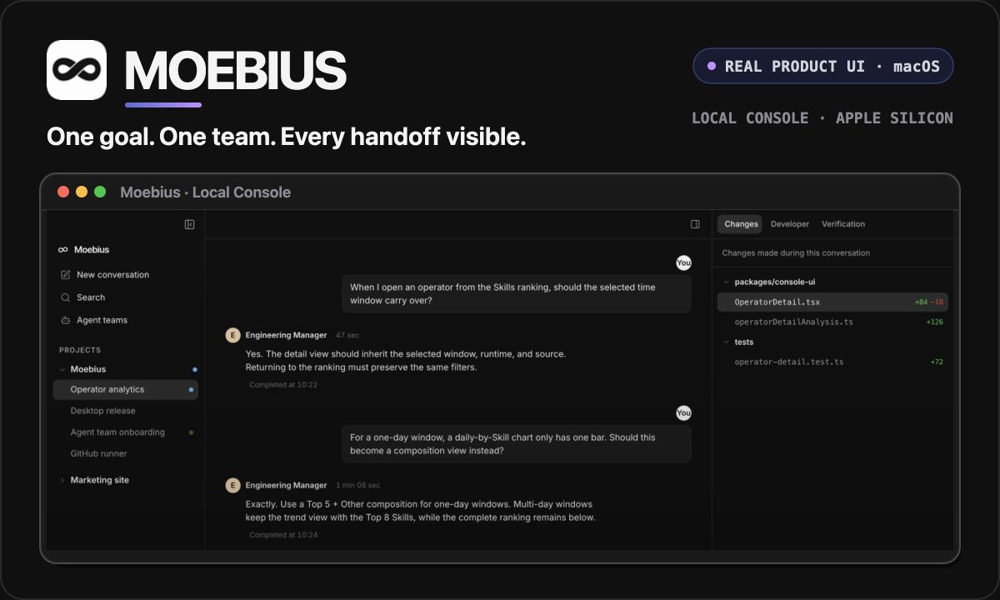

<p align="center">
  
</p>

<p align="center">
  <a href="README.md"><strong>English</strong></a> · <a href="README.zh-CN.md">简体中文</a>
</p>

<p align="center"><strong>A free, open-source macOS app that turns the AI coding tools you already use into a team.</strong></p>

<p align="center">
  <a href="https://github.com/tranfu-labs/moebius/releases/latest"><strong>Download for macOS</strong></a>
  ·
  <a href="#how-the-team-works"><strong>How it works</strong></a>
  ·
  <a href="CHANGELOG.md"><strong>What’s new</strong></a>
</p>

<p align="center">macOS 14+ · Apple Silicon · MIT licensed</p>

## Stop coordinating agents by hand

A single coding agent can do serious work. The coordination around it is still yours: check the plan, find a reviewer, relay feedback, ask for tests, recover lost context, and decide who should act next.

Moebius gives that coordination to an Agent team.

- **Talk to one Leader Agent.** Describe the goal and the decisions only you can make.
- **Give every role a real responsibility.** Planning, implementation, review, testing, and delivery can belong to different specialists.
- **Let the team hand work forward.** Members can inspect each other’s work, request corrections, and return evidence to the Leader Agent.
- **Keep the whole process visible.** Handoffs, tool runs, changes, failures, recovery, and final results stay in one conversation.

You are no longer the message bus between several AI chats. You set the direction; the team keeps the work moving.

## How the team works

```text
Your goal
   ↓
Leader Agent
   ↓ delegates, reviews, and routes
Specialist Agents
   ↓ implement, test, challenge, and revise
Leader Agent
   ↓ closes with the result and evidence
You
```

### Teams, not rigid workflows

Agents are defined in natural language: their responsibilities, judgment, collaboration boundaries, and handoff conditions. A team describes who is responsible for the work; the actual path forms around the goal instead of making you configure every step in advance.

### One conversation, shared context

The selected team stays bound to the conversation. Agents see the shared timeline, carry findings into the next handoff, and can resume after interruptions without asking you to reconstruct the task from scratch.

### Quality has owners

Specialists do not all produce parallel answers to the same prompt. A developer can implement, a reviewer can challenge the design, and QA can verify the behavior. Their evidence returns to the Leader Agent, who decides whether to continue, ask you, or close the work.

## From download to your first goal

1. **[Download the latest macOS release](https://github.com/tranfu-labs/moebius/releases/latest).** Choose the Apple Silicon DMG.
2. **Open Moebius.** The first-run guide checks Codex, Claude Code, and Kimi; one working AI coding tool is enough to continue.
3. **Choose a team.** Start with a built-in team, or describe your field and let AI draft one with the roles you need.
4. **Add a local project.** Moebius works in the directory you select.
5. **Start a conversation.** Pick the team and describe the result you want.

For example:

```text
Add retry support to the failing workflow, cover the edge cases,
and continue through review until the result is verified.
```

The team decides how to divide the work. When a product choice or risky action needs your judgment, it comes back with context instead of guessing on your behalf.

## Built for work on your Mac

- **Local projects:** you choose the folders Moebius is allowed to work in.
- **Your AI tools:** different Agents can use Codex, Claude Code, or Kimi independently.
- **Reusable teams:** built-in teams are ready to use, and custom teams can serve more than one project.
- **Persistent conversations:** the timeline survives handoffs, app restarts, failures, and recovery.
- **Visible execution:** inspect Agent activity, file changes, verification results, and the current owner of the next step.

Moebius is local-first, but the AI tools you connect may send prompts, project context, and attachments to their respective online services.

## Before you install

- Official releases support **macOS 14 or later on Apple Silicon**. Windows, Linux, Intel Mac, and universal builds are not currently provided.
- At least one supported AI coding tool—Codex, Claude Code, or Kimi—must be installed and signed in. The first-run guide can help install or diagnose each one independently.
- Moebius uses your existing accounts for those tools. Their usage limits and costs still apply.
- Release artifacts are signed with an Apple Developer ID but are not yet notarized. If macOS blocks the first launch, use the system-provided **Open** flow after verifying the release source.
- Project files and issue content may be shared with the AI services you connect. Keep secrets out of anything those services can read.

## Ready to hand off your first goal?

<p align="center">
  <a href="https://github.com/tranfu-labs/moebius/releases/latest"><strong>Download Moebius for Apple Silicon Mac →</strong></a>
</p>

Moebius is under active development. Read the [release notes](CHANGELOG.md), [report a bug](https://github.com/tranfu-labs/moebius/issues/new/choose), or disclose a vulnerability privately through [GitHub Security Advisories](https://github.com/tranfu-labs/moebius/security/advisories/new).

## Develop and contribute

Source setup, development commands, tests, review expectations, and the squash-merge workflow live in [CONTRIBUTING.md](CONTRIBUTING.md). Architecture starts with the [module map](docs/architecture/module-map.md) and [architecture invariants](docs/architecture/invariants.md); advanced GitHub runner behavior is documented in the [interaction protocol](docs/protocols/github-interaction.md).

## License

Moebius is licensed under the [MIT License](LICENSE). Copyright © 2026 TranFu.
