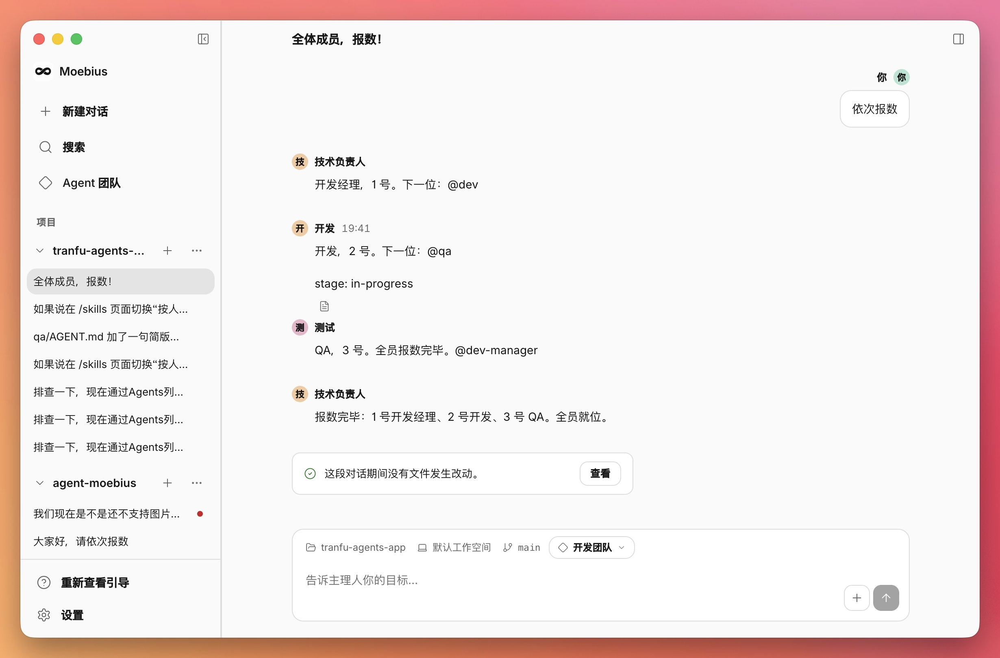
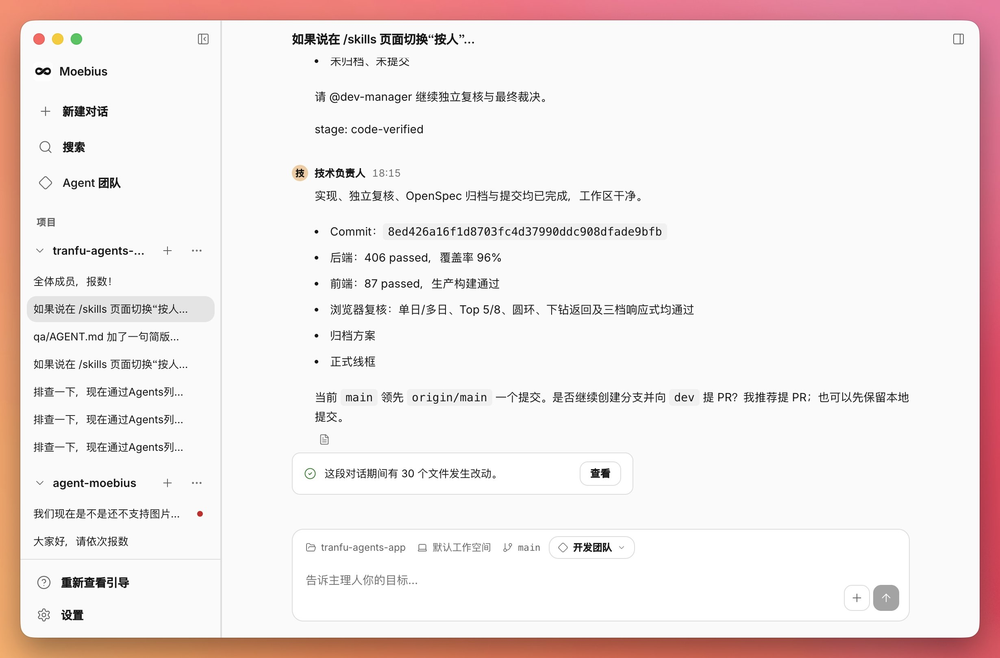
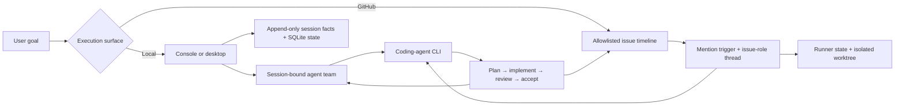

<p align="center">
  
</p>

<p align="center">
  <a href="README.md"><strong>English</strong></a> · <a href="README.zh-CN.md">简体中文</a>
</p>

<p align="center">
  <a href="https://github.com/tranfu-labs/moebius/actions/workflows/ci.yml"></a>
  <a href="LICENSE"></a>
  
</p>

Moebius gives developers a persistent team of coding agents instead of a collection of disconnected chats. Define roles and collaboration rules in Markdown, hand the team a goal, and watch planning, implementation, review, recovery, and acceptance continue in one visible timeline.

<p align="center">
  <a href="#quick-start"><strong>Run from source</strong></a>
  ·
  <a href="https://github.com/tranfu-labs/moebius/releases/latest"><strong>Latest release</strong></a>
  ·
  <a href="docs/product/prd.md"><strong>Product intent</strong></a>
</p>

> [!NOTE]
> Moebius is under active development. Packaged releases currently support macOS on Apple Silicon only. See the [changelog](CHANGELOG.md) for release history.

## See the handoff, then the proof

<table>
  <tr>
    <th width="50%">A role-based handoff in progress</th>
    <th width="50%">A code-verified result</th>
  </tr>
  <tr>
    <td>
      <a href="./assets/screenshots/console-agent-handoff.jpg">
        
      </a>
    </td>
    <td>
      <a href="./assets/screenshots/console-code-verified.jpg">
        
      </a>
    </td>
  </tr>
</table>

Click either screenshot to inspect the full-resolution interface.

## Teams, not a fixed workflow

- **Describe responsibilities in plain language.** Agent Markdown defines expertise, boundaries, collaboration rules, and handoff conditions.
- **Keep one shared, resumable timeline.** Conversations, role changes, failures, recovery, and evidence survive long-running work.
- **Make quality a team responsibility.** Planning, implementation, QA, product review, and acceptance can belong to distinct roles.
- **Choose where the work happens.** Run locally by default, or explicitly enable an allowlisted GitHub Issue runner for a shared issue timeline.

## Supported today

- [x] Persistent local sessions backed by append-only JSONL facts and a rebuildable SQLite index
- [x] Session-bound agent teams with a primary agent responsible for routing and closeout
- [x] A local console with managed attachments, interrupted-run recovery, and resumable coding-agent sessions
- [x] An allowlisted GitHub Issue runner with mention-based handoffs and per-issue, per-role Codex threads
- [x] Isolated issue worktrees, bounded concurrency, media input, and release-backed output artifacts
- [x] An Electron desktop shell and reusable React console component library
- [x] A read-only observer for runner and goal-ledger diagnostics

## Quick start

For source development and terminal use, install Git, Node.js 24, pnpm 9.15.4, and an authenticated `codex` CLI available on `PATH`.

```bash
git clone https://github.com/tranfu-labs/moebius.git
cd moebius
corepack enable
corepack prepare pnpm@9.15.4 --activate
pnpm install --frozen-lockfile
pnpm start
```

`pnpm start` launches the loopback local console and prints its URL. It does not scan GitHub issues. A clean startup needs neither repository configuration nor GitHub authentication; `codex` is needed when a session actually runs an agent.

Open the printed URL, add or select a project, create a session, choose an agent team, and send a goal.

## Choose an execution surface

| Surface | Command | What it does |
| --- | --- | --- |
| Local console | `pnpm start` | Runs local sessions only; no GitHub intake |
| Desktop app | `pnpm desktop` | Builds and opens the Electron operator console |
| GitHub Issue runner | `pnpm start -- --github-mode` | Scans only allowlisted repositories; no local console |
| Read-only observer | `pnpm observer` | Shows diagnostics without controlling or writing runner state |
| Component workshop | `pnpm --filter @moebius/console-ui storybook` | Opens the console UI Storybook |

### GitHub Issue runner

GitHub mode additionally requires an authenticated `gh` CLI and network access to GitHub and the configured Codex provider. The checked-in `config.toml` intentionally enables no repositories. Add machine-local repositories to the ignored `config.local.toml`:

```toml
[[watchRepositories]]
owner = "your-org"
repo = "your-repo"
```

Then start the explicit GitHub mode:

```bash
gh auth status
pnpm start -- --github-mode
```

The first scan establishes a baseline instead of processing historical issues. A later issue body or comment can hand off control with one valid agent mention:

```text
@dev Investigate the failing test, propose a verifiable plan, and continue through review.
```

In GitHub mode, `@` means “hand off the next step,” not “refer to this role.” A message may contain at most one valid agent mention. Read the [GitHub interaction protocol](docs/protocols/github-interaction.md) before operating a shared runner.

> [!WARNING]
> Do not run a terminal GitHub-mode runner and the desktop runner against the same repository at the same time. When intentionally switching between them, point both at the same `MOEBIUS_DATA_ROOT`.

## How it stays coherent



The CLI is the execution driver. Agent Markdown defines responsibilities and trusted capabilities; Moebius owns routing, persistence, bounded side effects, recovery, and GitHub adapters.

## Runtime boundaries

### Desktop releases

Production releases use `v*` tags and provide DMG and ZIP artifacts for macOS on Apple Silicon only. Current artifacts are signed with an Apple Developer ID but are not notarized, so macOS may show a security warning. Verify the release provenance before using the system-provided Open flow.

### Data roots

| Context | Default data root |
| --- | --- |
| Terminal source run | Repository root |
| Desktop development | Repository root |
| Packaged desktop app | `~/.moebius` |

Use `MOEBIUS_DATA_ROOT` to override configuration and runtime data, and `MOEBIUS_WORKDIR_ROOT` to override issue worktrees. Local sessions and the GitHub runner use separate SQLite stores and are not mirrored into each other.

### Security

- Local mode binds its console to loopback by default and does not enable GitHub intake.
- GitHub mode is explicitly opt-in and mutating: it can read issues, add reactions, post comments, create child issues, provision local worktrees, and publish selected artifacts through GitHub Releases.
- The repository allowlist is empty by default; access is limited by the authenticated `gh` account.
- Issue bodies, comments, attachments, and project files may enter prompts or be sent to the configured provider. Do not place secrets in content an agent can read.
- Keep credentials in the normal CLI stores or environment variables. Never commit `.env` or `config.local.toml`.

Report vulnerabilities privately through [GitHub Security Advisories](https://github.com/tranfu-labs/moebius/security/advisories/new).

## Development

```bash
pnpm test
pnpm typecheck
pnpm brand:check
pnpm --filter @moebius/desktop build
```

`pnpm brand:generate` requires macOS and `/usr/bin/sips`; the read-only `pnpm brand:check` can run in CI without regenerating assets.

Start with the [module map](docs/architecture/module-map.md), [architecture invariants](docs/architecture/invariants.md), and [product PRD](docs/product/prd.md).

## Contributing

Contributions are welcome. Read [CONTRIBUTING.md](CONTRIBUTING.md) for setup, Conventional Commits, tests, review expectations, and the squash-merge workflow. Use the repository's Issue Forms for bugs, feature requests, and questions.

## License

Moebius is licensed under the [MIT License](LICENSE). Copyright © 2026 TranFu.
