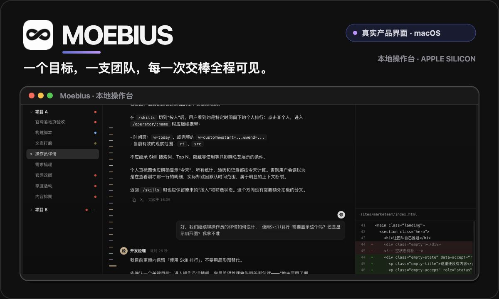
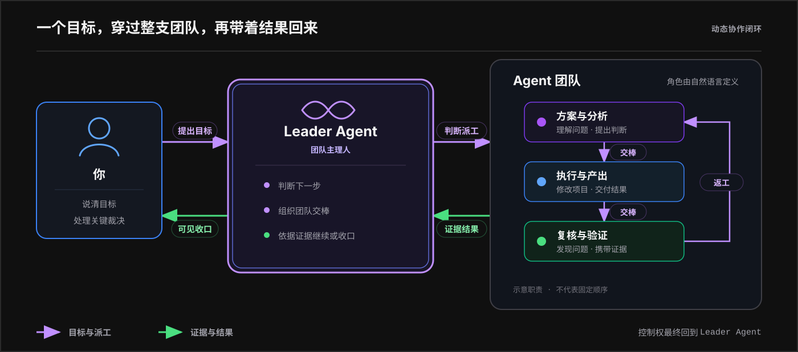

<p align="center">
  
</p>

<p align="center">
  <a href="README.md">English</a> · <a href="README.zh-CN.md"><strong>简体中文</strong></a>
</p>

<p align="center"><strong>一款免费开源的 macOS 应用，把你已经在用的编程 AI 变成一支团队。</strong></p>

<p align="center">
  <a href="https://github.com/tranfu-labs/moebius/releases/latest"><strong>下载 macOS 版</strong></a>
  ·
  <a href="#团队如何工作"><strong>团队如何工作</strong></a>
  ·
  <a href="CHANGELOG.md"><strong>查看更新</strong></a>
</p>

<p align="center">macOS 14+ · Apple Silicon · MIT License</p>

## 别再手动调度每个 Agent

一个编程 Agent 已经能完成复杂工作，但它周围的协调仍然由你承担：检查方案、寻找评审、转述意见、安排测试、恢复上下文，以及不断决定下一步该交给谁。

Moebius 把这些协调工作交给一支 Agent 团队。

- **只和 Leader Agent 对话。** 说清目标，以及只能由你决定的关键取舍。
- **让每个角色真正负责。** 方案、实现、评审、测试和交付可以由不同专业成员承担。
- **让团队自动接力。** 成员可以检查彼此的工作、要求修正，并把证据交回 Leader Agent。
- **让全过程保持可见。** 交棒、工具执行、文件改动、失败、恢复和最终结果都在同一条对话中。

## 团队如何工作

<p align="center">
  
</p>

**配置团队，而不是固化工作流。** Agent 用自然语言定义职责、判断方式、协作边界和交棒条件。团队只规定“由谁负责”，执行路径围绕当前目标自然形成，不要求你预先配置每一步。

**一条对话，共享上下文。** 选定的团队会持续绑定当前对话。成员共享时间线，把发现带入下一次交棒，并在中断后继续推进，不要求你从头重述任务。

**质量有明确负责人。** 开发可以实现，评审可以质疑方案，测试可以验证行为。证据最终回到 Leader Agent，由它决定继续派工、询问你，还是完成收口。

## 从下载到第一个目标

1. **[下载最新 macOS 版本](https://github.com/tranfu-labs/moebius/releases/latest)。** 选择 Apple Silicon DMG。
2. **打开 Moebius。** 首次引导会检查 Codex、Claude Code 和 Kimi；其中一种编程 AI 可以正常工作即可继续。
3. **选择团队。** 直接使用内置团队，或描述你的领域，让 AI 起草一支包含所需角色的新团队。
4. **添加本地项目。** Moebius 只在你选择的目录中工作。
5. **新建对话。** 选定团队，然后说出你想要的结果。

例如：

```text
为失败的工作流增加重试支持，覆盖边界情况，
并持续推进评审，直到结果完成验证。
```

团队会自行判断如何分工。如果产品取舍或高风险操作需要你拍板，它会带着上下文回来询问，而不是替你猜测。

## 为你的 Mac 本地工作而生

- **本地项目：** 由你选择允许 Moebius 工作的文件夹。
- **你自己的 AI 工具：** 不同 Agent 可以分别使用 Codex、Claude Code 或 Kimi。
- **可复用团队：** 内置团队可以开箱即用，自定义团队也能服务多个项目。
- **持久化对话：** 时间线能跨越交棒、应用重启、失败与恢复。
- **可见的执行过程：** 查看 Agent 活动、文件改动、验证结果，以及下一步由谁负责。

Moebius 本地优先，但你接入的编程 AI 仍可能把提示词、项目上下文和附件发送到各自的在线服务。

## 安装前需要知道

- 正式版本仅支持 **macOS 14 或更高版本的 Apple Silicon Mac**。当前不提供 Windows、Linux、Intel Mac 或 universal 版本。
- 至少需要安装并登录一种受支持的编程 AI：Codex、Claude Code 或 Kimi。首次引导可以分别协助安装或诊断。
- Moebius 使用你已有的这些工具账号，相关用量限制和费用仍由对应服务决定。
- 发行产物已使用 Apple Developer ID 签名，但尚未完成公证。如果 macOS 阻止首次启动，请先核对发布来源，再使用系统提供的**打开**流程。
- 项目文件和 issue 内容可能被发送给你接入的 AI 服务。不要在这些服务可以读取的内容中放置秘密信息。

## 准备交出第一个目标？

<p align="center">
  <a href="https://github.com/tranfu-labs/moebius/releases/latest"><strong>下载 Moebius Apple Silicon Mac 版 →</strong></a>
</p>

Moebius 仍在积极开发中。你可以阅读[版本记录](CHANGELOG.md)、[报告问题](https://github.com/tranfu-labs/moebius/issues/new/choose)，或通过 [GitHub Security Advisories](https://github.com/tranfu-labs/moebius/security/advisories/new) 私下披露安全问题。

## 开发与贡献

源码环境、开发命令、测试、评审要求和 squash merge 流程统一放在 [CONTRIBUTING.md](CONTRIBUTING.md)。架构入口是[模块地图](docs/architecture/module-map.md)与[架构不变量](docs/architecture/invariants.md)；高级 GitHub runner 行为见 [GitHub 交互协议](docs/protocols/github-interaction.md)。

## 许可证

Moebius 采用 [MIT License](LICENSE)。Copyright © 2026 TranFu。
