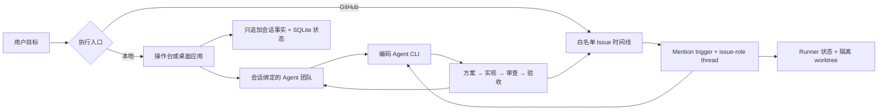

<p align="center">
  
</p>

<p align="center">
  <a href="README.md">English</a> · <a href="README.zh-CN.md"><strong>简体中文</strong></a>
</p>

<p align="center">
  <a href="https://github.com/tranfu-labs/moebius/actions/workflows/ci.yml"></a>
  <a href="LICENSE"></a>
  
</p>

Moebius 给开发者的不是一组彼此割裂的对话，而是一支持续协作的编码 Agent 团队。用 Markdown 定义角色与协作规则，把目标交给团队，让方案、实现、审查、恢复和验收在同一条可见时间线里持续推进。

<p align="center">
  <a href="#快速开始"><strong>从源码运行</strong></a>
  ·
  <a href="https://github.com/tranfu-labs/moebius/releases/latest"><strong>最新版本</strong></a>
  ·
  <a href="docs/product/prd.md"><strong>产品意图</strong></a>
</p>

> [!NOTE]
> Moebius 仍在积极开发中。打包版本目前只支持 Apple Silicon Mac；发布记录见[变更日志](CHANGELOG.md)。

## 先看交棒，再看结果

<table>
  <tr>
    <th width="50%">按角色交棒执行中</th>
    <th width="50%">代码验证完成</th>
  </tr>
  <tr>
    <td>
      <a href="./assets/screenshots/console-agent-handoff.jpg">
        
      </a>
    </td>
    <td>
      <a href="./assets/screenshots/console-code-verified.jpg">
        
      </a>
    </td>
  </tr>
</table>

点击任一截图可查看完整分辨率的界面。

## 配置团队，而不是固化工作流

- **用自然语言描述职责。** Agent Markdown 定义专业能力、边界、协作规则和交棒条件。
- **保留一条可恢复的共享时间线。** 对话、角色切换、失败、恢复与证据不会在长任务中丢失。
- **让质量成为团队职责。** 方案、实现、测试、产品审查和最终验收可以由不同角色承担。
- **选择工作发生的位置。** 默认在本地运行；需要共享 Issue 时间线时，再显式启用只扫描白名单仓库的 GitHub Issue runner。

## 当前能力

- [x] 以只追加 JSONL 事实日志和可重建 SQLite 索引承载持久本地会话
- [x] 会话绑定 Agent 团队，由主 Agent 负责路由和最终收尾
- [x] 支持托管附件、中断恢复和编码 Agent 会话续跑的本地操作台
- [x] 支持 mention 交棒及 issue + role 独立 Codex thread 的白名单 GitHub Issue runner
- [x] Issue 隔离 worktree、有界并发、媒体输入和通过 GitHub Release 发布的输出产物
- [x] Electron 桌面壳与可复用 React 操作台组件库
- [x] 用于 runner 与目标账本诊断的只读 observer

## 快速开始

从源码开发或使用终端入口前，请安装 Git、Node.js 24、pnpm 9.15.4，以及已完成认证且可通过 `PATH` 调用的 `codex` CLI。

```bash
git clone https://github.com/tranfu-labs/moebius.git
cd moebius
corepack enable
corepack prepare pnpm@9.15.4 --activate
pnpm install --frozen-lockfile
pnpm start
```

`pnpm start` 会启动 loopback 本地操作台并打印访问地址，不会扫描 GitHub Issue。干净环境冷启动不需要仓库配置或 GitHub 认证；只有会话真正运行 Agent 时才需要 `codex`。

打开命令打印的地址，添加或选择项目，创建会话，选择 Agent 团队，然后发送目标。

## 选择执行入口

| 入口 | 命令 | 行为 |
| --- | --- | --- |
| 本地操作台 | `pnpm start` | 只运行本地会话，不启用 GitHub intake |
| 桌面应用 | `pnpm desktop` | 构建并打开 Electron 操作台 |
| GitHub Issue runner | `pnpm start -- --github-mode` | 只扫描白名单仓库，不启动本地操作台 |
| 只读 observer | `pnpm observer` | 只显示诊断，不控制 runner，也不写 runner 状态 |
| 组件工作台 | `pnpm --filter @moebius/console-ui storybook` | 打开操作台组件 Storybook |

### GitHub Issue runner

GitHub 模式还需要完成认证的 `gh` CLI，以及可访问 GitHub 和所配置 Codex 服务的网络。提交到仓库的 `config.toml` 默认不启用任何仓库；请在被忽略的 `config.local.toml` 中加入本机要监听的仓库：

```toml
[[watchRepositories]]
owner = "your-org"
repo = "your-repo"
```

然后启动显式 GitHub 模式：

```bash
gh auth status
pnpm start -- --github-mode
```

首次扫描只建立 baseline，不会批量处理历史 Issue。后续 Issue 正文或评论可以用一个合法 Agent mention 交出控制权：

```text
@dev 排查失败测试，给出可验证方案，并继续推进审查。
```

在 GitHub 模式中，`@` 表示“把下一步控制权交给该角色”，而不是普通提及。每条消息最多只能包含一个合法 Agent mention。运行共享 runner 前，请先阅读 [GitHub 交互协议](docs/protocols/github-interaction.md)。

> [!WARNING]
> 不要同时让终端 GitHub-mode runner 和桌面 runner 监听同一仓库。有意切换时，请让两者指向同一个 `MOEBIUS_DATA_ROOT`。

## 如何保持协作连贯



CLI 是执行驱动。Agent Markdown 定义职责与可信能力；Moebius 负责路由、持久化、有界副作用、恢复和 GitHub adapter。

## 运行边界

### 桌面发行

正式发行使用 `v*` tag，并只提供适用于 Apple Silicon Mac 的 DMG 和 ZIP。目前产物使用 Apple Developer ID 签名，但尚未 notarization，因此 macOS 仍可能显示安全提醒。请先核对 Release 来源，再决定是否使用系统提供的“打开”流程。

### 数据根目录

| 场景 | 默认数据根目录 |
| --- | --- |
| 终端源码运行 | 仓库根目录 |
| 桌面开发 | 仓库根目录 |
| 打包桌面应用 | `~/.moebius` |

使用 `MOEBIUS_DATA_ROOT` 覆盖配置与运行时数据目录，使用 `MOEBIUS_WORKDIR_ROOT` 覆盖 Issue worktree。本地会话与 GitHub runner 使用相互独立的 SQLite，不会互相镜像。

### 安全

- 本地模式默认只绑定 loopback，不启用 GitHub intake。
- GitHub 模式需要显式启用且会产生外部写操作：它可以读取 Issue、添加 reaction、发布评论、创建子 Issue、准备本地 worktree，以及通过 GitHub Release 发布选中的产物。
- 仓库白名单默认为空；可访问范围受当前 `gh` 账号权限限制。
- Issue 正文、评论、附件和项目文件可能进入 prompt 或被发送给所配置的服务。不要把秘密放进 Agent 可读取的内容。
- 凭证应保存在 CLI 的常规凭证存储或环境变量中。不要提交 `.env` 或 `config.local.toml`。

请通过 [GitHub Security Advisories](https://github.com/tranfu-labs/moebius/security/advisories/new) 私下报告安全漏洞。

## 开发

```bash
pnpm test
pnpm typecheck
pnpm brand:check
pnpm --filter @moebius/desktop build
```

`pnpm brand:generate` 依赖 macOS 与 `/usr/bin/sips`；只读的 `pnpm brand:check` 无需重新生成资产，可在 CI 中运行。

建议从[模块地图](docs/architecture/module-map.md)、[架构不变量](docs/architecture/invariants.md)和[产品 PRD](docs/product/prd.md)开始了解项目。

## 参与贡献

欢迎贡献。开发环境、Conventional Commits、测试要求、审查标准和 Squash Merge 流程见 [CONTRIBUTING.md](CONTRIBUTING.md)。提交 Bug、功能建议或问题时，请使用仓库提供的 Issue Forms。

## 许可证

Moebius 使用 [MIT License](LICENSE)。Copyright © 2026 TranFu。
