# 模块地图

Moebius 当前只有本地运行形态：`pnpm start` 启动 loopback local console，Electron 桌面壳在主进程内拥有同一 local console server。GitHub 仅作为源码托管、问题反馈与 Release 分发平台，不再是产品运行入口。`pnpm check:boundaries` 以 TypeScript AST 检查下列 `[IB:*]`，并校验每条禁止项只登记一次。

技术分层固定为四层：view / application / domain / adapter。业务能力地图不再用 GitHub issue runner 的旧六层叙事；composition root 是 application 的窄 allowlist，不是第五层。

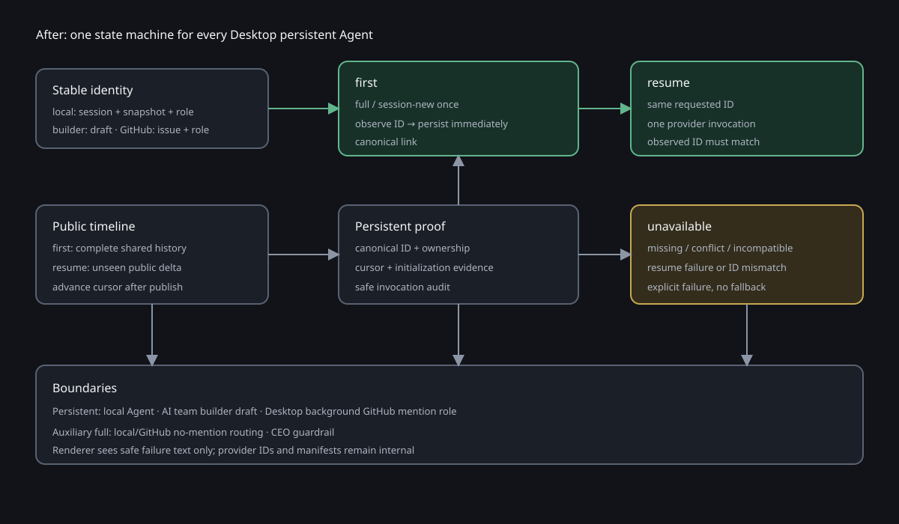
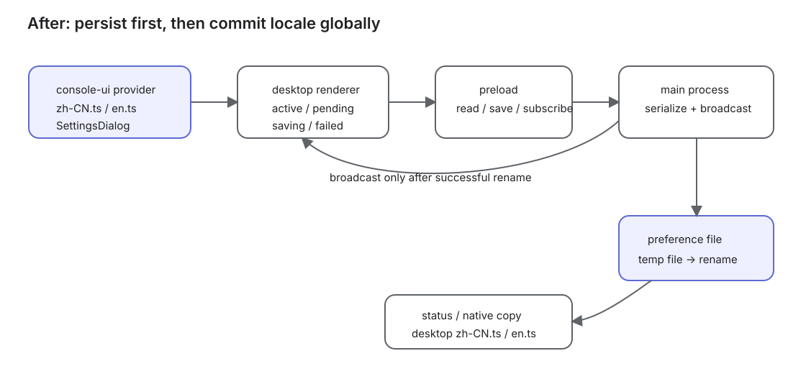

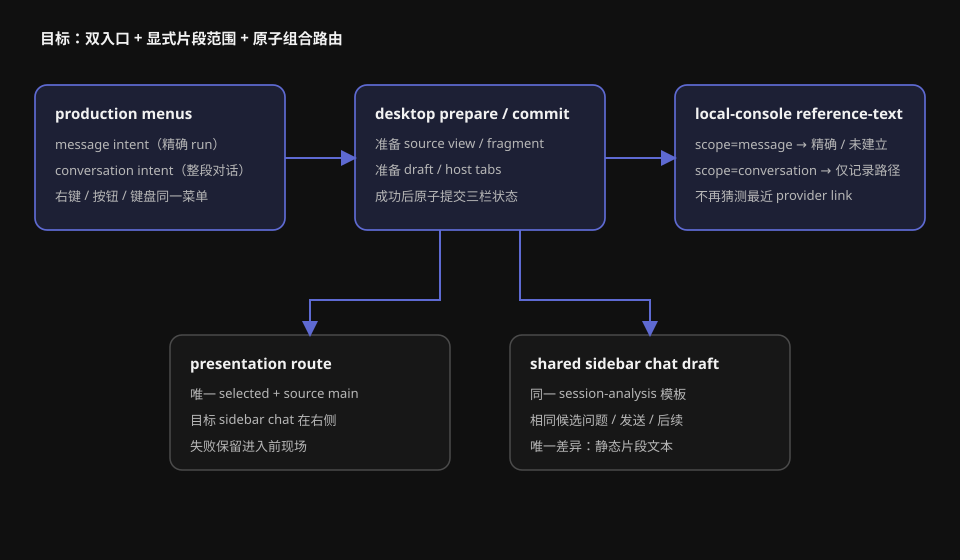
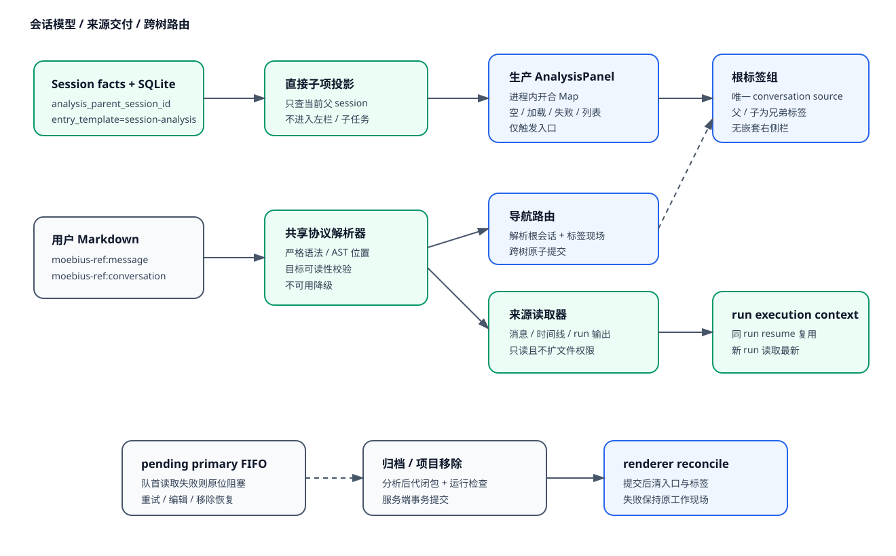
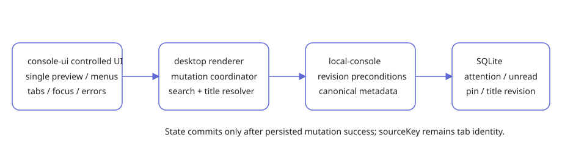
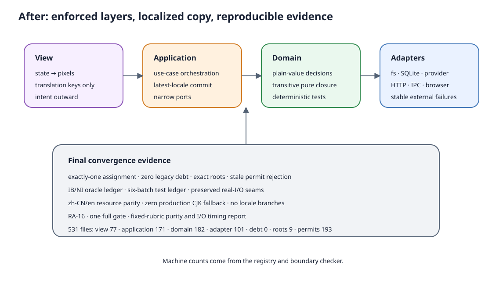
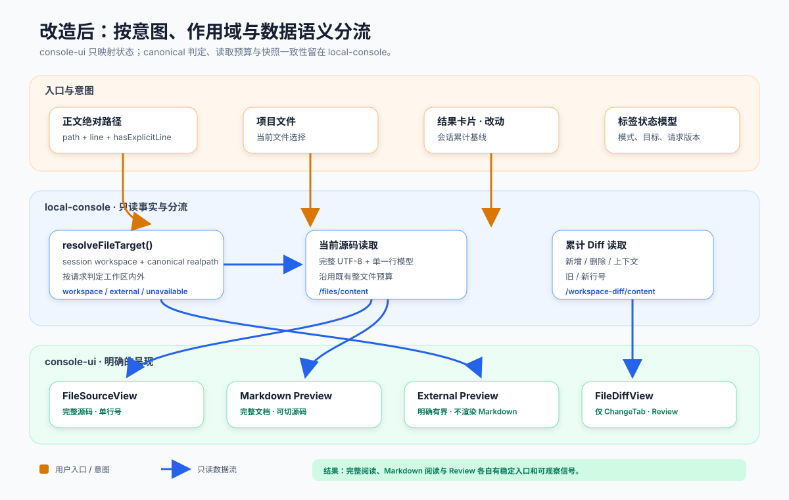

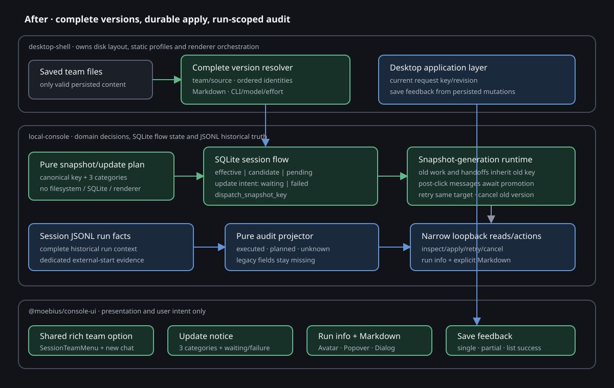

### four-layer-production-architecture
- 职责边界：`src/**`、`desktop/src/**` 与 `packages/console-ui/src/**` 的生产 TS/TSX 文件必须唯一归入 view / application / domain / adapter。domain 是可直接单测的纯闭包；application 编排端口与时序；adapter 承接 fs、SQLite、provider CLI/API、HTTP/IPC；view 只映射状态到显示。最终机械基线为 698 个生产文件（view 115 / application 212 / domain 220 / adapter 151）、file/dependency debt 0、composition root allowlist 16、exact permit 447；新增文件、stale debt、stale permit 与未登记 root 均 fail closed。
- 入口：`src/testing/four-layer-registry.ts`、`src/testing/four-layer-boundaries.ts`、`scripts/check-import-boundaries.ts`。
- 上游：完整测试与 scope 测试的 preflight、开发者定向执行；不进入产品运行时。
- 禁止依赖：生产文件不得零归属或多重归属。[IB:architecture-layer-assignment-total]；四层之间不得出现矩阵未允许且未登记 exact debt 的运行时依赖。[IB:architecture-layer-dependency-matrix]；domain 不得经直接或传递运行时依赖到达 fs、SQLite、child process、provider、Electron、HTTP/IPC adapter。[IB:domain-pure-runtime-closure]；view 不得依赖 application、adapter 或副作用 runtime。[IB:view-no-side-effect-adapters]；application 不得依赖 view，只有 exact composition root 可装配 view。[IB:application-no-view-dependency]；adapter 不得反向调用 application use case。[IB:adapter-no-use-case-reentry]；未列名 application 文件不得同时装配 view 与 concrete adapter，stale root 也不得保留。[IB:composition-root-narrow-allowlist]；application use case 不得超过 300 逻辑行或复杂度 12，也不得在未委托 domain `decide*`/`plan*` 且无 exact transport permit 时保留条件分支。[IB:application-use-case-shape]；adapter 不得保留未归类 codec/transport control 且无 exact external-contract permit 的业务条件。[IB:adapter-boundary-branch-total]；view JSX 不得内联复制领域业务判据。[NI:view-intent-only]（非 import：由组件隔离测试与真实页面验收共同判定）

### desktop-shell
- 职责边界：Electron main 是桌面 composition root，负责数据根、PATH、种子、团队磁盘布局、完整已保存团队版本解析、onboarding、CLI/API 能力探测、local console server、IPC、窗口、日志和更新检查。Provider 档案由 main-only SQLite repository 与 safeStorage vault 组合，renderer 只能获得白名单摘要；短生命周期 Pi Host 由桌面装配但不成为后台 runner。renderer controller 负责页面状态编排与只提交当前 request key/revision 的团队更新、run audit、保存反馈结果，`packages/console-ui` 负责纯视图。桌面不再派生常驻 runner child，也不再启动 observer server；辅助状态页只显示 local console、环境、版本和更新事实。
- 入口：`desktop/src/main.ts`、`desktop/src/preload.ts`、`desktop/src/console-page/*`、`desktop/src/status-page/*`。
- 上游：`pnpm desktop`、打包应用、desktop 测试，以及 `scripts/acceptance/desktop-cli-path-discovery.ts` 的隔离 GUI/login-shell PATH 验收。
- 禁止依赖：桌面壳不得复制 local runtime、团队校验或 provider session 的业务规则。[NI:desktop-no-business-rule-copy]（非 import：语义复制需由 controller/domain 测试与 composition-root 审计判定）；renderer 不得直接拼接 shell 命令或绕过 preload 调用 Node adapter。[NI:desktop-no-shell-concatenation]（非 import：需检查 IPC 与外部参数数据流）；用户团队资源不得写回打包资源目录。[NI:desktop-no-resource-writeback]（非 import：需验证文件系统写入目标）

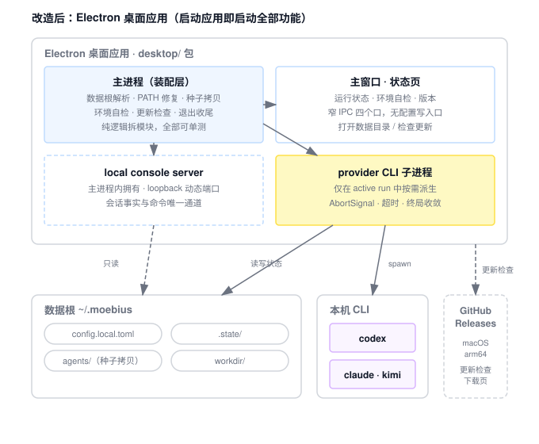

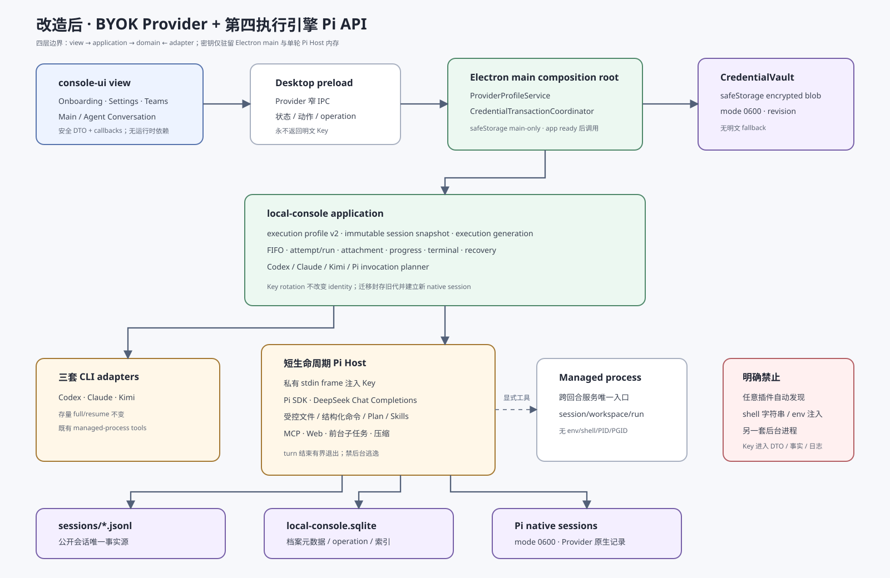
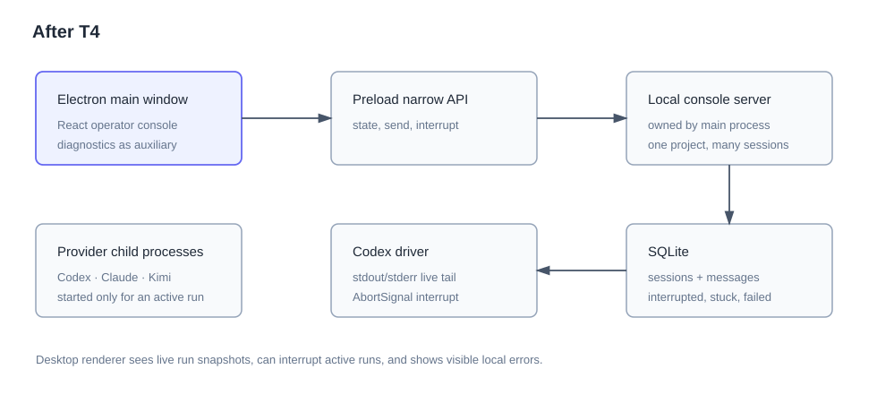
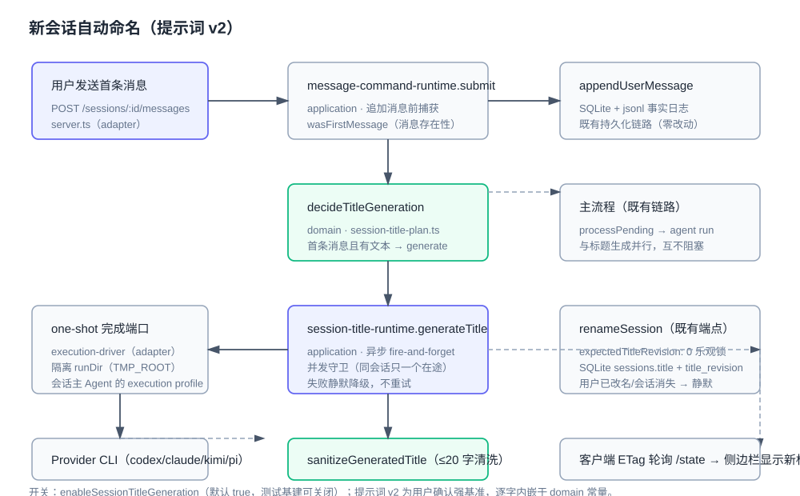
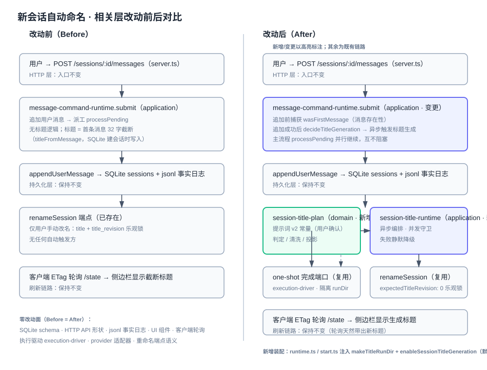

### console-ui
- 职责边界：React/Radix/Tailwind 组件库只承载显示、交互 intent 与组件级可测协议，包括共享团队选项、团队更新提示、run 信息 Popover、只读 Agent Markdown Dialog、只读 Claude raw-terminal surface 与保存反馈；Claude terminal 只消费按序 trace，不产生 PTY 输入，也不把控制序列解释为 Markdown/HTML。Claude 原生信任提示出现时，组件库仍只呈现 trace，不呈现 trust dialog、决策按钮或可编辑终端输入。状态点只消费 local-console 查询层提供的规范化结果，项目折叠时只做该结果的展示优先级聚合，不重新解释 continuation、attention 或运行事实；组件库不比较团队版本、不提升队列、不读取数据根，也不调用 provider、SQLite、HTTP 或 Electron IPC。真实 renderer 数据流属于 desktop-shell application 层。
- 入口：`packages/console-ui/src/index.ts`、`packages/console-ui/src/console/*`、Storybook。
- 上游：desktop renderer、Storybook、组件测试。
- 禁止依赖：组件库不得反向 import `src/runner.ts`、`src/local-console/**` 或状态 adapter。[IB:console-ui-no-runtime-internals]；组件库不得调用 Codex adapter 或 child process。[IB:console-ui-no-side-effect-adapters]；组件不得复制业务事实或状态机。[NI:console-ui-no-business-fact-copy]（非 import：由组件隔离测试和 domain 单测对账）

### local-console
- 职责边界：本地操作台提供 loopback HTTP、SQLite 可变状态与 JSONL 会话事实；负责项目/会话、完整团队快照、三类变化检测、effective/candidate/pending 与持久化 apply intent、dispatch 快照代次、run 审计投影、四引擎执行配置、消息 FIFO、主 Agent/成员接力、provider canonical session、执行代际迁移/结束、恢复/中断/失败、附件、运行过程、文件引用，以及当前应用生命周期内的会话级托管进程。状态查询在目录、团队连续性、关注状态、运行活动与轮次状态全部汇合后生成不可变的会话状态点；侧栏、项目聚合与 Dock 只消费该投影，投影不落盘。主 Agent 派工世代由 `handoff-dispatch-runtime.ts`（application）编排、`control-dispatch.ts`（domain）纯决策：每次派工持久化递增 generation 事实，同角色新派工覆盖旧派工（未启动取消、晚到结果不交棒），用户直达不参与世代。SQLite 只保存可变版本流转，run 当时的完整团队/profile 与外部启动证据追加到 JSONL；窄 API 只按 session/run 暴露审计与显式 Markdown 读取。普通 Claude local-console run 由 `claude-agent-sdk-runner.ts` 适配共享 Agent SDK query，结构化 activity 进入既有运行投影，session/resume 仍由 execution-driver 绑定；legacy TUI modules remain only for compatibility tests and explicit legacy acceptance, and are not part of the default composition root. Pi 安全过程记录持久化在数据根并以事实中的可信路径关联；Provider Key、ciphertext 与原始请求响应不得进入会话事实。普通 provider run 由单轮 stdio MCP bridge 进入 supervisor；Claude SDK run 复用同一 invocation capability，由 execution-driver 负责创建、preflight 与撤销。Claude 原生工作区信任提示不再由 local-console 读取或确认；SDK 的安全失败直接进入既有错误分类。注册表不进入会话事实，重启只精确清理而不恢复或重放命令。`runtime.ts` 仅保留窄 composition root；决策规则在纯 `*plan.ts` / `runtime-domain.ts`，时序在 application runtime，fs/SQLite/provider/HTTP/launchd 在 adapter。新会话自动标题生成由 `session-title-plan.ts`（domain）判定、`session-title-runtime.ts`（application）编排，触发面覆盖 create + initialMessage 与 submit 两条首条消息落库入口，共享同一 runtime 实例与进程内在途守卫。
- 入口：`src/runner.ts` → `src/local-console/start.ts`、`src/local-console/server.ts`、`src/local-console/runtime.ts`；Desktop main 直接调用同一 start API。
- 上游：终端 local CLI、Electron main、local acceptance 与单元测试。
- 禁止依赖：`control-dispatch.ts` 不得经直接或运行时传递依赖到达文件系统、SQLite、provider 或 execution driver adapter。[IB:local-control-planner-pure-closure]；`handoff-dispatch-runtime.ts` 不得经直接或运行时传递依赖到达文件系统、SQLite、provider 或 execution driver adapter。[IB:local-handoff-runtime-pure-orchestration]；`run-invocation-plan.ts` 不得经直接或运行时传递依赖到达文件系统、SQLite、provider 或 execution driver adapter。[IB:local-invocation-planner-pure-closure]；本地 child orchestration 只允许映射为 local child session，不得产生 GitHub issue、comment、reaction 或 state 写入。[NI:local-console-local-only]（非 import：需由真实进程树、网络边界与历史数据不变验收共同判定）；托管进程不得退化为 shell 后台化、direct child、裸 PID/PGID reconciliation 或正文 JSON 协议，非 Darwin target spawn 必须为零。[NI:managed-process-owned-lifecycle]（非 import：由 argv 数据流、launchd 证据和进程树验收）；legacy GitHub 表只读保留，不得在 local 启动时迁移、清空或重写。[NI:local-console-legacy-state-nondestructive]（非 import：需对启动前后文件哈希和逐表行数）

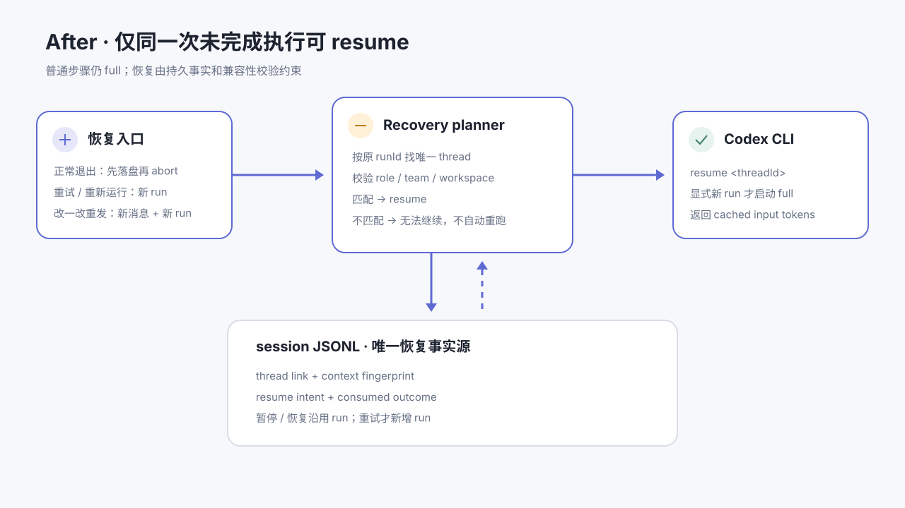
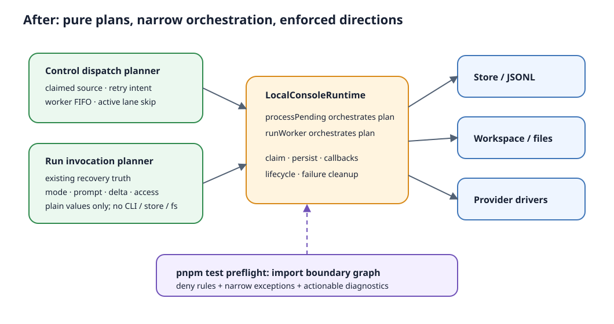
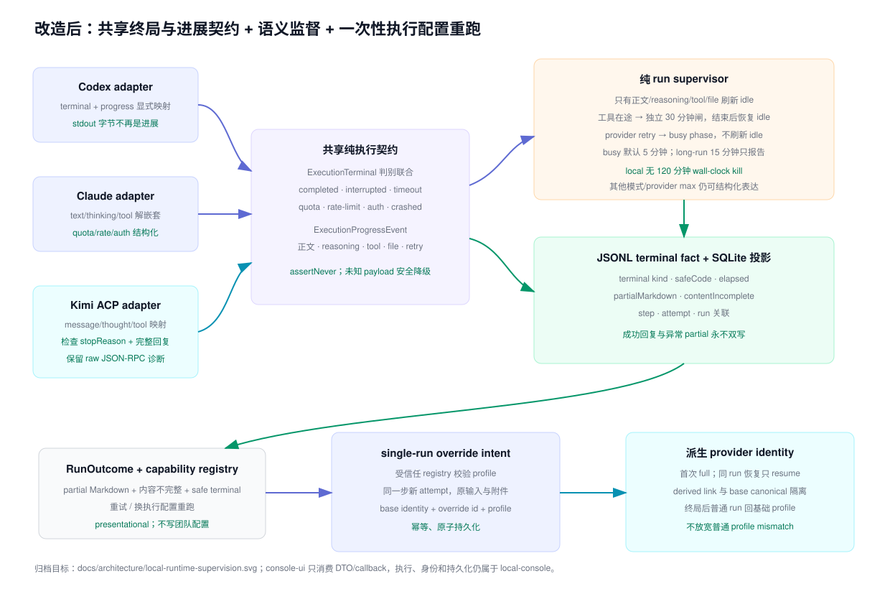

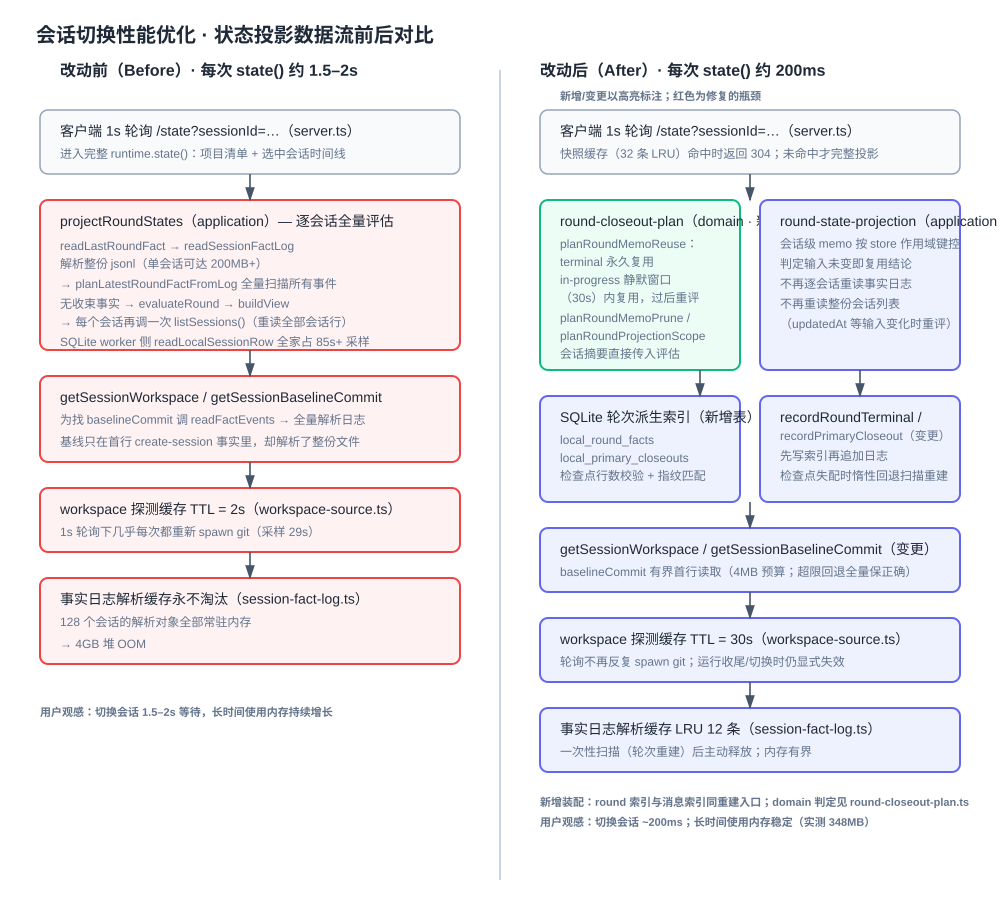
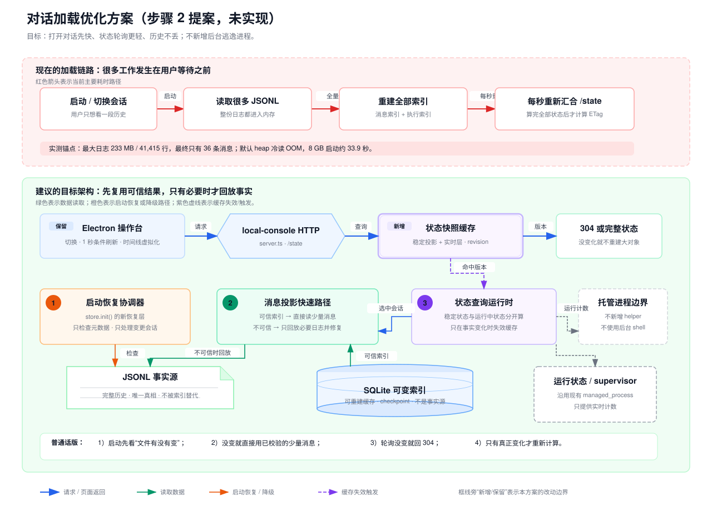

### local-entry
- 职责边界：`src/runner.ts` 现在只是兼容包脚本的 local CLI shell：校验参数、启动 local server、打印地址并在 SIGINT/SIGTERM 时关闭。`--github-mode` 是已退役参数，必须在 server 启动前给出可读错误。
- 入口：`pnpm start` → `tsx src/runner.ts`。
- 上游：终端用户、开发脚本、启动行为测试。
- 禁止依赖：local 入口不得派生 runner child、调用 `gh` 或读取 repository 白名单。[NI:local-entry-no-github-runtime]（非 import：由启动参数、进程树和外部命令探针判定）

### agents
- 职责边界：`agents/*.md` 是本地团队 persona 素材，`agents/ceo-scripts/*.md` 是 CEO 编排数据；两者都不是运行时状态。已退役的 prescript/workspace-access frontmatter 不再解析或执行。
- 入口：数据根团队成员 `AGENT.md`、仓库默认 `agents/*.md`、`src/agent-manifest.ts`。
- 上游：local team binding、AI 建队与 local route persona loader。
- 禁止依赖：agent Markdown 不得声明可执行脚本、GitHub token或任意工作区权限。[NI:agents-static-material-only]（非 import：Markdown 不在 TypeScript import graph 中，需解析与运行时行为验证）

### stages
- 职责边界：集中定义 stage 枚举与尾部 marker 解析，只处理字符串，不知道 transport、provider 或持久化。
- 入口：`src/stages.ts`。
- 上游：local persona 与协作流程。
- 禁止依赖：stage 模块不得调用 provider 或文件系统 adapter。[IB:stages-no-side-effect-adapters]；stage 白名单不得在其他模块复制维护。[NI:stages-single-whitelist]（非 import：常量复制需代码审查与行为测试）

### ceo-scripts
- 职责边界：只读加载并校验 `agents/ceo-scripts/*.md` 的 workflow id/action，供 local CEO persona 与 child-session parser 使用；不执行脚本、不调用 provider、不持久化状态。
- 入口：`src/ceo-scripts.ts`。
- 上游：local route persona、local session metadata runtime。
- 禁止依赖：CEO 剧本 loader 不得调用 Codex adapter。[IB:ceo-scripts-no-provider-adapters]；CEO 剧本不得被当作可 mention agent 或可执行脚本。[NI:ceo-scripts-data-only]（非 import：属于素材分类和运行时调用语义）

### local-ceo-orchestration
- 职责边界：纯解析 CEO 结构化输出、校验 workflow/成员/分组/任务字段，再由 local application 映射成 child sessions。persona/script 读取在 adapter，session 创建在 application；parser 不做 IO。
- 入口：`src/local-console/ceo-orchestration-parser.ts`、`src/local-console/local-child-session-plan.ts`、`src/local-console/session-metadata-runtime.ts`。
- 上游：local primary Agent 成功终局。
- 禁止依赖：local CEO parser 不得调用 provider、文件系统或 child process。[IB:local-ceo-orchestration-no-side-effect-adapters]；parser 不得创建 GitHub issue 或直接写 session 状态。[NI:local-ceo-orchestration-pure]（非 import：副作用可经注入回调隐藏，需 application 行为测试）

### triggers
- 职责边界：只对 local 共享时间线的最新消息解析第一条可用 agent mention；代码区域内 mention 被忽略。trigger 不解释 stage、自然语言验收或 provider 状态。
- 入口：`src/triggers/index.ts`、`src/triggers/mention-trigger.ts`。
- 上游：local primary dispatch。
- 禁止依赖：trigger 不得调用 provider或文件系统 adapter。[IB:triggers-no-side-effect-adapters]；trigger 不得把 stage 或编排规则复制进 mention 判定。[NI:triggers-mention-only]（非 import：由 trigger 行为测试判定）

### local-config
- 职责边界：同步读取并校验 `config.toml` / `config.local.toml` 的 provider/model 覆盖；兼容读取旧 `watchRepositories` 只为旧配置不阻断 local 启动，结果被忽略。
- 入口：`src/local-config.ts`、`src/config.ts`。
- 上游：local CLI、Desktop 与 provider adapters。
- 禁止依赖：配置解析不得调用 provider adapter。[IB:local-config-no-provider-adapters]；配置不得保存 token、issue 内容或运行时会话状态。[NI:local-config-no-sensitive-state]（非 import：需检查解析结果和写入行为）

### conversation-protocol
- 职责边界：本地共享时间线的 speaker 归一化、role metadata 兼容、Markdown 代码区 mention 解析与 agent 可见 envelope 格式化。provider prompt 与 resume delta 由 `src/local-console/prompt.ts` 负责。
- 入口：`src/conversation.ts`、`src/local-console/timeline.ts`、`src/local-console/prompt.ts`。
- 上游：local dispatch、route judgment、SQLite 历史兼容。
- 禁止依赖：conversation 纯模块不得调用 provider 或文件系统 adapter。[IB:conversation-no-side-effect-adapters]；时间线正文不得被解释为 shell 命令或权限声明。[NI:conversation-no-shell-content]（非 import：需追踪外部文本到进程参数的数据流）

### provider-adapters
- 职责边界：`src/codex.ts`、`src/claude-agent-sdk.ts`、`src/claude-version.ts`、`src/kimi.ts` 与 `src/pi-execution-adapter.ts` 把三家 CLI 和 Pi API 映射为统一执行契约。可执行文件解析、版本探测、Claude Agent SDK query、full/resume session identity、结构化 activity、usage/error 归一化、普通/Builder profile 与 managed MCP stdio 注入分别留在窄 adapter；原生 transcript/wire/安全 trace 读取与 canonical session 校验继续由对应 resolver 负责。Claude 默认路径是每轮有自然终点的 headless SDK query，不创建 PTY、TUI lifecycle、workspace trust detector、raw terminal trace 或持久 relay；认证、权限、MCP 与启动失败直接进入既有安全错误分类。`src/claude.ts`、`src/claude-print.ts`、`src/claude-tui-*` 仅作为兼容测试或显式 legacy acceptance 的保留 adapter，不进入默认组合根。Pi Host 只接受单次 invocation 的长度前缀 stdin/stdout 帧，Key 不进入 argv/env。业务 dispatch、重试与终局文案不进入 provider adapter。
- 入口：`src/execution-contract.ts`、`src/claude-agent-sdk.ts`、`src/local-console/managed-process-mcp-wiring.ts`、四家 provider adapter、`src/pi-host.ts`、`src/pi-host-protocol.ts`。
- 上游：local application runtime、AI team builder，以及 `scripts/acceptance/pi-agent-capabilities.ts` / `scripts/acceptance/byok-pi-electron.ts` 的真实 DeepSeek 与 Electron 验收。
- 禁止依赖：provider adapter 不得读取 persona 决定路由，也不得把外部正文拼成 shell 字符串。[NI:provider-adapter-no-business-routing]（非 import：需检查参数数据流和 application/domain 对账）

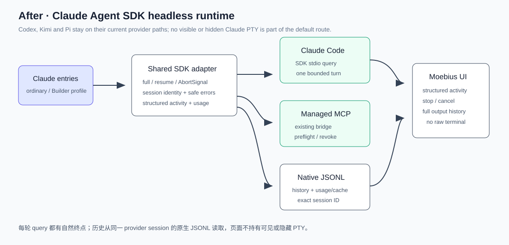

### sqlite-state
- 职责边界：`src/sqlite-state.ts` 通过 `new URL("./sqlite-state-worker.ts", import.meta.url)` 动态启动 worker；worker 只暴露 local store 仍消费的 commands。旧 GitHub 表若已存在必须原样保留，fresh local schema 不再创建这些表。
- 入口：`src/sqlite-state.ts`、`src/sqlite-state-worker.ts`、`src/local-console/store.ts`。
- 上游：local console store、Desktop 打包时的显式 worker entry。
- 禁止依赖：SQLite 初始化不得 drop、truncate、迁移或重写既有 GitHub runner 表。[NI:sqlite-legacy-github-state-nondestructive]（非 import：需用带代表数据的真实数据库做哈希与逐表行数对账）
