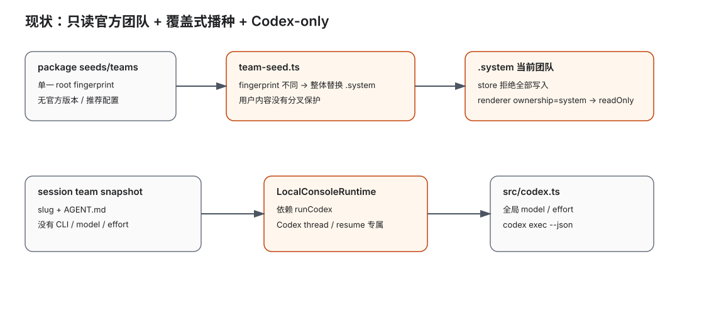
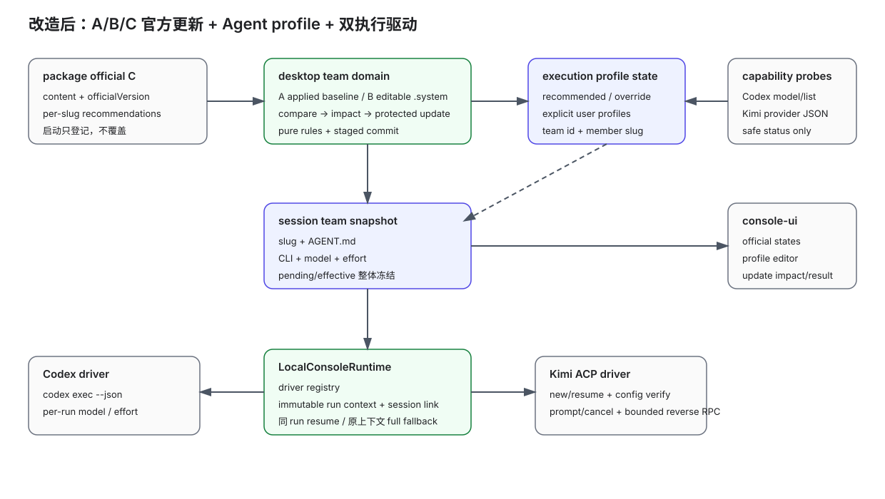

# 设计：agent-runtime-profiles-official-team-updates

现状与改造后的数据流见  与
。

## 1. 总体分层

```text
package seed (C)
  ├─ official content
  └─ official manifest + recommendations
             │ register only
             ▼
desktop team domain
  ├─ editable .system team (B)
  ├─ applied official state (A)
  ├─ saved execution bindings
  ├─ capability probes
  └─ compare / plan / commit update
             │ snapshot on create/switch
             ▼
local-console session snapshot
  └─ member { slug, AGENT.md, execution profile }
             │ per run
             ▼
execution driver registry
  ├─ Codex exec driver
  └─ Kimi ACP driver
```

依赖方向保持 `console-ui → desktop-shell → local-console driver interface`。`src/`
中的 local-console 不读取团队目录、官方状态或 Electron IPC；desktop 负责把完整
快照注入。GitHub runner 继续直接依赖现有 Codex driver，不反向依赖桌面团队域。

## 2. 磁盘与状态模型

### 2.1 团队内容保持原形

`team.json` 继续只保存 name、description、primaryAgentSlug、memberOrder；
`members/<slug>/AGENT.md` 继续拥有成员身份与正文。官方团队当前内容 B 仍位于
`<dataRoot>/teams/.system/<teamId>`，但不再只读。

以下内容不写进团队内容目录：

- 官方版本与已应用内容指纹；
- 官方推荐运行配置；
- 用户运行覆盖；
- CLI 能力缓存；
- 更新 journal。

这样 Finder 编辑、内容指纹、团队复制和会话内容快照的边界不会互相污染。

### 2.2 安装包官方 manifest

每个 `seeds/teams/<teamId>/official.json` 是 C 的机器元数据：

```ts
interface PackagedOfficialTeamManifestV1 {
  schemaVersion: 1;
  officialVersion: string;
  members: Record<string, {
    recommendedProfile: ExecutionProfile;
    renamedFrom?: string;
  }>;
}
```

`official.json` 不进入团队内容指纹，也不复制为用户可编辑内容。
`renamedFrom` 只用于更新摘要；迁移仍严格按“删除旧 slug + 新增新 slug”，绝不据此
继承用户覆盖。

### 2.3 应用状态

在 `<dataRoot>/.state/agent-teams/` 保存两个版本化文档：

```ts
interface OfficialTeamStateDocumentV1 {
  schemaVersion: 1;
  teams: Record<string, {
    appliedOfficialVersion: string;
    appliedContentFingerprint: string;
    appliedRecommendationFingerprint: string;
    appliedRecommendations: Record<string, ExecutionProfile>;
    baselineConfidence: "verified" | "conservative";
  }>;
}

interface TeamExecutionBindingDocumentV1 {
  schemaVersion: 1;
  teams: Record<string, {
    ownership: "system" | "user";
    members: Record<string,
      | { source: "recommended" }
      | { source: "override" | "explicit"; profile: ExecutionProfile }
    >;
  }>;
}
```

team key 使用既有稳定 team id 加 ownership，不使用路径。用户团队 relocation 不需要
迁移绑定。普通用户团队只允许 explicit；官方团队的当前官方成员允许 recommended
或 override；无法在当前 A 中找到官方推荐的成员按 explicit 处理。

写入采用同目录临时文件 + fsync/rename 的小型文档 store；parse、schema 校验、状态
归一化与有效 profile 求值放在无 IO 纯模块中。

### 2.4 ExecutionProfile

```ts
type ExecutionCli = "codex" | "kimi";

interface ExecutionProfile {
  cli: ExecutionCli;
  model: string;
  effort: string;
}
```

首版不把 provider、账号、权限模式或任意额外 flags 暴露为 Agent 字段。profile 必须
是完全保存的三元组，不使用“沿用全局配置”的隐式空值。初始官方推荐沿用当前产品默认
行为：Codex、`DEFAULT_CODEX_MODEL`、当前默认 reasoning effort；之后官方推荐通过
`officialVersion` 正常演进。

## 3. 三方比较与更新规划

### 3.1 内容指纹

新增 `computeOfficialTeamContentFingerprint`，只遍历：

- 规范化 `team.json` core；
- `members/` 下每名成员的完整目录与普通文件；
- 当前 PRD 允许维护、且明确属于团队内容的其他成员文件。

它明确排除：

- `onboarding-orchestration.json`；
- `official.json`；
- `.teams-seed.marker`；
- 运行配置、缓存、临时文件与应用内部元数据；
- symlink 与不支持的特殊文件（比较返回不可读，不跟随出界）。

路径按 POSIX 相对路径排序，文件内容按原始 bytes 入 hash；core JSON 在 hash 前按固定
字段顺序序列化，避免仅格式变化产生噪音。

### 3.2 纯状态推导

```ts
deriveOfficialTeamUpdateState({
  applied: A,
  current: B,
  packaged: C,
  bindings,
}): OfficialTeamUpdateState
```

输出包括：

- `customizationStatus`;
- `updateStatus`;
- `primaryAction`;
- `requiresProtectiveCopy`;
- member adds/removes/renames;
- recommendation changes;
- protected members/bindings;
- stable reason code。

保护判据优先于 `B === C.content` 快捷登记：

1. C 删除/改名一个存在 override 的 A 成员；
2. C 新增 slug 与 B 中 A 不认识的用户成员同名；
3. baselineConfidence 为 conservative 且 B 无法证明是干净内容。

纯函数覆盖完整真值表，UI 和 IO 层不得复制判据。

### 3.3 更新 plan 与提交

更新分两步：

1. `prepareOfficialTeamUpdate` 读取并重验 A/B/C/bindings，生成带
   `inputFingerprint` 的不可变 plan，完整校验副本目标、C 内容和迁移结果。
2. `commitOfficialTeamUpdate` 只接受仍匹配当前状态的 plan；状态已变化则返回
   `STALE_UPDATE_PLAN`，要求页面重新载入。

需要副本时：

- 把 B 复制到同一数据根的隐藏 staging 目录；
- 为副本生成稳定 user team id，复制全部已保存 profile 为 explicit；
- staging 中重读团队结构与配置；
- 把 C 准备到 official staging，按 slug 合成新版 bindings；
- 写入 update journal 后交换官方目录、登记 A、登记用户团队记录与 bindings；
- 全部完成才让副本和新版同时出现在列表。

失败时用 journal 和 backup 恢复到操作前可见状态。启动恢复只允许得到“全部旧状态”或
“副本 + 完整新版”之一；重复提交同一 plan 使用 plan id 去重，不能生成第二个副本。
这是技术一致性设计，不新增 PRD 中未承诺的自动内容修复。

### 3.4 旧播种迁移

旧版只有 root marker，没有逐团队 A：

- 若忽略 marker 文件后计算出的 `.system` seed fingerprint 与旧 marker 相同，则
  当前内容可证明未被改动：逐团队以当前 B 建立 verified A。
- 若不相同、marker 缺失或读取失败，则逐团队建立 conservative A：当前内容保留，
  页面显示已自定义/有更新，任何应用 C 的操作先保留副本。
- 首次安装且 `.system` 不存在时，从 C 创建 B 与 verified A。
- 迁移完成后旧 marker 只作兼容审计输入，不再驱动覆盖。

## 4. 运行配置能力与保存

### 4.1 能力 DTO

```ts
interface ExecutionCapabilitySnapshot {
  cli: "codex" | "kimi";
  cliVersion: string | null;
  status: "available" | "missing" | "unavailable";
  models: Array<{
    id: string;
    displayName: string;
    efforts: string[];
    defaultEffort: string | null;
  }>;
  snapshotId: string;
  checkedAt: string;
}
```

错误只返回稳定 code 与安全中文摘要；stderr、绝对路径、provider secret 和原始配置
不得进入 renderer。

### 4.2 Codex 能力探测

启动短生命周期 `codex app-server --stdio`，完成 initialize 后调用 `model/list`，
读取 model id、display name、defaultReasoningEffort 与
supportedReasoningEfforts。命令不存在是 missing；协议不支持、认证/配置错误或超时
是 unavailable。

app-server 当前标记 experimental，因此探测模块必须隔离并有版本/协议测试。协议不可
用时不回退到硬编码模型列表；已保存配置保留并显示“无法验证”。

### 4.3 Kimi 能力探测

先执行 `kimi --version`，再执行 `kimi provider list --json`，从当前用户已经配置的
models 表读取 model alias、display_name、support_efforts、default_effort 与
off_effort。Moebius 不修改 `~/.kimi-code/config.toml`，不创建 provider，不接触
token。

Kimi 官方文档明确提供 `provider list --json`、模型声明中的 `support_efforts` /
`default_effort`，以及 ACP 的 model/thinking config option：

- https://www.kimi.com/code/docs/en/kimi-code-cli/reference/kimi-command.html
- https://www.kimi.com/code/docs/en/kimi-code-cli/configuration/config-files
- https://www.kimi.com/code/docs/en/kimi-code-cli/reference/kimi-acp

`provider list --json` 只用于团队页候选项和保存时能力校验，不能证明某次 ACP session
最终采用了保存值。运行时必须以 `session/new|resume` 返回的 `configOptions`，以及
`config_option_update` / 设置响应中确认的当前选择为权威；两层校验不能互相替代。

### 4.4 保存与草稿

运行配置 editor 以 saved/draft 分离：

- 改字段只改 draft；
- 切 CLI 清空不再适用的 model/effort draft，要求用户从新能力快照完成选择；
- save 携带 capability snapshotId，main process 重新检查该组合仍存在；
- save 失败保留 draft，effective profile 仍是最近一次 saved；
- discard 只丢当前 draft；
- 离开详情与 update/duplicate 操作复用统一 dirty guard，同时覆盖 AGENT.md 和 profile
  drafts。

## 5. 会话快照迁移

### 5.1 snapshot schema

```ts
interface LocalConsoleAgentTeamSnapshotMember {
  name: string;
  agentMarkdown: string;
  executionProfile?: ExecutionProfile;
}
```

SQLite snapshot table增加 `execution_cli`、`execution_model`、`execution_effort` 可空
列。新会话和切换团队的 pending snapshot 必须为每个成员写完整 profile；pending →
effective 沿用现有整体切换，不单独更新字段。现有
`applyPendingSessionContextWhenIdle` 边界保持不变：切换前已启动或已排队的所有 run
进入终态后才整体提升 pending；同一边界先提升团队快照，再处理待接回结果和待发射
消息。

旧行三列均 NULL 表示 legacy Codex。读取时构造仅供执行的
`LegacyCodexExecutionProfile`，使用升级前同一路径的 Codex options；full、resume 与
fallback 都复用这一个兼容身份。不回写旧 session snapshot，不根据当前团队页配置
补齐。

### 5.2 run 级不可变执行上下文

session 的 effective/pending snapshot 会在换队时整体切换，不能作为旧 run 恢复的
唯一来源。每条 run 在启动或排队时必须追加不可变 JSONL fact，并由 SQLite 建可重建
索引：

```ts
interface RunExecutionContextFact {
  runId: string;
  role: string;
  teamSnapshot: LocalConsoleAgentTeamSnapshot;
  profile: ExecutionProfile | LegacyCodexExecutionProfile;
  workspaceIdentity: string;
  contextFingerprint: string;
}
```

`teamSnapshot` 保存该 run 当时看到的完整成员顺序、Markdown 与 profile，不只保存
当前角色；这样 full-fallback 仍能按原团队规则解释共享时间线。execution session link
只引用同一 `runId` 和 `contextFingerprint`，不能在恢复时重新读取 session 当前
effective snapshot。

换队只影响边界之后新建/排队的 run。旧 run 的 resume 与 full-fallback 都读取自己的
`RunExecutionContextFact`；当前团队接手旧结果必须创建新 run。升级前缺 profile 的
会话和 run 使用 `LegacyCodexExecutionProfile`，不得从当前团队绑定补齐。

### 5.3 复制与成员迁移

- 官方同 slug override：快照前求值为 override 原值。
- 官方同 slug recommended：快照前求值为当前 A recommendation。
- 用户团队：读取 explicit。
- profile 缺失或组合当前不可用是否阻止新建对话仍由后续 PRD 决定；若会话已创建并
  到达执行点，驱动必须明确失败且不得降级。

## 6. Execution driver

### 6.1 通用契约

```ts
type ExecutionRunMode =
  | { kind: "full" }
  | { kind: "resume"; engine: ExecutionCli; sessionId: string };

interface ExecutionRunOptions {
  profile: ExecutionProfile | LegacyCodexExecutionProfile;
  runContextFingerprint: string;
  prompt: string;
  runDir: string;
  cwd?: string;
  imagePaths: string[];
  signal?: AbortSignal;
  mode: ExecutionRunMode;
  onVisibleAgentMarkdown?: (text: string) => void;
  onSessionStarted?: (engine: ExecutionCli, sessionId: string) => void | Promise<void>;
}
```

LocalConsoleRuntime 只调用 registry。driver 结果使用中性字段
`engine/sessionId/cachedInputTokens?`；Codex 专属 token 指标继续可空。GitHub runner、
AI 建队与其他现有调用继续使用 `runCodex` 兼容入口，不随 registry 改造。

### 6.2 Codex adapter

- `src/codex.ts` 保留现有 JSONL framer、watchdog、终止升级和 thread started 提取。
- 新增 profile-aware options builder：保留 provider、service tier、fast mode、
  sandbox 与用户配置语义，只规范化地替换 `-m` 与
  `model_reasoning_effort="<effort>"`，禁止追加重复配置后依赖参数顺序碰运气。
- full/resume 都显式传同一 model/effort；resume threadId 继续精确指定。

当前安装的 Codex CLI `0.144.1` 提供 `codex exec --json -m`、
`codex exec resume <sessionId>` 与 `-c key=value`；生成的 app-server schema提供
`model/list`、`supportedReasoningEfforts` 和 `defaultReasoningEffort`。实现测试使用
fixture 协议，不依赖开发机实时模型列表。

### 6.3 Kimi ACP adapter

每个 Moebius attempt 启动一个 `kimi acp` 子进程：

```text
spawn kimi acp
  → initialize
  → authenticate(login)
  → full: session/new(cwd)
     resume: session/resume(sessionId, cwd)
  → read authoritative session configOptions
  → session/set_config_option(model)
  → session/set_config_option(thinking effort)
  → verify config_option_update / setting responses
  → session/set_config_option(mode = auto)
  → session/prompt(text + images)
  → aggregate agent_message_chunk
  → terminal response / error
```

约束：

- JSON-RPC id 严格关联，单行/单消息有尺寸上限，未知 notification 记录诊断但不暴露
  raw payload。
- `session/new|resume` 响应中的 `configOptions` 决定当前 session 实际提供的 model /
  thinking option id、候选值与当前选择。driver 发送设置请求后，必须把
  `config_option_update` 与对应设置响应归一化为最终生效的 model/effort，并与快照
  逐字段比较。
- 若保存的 option/value 已不存在、设置响应失败、CLI 回落到默认值、响应无法证明
  最终选择，或最终 model/effort 与快照任一不一致，attempt 必须以安全的
  `KIMI_PROFILE_NOT_EFFECTIVE` 在 `session/prompt` 前失败。失败路径不得发送 prompt、
  不得静默改写快照，也不得调用 Codex 或任何其他 execution driver。
- full 与 resume 使用同一份运行前核验；恢复到已存在 session 也不能假设旧配置仍然
  生效。
- `fs/read_text_file` / `fs/write_text_file` reverse RPC 只允许规范化后位于 workspace
  或本 run 的托管附件根；symlink 出界、绝对路径出界和 NUL 一律拒绝。
- auto mode 后若仍收到 permission/question request，driver fail closed，不替用户
  猜答案。
- image prompt 读取已受附件能力保护的本地图片并转换为 ACP image block；普通文件
  继续通过现有 prompt manifest。
- AbortSignal 在 session 已建立时先发 `session/cancel`，随后发送 SIGINT；等待一段
  有界宽限后发送 SIGTERM，再等待一段有界宽限后发送 SIGKILL。session 尚未建立时
  只跳过 `session/cancel`，三段信号顺序不变；outer close 不得追加乱序或重复信号，
  并与 Codex driver 一样保证 promise 有限 settle。
- session id 只取 `session/new|resume` 响应，不用 `--continue`、mtime 或
  `session_index.jsonl` 猜测。

### 6.4 resume 与外部 session link

把 `codex-thread-link` 兼容升级为 execution session link：

```ts
interface ExecutionSessionLinkFact {
  runId: string;
  engine: "codex" | "kimi";
  externalSessionId: string;
  profileFingerprint: string;
  runContextFingerprint: string;
}
```

旧 Codex link 读取为 engine=codex，并关联该 run 的 legacy context。恢复规划只从
`RunExecutionContextFact` 取原角色、团队、工作空间与 profile；除现有检查外，增加：

- 原 link engine 必须等于 run context profile.cli；
- profile fingerprint 必须相同；
- runContextFingerprint 必须相同；
- 对应 driver 必须确认外部 session 可恢复。

任一不匹配使用原 `RunExecutionContextFact` 做 full-fallback 并记录中性原因，不能
读取换队后的 current effective snapshot。绝不把 Codex thread id 交给 Kimi，也不把
Kimi session id 交给 Codex；当前团队要接手必须创建新 run。

## 7. UI 与 IPC

### 7.1 IPC

扩展窄 IPC，而非暴露通用文件/命令执行：

- list/get team 返回 official state summary 与 member saved profile summary；
- check capabilities；
- save/discard profile 仍在 renderer draft，本地只需 save；
- prepare/apply official update；
- restore current recommendation；
- 既有 team/member write 接受 system ownership；
- trash team 仍只接受 user ownership。

所有 request 在 main process 重验 team id、ownership、slug、profile 与 plan token。

### 7.2 UI 状态

团队详情不再接收整页 `readOnly`，改为明确 capability：

```ts
{
  canEditContent: boolean;
  canDeleteTeam: boolean;
  officialState?: ...;
}
```

这避免以后再次把“官方来源”错误等同于所有字段只读。

运行配置状态与 `AGENT.md` editor state 分离在纯 reducer 中；离开守卫只组合两类
dirty facts。官方更新 banner、影响摘要、成功/失败结果由 server DTO 决定，组件不
复算 A/B/C。

字符版式见 `wireframes.md`。不新增颜色令牌；“有更新/已自定义/需要调整”使用现有
中性/info 状态语义，不能复用 danger/repair 红点。

## 8. 测试与验收

### 8.1 单元测试

1. A/B/C 完整真值表；保护优先于 `B === C`。
2. 指纹包含 core/member files，排除 orchestration/official/runtime state。
3. official update 的同 slug、新增、删除、改名、用户 slug 撞名与推荐迁移。
4. verified/conservative 旧 marker 迁移。
5. update plan stale、任一步失败、重试幂等、启动 journal 恢复。
6. profile source 求值、复制固化、恢复当前推荐。
7. Codex model/list 与 Kimi provider JSON 能力解析；缺失/不可用/过期快照。
8. Codex profile options 去重与 full/resume 同配置。
9. Kimi ACP initialize/new/resume/config/prompt/cancel、`configOptions` 与
   `config_option_update` / 设置响应归一化、chunk framing、越界 fs 请求。
10. session snapshot 新字段、legacy NULL Codex、pending/effective 在全部已启动/排队 run
    终态后整体切换。
11. run execution context JSONL fact / SQLite 重建索引、换队后旧 run 上下文不变。
12. engine/profile/context mismatch 禁止 resume，full-fallback 使用原 run context 且
    不调用当前团队 driver。
13. Kimi model/effort 回落、缺项、设置失败或无法确认时在 prompt 前失败，且另一
    driver 调用次数为零。
14. Kimi 图片转 ACP image block、普通文件保持 manifest；转换失败不降级 Codex。
15. UI reducer 的 Markdown/profile 独立草稿与离开守卫。

### 8.2 组件/接线测试

- 官方团队的团队信息、主 Agent、成员和 AGENT.md 均可编辑，删除团队仍不可达。
- 保存 profile 后显示 override；只改 profile 不显示“已自定义”。
- clean update、保护副本 update、`B === C` 登记、能力仅变化四类主操作。
- 更新前影响摘要和更新后副本入口。
- narrow/wide 下更新 banner、成员 selector、profile editor 不遮挡操作。
- main process IPC 拒绝 renderer 伪造 system delete、无效 profile 与 stale plan。

### 8.3 fake CLI 验证

使用 PATH 前置的 fake `codex` / `kimi`，不调用真实模型：

1. 一支团队混用 Codex 与 Kimi，两名成员分别产生正确 driver 调用及
   model/effort。
2. 对话创建后修改团队 profile，当前 session 仍使用快照，新 session 使用新值。
3. fake Kimi 缺失/非零退出时 run 明确失败，fake Codex 调用次数为 0。
4. Kimi 未完成 run 生成 session link；恢复只调用同一 session；换队后旧 run 的
   session 不可恢复时仍用原 Kimi/team/profile full-fallback，fake Codex 调用为零。
5. fake Kimi 分别返回匹配、默认回落、过期 option、设置失败和缺少最终选择；只有
   匹配场景收到 `session/prompt`，其余场景 prompt 与 fake Codex 调用次数都为零。
6. Kimi 图片进入 ACP image block、普通文件进入 manifest；附件转换失败时 fake
   Codex 调用为零。
7. SIGINT/cancel 与 watchdog 均有限 settle。

### 8.4 AI/DOM 验证

- 修改官方团队内容，注入新版 C，核对“已自定义 + 有更新”和影响摘要。
- 点击“保留副本并更新”，核对副本内容/explicit profile、官方新版/recommended
  profile、官方身份分离。
- 只改运行配置后更新，核对无冗余副本。
- 删除有 override 成员、slug collision 两种保护路径即使 `B === C` 仍建副本。
- 保存失败、外部冲突、stale plan 不留下半成品。
- 主要验收以 DOM 文本、状态 DTO、文件事实和退出码为证据；只有断言无法覆盖的布局
  问题才截图，截图落盘不回读。

### 8.5 实施门禁

实现阶段至少运行：

```text
pnpm exec vitest run <新增定向测试>
pnpm test
pnpm typecheck
pnpm --filter @moebius/console-ui build-storybook
pnpm --filter @moebius/desktop build
```

长日志重定向到临时文件，只回读退出码与关键失败行。

### 8.6 PRD 验收追踪

`agent-teams.md` 的 #3、#14–27 是本 change 新增行为的追踪范围。#1–2、#4–13 是既有
团队页面能力，只要求相关定向测试与全量测试继续通过，不作为本 change 新建实现项。

| `agent-teams.md` 验收 | 规格/验证落点 |
| --- | --- |
| #3 官方团队可编辑但身份稳定、不可删 | desktop-shell「Team storage」；UI + IPC 正反测试 |
| #14 独立 CLI/model/effort、无静默降级 | desktop-shell profile/capability；fake CLI 混用/缺失测试 |
| #15 配置状态不等于自定义/修复 | desktop-shell 指纹排除；console-ui management state 测试 |
| #16 干净更新不建副本 | desktop-shell three-way/update；A=B、C≠A 单测 |
| #17 分叉与 B=C 快捷登记 | 保护优先级真值表；两条 store 集成测试 |
| #18 仅推荐变化也更新 | recommendation fingerprint；同 slug recommended/override 测试 |
| #19 新增/删除无覆盖成员 | member migration 纯函数与 update fixture |
| #20 删除/改名有覆盖成员 | equal-content protection + protective copy 故障注入 |
| #21 恢复当前已应用推荐 | effective profile/restore IPC 测试 |
| #22 副本固化配置并脱离来源 | duplicate store + list DTO 断言 |
| #23 草稿/冲突/失败无半成品 | combined dirty guard + stale plan/journal/failure injection |
| #24 管理状态不触发 repair 红点 | console-ui sidebar indicator 否定断言 |
| #25 两类草稿独立 | profile reducer + leave/update/duplicate guard 组件测试 |
| #26 更新前后事实可核对 | impact/result DTO 与 DOM 测试 |
| #27 新官方 slug 撞用户成员 | collision protection 纯函数 + protected update 集成测试 |

| `main-conversation.md` 验收 | 规格/验证落点 |
| --- | --- |
| #20、#46 团队内容与每名 Agent profile 快照稳定 | local-console snapshot delta；新建/换队/团队后改单测 |
| #42、#44 同 run、同 engine/profile 才 resume，否则 full fallback | execution link delta；recovery planner + fake CLI |
| #47 CLI 硬绑定且不自动降级 | local-console hard-route delta；missing/mismatch 时另一 driver 零调用 |
| #48 旧会话保持原 Codex 行为 | legacy NULL migration；不读取当前团队配置的兼容测试 |
| #6、#49 并行换队与旧 run context | pending/effective + run-context fact；全部旧 run 终态、旧 run fallback 测试 |
| #36 附件按绑定 CLI 交付 | Kimi ACP image block + ordinary-file manifest fake CLI 测试 |

## 9. 权衡

### 运行配置不写进团队目录

优点是官方内容指纹、Finder 编辑与本机执行方式彻底分离，官方更新不会覆盖绑定；
代价是复制/删除/重定位必须显式协调 profile store。选择显式协调，因为稳定 team id
已经存在，且 PRD 明确把运行配置定义为本机执行配置。

### Kimi 采用 ACP，不采用 `kimi -p --continue`

print mode 的 stream-json 适合一次性脚本，但 `--continue` 以 cwd 最近会话为目标，
无法满足 Moebius 对“只恢复同一次未完成 run”的精确关联。ACP 明确返回 session id，
支持 session/resume、model/thinking config、prompt 与 cancel，代价是需要实现受限
JSON-RPC client 和 reverse RPC 安全边界。为避免错恢复，选择 ACP。

### Codex 不整体迁到 app-server

当前 `codex exec --json` 的 full/resume/watchdog 已有大量验证。只为能力探测使用
app-server `model/list`，执行仍复用稳定路径，可显著缩小回归面。代价是两条 Codex
协议表面需要版本测试。

### 保守迁移优先于误判干净

旧 marker 无法总是还原逐团队 A。无法证明时要求保留副本会多一次用户操作，但不会
丢数据；反向误判干净会静默覆盖，因此不可接受。

### 不在本 change 偷渡其他页面裁决

本批明确交付 Agent Teams + core driver；onboarding、新建对话 invalid-profile gate、
右侧过程栏与 GitHub runner 继续范围外。代价是全产品 Kimi 体验不能由单个 change
一次宣称完成，但事实源不会被技术实现反向绑架。

## 10. 风险与回滚

- **官方更新数据丢失**：纯 plan + staging + journal + stale token + 故障注入测试；
  回滚代码前保留新状态文档，旧代码不得重新启用覆盖式 seed。
- **能力协议变化**：探测隔离、超时、fixture 与 unavailable 降级；不硬编码伪列表。
- **Kimi ACP 反向文件请求越界**：规范化路径、symlink realpath 校验、允许根白名单、
  默认拒绝。
- **resume 串错引擎/配置**：link 写 engine/profile fingerprint，恢复前全部相等检查。
- **renderer 复制业务规则**：比较、迁移、能力校验全部在纯 domain/main process，
  UI 只渲染 DTO。
- **单文件过大**：预计 `team-store.ts`、`agent-team-detail.tsx` 和
  `local-console/runtime.ts` 均可能超过 200 行 diff；实施必须先拆出纯模块和子组件，
  对每块可测逻辑单测，不允许把规则继续堆进现有大文件。
- **PRD 缺口**：未补齐对应页面前，不得宣称 onboarding、new conversation 或完整
  过程支持 Kimi。

回滚分两级：

1. UI/driver 功能回滚时，新状态文档和 snapshot 新列保持向后兼容，旧会话仍走 Codex。
2. 若要恢复官方团队只读产品决策，必须先回滚 PRD；不得仅恢复旧 seed 覆盖逻辑，因为
   它会破坏已产生的用户编辑。
