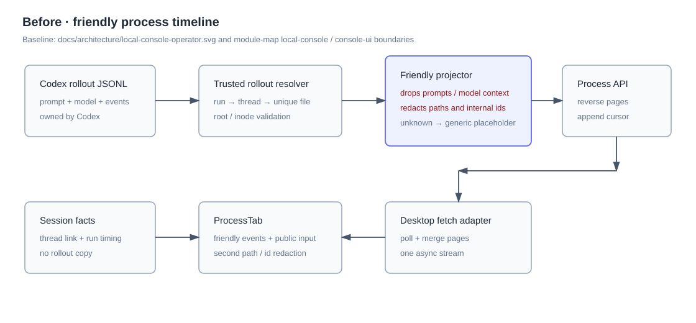
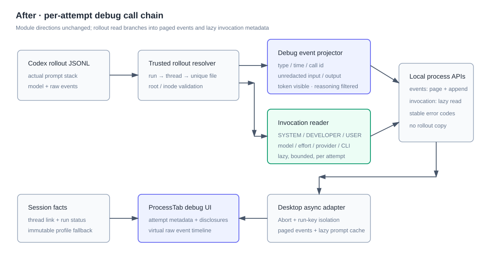

# 设计：agent-run-debug-output

## 方案

### 1. 数据源与信任边界

沿用现有 `LocalCodexThreadLinkFact` 作为 `runId → threadId` 唯一关联，并继续通过 `resolveCodexRollout()` 把候选限制在受信任的 Codex sessions 根内。调试视图不扫描 runDir、不按时间或 role 猜文件，也不把 rollout 内容写回 Moebius JSONL / SQLite。

`SYSTEM_PROMPT` 的事实源是 `session_meta.payload.base_instructions.text`；developer 和 user 层事实源是 rollout 中按顺序出现的 `response_item.message`；模型 / effort 取实际 `turn_context`，provider / CLI 取 `session_meta`。Moebius 的 run lifecycle / timing facts 继续作为运行中、completed、failed、interrupted、stuck 与开始 / 完成时间的权威来源。界面同时显示 Codex 原始生命周期事件，二者不互相覆盖。

### 2. 两条读取通道

过程标签继续使用现有分页通道读取调用与输出，但扩充为调试事件 DTO：

- `protocolType`：原始顶层与 payload 类型；
- `timestamp`：rollout 原始 ISO 时间戳；
- `callId` / `name` / `status`；
- `input` / `output` / `rawPayload`；
- 可读的事件类别只负责选择图标和标题，不替换原值。

新增 attempt 级窄读取通道，例如：

`GET /api/local-console/sessions/:sessionId/runs/:runId/process-debug-invocation`

它只返回当前 run 关联 rollout 的 prompt stack 与实际执行元数据。UI 首次展开任一 prompt 层时加载，按 `sessionId + runId` 缓存；切换标签或会话时 Abort，迟到响应不能写入新的选择。prompt 很大时允许单个完整 record 独占响应并超过常规事件页字节预算，不能静默截断或以“安全上限”为由只返回半段；损坏或不可读时返回明确 `unavailable / malformed`。

事件分页不重复携带 prompt stack；prompt 读取不承担过程事件分页。这样既保证显式可发现的 `SYSTEM_PROMPT`，又避免每一页重复传输大段内容。

### 3. 调试投影边界

`process-event-projector.ts` 仍是 rollout 协议到稳定 DTO 的唯一转换点，但规则改为：

- system / developer / user prompt 与 turn metadata 从普通事件流剥离到 invocation reader；
- assistant 输出、命令、函数、custom tool、tool search、MCP、patch、web search、错误、abort 与其他生命周期事件保留原始类型、id、输入、输出、状态和 payload；
- 不调用 `friendlyProcessText`、`safeDisplayPath` 或 renderer 的二次 id / path 脱敏；
- `token_count` / usage 显式投影为独立 token 统计事件；`reasoning`、`agent_reasoning` 与 encrypted reasoning payload 显式过滤，且两类边界都不得被 unknown fallback 绕过；
- 其他未知类型返回 `unsupported-debug`，包含原始类型、时间戳和序列化 payload；
- 成对出现的镜像 Agent 文本仍可按现有稳定判据去重，但不得以相似文本启发式吞掉不同时间或不同 phase 的真实输出。

原始对象在 local-console 边界序列化为字符串后再下发，renderer 不接收可执行对象。JSON 序列化语义保持完整；不承诺保留原 JSONL 的空白格式或键顺序。

### 4. attempt 概览与状态

扩展 `LocalConsoleProcessAttemptMeta` / `OperatorProcessAttemptMeta`：

- `engine`、`model`、`effort`、`provider`、`cliVersion`；
- `threadId`、`runId`；
- `startedAt`、`completedAt`、`elapsedMs`；
- `status` 使用现有完整 run timing 状态，而不是压成 `running | settled`。

模型元数据优先取 rollout 实际值；历史 rollout 缺字段时再使用 immutable run execution context 的 profile 作为有来源标记的 fallback。两者都没有时显示「未记录」，不得拿当前团队配置冒充历史值。

### 5. UI 信息架构

`ProcessTab` 保留标签去重、反向分页、虚拟列表、跟随最新和阅读位置恢复。每个 attempt 的内容顺序固定为：

1. attempt 标题、状态、独立计时和开始 / 完成时间；
2. model / effort / provider / CLI 与原始 run / thread 标识；
3. 常驻调试敏感信息提示；
4. `SYSTEM_PROMPT`、`DEVELOPER_PROMPT`、`USER_INPUT` 三个 disclosure；
5. 按时间排序的调用与输出事件。

prompt disclosure 默认关闭。短事件的标题、时间、类型、名称、call id 和状态常驻；参数、结果、raw payload、Agent 原始输出默认按长度门槛折叠。所有原文使用 `<pre>` 和等宽字体，React 文本转义；不使用 `MarkdownMessage`。终端控制字符由纯函数映射成 `\\x1b`、`\\x00` 等可见转义，不直接删除，以便调试者知道原值存在。

新增 disclosure 模式只使用现有 `bg-card / bg-sunken / border-line / text-*` 令牌、既有圆角和 lucide 图标，不新增色值、阴影或渐变。实现时把模式写入 `packages/console-ui/DESIGN.md`。

### 6. 异步状态与竞态

prompt stack 状态按 run 独立：

- `idle`：未展开；
- `loading`：显示该层骨架 / 文案；
- `ready`：显示三层实际内容；
- `unavailable`：关联或层缺失的明确说明；
- `error`：可重试，不影响事件流；

状态更新必须以发起请求时的 `sessionId + runId` 校验当前目标。父级重渲染和 callback 身份变化不得重复清空已加载内容；慢响应在切换 attempt / tab / session 后不得覆盖新目标；失败后重试只重置目标 run。

### 7. 测试设计

纯逻辑单测：

- system / developer / user prompt 分层、顺序与缺层；
- model / effort / provider / CLI 提取及 immutable context fallback；
- token 统计显式投影、reasoning 显式过滤，且 unknown-debug 不得绕过边界；
- call id、绝对路径、内部 id、输入 / 输出不脱敏；
- terminal controls 变成可见转义；
- run status 与时间映射；
- cursor 跨页、超大单事件、半行追加和 rollout identity 变化。

组件测试：

- attempt 概览和三层 disclosure；
- 长内容默认折叠，展开后首中尾完整；
- 原始内容不经 Markdown / HTML 执行；
- exact ISO 时间戳、protocol type、call id 与结束状态可见；
- token 统计可见且 reasoning 不可见；
- 1,000 条事件仍保持有界 DOM。

异步集成测试：

- prompt 请求慢返回时父级重渲染；
- `onLoadInvocation` callback 身份变化；
- 切换 tab / session 后旧请求迟到；
- 失败 → 重试 → 成功；
- invocation 加载失败时过程事件仍可读；
- append 轮询与 prompt 加载并行时互不覆盖。

reasoning / token 测试按 R2 落地：覆盖 token 事件类型、原始 usage payload、分页和折叠；覆盖 reasoning / encrypted payload 被显式过滤且 unknown-debug 不能绕过。

真实运行验证按 `proposal.md#真实运行验收清单` 逐条执行。涉及用户可见 UI，因此单测、typecheck 和 build 全绿后仍不能直接声明完成，必须提供每条页面入口与可观察信号的运行证据。

## 权衡

- 选择读取 Codex rollout 原值，而不是持久化 Moebius 自己的 prompt 快照：避免双源漂移，历史真实性更高；代价是 rollout 被清理后仍不可用。
- 选择 prompt stack 独立惰性读取，而不是塞进每个过程分页响应：避免大 prompt 在向前翻页和轮询时重复传输；代价是 UI 多一条可取消的异步状态。
- 选择稳定 DTO + 原始字符串字段，而不是把任意 JSON 对象直通 renderer：保留调试信息的同时把执行与渲染边界固定在 local-console。
- reasoning / token 采用用户确认的 R2：token 统计进入调试链，便于排查上下文消耗、缓存命中与限额；reasoning 继续过滤，避免开放敏感文本或 encrypted payload。“完整调用链”因此指完整输入、调用、输出、运行事实与 token usage，不指整个 rollout JSONL。
- Kimi 不在首版读取链路中不是把“Agent 消息”缩成 Codex 消息，而是现有能力不对称：两种引擎都会记录通用 execution-session link，但只有 Codex 额外记录 `codex_thread_link`，且现有 `process-history.ts` 只消费该事实并通过 `resolveCodexRollout()` 获得受信任文件。Kimi 目前没有等价的可恢复记录 resolver、文件身份校验与分页契约；首版继续在原位显示不可用，另行建设数据源能力后才能接入。
- 选择显示未脱敏路径和内部 id，同时常驻风险提示：满足本地调试目标；代价是用户复制出去前必须自行判断内容是否适合分享。

## 风险

- Codex rollout schema 变化可能让 prompt 层或模型字段缺失。缓解：按层 unavailable、unknown-debug、fixture 覆盖和稳定错误码，绝不从当前配置伪造历史值。
- 未脱敏工具结果可能包含凭据或私密路径。缓解：本地 loopback、只读文本、常驻敏感信息提示；本次不承诺安全分享。
- 大 prompt / payload 可能造成内存和渲染压力。缓解：prompt 惰性读取、单条完整 record 独占响应、长内容 disclosure、事件反向分页和虚拟列表；不得用静默截断换取性能。
- raw payload 可能包含 HTML、ANSI 或控制字符。缓解：服务端字符串化、React 文本渲染、控制字符可见转义、禁止 Markdown / HTML 执行。
- 两条异步通道可能发生竞态。缓解：AbortController、run key 校验和父级重渲染 / 慢失败返回测试。
- 回滚可恢复旧 projector 与 ProcessTab，并删除 invocation 窄路由；session facts 和数据库 schema 未新增持久化字段，不需要数据迁移。
