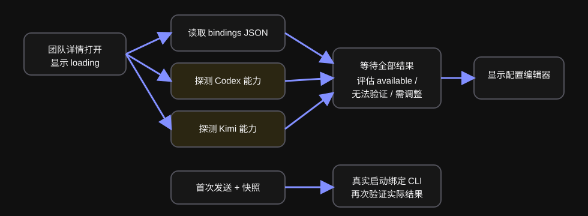
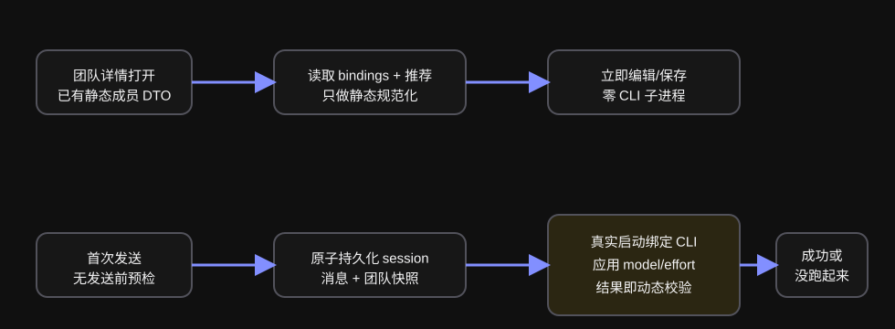

# 设计：defer-runtime-validation-to-execution

## 架构基线

当前运行配置与会话绑定总图以 `docs/architecture/agent-runtime-profiles-official-team-updates.svg` 和 `docs/architecture/agent-teams-runtime-binding.svg` 为基线。本 change 只改“团队管理读取/保存”到“首次真实执行”的动态验证时机：

## 方案

### 1. 静态运行配置文档成为团队管理唯一输入

`AgentTeamExecutionProfileDocument` 收窄为：

- `binding`：recommended / override / explicit；
- `recommendation`：当前已应用官方版本的推荐值或 `null`；
- `effectiveProfile`：规范化后的 CLI/model/effort。

移除 `status`、`capabilities`、`capabilitySnapshotId` 和 refresh request。团队列表读取 bindings 与官方推荐时已经拥有上述事实；将完整静态文档随成员 DTO 提供给详情，详情切换成员时直接初始化 editor，不再另发一个可能被父级刷新取消的加载请求。

缺少持久化 binding 的旧数据继续按既有默认/推荐规则在服务端解析，不让 renderer 发明默认值。是否继续在读取时物化默认 binding 由现有兼容测试约束，本 change 不借机迁移存储格式。

### 2. 编辑器只做静态表单校验

- CLI：受控 select，只允许 `codex | kimi`。
- Model、effort：受控文本输入；保存时 trim 首尾空白，trim 后必须非空，未知但非空的值可以保存；服务端 `normalizeExecutionProfile` 仍是最终权威。
- 保存不携带能力快照，不因本机缺 CLI、未登录或不支持值而失败。
- 官方推荐恢复、逐成员草稿、联合离开保护、保存失败后最近一次已保存值仍生效等逻辑保持原数据结构与交互。
- 删除“正在读取运行配置”“无法验证”“需要调整”“重新检查”和运行配置健康 badge。普通磁盘/IPC 读取失败仍走页面已有数据加载失败边界，不伪装成 CLI 不可用。

状态规则继续集中在纯配置规范化与现有逐成员 editor helpers 中；组件只把 draft/错误映射成表单。不得把 CLI 能力或 shell 调用移入 UI。

### 3. 团队 IPC 零 CLI 子进程

`read/list/save/restore execution profile` 只访问团队管理 store、官方推荐状态和团队成员身份。删除 `team-ipc.ts` 对 `probeExecutionCapabilities` 的调用及 cache；团队管理 IPC 的任一路径都不得 spawn Codex/Kimi。

`execution-capabilities.ts` 保留给 onboarding/AI 建队等明确的环境准备流程。本 change 不删除这些消费者，也不改变其 revision、安装或脱敏契约。

### 4. readiness 只作参考，所有新 run 直接启动

新对话 UI 保留既有 `cliReadiness` 属性与“其中 N 名成员仍需完成 X 准备”提示。本 change 不改变 onboarding 或新对话的提示展示；只明确该状态是参考信息，不参与发送使能，也不触发团队管理探测或发送前 capability preflight。

普通操作台 `App` 删除挂载时和 shell-ready 时对两套 CLI 的主动 `checkOnboardingCliReadiness`。它只消费 onboarding 已产生的 readiness 状态；若 onboarding 发起的安装任务在离开引导后完成，仍按 onboarding 的既有安装契约复检对应 CLI。这样进入 Agent 团队、新建对话或发送消息都不会借应用级 readiness 再次探测，同时不删除已有提示组件和安装延续能力。

首次发送顺序保持：

1. 静态校验项目、团队结构与附件。
2. 一个事务创建 session、第一条用户消息、附件归属和完整团队快照。
3. runtime 创建主 Agent run，并按快照 `cli/model/effort` 选择真实 driver。
4. driver 的 spawn、认证或配置应用失败时，run 收敛为“这一步没跑起来”；session、消息和快照保留，草稿按“消息已成功提交”语义清理，不回滚成未发送。

这里不新增预检 API。Codex 的实际 spawn 结果与 Kimi ACP 的 session/config option 确认已经是更可靠的动态校验。第二条及后续消息、成员接力和重试继续走同一硬路由路径：每次只启动对应不可变快照绑定的 driver，不调用 capability probe。

团队页修改只改变团队 store。已有会话后续发送继续使用其 effective 团队快照；针对旧 run 的重试继续使用该 run 的冻结快照；只有新建会话或用户在既有会话中明确重新选择该团队并到达既有生效边界时，才载入团队 store 中的新配置。

## 自动化测试

| 行为 | 位置 | 用例 |
| --- | --- | --- |
| 团队读取/保存不探测 CLI | `desktop/tests/team-ipc.test.ts` | 注入会在调用时失败的 probe/spawn seam（必要时先做最小依赖注入），list/read/save/restore 均成功且调用为 0 |
| 静态配置校验 | `desktop/tests/team-ipc.test.ts`、`tests/team-execution-profile.test.ts` | 非法 CLI、全空白 model、全空白 effort 拒绝；`"  model-x  "` / `"  effort-x  "` 保存为 trim 后值；任意未知但非空 model/effort 可保存 |
| 官方推荐与用户覆盖 | `desktop/tests/team-ipc.test.ts` | 恢复推荐、保存覆盖、复制/更新保护结果不因移除 capability snapshot 改变 |
| 逐成员草稿与表单 | `packages/console-ui/src/console/agent-team-detail.test.tsx` | 初次渲染立即见保存值；切换成员草稿独立；静态错误禁用保存；失败保留草稿；无 loading/recheck/健康状态 |
| 团队页契约透传 | `packages/console-ui/src/console/agent-teams-page.test.tsx`、`desktop/tests/console-app-agent-teams.test.tsx`（若不存在则在邻近 app 测试建同域文件） | 父级每秒等价重渲染不清空 editor，不创建额外读取请求 |
| 新对话 readiness 保持为参考 | `packages/console-ui/src/console/new-conversation-page.test.tsx` | 保留既有兼容性提示；部分兼容时提示仍显示，但满足项目/团队结构/附件条件的发送按钮可用 |
| 首次发送真实失败 | `tests/local-console-execution-runtime.test.ts` 或邻近首次发送集成测试 | Kimi/Codex 缺失或拒绝配置时 session、首条用户消息和快照已存在，run 为 failed，安全原因可见，另一 driver 调用为 0 |
| 普通操作台与后续发送零预检 | `desktop/tests/console-app-message-runtime-boundary.test.tsx`（新增）与 `tests/local-console-execution-runtime.test.ts` | 普通 App 挂载、shell-ready、进入团队页及第一/第二/第三次发送均不调用 `checkOnboardingCliReadiness`/团队 capability；已有 readiness 状态仍能显示提示，onboarding 安装完成复检另由既有测试保护；runtime 每次只增加一次快照绑定 driver 调用，另一 driver 为 0 |
| 团队修改的快照边界 | `tests/local-console-execution-runtime.test.ts` | 会话创建后把同一 team/member 从 Kimi 改为 Codex；旧会话后续发送与旧 run 重试仍调用 Kimi 及原 model/effort，新会话首次发送才调用 Codex 及新值 |
| 既有硬路由与恢复 | 既有 `tests/local-console-execution-runtime.test.ts`、`tests/kimi.test.ts` | 混合团队、run 快照、Kimi config option fail-closed、Codex/Kimi 不降级继续全绿 |

### 单文件 >200 行可测性评估

- `agent-team-detail.tsx` 可能因删除 capability UI/状态而产生较大 diff：状态规则保留在纯 helper/服务端 normalizer，组件测试覆盖所有显示状态，不新增不可测业务分支。
- `team-ipc.ts` 可能因 DTO 收窄产生较大 diff：配置解析与 binding/recommendation 合并继续复用 `team-execution-profile.ts` / store 纯逻辑，IPC 测试覆盖零探测与错误。
- 其余文件预计为契约透传和删除旧 props；若实施时任一单文件 diff 超过 200 行，先按逻辑/IO/渲染分块复核，不能测试的逻辑必须下沉后再继续。

## AI / 真实运行验收

1. 用开发态桌面进入“Agent 团队 → 任一团队详情”，在 PATH 前放置会记录每次启动并立即失败的 `codex`、`kimi` shim。停留并切换至少两名成员，跨过三次 1 秒操作台轮询。
   - DOM：运行配置首屏即显示保存的 CLI/model/effort；不存在“正在读取运行配置”“无法验证”“需要调整”“重新检查”。
   - 进程证据：shim 计数文件中 Codex=0、Kimi=0。
2. 修改 model/effort 为本机 shim 不认识但非空的值并保存。
   - DOM：保存成功、草稿标记消失；切走再返回仍显示原字符串。
   - 磁盘：对应 `execution-bindings-v1.json` 只更新目标 team/member；不包含 capability cache 或探测结果。
3. 在一个未进入 onboarding、没有活动安装任务的普通操作台启动中，进入团队页后再新建对话并选择该团队。
   - DOM：若应用已有 readiness 结果，既有“仍需完成 Codex/Kimi 准备”提示可以继续显示；满足项目/团队结构/附件条件时发送按钮仍可用。
   - 探针证据：从普通 App 挂载、shell-ready、进入团队页到发送前，shim 中没有 capability probe 参数；后续继续区分 probe 参数与真实 driver 启动参数。
4. 发送第一条消息，让绑定 CLI shim 以缺失或非零退出失败。
   - DOM：会话行和用户首条消息已经出现；主 Agent 记录收敛为“这一步没跑起来”，不长期 running。
   - SQLite/API：session 团队快照保存原 CLI/model/effort，首条用户消息存在，run 为 failed。
   - 进程证据：发送动作没有 version/model-list/provider-list 等 capability probe；只出现绑定 driver 的真实启动参数，另一 CLI=0。
5. 恢复正常绑定 CLI，修改团队页中同一成员的 CLI/model/effort，然后回到旧会话点击重试并再发送两条消息。
   - DOM/API：重试和第二、第三条消息均按旧会话/旧 run 快照启动并可成功；每次发送没有 capability probe，另一 driver=0。
   - SQLite/API：旧会话快照保持原值，团队 store 已是新值，两者互不改写。
6. 使用同一团队新建另一段会话并发送第一条消息。
   - SQLite/API：新会话快照采用团队页新值。
   - 进程证据：新会话只启动新快照绑定 driver，不调用旧 driver 或 capability probe。

证据写入 `artifacts/acceptance/defer-runtime-validation-to-execution-evidence.json`，包含时间戳 DOM 断言、shim 计数、API/SQLite 摘要和退出码；截图只为版式补充，不替代断言。

## 权衡

- model/effort 使用文本值而非本机下拉：失去团队页内即时的机器能力提示，换来配置可移植、零阻塞和不会伪造跨 CLI 固定选项。主动诊断留给独立运行环境页。
- 不在首次发送前增加轻量 `--version`：少一次看似友好的提前提示，避免“预检成功、真实启动仍失败”的竞态与重复成本；实际 driver 错误更权威。
- 首次 driver 失败不回滚已创建会话：用户已经提交消息，保留消息、快照和失败事实才能重试与审计；把它退回草稿会制造提交状态歧义。
- 从团队 DTO 直接初始化 editor，而非仅修复 effect callback identity：同时消除额外读取、loading 文案和已知竞态，数据源仍是主进程静态 store，不在 renderer 缓存第二份权威事实。

## 风险

- 用户可保存当前 CLI 不支持的拼写：这是已确认的可移植配置取舍；真实启动 fail-closed 且错误可见，不静默替换。
- DTO 收窄可能误伤 onboarding/AI 建队：实施时按调用图核对，`execution-capabilities.ts` 及 readiness contract 只保留给这些明确消费者。
- 已有测试大量构造 capability document：优先更新共享 fixture，避免为了旧 DTO 保留死字段。
- readiness 仍可能过期：本 change 明确保留其既有提示价值，但发送不以它为门槛，真实 driver 结果才形成运行事实。
- 回滚时可恢复旧 DTO/UI，但不应恢复 callback 生命周期缺陷；若产品日后重新需要诊断，应以独立页面和用户手动动作接入。
