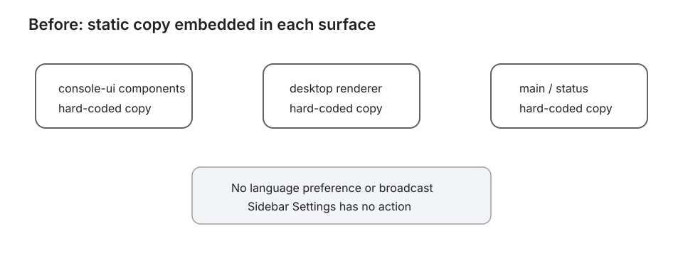

# 设计：add-desktop-i18n-settings

## 方案

### 资源与翻译边界

`packages/console-ui/src/i18n/` 提供 `Locale`、资源 key、插值参数、`translate`、React provider 与 hook；真实文案分别存放于 `locales/zh-CN.ts`、`locales/en.ts`。桌面主进程与不经过 React 的状态页在 `desktop/src/i18n/` 保有同样分离的资源文件和窄翻译入口。

资源注册表是唯一允许按 locale 选择字典的位置。生产组件只提交翻译 key 和动态参数，禁止 `locale === ...`、按语言 `switch` 或按语言三元表达式。用户/Agent 内容、名称、路径、文件正文与原始诊断只作为参数或原文呈现。

### 设置弹窗

`SettingsDialog` 是 `console-ui` 的受控展示组件，只接收 active/pending locale、保存状态与回调，不读取 IPC、磁盘或 `localStorage`。`OperatorConsole` 保持主工作区挂载，仅控制弹窗开关并把语言动作交给 desktop renderer。

弹窗使用既有语义令牌与 Radix Dialog：打开后焦点进入，`Tab` 不逃逸，`Esc` 与关闭按钮关闭并归还焦点；遮罩点击不关闭。常规宽度采用左侧分类/右侧内容，窄窗改为上下结构，首期不渲染未来分类。

### 持久化、IPC 与原子切换

`desktop/src/language-preference.ts` 负责版本化偏好文档的纯校验与原子文件写入：写临时文件、关闭、rename；失败清理临时文件。`language-preference-contract.ts` 定义支持值和 preload DTO。

main 在创建窗口前读取偏好并持有当前 locale；preload 只暴露读取、保存、订阅三项能力。renderer 的状态机为 `active / pending / saving / failed`：

1. 选择另一语言只更新 pending 并调用保存。
2. main 写入成功后更新内存 locale 并广播全部窗口。
3. renderer 收到成功结果/广播后一次提交 active locale。
4. 写入失败不更新 main、不广播，renderer 保持原 active locale并提供重试。

启动注入已保存 locale，保证首次可操作界面直接使用目标语言。新开的状态窗口读取 main 当前 locale；已开的窗口接收广播。

### 静态文案迁移

迁移操作台、Sidebar、时间线结构化状态、composer、Agent 团队、onboarding、设置、菜单/确认/空态/错误/tooltip/placeholder/aria 文案，以及状态页和 Electron 原生弹窗中的 Moebius 自有标题与说明。renderer/main 之间优先传稳定错误码，由当前语言资源渲染；OS/CLI 原始错误保持诊断原文。

为控制大文件风险，状态机、翻译逻辑、偏好 store 和 IPC contract 分离为可单测模块；`operator-console.tsx`、`app.tsx` 和 `main.ts` 只做薄装配。资源文件即使超过 200 行也只含静态映射，以双语 key/参数对齐测试和真实页面巡检覆盖。

### 验证

- 资源 key/插值参数对齐；缺 key、未知 key、未支持 locale fail closed。
- 源码守卫禁止生产组件中的 locale 文案分支，并检查迁移范围内没有遗留静态文案。
- 偏好文件覆盖缺失、合法、损坏、未知 locale、原子写入、失败清理。
- reducer/IPC 覆盖保存前不切换、成功提交、失败保持、重试、过期响应和成功后才广播。
- 设置弹窗覆盖入口、焦点、`Esc`、遮罩、保存中、失败重试与窄窗。
- 集成覆盖切换时项目、会话、滚动、Sidebar、草稿和用户内容不变。
- 运行 `pnpm test`、`pnpm typecheck`、console-ui build、desktop build。
- 真实 Electron 双语巡检使用 DOM 文本、`html.lang`、可访问名称与持久化重启断言留证；视觉只在真实运行页观察并把截图落盘，不回读截图到主会话。

## 架构

现状基线引用 `docs/architecture/desktop-shell.svg` 与 `docs/architecture/module-map.md` 的 desktop-shell / console-ui 边界；改造后仍保持 renderer → preload → main → 文件系统的单向依赖，不让 `console-ui` 读取 IPC 或磁盘。

## 权衡

1. 选择本地 TypeScript 资源而不是远程包或运行时下载，换取离线可用、类型检查和构建时缺失 key 失败。
2. 选择保存成功后切换，而不是乐观切换再回滚，避免用户看到短暂错误语言和“看似保存”的假象。
3. `console-ui` 与 desktop 非 React 表面各自保有资源文件，避免 package 反向依赖 desktop；用对齐测试约束公共 key，而不是引入跨边界运行时依赖。
4. 默认固定简体中文，不跟随系统 locale，严格遵循已确认产品规则。

## 风险

- 全局文案面广，容易漏项：以源码扫描、双语页面遍历和可访问树巡检共同门禁。
- 语言切换可能触发整页重建：provider 必须包住既有路由且只替换 context value，集成测试锁定草稿、选择和滚动状态。
- Electron 启动期可能先显示默认中文：在创建 BrowserWindow/加载 renderer 前读取偏好并注入初始值。
- 偏好写入或广播竞态：main 串行保存，renderer 用请求序号忽略过期响应，只在成功持久化后广播。
- 回滚时可删除设置入口和语言 IPC/store，并恢复静态中文；偏好文件留存不会影响旧版本。
