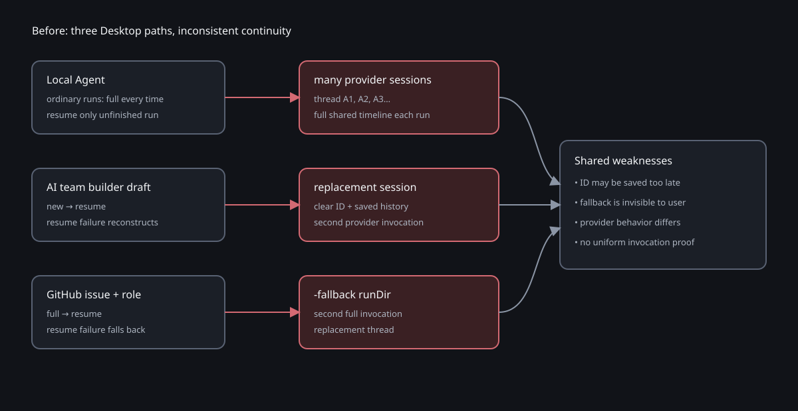

# 设计：resume-desktop-agent-sessions

## 架构基线

现状基线来自 `docs/architecture/local-console-recovery-resume.svg`、
`docs/architecture/desktop-team-onboarding-orchestration.svg`、
`docs/architecture/runner-issue-processing.svg` 与 `docs/architecture/module-map.md`。
本 change 不引用其他 change 的架构制品。




## 方案

### 1. Desktop 持久 Agent 范围

生产 provider 调用点按下表穷尽并分类：

| Desktop 入口 | 调用模块 | provider 方法 | 身份 |
| --- | --- | --- | --- |
| 主操作台新建 / 继续对话 | `desktop/src/main.ts` → local server → `LocalConsoleRuntime` → `execution-driver.ts` | Codex `run()` / Kimi `runKimiAcp()` | `session + teamSnapshotFingerprint + role` |
| 首次引导第 2 步 AI 建队 | renderer → preload / IPC → `AiTeamBuilder.runCurrentTurn()` | Codex / Kimi builder spawner | `draftId` |
| Agent 团队页 AI 建队 | renderer 保存 `agent-teams-<uuid>` → 同一 builder IPC | Codex / Kimi builder spawner | `draftId` |
| Desktop 自动后台 runner | `main.ts::startRunner()` → `runner-child.ts` → `start({mode:"github"})` | Codex `run()` | `issueKey + role` |

`src/local-console/route-bus.ts`、GitHub external no-mention route 与
`src/format-ceo.ts` guardrail 没有持久 Agent 身份，保持 full 的一次性辅助推理。
readiness、版本检查、安装和 observer 不产生 Agent 推理 session。

新增 `tests/desktop-runtime-provider-scope.test.ts` 以生产调用点 inventory 锁定这个
边界：任何新增直接 provider 调用点必须先分类为持久 Agent 或辅助推理；辅助项必须
断言 full 且不得读写 Agent session link / cursor。

### 2. 统一身份状态机

纯 planner 只返回三种结果：

```text
first
  无任何已创建 provider session 的证据
  → 允许 full / session/new

resume(externalId)
  有且只有一个 canonical external ID，归属兼容
  → 只允许 resume(externalId)

unavailable(reason)
  已有创建/运行证据但 ID 缺失、候选冲突、归属不兼容
  → provider 调用次数为 0
```

provider 调用开始后还有一条共同规则：resume 调用只执行一次。请求失败、provider
会话不存在或返回不同 external ID 时直接形成 `resume-unavailable:<reason>`，不得回到
`first`，不得清空 canonical ID。

“首次创建失败”按可观察证据分流：

- 尚未观察到 `thread.started` / `session/new` 成功即失败：外部 session 未建立，仍可
  重试 `first`。
- 已观察到 external ID：立即持久化 canonical link；即使 prompt、输出解析、评论发布
  或最终状态写入随后失败，下一次只能 resume。
- 已证明执行成功或 session 创建但 stable link 丢失：`unavailable`，不能冒充首次。

### 3. local Agent session planner 与公开增量

`src/local-console/execution-context.ts` 从“只有 recovery intent 才 resume”重构为不依赖
UI 的 Agent session planner。身份 fingerprint 使用当前 run 冻结的团队快照 fingerprint
和 role；团队快照已经包含 persona、CLI、model、effort，因此不再为 model / effort
另造身份轴。workspace 属于会话锁定事实，作为 link 归属校验而非可变分叉。

`src/local-console/codex-resume.ts` 不再承担 provider session 规划。删除其中可执行的
`planLocalCodexRecovery` / `LocalCodexRecoveryPlan` 与产生 `full-fallback` 的分支；
现有 `codex_resume_intent`、`codex_resume_consumed` 和 usage facts 仍需兼容读取，用于
旧 JSONL 与“恢复哪一个产品 run / attempt”的桥接。历史 `mode=full-fallback` consumed
fact 只作为 legacy telemetry 可读，planner 和 runtime 均不得再次产生该 mode。
`execution-context.ts` 只从兼容层读取 intent 身份信息，是否 `first | resume |
unavailable` 完全由 canonical Agent session facts 决定。

`src/local-console/store.ts` / `types.ts` 在每会话 JSONL 追加：

- provider session initialization / observed ID；
- canonical Agent session link；
- Agent public timeline cursor；
- 旧事实唯一候选迁移或 migration-unavailable 结果；
- invocation audit（mode、requested/observed ID、outcome，不含 prompt 与敏感数据）。

首次执行由 `src/local-console/prompt.ts` 生成完整共享时间线；后续 resume 根据 cursor
选择该 Agent 未见的公开用户 / Agent / 必要系统事实，并只准备这个 prompt 范围的附件。
自身已经形成的公开回复不重复发回自己。成功 Agent 回复持久化后推进 cursor；driver
失败、输出不合法或回复未落库都不推进，显式重试再次发送未确认增量。provider 不提供
幂等 turn key，因此失败边界无法保证“prompt 恰好一次”，但能保证“只调用一次 resume、
绝不 replacement session”。

`src/local-console/runtime.ts` 的主 Agent lane 与 worker lane 共用 planner，删除
`full-fallback` 分支。`unavailable` 使用现有系统事实与 UI 投影：

- 标题：`原执行已经无法继续`
- 说明：`你可以重新运行，或直接说话、换一个成员接手。`
- 动作：`重新运行`

重新运行创建新的产品 run / attempt，但同一 Agent identity 仍只 resume 原 external ID。
若 ID 永久丢失，重新运行仍明确失败；换团队快照或换成员才是新身份。

旧 local 数据只按身份过滤所有兼容 link：归一后恰有一个 ID才追加 canonical migration；
零个且有历史执行证据、或两个不同 ID 都 unavailable。零个且没有任何执行证据才是真正
首次。不得使用“最近成功”“最新时间”或当前团队配置补写。

### 4. Codex / Kimi driver 一致性

`src/local-console/execution-driver.ts` 把 canonical ID 原样传给 provider，并要求成功结果
的 external ID 与请求 resume ID 完全一致。`src/kimi.ts` 继续使用 ACP：

```text
spawn: kimi acp
initialize → session/new | session/resume → 配置确认 → session/prompt
session/resume params: { sessionId, cwd, mcpServers: [] }
```

本机隔离实测 Kimi CLI 1.49.0 的 initialize 声明 `sessionCapabilities.resume`；不存在
的 ID 返回 `Invalid params / Session not found`，没有创建新 session。终端
`kimi -r <session-id>` 不用于生产恢复，因为未知 ID 的终端行为不能满足 fail-closed。
Moebius 从 `session/new|resume` 响应取得 ID，保存在 local facts 或 AI 建队 draft；
Kimi 自身 session 数据继续由受管 `KIMI_CODE_HOME` 路径恢复。

Codex / Kimi 的 `onSessionStarted` 必须在最终结果前可观察 ID。callback 持久化失败时
停止当前执行并形成 unavailable，不能继续到可能丢失 link 的成功态。

### 5. AI 建队 draft 连续性

AI 建队身份边界沿用既有 draft 生命周期：

- onboarding 使用固定 `onboarding-team-builder` draft。
- Agent 团队页使用 localStorage 保存的 `agent-teams-<uuid>`；返回同一未完成流程继续
  同一 draft。
- 团队成功创建后清除当前 draft ID；下一次入口创建新 UUID 和新 provider session。
- 服务端 draft 文件与并发互斥都按 draft ID 隔离，跨 draft 不查找或复用 external ID。

`desktop/src/ai-team-builder/index.ts` 删除 resume failure reconstruction。
`state-machine.ts` 升级 schema 并兼容读取 v2，删除 `threadRebuildUsed` 与 reset
transition。driver result 的失败分支也可携带已观察到的 external ID；service 收到后
先保存，再投影 failed state。submit、adjust、retry、唯一一次结构 repair 都只使用 draft
的同一 ID。

Codex / Kimi spawner 在每个 runDir 写安全 invocation manifest：
`full|resume`、requested ID 是否存在、observed ID 是否一致、outcome。manifest 不写
prompt、原始输出或 provider 密钥，也不进入 renderer DTO。resume 失败的可见 DTO 固定为：

`AI 上下文暂时无法继续，已保留对话和最后有效方案。`

页面保留 `重试`，draft ID / external ID / 最后有效方案均不清空。

Codex CLI 对不存在的 resume ID 可能自行创建 replacement thread，因此 Codex spawner
必须在启动 CLI 前通过共享的 `src/codex-rollout.ts` 精确确认 rollout 可用；不可用时只写
一份 failed resume manifest，不启动 provider。若预检后仍观察到不同 ID，
`src/codex.ts` 必须立即终止进程，并把 thread-start callback / canonical link
持久化失败作为整个 provider run 的失败返回，service 再把 draft 收敛到
`resume-failed`，不得让异常逃逸后遗留 `phase=running`。

### 6. Desktop 后台 GitHub role

正式 Desktop `boot()` 无条件执行 `startRunner()`；runner supervisor 以 exact
`--github-mode` 启动 `runner-child.ts`，child 调用 `start({mode:"github"})`，因此
`issue + role` 是正式 Desktop 可达的后台持久 Agent 链路。

`src/conversation.ts` 保留首次 full 与后续公开 delta resume，删除 fallback full prompt
API；role state 加入 provider / workspace / persona 归属证明。`src/runner.ts` 删除
`-fallback` runDir 和第二次 Codex 调用：

- resume 在 reaction、媒体准备和 Codex 启动前通过共享 rollout resolver 预检，失败时
  零 provider 调用；
- full run 观察到 `thread.started` 后立即按 `issue + role` 固化 ID；
- resume 只调用一次，失败返回 `resume-unavailable:<reason>`；
- ID 保存不代表输入已公开处理，`lastSeenIndex` 只在 Agent 评论发布及相关副作用成功后
  推进；
- 失败沿用既有 issue retry budget，达到上限发布 dead-letter，Failure reason 保留
  `resume-unavailable:*`；
- resume 失败不推进 role cursor，下一次重试仍 resume 同一个 threadId。

`src/state.ts` 与 `src/sqlite-state-worker.ts` 扩展 role thread schema，并兼容旧
`.state/role-threads.json` / SQLite slice；旧 entry 的 threadId 唯一时补归属字段，
冲突或不兼容 fail closed。

### 7. 内部审计与 renderer 边界

三条链路都必须能直接断言每轮 provider 调用次数、mode 和 ID 连续性：

- local：session JSONL facts + runDir invocation manifest；
- AI 建队：draft state + per-runDir invocation manifest；
- GitHub：role state + 结构化 `codex-invocation` log / 既有 failure state。

manifest 只允许版本、identity type 的非敏感 hash、mode、requested/observed ID 的匹配
结果、outcome 与时间；需要排障的本地记录可以保存 external ID，但不得进入 renderer
DTO、普通 UI 文案、GitHub comment 或提交产物。现有页面布局不变，因此不创建
`wireframes.md`。

## 验收设计

### 单元与集成清单 1–15

| # | 可判定行为 | 主要实现文件 | 测试落点 |
| --- | --- | --- | --- |
| 1 | 同一 local Agent 首轮 first，第二轮只 resume 同一 ID | `execution-context.ts`、`runtime.ts`、`store.ts` | execution context / runtime tests |
| 2 | A → B → A 各身份只创建一次，A 收到 B 的公开增量 | `prompt.ts`、`runtime.ts`、cursor facts | timeline / runtime tests |
| 3 | Codex/Kimi 混合团队按各自快照硬绑定且 ID 不跨 provider | `execution-driver.ts`、runtime、AI spawners | local driver / AI engine tests |
| 4 | Kimi 调用序列和 exact `session/resume` 参数 | `src/kimi.ts` | `tests/kimi.test.ts`、Kimi spawner tests |
| 5 | 首次观察 ID 后必须先持久化 canonical link 才可提交回复；后续失败仍 resume 该 ID | `src/codex.ts` fatal started callback、三域 state save；local “每个 Agent run…”与“恢复执行段…”原文锚点 | 三域 failure-after-ID tests；local link-write failure 不提交回复/不推进 cursor |
| 6 | creation evidence 已存在但 ID 缺失时 unavailable、provider 调用 0 次；未创建前失败仍可 first retry | local planner、AI draft、GitHub role state | planner / state-machine / state tests，区分 before-created 与 created-but-unlinked |
| 7 | ID 缺失、冲突、外部不存在时只有一次 resume，无第二次 full / `session/new` | `codex-resume.ts` 去执行规划、共享 `src/codex-rollout.ts` 预检、`execution-context.ts` / runtime 与 AI / GitHub 删除 fallback；删除 local “仅显式同次未完成执行可以 resume” | real fake Codex replacement-thread、runtime、AI service、runner call-count tests；普通下一步/重试不再 full |
| 8 | 身份归属、workspace、provider、冻结 persona 冲突 fail closed；只有新团队快照身份可首次创建 | local identity fingerprint、GitHub context proof；修改 local “恢复兼容性失败时不自动重新执行” | execution context / conversation / state tests；同快照冲突失败、新快照 first |
| 9 | 新消息、重试、同快照改一改重发、重新运行、优雅重启都复用 ID | local runtime / `codex-resume.ts` legacy intent codec / canonical planner | ordinary / retry / edit-resend / rerun / restart tests；每种路径断言同 ID 且无 full |
| 10 | 旧 local 只迁移唯一 ID，零/冲突候选 unavailable 且零 provider 调用 | local canonical resolver / store；修改 local “旧 thread link 没有上下文指纹” Scenario | legacy unique / zero / conflict tests，禁止按时间或成功状态猜测 |
| 11 | GitHub role 首次 full、后续 resume；失败无 fallback runDir | `conversation.ts`、`runner.ts` | conversation / runner tests |
| 12 | GitHub thread started 立即保存 ID，评论成功前不推进 cursor | `runner.ts`、`state.ts`、SQLite worker | runner / state / SQLite tests |
| 13 | AI 建队 submit/adjust/repair/retry resume；失败保留 draft ID、不重建 | AI service/state/driver/spawners | AI service / state / spawner / IPC tests |
| 14 | 辅助 route / guardrail 保持 full 且新增调用点必须分类 | 无生产行为变更 | provider scope inventory + existing route tests |
| 15 | 根测试、typecheck、Desktop build 全绿 | 全部改动 | `pnpm test`、`pnpm typecheck`、desktop build |

### Desktop 真实运行验收

所有入口先执行 `pnpm desktop`，运行日志重定向落盘，只读取结构化断言。

1. **local 正常续跑**
   - 页面：新建对话 → 选择 Codex/Kimi 混合团队 → 发送目标，完成“主 Agent → 成员 →
     主 Agent”。
   - DOM：三段回复按角色出现在时间线；正常轮次不出现
     `原执行已经无法继续`。
   - 记录：每个 `session + snapshot fingerprint + role` 只有一个 canonical external ID；
     后续 invocation 全为 resume 且 ID 不变；每 run 只有一条 provider invocation。
2. **local resume 失败**
   - 在 disposable data root 破坏 Codex rollout 或 Kimi session，再触发同一 Agent。
   - DOM：出现 `原执行已经无法继续`、
     `你可以重新运行，或直接说话、换一个成员接手。` 与按钮 `重新运行`。
   - 记录：失败 run 只有一条 resume；无 `full-fallback`、第二个 session link、
     `session/new` 或第二个 runDir invocation。
3. **AI 建队正常与失败**
   - 页面入口一：首次引导第 2 步；入口二：Agent 团队 → 新建团队 →
     跟 AI 聊出一支新团队。
   - DOM：region `AI 建队`；输入框 `描述团队目标或回答问题`，调整态
     `调整团队提案`。失败显示
     `AI 上下文暂时无法继续，已保留对话和最后有效方案。` 与 `重试`。
   - 记录：draft external ID 在 submit / adjust / repair / retry 间不变；失败轮 manifest
     只有一条 resume，无 `session/new` 或 reconstruction run。
4. **Desktop 后台 GitHub role**
   - 状态页先断言 runner `运行中`；对白名单测试 issue 同 role 连续触发两轮。
   - 正常记录：第二轮只有一条
     `codex-invocation mode=resume threadId=<原ID>`。
   - 失败记录：role cursor 不推进，failure reason 为
     `resume-unavailable:<reason>`；达到预算后 issue 的既有 dead-letter 评论显示同一
     Failure reason；日志无 `-fallback` runDir 或同轮 `mode=full`。

Kimi 正向模型验收要求机器已登录 Kimi；隔离协议、参数和不存在 ID 的负向边界不依赖
登录，可在自动测试中完成。

## 文件级改动

- 产品 / 架构：`docs/product/prd.md`、三个页面 PRD、ADR-0007/0008、
  `docs/architecture/module-map.md`、`runner-cost-notes.md` 和本 change 架构图。
- local：`execution-context.ts`、`codex-resume.ts`、`prompt.ts`、`store.ts`、`types.ts`、
  `runtime.ts`、`execution-driver.ts`、`src/kimi.ts`。
- 共享 Codex adapter：`src/codex.ts`；rollout 解析上移到
  `src/codex-rollout.ts`，原 `src/local-console/codex-rollout.ts` 保留兼容 re-export。
- GitHub：`conversation.ts`、`runner.ts`、`state.ts`、`sqlite-state-worker.ts`。
- AI 建队：`index.ts`、`state-machine.ts`、`driver.ts`、Codex/Kimi spawner、DTO / IPC
  测试。
- 测试：上述邻近测试加 `tests/desktop-runtime-provider-scope.test.ts`。

清单外没有行为变化；invocation 记录仅增加内部可审计性。

## 权衡

- 选择 fail closed 放弃 session 丢失后的透明自愈，换取“同一 Agent 就是同一 provider
  session”的可验证契约。
- local 身份纳入完整团队快照而不是单独比较 model / effort；避免同一个事实被多组
  兼容规则重复表达。切换快照自然产生新身份。
- 旧数据只接受唯一候选，放弃“最近一次通常是对的”的便利，避免把两个历史 thread
  中错误的一个变成不可逆 canonical 状态。
- cursor 在公开回复成功后推进，保证失败不会吞掉其他成员的消息；provider 不支持
  idempotency key 时，失败重试可能让同一增量在同一 session 内出现两次，这是比创建
  replacement session 更小且可见的风险。
- 不把 auxiliary inference 强行持久化；它们没有用户可识别的 Agent 身份，纳入只会
  制造无法定义的生命周期。

## 风险

- 长期 provider session 会累积上下文并依赖 provider 自身压缩；真实验收需要长会话
  样本观察压缩后是否仍遵守 persona 与公开增量。
- `thread.started` / `session/new` 与本地持久化之间仍存在崩溃窗口；callback 必须同步
  完成持久化才允许继续，无法确认时宁可 unavailable。
- local 旧事实可能存在多个 run thread；迁移必须保持只追加、幂等并在冲突时无 provider
  调用。
- GitHub ID 提前持久化与评论 cursor 延后推进是两个提交点，必须测试进程在两者之间
  崩溃时仍 resume 同 ID 并重投未确认 delta。
- provider 调用点 inventory 属于架构门禁；若只按文本扫描容易误报，测试应解析受控
  import / adapter 清单并给出明确更新入口。

回退不能只恢复 fallback 代码，因为 PRD 已明确禁止 replacement session。若产品决策
回退，必须重新采访并同步 PRD / ADR；数据层可以继续保留 canonical link 与 cursor 事实，
旧版本应忽略未知追加事实而不是删除它们。
