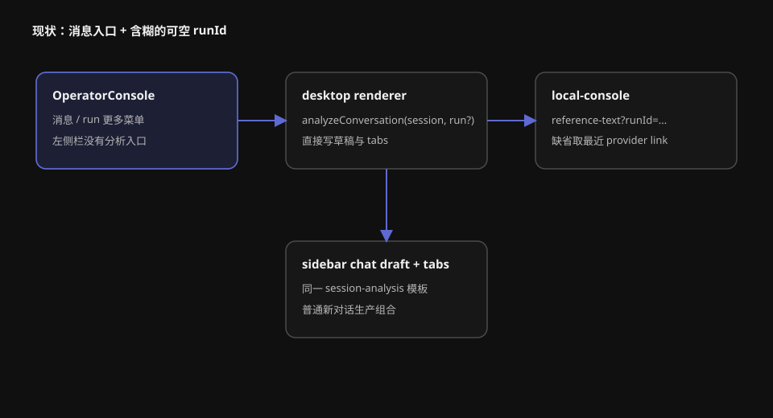

# 设计：analyze-conversation-from-sidebar

## 方案

### 1. 统一入口命令，不统一来源片段

`console-ui` 向 renderer 发出判别联合：

```ts
type AnalyzeConversationIntent =
  | { kind: "message"; sessionId: string; runId: string | null; messageId: number }
  | { kind: "conversation"; sessionId: string; projectId: string };
```

消息菜单只产生 `message`，左侧栏菜单只产生 `conversation`。renderer 复用同一草稿归并、标签打开和后续创建链路；`kind` 只决定 reference-text 请求范围和入口路由是否需要先切换来源对话。

### 2. 菜单可达性与禁用边界

`ConversationSidebar` 增加窄回调 `onAnalyzeConversation`，以及 session fixture 上的 `analysisDisabledReason`。菜单顺序固定为分析、复制路径、归档。对话行的右键、行内菜单按钮与键盘 `ContextMenu` / `Shift+F10` 都控制同一个 Radix DropdownMenu 实例；菜单关闭后焦点返回触发入口。

消息侧继续使用 `ConversationAnalysisMenu`，但把菜单绑定提升到消息容器：右键、现有轻操作按钮和键盘上下文操作共享同一个受控菜单。消息项文案只描述「这条消息」，不改变 run 操作。

对话正在运行、存在未读结果、未选中或项目目录不可用时分析项仍可用。只有 renderer 明确投影记录路径不可用时才传入禁用原因「对话记录不可用，暂时无法分析」。禁用项继续保留 Radix `disabled`、`aria-disabled` 与辅助技术描述，并复用现有 Tooltip 让鼠标悬停用户看到同一原因；正常禁用不触发回调。

### 3. 可信片段范围

reference-text 请求增加必填 `scope=message|conversation`：

- `conversation`：验证 session 存在，返回 `Moebius 会话记录：<path>`，完全忽略外部执行链接。
- `message`：使用明确传入的 `runId` 查找对应 provider link；匹配时写 CLI 和 external session id，未匹配或 `runId=null` 时写 `外部执行：未建立`。

renderer 不拼接路径、CLI 或 provider id，只转发可信 API 结果。服务端不再用缺省 `runId` 推断最近一次执行。旧客户端在 change 完成后不存在，因此 scope 缺失直接拒绝，避免静默回到含糊行为。

### 4. 当前与非当前对话路由

当前对话入口沿用既有流程：加载片段，查找同来源工作空间的可归并草稿，追加一个片段，打开或聚焦当前 host 的 conversation tab。

非当前对话入口分为 prepare 与 commit：

1. 从当前 state 快照解析目标 session，并确认对话分析项可用。
2. 请求 conversation 片段。
3. 读取或创建目标 host 的分析草稿候选和 tabs 候选，但不立即写 store 或 React state。
4. 通过现有 refresh/route 能力加载目标来源对话视图。
5. 全部成功后写入草稿 store、目标 host tabs store，并一次提交 presentation route、选中项、右侧栏 tabs 与 open 状态。

任何 prepare 步骤失败都不写草稿/标签/选择。commit 使用同步的本地 store 写入和 React 状态提交；若目标加载失败，进入前现场保持不变并显示错误。原对话自己的 tabs、草稿和阅读位置仍按 host key 保留。

### 5. 项目目录不可用

左侧栏 session fixture 独立投影“记录路径是否可取得”，不复用项目 `directoryAvailable` 作为分析禁用条件。入口成功后草稿仍预选来源项目；`NewConversationPage` 以草稿当前项目的 availability 决定发送是否可用。用户改选可用项目后立即恢复发送，来源项目之后只保留片段来源身份。

### 6. Page Story 与测试

扩展 `session-analysis-page.stories.tsx`，继续直接渲染 `OperatorConsole` 生产导出、固定中文 locale、固定时间与 fixture，不连接 IPC 或文件系统；分析草稿标签与真实应用一致显示「新对话」。新增场景：

- 消息菜单打开；
- 当前对话菜单打开；
- 记录不可用时分析项禁用；
- 项目目录不可用但分析项可用；
- 从非当前对话触发后的三栏一致结果；
- 消息级与对话级片段并排可比较。

单元测试覆盖：

- 三种菜单入口绑定同一对象、禁用原因与焦点返回；
- message/conversation scope 的请求编码和服务端格式；
- 未建立外部执行、精确 run 匹配及 conversation 不猜测最近 run；
- 非当前对话慢返回、失败返回、父级重渲染和回调身份变化；
- prepare 失败不写 store、不改变 route；成功只追加一个片段；
- 项目目录不可用入口可用、当前项目不可用发送禁用、改选后恢复。

真实页面确认使用 Page Story 的直接 iframe URL，逐项检查可访问菜单名、唯一选中行、主标题、右侧栏片段和 disabled reason；静态构建通过不能替代这些观察。




## 权衡

1. **显式 scope，而不是继续用 `runId` 是否为空推断**：避免对话入口错误选择最近 run，也让消息“尚未建立”成为可判定状态。代价是客户端与服务端契约同时修改，但当前只有本地桌面客户端，迁移面有限。
2. **复用同一草稿模型，不增加 entryTemplate**：两种入口只有片段差异，新增模板会制造第二套归并、持久化和方案闸门。现有 `session-analysis` 保持唯一入口模板。
3. **prepare/commit，而不是先选择再补右侧栏**：满足失败不半切换；代价是 renderer 编排需要将候选草稿与 tabs 延迟写入。
4. **生产 Page Story 在实现后补齐，不用 Story-only 假菜单**：保证人工闸门看到真实生产控件，避免 Story 与 app 分叉。
5. **不新增 wireframes**：菜单使用现有浮层模式，右侧栏页面结构不变；版式事实已经在四份 PRD 中确认。

## 风险

- Radix DropdownMenu 的鼠标右键和键盘上下文菜单如果各自维护 open 状态，可能出现焦点回错对象；通过单一受控实例和三入口测试收敛。
- 异步片段请求期间用户可能切换对话或回调身份变化；命令必须绑定触发时 session id，并在 commit 前复验目标仍存在，不能读取闭包中的最新“当前行”替代来源。
- local store 写入与 React commit 不是跨介质事务；prepare 阶段不得提前持久化，commit 中只执行不会失败的同步 store 更新，并在测试中注入失败点验证。
- 当前 reference-text 会在 `runId=null` 时取最近链接，本次必须彻底移除该兼容路径；遗漏会直接违反对话级片段验收。
- 项目目录不可用与记录路径不可用是两条独立事实，不能继续由一个 `directoryAvailable` 推导。
- 回滚时可移除新增入口和显式 scope，并恢复旧消息文案；既有草稿和已创建 sidebar chat 数据结构未改变，无需数据迁移。
