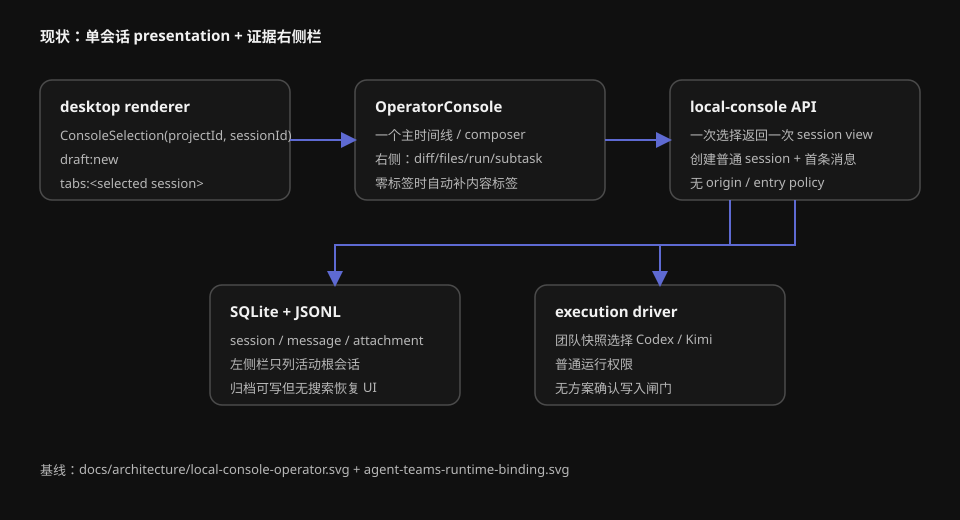
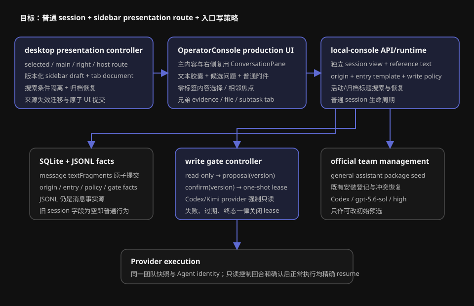

# 设计：sidebar-chat-session-analysis

## 实施状态

- `implementation_authority`: `granted`
- 用户已在第二人工闸门明确回复「开始开发」，完整生产实现、自动化测试和真实运行验收已获授权。
- 生产实现、功能验收和视觉验收均已完成；交付收尾按项目规则回流现状 specs、架构事实源并归档 change。

## 方案总览

实现保持一个核心不变量：sidebar chat 是普通 local-console session，只是可以由另一段会话的右侧栏承载。分析入口只增加预填静态文本与 `confirm-current-plan-before-write` 入口策略，不创建另一套消息、团队、执行或权限模型。

### 1. 会话与消息事实

在 session 创建事实与 SQLite 投影中增加以下可选字段：

- `originSessionId`：仅供组合路由和找回；不能作为 prompt，也不能授予读取或写入能力。
- `entryTemplate`：`null | "session-analysis"`；只标记入口行为，手动 sidebar chat 为 `null`。
- `writePolicy`：`"normal" | "confirm-current-plan-before-write"`；由可信创建请求设置，不能从正文、文本片段或来源 run 推断。

首条及后续用户消息允许携带 `textFragments`。每项包含稳定 fragment id、短标签和完整普通文本；不得包含文件附件状态、blob id 或自动解析结果。JSONL 事实与 SQLite 索引必须在同一消息 fact 中原子写入正文、普通附件和文本片段。prompt builder 按保留顺序把片段作为明确分隔的普通文本上下文注入；UI 仍把正文与片段分别投影。

入口请求只向 local-console 获取可信格式化所需的标识：

- Moebius session JSONL 的本机绝对路径；
- 可用时，点击位置对应 provider 名称与 external session/thread id；
- 没有外部 id 时只返回 Moebius 路径。

renderer 只把响应保存为静态文本，不读取目标文件、不追踪更新、不解析回结构化权限。

### 2. sidebar chat 草稿

新增版本化 `SidebarConversationDraftDocument`，每份草稿包含：

- `draftId`、`hostSessionId`、初始项目/实际工作空间、当前项目/工作空间/团队；
- `entryTemplate`、静态文本片段、正文、普通附件 draft key；
- 系统预选快照和更新时间。

草稿归并只消费流程 PRD 定义的键。入口控制器先查找可归并的未发送草稿；命中则聚焦并追加片段，未命中则创建新草稿标签。首次发送成功后原子完成：

1. 创建普通 local-console session 与首条消息；
2. 保存 origin/entry/write policy；
3. 当前右侧标签由 draft locator 原地替换为 session locator；
4. 清理草稿正文、片段和附件引用；
5. 把创建结果加入最终项目的普通会话列表。

任一步失败都保留完整草稿且不留下可见半会话。

### 3. 组合路由与独立会话视图

renderer 把当前单一 `ConsoleSelection` 升级为版本化 presentation route：

- `selectedSessionId`：左侧栏唯一高亮对象；
- `mainSessionId`：主内容承载会话；
- `rightConversationSessionId`：当前选中的 sidebar chat，可空；
- `hostSessionId`：右侧栏标签现场所属主会话。

普通会话四者收敛为同一个主会话且右侧为空。点击 sidebar chat 时，先读取目标与 origin：

- origin 可用：主内容加载 origin，右侧会话独立调用已有 session view/消息端点，左侧只高亮 sidebar chat；
- origin 不可用：主内容直接加载 sidebar chat，右侧会话为空并显示非阻断说明。

`OperatorConsole` 不复制时间线。抽取/复用一个受控 `ConversationPane` 生产组合，使主内容和右侧标签都使用相同标题、时间线、run、composer、附件、团队菜单与恢复行为。右侧会话内部打开完整输出、文件和子任务时，把意图交给 host 的外层 `RightSidebar`，新增兄弟标签。

右侧栏标签持久化由逐 session key 迁移为单个版本化文档，以便归档或项目移除时原子清理所有 host 下指向目标 sidebar chat 的标签。旧文档只迁移既有证据标签，不臆造会话关系。

### 4. 零标签、关闭与草稿丢弃

`RightSidebarTabsState` 允许 `tabs=[]`。显示右侧栏且零标签时直接渲染内容选择，不创建占位标签。选择类型后才创建标签。

`closeRightSidebarTab` 只返回标签状态和相邻焦点目标，不再补空白标签。容器在结果为零时关闭右侧栏并把焦点还给主内容显示按钮。

关闭未发送会话草稿前，由 renderer 比较关闭瞬间最终状态与系统预选快照。正文、片段、普通附件或上下文差异任一存在即显示丢弃确认；隐藏右侧栏不触发丢弃。

### 5. 分析入口与写入闸门

入口菜单只负责生成草稿与候选问题。写入闸门绑定 session 的可信 `writePolicy`，与当前团队、来源团队、文本内容和 provider 无关。

闸门状态作为可重建 session policy fact 持久化：

- `read-only`：默认状态，所有成员 run 使用只读 provider 能力；
- `proposal-current(version)`：当前主 Agent 已提出可确认方案；
- `write-lease(version)`：用户自然语言确认了当前版本，仅供紧接着的执行尝试消费；
- `read-only`：写入尝试结束、失败或被中断后关闭一次性 lease；需要继续修改时重新基于当前方案确认。

确认识别采用 fail-closed 的同一会话主 Agent 控制回合：

1. 主 Agent 在只读运行中用受信任 developer contract 返回用户可见回复和可选控制 envelope；
2. `proposal` envelope 只登记当前方案版本；
3. 用户后续消息仍先在只读能力下由主 Agent判断；只有 `confirm(version)` 与当前版本精确匹配，runtime 才建立一次性 write lease；
4. runtime 立即以同一 Agent identity 和 external session resume 执行已确认方案；控制回合不形成第二条可见 Agent 回复；
5. envelope 缺失、非法、版本过期、方案被修改、局部确认范围不明确或 provider 不支持安全只读时保持只读，并给用户可见说明。

Codex 使用受控 `--sandbox read-only`；Kimi 使用 `workspaceAccess: "read-only"`。正常执行继续使用当前团队快照的 provider/model/effort 和普通权限。read-only 禁止文件写入与会产生持久变化的命令；不能只依赖提示词声明。团队文件位于工作空间外时也不得因入口自动扩张 provider read roots 或 write roots。

该控制 envelope、方案版本和 write lease 是实现协议，不进入产品 UI，也不成为会话标题或阶段徽标。手动 sidebar chat 的 `writePolicy="normal"`，不会经过此闸门。

### 6. 搜索、归档与恢复

local-console 新增只读会话搜索端点，输入为规范化查询与 `includeArchived`。服务端只搜索仍属于活动项目的根用户会话标题；当前基线执行 trim + NFKC + lowercase contains。结果返回 session、project、archived 和 origin 可用性，不返回消息正文。

renderer 搜索控制器冻结每次已提交条件。只有仍匹配当前控件的最近结果/错误/加载状态可以呈现；失效请求不阻塞新搜索。恢复并打开调用既有 restore 事实写入后，再提交组合路由；任何失败都保持搜索现场和先前选择。

单条归档、项目批量归档、来源失效和恢复都先计算 presentation transition，再原子提交可持久事实与标签文档。应用外来源失效无法参与同一事务时，保留最后成功内容，先显示重试；主内容成功迁移后再清理旧 host 标签。

### 7. 「通用助手」官方团队

新增 `seeds/teams/general-assistant/`：

- `team.json`：显示名称「通用助手」，唯一主成员 `assistant`；
- `members/assistant/AGENT.md`：只含身份 frontmatter，无专业职责正文；
- `official.json`：推荐 `Codex / gpt-5.6-sol / high`；
- 不添加独立 onboarding 编排规则。

现有 team seed 流程负责缺失官方团队的首次登记，但需要把“稳定身份冲突”和“预定目录冲突”投影为不同、可恢复的产品状态。保留操作通过 staging + 原子记录切换完成；失败不得改写现有用户团队或冲突文件。

sidebar chat 初始团队解析使用固定官方 identity，不更新普通新会话偏好；首次发送成功后才按最终团队复用现有 last-used 记录。所有团队选择器使用服务端投影的用户可读 disambiguator，不暴露内部 key、路径或临时序号。

### 8. production Page Story

最终 Story 路径：

`packages/console-ui/src/console/session-analysis-page.stories.tsx`

Storybook 标题：

`Page/Console/SessionAnalysis`

Story 必须直接渲染 `OperatorConsole` 生产导出、使用固定时间与固定 fixture、`layout: "fullscreen"`，至少包含：

- `AnalysisDraftSingleFragment`
- `AnalysisDraftAccumulatedFragments`
- `TextFragmentTooltipOnKeyboardFocus`
- `CreatedSidebarConversation`
- `RightSidebarZeroTabs`
- `RecoveredSidebarConversation`
- `SourceUnavailableFallback`

Story 中的提交、删除、候选问题、标签切换只改变内存 fixture，不调用真实 IPC、localStorage、SQLite、runner、Codex、Kimi 或文件系统。Page Story 在生产受控 props 能完整表达这些状态后创建；不得用 story-only 页面复制、绝对定位覆盖或把普通文件附件伪装成文本片段。

## 文件职责

| 层 | 主要文件 | 职责 |
| --- | --- | --- |
| UI 纯模型 | `packages/console-ui/src/console/right-sidebar-tabs.ts`、新增 sidebar route/text fragment 纯模型 | 标签、焦点、草稿片段与组合呈现的纯状态转换 |
| UI 生产组合 | `operator-console.tsx`、`new-conversation-page.tsx`、`role-composer.tsx`、`conversation-sidebar.tsx`、新增 search surface | 完整复用会话布局并发出用户意图 |
| Story/test | `session-analysis-page.stories.tsx` 与相邻 `*.test.tsx` | 确定性状态浏览和组件级交互断言 |
| Renderer 状态 | `desktop/src/console-page/app.tsx`、新增 sidebar draft/route/search stores | IPC 编排、版本化持久化、并发和原子 UI 提交 |
| Local API | `state-sync.ts`、`src/local-console/server.ts` | 创建参数、独立 session view、搜索/恢复、引用文本窄端点 |
| Runtime/store | `runtime.ts`、`store.ts`、`sqlite-state*.ts`、`prompt.ts`、`execution-driver.ts` | session/message facts、来源、文本片段、写策略、只读/写 lease |
| 团队 | `desktop/src/team-seed.ts`、`team-*`、`seeds/teams/general-assistant` | 官方团队登记、冲突恢复、推荐配置 |

## 权衡

- 选择普通 session + presentation route，而不是新增 analysis session 类型；代价是 renderer 必须能同时加载两段普通会话，但可避免长期复制消息和运行语义。
- 选择结构化消息文本片段，而不是把胶囊内容拼进正文；代价是扩展消息 fact，但可保证 UI、prompt 与首次发送原子性，且不会伪装成文件附件。
- 选择 runtime 强制只读 + fail-closed 控制 envelope，而不是只写候选提示词；代价是确认后可能多一次不可见控制回合，但能真正阻止持久写入。
- 选择一次性 write lease，而不是确认后永久开放；代价是后续新增修改需要再次确认，但确认范围可以机械绑定当前方案版本。
- 选择集中版本化右侧栏标签文档，而不是继续分散 localStorage key；代价是一次迁移，但支持跨 host 原子清理。
- 第二人工闸门使用生产 props 表达目标状态：先补通用 conversation tab、文本片段、候选问题和嵌入式普通会话接口，再由 Page Story 组合；不创建 story-only 平行布局。

## 风险

- 自然语言确认识别错误会导致越权写入。控制协议必须 fail-closed，并覆盖模糊赞同、局部确认、方案变更、回调身份变化和晚到响应。
- 同一 external session 的只读控制回合与写入回合若 provider 语义不同，可能无法安全 resume；必须分别对 Codex/Kimi 做能力验收，不支持时明确不可执行，不能降级为普通写权限。
- 组合路由使“选中”和“主内容”分离，容易让轮询晚到状态覆盖当前视图；所有 session view 请求必须按目标 session 和当前 route 校验后提交。
- 草稿正文、普通附件和文本片段跨两个存储体系时可能部分消费；首次发送需以服务端会话事实成功为唯一消费点，并让客户端清理保持幂等。
- 官方团队首次登记冲突处理会触及既有安装；必须以 staging、原子 rename/记录写入和失败回滚保护用户文件。
- 搜索与恢复会扩大当前 placeholder 范围；若实现周期需要切片，必须按任务依赖顺序提交，但在所有端到端验收通过前不得归档 change 或回流 specs。

## 回滚

- 新字段均可选；旧会话按普通主会话读取。
- renderer 版本化文档保留旧标签读取迁移，回滚版本忽略新 tab/session locator，不能删除会话事实。
- `general-assistant` 是正常官方团队；代码回滚不得删除用户已经编辑的团队目录或已有会话快照。
- 写策略识别异常时一律回到 read-only，不允许以可用性为由自动放宽。
