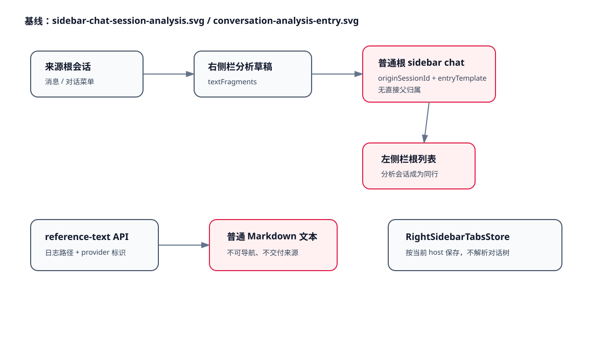

# 设计：analysis-conversation-tree

## 基线

- 页面基线：`docs/wireframes/pages/console.md`；产品意图由 `docs/product/pages/main-conversation.md`、`main-left-sidebar.md`、`main-right-sidebar.md`、`agent-conversation.md` 与 `docs/product/flows/session-analysis.md` 接管。
- 架构基线：`docs/architecture/sidebar-chat-session-analysis.svg`、`docs/architecture/conversation-analysis-entry.svg`、`docs/architecture/local-console-recovery-resume.svg`、`docs/architecture/local-console-streamdown-markdown.svg`。

## 架构

## 方案

### 1. 会话模型与直接父子查询

- 保留 `parent_session_id` 作为团队子任务的运行时谱系，不改变现有 `childSessions` 投影。
- 为 sidebar chat 会话事实新增 `analysis_parent_session_id`。只有 `entry_template = session-analysis` 的已创建分析会话可以设置该字段；父会话可以是根对话或另一段分析对话。
- `origin_session_id` 继续表达创建来源，不承担导航归属。分析面板只按 `analysis_parent_session_id = 当前会话` 查询未归档直接子项。
- 根列表排除具有 `analysis_parent_session_id` 的分析会话；团队子任务列表仍只读取 `parent_session_id`，两条关系不互相投影。
- 分析会话创建时，在同一个 store 命令内写入会话事实、首条用户消息及直接父关系；失败不得留下半个会话。

### 2. 面板状态与右侧栏标签

- renderer 从 local-console state 接收全部可见 sidebar chat 摘要，并按直接父关系派生当前对话的面板条目；不为每个面板新增轮询接口。
- 面板开合使用 renderer 进程内 `Map<sessionId, boolean>`，不写入 localStorage；切换会话保留，应用重启默认关闭。
- 根对话面板挂在主内容 `OperatorConsole`；右侧栏分析会话使用同一个生产 `AnalysisPanel` 和会话内容组件，在标签内部传入当前分析会话的直接子项。
- 所有分析会话标签写入根会话的 `RightSidebarTabsStore`。打开前沿 `analysis_parent_session_id` 解析根；同树复用现有组，跨树先准备目标根会话状态，再一次提交 selection 与目标唯一标签。
- 唯一性继续由 `conversationTabSourceKey(sessionId)` 保证；父分析会话与子分析会话是同一个外层标签条的兄弟。

### 3. `moebius-ref:` 与来源交付

- 新增纯逻辑协议模块，唯一接受：
  - `moebius-ref:message/<percent-encoded-session-id>/<positive-message-id>`
  - `moebius-ref:conversation/<percent-encoded-session-id>`
- Markdown 插件只在普通 link 节点解析该协议；代码、HTML、图片地址和裸文本不触发。合法目标注册应用内 intent，非法或不可读目标保留可读标签并进入不可用反馈，不交给系统外链。
- 文本胶囊发送时按固定来源块序列化；标签和摘录经过纯文本投影、Unicode grapheme 截断和 Markdown link-label 转义。历史消息只保存拼接后的正文。
- 用户消息提交或新 run 创建前，runtime 从 Markdown link 节点提取引用并读取最新目标：
  - 消息级：目标消息、附件元数据、关联 run timing 与可用过程输出；
  - 对话级：当前完整时间线、附件元数据、相关 run timing 与可用过程输出。
- 来源包作为本次 run 的只读输入上下文追加到 provider 用户输入，不授予来源项目文件能力。同一 run 的 resume 继续复用已落入 run execution context 的来源内容；创建新 run 时重新解析原用户消息并读取最新来源。
- 来源读取发生在消息提交 / 新 run 创建前；任一目标不可读即返回结构化错误，不写入新消息或 run。

### 4. 队列、归档与项目移除

- 主理人忙碌时，消息仍进入现有 pending FIFO。带引用项到达队首、准备 claim 为新 run 时才读取来源；失败时保留同一 pending 消息并记录可恢复的来源错误，不 claim、不启动后续项。
- renderer 在待发射区为队首错误提供重试、编辑和移除；编辑更新同一 pending 项并保持位置，移除或读取成功后继续 FIFO。
- 根对话归档前解析全部分析后代；任一后代存在 active run 或待接回控制工作时拒绝普通归档。提交归档时递归隐藏整棵分析树。
- 项目移除由 store 在单一事务内计算“自身属于该项目的会话”及其分析后代闭包；普通移除遇到运行中或待接回工作时拒绝，强制移除按 runtime 编排先停止、再放弃待接回、最后提交项目移除和递归归档。
- renderer 只在服务端提交成功后清理面板入口和目标标签；失败时不提前修改持久标签文档。

### 5. 兼容与迁移

- 旧会话的 `analysis_parent_session_id` 为 `NULL`，继续按原 sidebar chat 显示。
- 旧版已经创建但仅带 `entry_template = session-analysis` 与 `origin_session_id` 的会话，在幂等迁移中将 `origin_session_id` 作为直接父关系回填；父对象不存在时保持根会话可见，避免无入口隐藏。
- 旧 Markdown 日志路径文本保持普通文本，不自动猜测为内部引用。
- Page Story fixture 继续只用于确定性视觉状态；真实 renderer 数据通过生产 props 投影，不 import story。

## 权衡

- 选择独立的 `analysis_parent_session_id`，而不是复用 `parent_session_id`：多一个持久字段，但避免分析对话进入团队子任务状态机、成员卡片和控制权统计。
- 选择 renderer 由已有 session 集合派生直接子项，而不是新增每面板请求：减少竞态与加载链路；代价是 state payload 包含分析会话摘要。后续数据量需要分页时再引入有版本的查询接口。
- 选择公开协议而不附加签名：符合产品对复制、用户手写和 Agent 输出等价的裁决；安全边界落在严格语法、当前用户可读目标和不扩展文件权限。
- 选择 run 开始时读取最新来源而非静态截点：实现与用户心智更简单；同一次 run 通过持久 execution context 保持一致，新的 run 可以看见更新。
- 选择服务端事务结果驱动 UI 清理：不能提供跨 SQLite 与 localStorage 的真正分布式事务，但可保证服务端失败时 UI 不提前丢入口；renderer 清理失败可由下一次 state reconcile 修正。

## 风险

- 来源内容可能很长：来源包使用有界分段和明确完整性元数据，provider 适配层按需拼装；不得静默截断。
- Markdown AST 与纯文本正则不一致：提取和渲染共享同一协议解析器，并用代码块、图片、HTML、转义字符、Emoji 和非法 ID 测试锁定。
- 跨树切换可能出现半套现场：先加载目标根 state 和 tabs，再在单个 reducer 提交；任一步失败保留原 selection。
- 旧分析会话回填可能遇到损坏父引用：只回填存在且未自指的父对象，异常对象保持可见并记录诊断。
- 强制项目移除跨多个异步停止步骤：停止或放弃任一步失败即终止，store 事务不执行；不清理 renderer 入口。
- 回滚：schema 新字段可保持但停止写入；renderer 可退回普通 sidebar chat 展示。`moebius-ref:` 解析器关闭后链接降级为不可用文本，不会被系统外链打开。

## 实施后反思

- 会话事实、renderer 投影和 Page Story 保持同一直接父子模型；生产代码未 import 或运行时读取 Story fixture。
- 面板没有新增详情或管理层级；根对话和分析对话均复用同一 `AnalysisPanel`，子分析会话继续进入现有外层右侧栏标签组。
- 来源交付在 claim 前执行，完整正文、附件元数据、运行时序和可用输出按带完整性序号的分段注入；同一 run 的 execution context 继续复用，新 run 重新读取。
- 真实桌面验证发现“毫秒不同但显示到秒”的同名条目仍不可辨认，实施已将相同可见时间稳定消歧为 `A/B`，没有为面板增加摘要或状态。
- 归档与项目移除仍以服务端事务结果驱动 renderer 清理；这满足失败不丢入口的边界，但不宣称 SQLite 与 renderer 内存之间存在分布式事务。
- 功能返工复验已覆盖 pending 队首读取、Markdown link-node 来源边界、键盘焦点和跨树消息高亮；视觉验收因执行环境中的 Kimi 故障未执行，并由用户明确要求跳过，因此不记为视觉通过。
