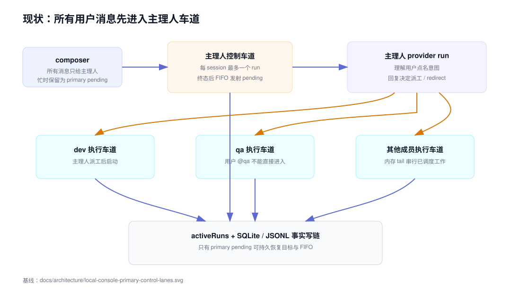
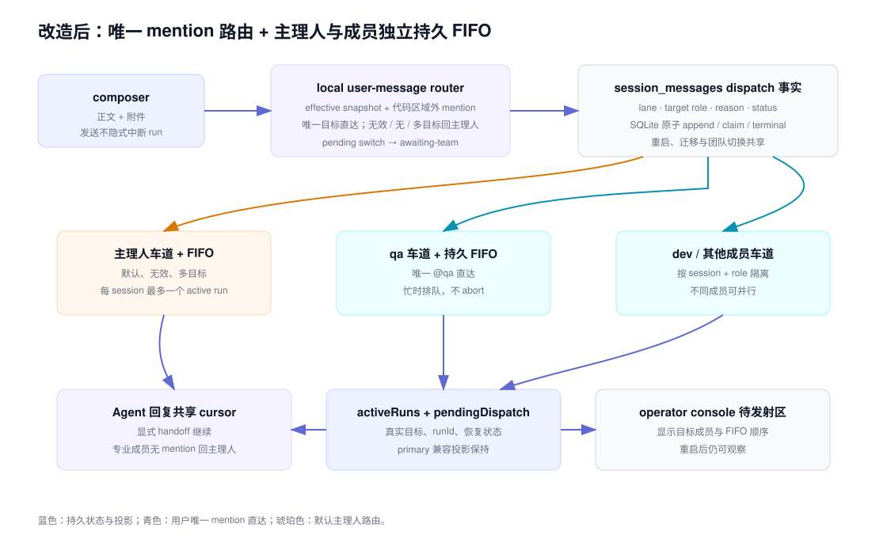

# 设计：local-console-direct-member-mention

## 方案

### 1. local-only 纯路由规则

新增不依赖 UI、SQLite、provider 或 shell 的 `src/local-console/user-message-routing.ts`。它接收用户正文、effective 团队有序成员和首成员主 Agent，复用 `parseAgentMentions()` 的代码区域屏蔽与语法结果，但不修改共享 parser 或 GitHub trigger。

输出固定为：

- 一个不同的有效成员：`lane=primary|worker`、`targetRole=<该成员>`、`reason=single-valid-mention`；
- 没有有效成员（包括未点名和全部无效）：主 Agent，`reason=no-valid-mention`；
- 两个及以上不同有效成员：主 Agent，`reason=multiple-valid-mentions`。

同一成员重复出现按一个目标处理；无效 mention 与唯一有效 mention 并存时仍直达唯一有效成员。行内代码、fenced code block 和团队外 slug 不进入有效集合。该模块集中单测规则边界，runtime 只消费判定结果。

PRD、spec-delta 与测试使用同一判据矩阵：

| 正文中的有效目标集合 | 首位执行者 |
| --- | --- |
| 空集（未点名或全部无效） | 主 Agent |
| `{qa}`（包括重复 `@qa`，或 `@unknown` 与 `@qa` 并存） | qa |
| `{qa, dev}` 或更多不同成员 | 主 Agent |

### 2. 用户消息持久化 dispatch 事实

在 `session_messages` 幂等增加 nullable 字段：

- `dispatch_lane`: `primary | worker | awaiting-team`
- `dispatch_role`: 已解析目标 role；`awaiting-team` 时为 null
- `dispatch_reason`: `single-valid-mention | no-valid-mention | multiple-valid-mentions`

迁移时，升级前已存在的 user message 确定性回填为 `dispatch_lane=primary`，避免旧 pending 消息在新版本被重新解释为直达成员。新消息提交时：

- 没有 pending 团队切换：runtime 用 effective 快照解析并在 append user message 的同一事务写入 dispatch 事实；
- 已有 pending 团队切换：写 `awaiting-team`，不针对旧团队启动；新快照提升后再按新成员名单原子补齐 dispatch 事实。

消息正文与附件仍只存在 `session_messages` 和既有 attachment refs；不复制 prompt 或附件内容。dispatch 字段是可重建索引之外的路由事实，因为重启后不能用后来变化的上下文重新猜测已确认目标。

### 3. 主理人 FIFO 与持久化成员 FIFO

保留主理人现有 pending FIFO 与 `local_message_cursors` 接力位点。claim 逻辑按 dispatch lane 分流：

- `primary`：沿用现有 claim、运行、终态与 pending 发射；
- `worker`：控制 cursor 只记录该用户消息已完成入站路由，不把它交给主 Agent；用户消息保持 pending，成为目标 role 的持久 FIFO 项；
- `awaiting-team`：在 pending 团队快照尚未提升时不可 claim。

新增按 `sessionId + role` 原子领取最早 worker pending 的 store 操作。只有该 role 没有 runtime active run、持久 running source 或 worker placeholder 时才能把最早一条改为 running、写入 runId/activatedAt 并启动。不同 role 可独立领取；同 role 永远最多一个 active run。

直接用户消息本身作为 worker run 的 source message，不额外制造第二条 source placeholder。成功时同一事务完成用户 source、插入目标成员回复；失败、stuck、用户停止或 resume-unavailable 时完成同一 source 并写既有可见系统事实。Agent 回复随后仍进入共享消息 cursor：有合法交棒时继续对应成员，无 mention 的专业成员回复回到主 Agent。

### 4. 区分 redirect 与 direct dispatch

把 worker 调度调用显式标记来源：

- `agent-handoff` / `primary-redirect`：保持现有规则。主 Agent 点名活动成员时中断旧 run，等终态后带新指令重启。
- `user-direct`: 只在该 role 可领取时启动；role 忙时留在持久 FIFO，绝不调用旧 run 的 abort controller。

现有内存 `workerLaneTails` 只负责已领取工作的进程内串行收束，不再充当用户直达消息的唯一队列事实。worker 任一终态后触发该 role 的下一条持久 pending 领取，并继续触发主 session cursor 处理已写入的 Agent 回复。

### 5. 团队切换、已有会话与恢复

- 切换请求之前已经解析为 worker 的 pending 属于旧 effective 团队排队工作，和已启动 run 一样阻止 pending 团队快照提升；它启动时使用旧 effective 快照并冻结自己的 execution context。
- 切换请求之后提交的 `awaiting-team` 消息不启动旧团队。旧 run 与旧 worker FIFO 清空后先提升新快照，再按新团队名单解析这些消息。
- 升级前历史消息、completed 响应、cursor 和 canonical provider links 不改写；旧 pending user message 回填主 Agent，避免版本升级改变已经排队消息的接收者。
- graceful shutdown 时，活动 worker 按既有 runId/provider ID 恢复，未领取 worker pending 保持 pending。重启 startup catch-up 先修复或恢复 running source，再按每 role FIFO 领取；不得越过同 role 的活动恢复项。
- orphan running source 继续落可见 stuck；其终态确认后，同 role 下一条 pending 才可启动。一个 role 的恢复或失败不得阻塞其他 role 与主 Agent。
- 每个目标继续复用「session + effective snapshot fingerprint + role」Agent 身份；直达消息不能创建 replacement provider session。

### 6. State、desktop adapter 与待发射 UI

local snapshot、state 与 session view 新增统一 `pendingDispatchMessages`，每项至少包含 message、`targetRole`、`targetLane` 与 waiting 状态。迁移期保留 `pendingPrimaryMessages` 作为只含主 Agent 项的兼容投影，desktop renderer 只做 DTO 到 presentational props 的薄映射。

operator console 把现有 `primary-pending-zone` 泛化为待发射区：

- 每行显示提交顺序、可读目标成员和正文/附件摘要；
- 主理人项显示“→ 主理人显示名”，专业成员项显示“→ 成员显示名”，等待团队切换的项显示“→ 新团队生效后决定”；
- 同一目标保持提交顺序，不暗示跨目标全局串行；
- 区域继续复用正文列宽度、现有 accent pending 样式和滚动边界，不新增视觉令牌；
- composer 提示改为“继续说点什么，或 @ 一个成员…”，主理人方形停止按钮仍只绑定主 Agent runId。

目标显示和提示修订不是额外 UI 产品能力：前者是忙碌 FIFO 的必需可观察信号，后者用于移除现有“继续告诉主理人”对新路由规则的错误陈述，并复用 PRD 已有“继续说话或提及成员”提示。实现不新增 Page Story；只有既有 Story fixture 因 props 类型变化无法编译时才做机械适配，不增加展示场景。

### 7. 兼容范围与硬边界

以下内容只固定现有安全语义如何覆盖新 dispatch，不是新增产品能力：

- 跨 role 并行：现有 runtime 已允许主 Agent 与不同专业成员并行；本 change 只保证唯一 mention 直达后不退化成全局串行。
- 切换前 worker pending 阻止团队提升：现有契约已要求切换前已排队 run 使用旧团队并结束后再切换；本 change 只把新持久 worker FIFO 纳入“已排队工作”。
- 升级前 pending 固定回主 Agent：这是 migration fail-safe，避免新版本重新解释旧消息；不改变历史时间线或提供用户可选旧路由。

实现硬边界：

- `src/conversation.ts` 与 `src/triggers/*` 不修改；local-only 模块只读取 `parseAgentMentions()` 结果。
- GitHub runner、GitHub mention trigger 与 Agent-to-Agent “第一个有效 mention”保持原样。
- 主 Agent redirect 活动成员继续中断旧 run 并带新指令重启；只有 `user-direct` 禁止 abort。

### 8. 验证策略

自动化测试：

- 纯路由：按上方同一判据矩阵覆盖未点名、全无效、唯一有效、无效加唯一有效、同一成员重复、多个不同有效、行内代码和 fenced code。
- SQLite/store：schema migration、旧 pending 回主 Agent、dispatch 原子 append、按 role FIFO claim、同 role 互斥、不同 role 可领取、cursor 不把 worker source交给主 Agent。
- Runtime：`@dev` / `@qa` 首位启动对应成员；无效/未点名/多目标只启动主 Agent；主 Agent 与直达空闲 worker 并行；忙碌 worker 不被中断且只保留一个 active run；worker 终态后 FIFO 启动。
- 恢复：活动 worker graceful resume 加同 role pending、orphan/stuck 后释放下一条、startup catch-up 不重复不丢、canonical provider identity 不替换。
- 团队切换：切换前 worker pending 用旧快照并阻止提升；切换后消息等新快照再解析；旧/新同名 role 不串用 provider identity。
- UI/desktop：待发射目标名称、顺序、等待新团队文案、兼容 projection、主 Agent 停止按钮不变；父级重渲染与 props 更新后不得保留过期目标。
- 回归：主 Agent redirect 活动 worker 仍会中断重启；Agent-to-Agent 第一有效 mention 规则与 GitHub runner 完全不变；附件直达与失败恢复不丢。

真实运行验收使用生产桌面主对话、真实 local-console server/store/driver 写链和隔离临时数据根，而不是仅凭单测或 build。为消除 provider 响应速度与人工操作时机的不确定性，验收驱动在系统临时目录安装一个协议兼容的可控 Codex CLI shim，并把临时 `bin` 放在启动进程 `PATH` 首位；desktop 的 shell-path 合并保持 current PATH 在前，因此生产进程实际调用该 shim。shim 支持 `--version`、`exec`、`exec resume`，写入临时 `CODEX_HOME/sessions` rollout、发出真实 Codex JSONL 协议事件，并用外部 release 文件阻塞/释放指定 qa invocation。该 shim 只属于验收脚本，不增加 runtime 测试开关或生产分支。

每个 fallback 场景使用独立的新会话和独立 invocation log，避免上一主理人 run、pending 或 provider cursor 污染“第一位执行者”证据。至少记录：

1. 唯一 `@qa`：发送正文、`activeRuns.role=qa`、时间线第一条 Agent 回复 role=qa，以及 dev-manager/dev 在该次首次执行阶段没有 run。
2. 未点名、无效 mention、多成员 mention：分别在三个新会话发送，只观察各自首次 invocation；三次均为 `activeRuns.role=dev-manager`，qa/dev 没有 invocation。若无法新建会话，替代方案必须等待上一会话 `activeRuns=[]`、`pendingDispatchMessages=[]` 且 `hasPendingControlWork=false` 后再发送并重置 invocation log。
3. qa 忙碌 FIFO：shim 在第一条 qa invocation 写出 `thread.started`、rollout 与 started marker 后等待 release 文件。驱动确认 qa active runId 后发送第二条唯一 `@qa`，再断言目标为 qa 的 pending、qa active 数量仍为 1、runId/PID 不变、CLI invocation 仍为 1，且 signal log 在显式 release 前没有 SIGINT/SIGTERM。创建 release 文件后，第一条完成；随后才出现第二个 qa runId/第二次 invocation。
4. 重启恢复使用独立会话重新建立“qa 活动 + 第二条 qa pending”。关闭前先证明 signal log 为空；随后由验收驱动明确正常关闭应用，允许记录 `runtime-closing` 对应终止信号。重启同一 `MOEBIUS_DATA_ROOT`、`CODEX_HOME` 与 shim 后，断言第一条以相同 runId 和 thread ID 走 `exec resume`，第二条仍是 qa pending；释放恢复 invocation 后第二条才启动，且所有 invocation 使用同一个 canonical thread ID，没有 full replacement。
5. 已有会话升级：历史时间线不改写，升级前 pending 仍交主 Agent；升级后新唯一 mention 按新规则路由。

验收通过 CDP 读取生产 renderer 的可见文本，并通过 local state、临时 CLI invocation/signal log 和 rollout 交叉证明；不把截图回读作为默认断言。证据写入系统临时目录，包含入口、sessionId、发送正文、目标 role、未启动 role、runId/PID、pending target、release 时刻、signal log、重启前后 provider identity 与时间戳；仓库内 `artifacts/` 不写入、不提交。

## 权衡

- 不修改共享 `selectMentionedAgent()`：GitHub 和 Agent-to-Agent 当前采用“第一个有效 mention”，用户 composer 新规则采用“唯一不同有效目标”；放进 local-only 纯模块可避免 GitHub 漂移。
- 不继续用内存 Promise tail 保存用户队列：实现更小但重启会丢目标或顺序，无法满足已确认恢复契约。
- 不把忙碌直达解释为 redirect：用户已明确选择排队；主理人 redirect 仍保留中断权，两个来源必须在类型和测试中分开。
- 不让一个全局 FIFO 串行所有成员：当前产品允许不同成员并行；队列按 role 隔离才能保持这一能力。
- 不立即移除 `pendingPrimaryMessages`：保留一个迁移期兼容投影，降低 desktop 与外部调试消费者同时升级的风险；新 UI 只消费统一投影。
- 不创建新页面或新视觉模式：现有待发射区足以表达目标，只需把标题和行内容泛化。
- 不用真实模型“帮忙等待”或人工抢时间：协议兼容 CLI shim 和 release 文件让生产 driver run 的活动窗口可重复、可观测、可精确释放。

## 风险

- 全局消息 cursor 与 per-role worker queue 同时推进，若 store 事务边界不严谨可能重复启动或让消息既进主理人又进 worker。缓解：dispatch 持久化、worker 原子 claim、cursor skip 与 source terminal 写入均做 store 级并发测试。
- pending 团队切换可能与旧 worker queue 形成等待环。缓解：明确区分切换前 `worker` 与切换后 `awaiting-team`，只让前者阻止快照提升。
- worker direct source 从 placeholder 改为用户消息后会影响 orphan/retry 查询。缓解：source-kind 双路径测试，并以 `sessionId + runId + sourceMessageId + role` 固定身份。
- 多个不同有效 mention 回主 Agent 可能被用户误以为并行派发。缓解：待发射/活动信号只显示实际目标，验收验证专业成员没有被直接启动。
- 真实 provider 恢复受本机 CLI 会话状态影响。缓解：自动化固定 store/provider identity 不变量，真实桌面验收另外记录 provider ID 和可见恢复事实，二者缺一不声明 code-verified。
- 回滚时可恢复“全部 user → primary”路由并保留新增 nullable dispatch 列不读；不得删除或重写用户时间线、provider links 或队列中的正文/附件。

## 2026-07-30 第四轮 QA 阻塞修订

### 复现事实与根因

真实会话 `local:2026-07-29T09:16:04.958Z-5hsb8c` 已形成完整失败链：

1. 主 Agent 消息 404 通过 `@qa` 启动 detached worker run
   `local-2026-07-29T12:57:06.414Z-ua0g4yza`；该 run 的不可变
   `run_execution_context` 固定为 `sourceMessageId=404`、`role=qa`。
2. 正常关闭写入同一 run 的 graceful resume intent 后，通用
   `releaseMessageForResume()` 把 agent source 404 从 `displayed` 改成
   `pending`。该状态只适用于待领取 user source；primary cursor 会跳过
   `agent + pending`，因此原 QA run 无法重新 claim。
3. 未消费 intent 仍指向旧 QA run。后续用户消息 412、414 被 primary claim
   时，`gracefulResumeTargetForNextPending()` 先从错误的 pending agent source
   选出旧 runId，而 SQLite claim 随后跳过该 source、实际领取新的 user
   source。
4. runtime 因而尝试用同一旧 runId 写入
   `sourceMessageId=412/414`、`role=dev-manager` 的新 context；JSONL 的不可变
   fact guard 正确拒绝该写入并报告
   `conflicting run_execution_context fact`。连续发送“继续”只会重复同一错误。

该链路有可重复核对的持久证据，不依赖内存时序或人工观察：

- `2026-07-29T12:57:07.225Z` 的唯一 `run_execution_context` 把
  `local-2026-07-29T12:57:06.414Z-ua0g4yza` 固定到
  `sourceMessageId=404`、`role=qa`；
- `2026-07-29T12:57:26.795Z` 的未消费 `graceful-shutdown` intent 指向同一
  run/source/role，随后 `release_message_for_resume` 把 404 写成 `agent +
  pending`；
- 重启后的 `claim_next` 在 `12:59:00.821Z`、次日 `00:45:30.923Z` 和
  `01:17:42.150Z` 三次都把同一旧 runId 分配给别的实际 user source；消息 412、
  414、423 因同一个 context 冲突失败，对应可见 `run-not-started` 事实保留。

实现阶段先用生产 store/runtime 测试夹具重建这组最小事实：`agent + displayed`
handoff source → QA provider ID → clean close → `agent + pending` 污染形态 → 同根
启动。修复前测试必须稳定观察到 source 不能恢复或后续 user source 继承旧 QA runId，
修复后再转绿；不得只拿真实历史数据作为不可重复的唯一复现手段。

第四轮的关闭窗口 3/3 只构造了 `user-direct`：source 均为带 worker dispatch 的
user message，关闭前没有经过“Agent source 已由 primary cursor 标为 processed，再由
detached system placeholder 承载执行状态”的链路。因此通用释放成 `pending` 在这三例
中恰好正确。关联回归 5/5 分别覆盖 user-direct 并行/FIFO、SQLite role claim、primary
redirect 和 user-direct active resume，也没有在 provider ID 已建立后 clean-close 一个
`agent-handoff` source。两组测试都没有进入 `agent + pending + cursor 已越过 source`
这个必要环境，不能证明本阻塞。

这不是新的产品规则。它违反现有“正常退出自动恢复同一 run”和“run execution
context 不可变”契约，也暴露出原验收只覆盖 user-direct worker，遗漏
agent-handoff worker source 的环境假设。

### 既有契约违例映射

| 修复项 | 当前违例 | 既有契约锚点 |
| --- | --- | --- |
| source 强类型 | `ActiveLocalRun` 只保留 `lane=worker`，把 agent-handoff 当成 user-direct 释放；关闭逻辑无法保持原 source 的 speaker/claim 语义 | `正常退出先持久化恢复意图` 要求恢复原 run/step/attempt；`主 Agent 控制与成员接力` 要求 Agent source 继续按 handoff 处理 |
| 原子释放 | 现有事务把所有非 system source 一律改成 `pending` 并回退 cursor，因缺少 source disposition 而原子提交了无法被 primary claim 的 `agent + pending` 坏状态 | `生产写链只有一个串行写者` 与 `jsonl 持久化是 SQLite 提交的前置提交点` 要求 source-specific 转换仍通过同一 fact 写漏斗提交；`孤儿运行在重启后被确定性识别为卡住` 要求 graceful intent 优先于 orphan stuck |
| exact-source runId 隔离 | runtime 在 claim 前按“首个 pending”选择旧 runId，store 随后可能跳过该 source 并领取另一条消息，导致旧 runId 绑定新 source/role | `Execution session links are engine and profile specific` 固定不可变 run execution context；恢复 intent 只能选择其明确的 run/attempt，冲突必须 fail closed；`正常退出先持久化恢复意图` 要求精确恢复原 run |

上述三项都是让现有契约在 agent-handoff source 上成立，不新增 normal-close、handoff、
provider continuity 或消息路由规则。

### 修复边界

1. **显式保存 source 语义**：活动 run 不能只记录 `primary | worker` lane；
   worker 还要保留 `user-direct | agent-handoff` origin（或等价的强类型 source
   disposition）。调度入口构造判别联合，active run 与新写入的 graceful intent
   保留该值；intent 解析继续兼容旧事实缺字段。关闭、孤儿修复和恢复不得从正文、
   role 名或“最近的” placeholder 猜测 origin；旧事实只允许按下文兼容修复白名单
   识别。
2. **按 source 类型释放**：
   - primary/user-direct 的 user source 恢复为原 dispatch 下的 `pending`；
   - agent-handoff 的 agent source 保持 `displayed`，只把 cursor 原子回退到该
     source 之前，使它能重新触发同一 handoff；
   - detached system placeholder 只收束自身的运行状态，不得代替 agent source，
     也不得把 agent source 改成 user-only 状态。
   该状态转换收进 store 事务和 session fact 写漏斗，不直接修 SQLite。
3. **runId 与 exact source 绑定**：primary claim 只能在“实际领取的 source id”
   等于未消费 graceful intent 的 `sourceMessageId` 时复用 intent.targetRunId。
   若候选 source 被跳过、已终态或不是本次 claim，必须使用新 runId；不得先按一个
   source 选 runId、再把另一个 source 绑定到它。worker claim 继续按 exact
   message id 选择恢复目标。store claim 接口必须在同一事务中以实际选中的 source
   决定 cursor active runId；runtime 不得在 claim 前用列表扫描结果预占 runId。
4. **兼容修复已污染会话**：startup catch-up 识别“未消费 graceful intent +
   同 run 不可变 context + agent source 错误为 pending”的既有事实，幂等恢复
   `displayed` 与 cursor，再按原 runId/attempt/provider ID 恢复。只修复可由上述
   三项事实唯一证明的记录；歧义或身份冲突继续 fail closed，不猜最近 run，不删除
   历史失败消息。
5. **保持既有边界**：不放宽 `run_execution_context` 冲突 guard，不清除旧
   context，不创建 replacement provider session，不修改共享 mention parser、
   GitHub runner、Agent-to-Agent handoff 语义、PRD 或现行 spec。

### Startup compatibility repair 的安全判据

repair 是一个有界、只追加的兼容投影修复，不是历史数据迁移器。每个候选以
`sessionId + intentId + targetRunId + sourceMessageId + role` 为完整键，只有同时满足
以下条件才允许提交：

1. 恰有一个未消费、`reason=graceful-shutdown` 的 intent；同 source/run/role 的重复
   或冲突 intent 均拒绝。
2. 恰有一个不可变 execution context，且其 `sessionId/runId/sourceMessageId/role`
   与 intent 全等；context 缺失、冲突或存在第二个不同 context 均拒绝。
3. exact source 存在且 `speaker=agent`；待修复形态必须是 `status=pending`，已经是
   `displayed` 只允许作为重复启动的幂等 no-op。不得解析正文 mention，不得把 user
   source、system source 或其他 message id 转成 agent-handoff。
4. 当前进程没有该 run 的 active run；SQLite 没有该 run 的 running source，cursor
   没有指向别的 active message。与该 run/role 对应的 detached system placeholder
   必须不存在或已经是终态；多个候选 placeholder 或仍 running 均拒绝。
5. cursor 属于同一 session。`processedThrough >= sourceMessageId` 时只允许回退到
   `sourceMessageId - 1`；已经在该位置之前则保持不动。不得跨过更早消息、重排 later
   messages 或重写任何消息 id。
6. 新版 intent 若带 `sourceDisposition`，它必须是 `agent-handoff`；字段存在但与
   source speaker 不一致时拒绝。旧版 intent 缺字段时只可由上面五项不可变事实进入
   此兼容分支。

提交必须通过 session fact 写漏斗追加稳定 repair fact，并在同一事务把 exact source
恢复为 `displayed`、回退 cursor、保持 intent 未消费；不得直接写 SQLite。repair fact
或目标投影已存在时重复启动为 no-op，不追加第二条修复记录。

repair 不选择、创建或改写 provider identity。source/cursor 归一后，只有现有 recovery
planner 从同一 execution context/Agent identity 解析出唯一兼容 canonical external ID，
才允许以原 run/attempt 执行 resume；ID 缺失、冲突、不兼容或外部会话不可用时沿用
`resume-unavailable` fail-closed，provider invocation 为零，不执行 full /
`session/new`。因此 repair 成功不等于猜测 provider，也不放宽 provider guard。

以下情况明确拒绝 repair，并保留原事实供现有 stuck/unavailable/可见失败路径收敛：
intent 已消费或非 graceful、键不唯一、context 不全等、source 不存在或 speaker/status
不在白名单、另有 active/running 所有者、placeholder/cursor 冲突、新版 disposition
矛盾。消息 412/413/414/415 及其他 later 历史事实即使曾错误引用旧 runId，也不得删除、
改号、改正文、改既有终态或清除 error；它们不作为“选择最近 source/run”的依据。

### 验证设计

自动化必须覆盖下列独立信号：

1. 先固定红色复现：agent source handoff 建立 QA provider ID 后 clean close，在同根
   startup catch-up 中稳定复现修复前的 `agent + pending` 不可 claim 或 later user
   source 继承旧 QA runId；修复后同一测试转绿。
2. store 状态矩阵：user source graceful release 后为原 dispatch 的 `pending`；
   agent source 仍为 `displayed` 且 cursor 回退；system placeholder 终态不改变
   source speaker/status。相同修复重复执行保持幂等。
3. repair 白名单与拒绝矩阵：分别覆盖 consumed/non-graceful intent、重复或冲突
   intent、context 缺失/冲突、source 缺失或非 agent、source 非 pending/displayed、
   active/running owner、placeholder 多义/未终态、cursor active 冲突和 disposition
   冲突；拒绝分支不得追加 repair fact 或执行 provider。
4. agent-handoff 正常恢复：主 Agent 回复 `@qa`，QA 建立 provider ID 后正常关闭；
   重启只执行一次 `resume`，Moebius runId、step、attempt、QA role、source message
   及 provider ID 均不变，provider `full` 次数不增加。
5. exact-source 隔离：存在未消费 QA intent 时追加普通用户“继续”，QA 原 source
   先恢复；该用户消息不得继承 QA runId。后续若交给主 Agent，必须使用自己的 runId
   与 dev-manager context，且时间线不出现 `conflicting run_execution_context`
   或 `run-not-started`。
6. 历史污染修复：从真实失败形态构造 `agent + pending` source、旧 QA context、
   未消费 intent、已收束 placeholder 和其后的失败 user message；startup
   catch-up 幂等恢复 QA，保留历史失败记录，并让会话继续到主 Agent 收尾。
7. 回归 user-direct worker + 同 role FIFO、primary graceful resume、provider
   unavailable、orphan stuck、关闭前 provider 启动竞态与跨 role 并行，证明本修复
   没有把 direct worker 退回主 Agent 或绕过 fail-closed。

真实运行验收继续使用生产桌面、真实 local-console server/store/driver 写链和可控
Codex CLI shim：

1. 新会话路径：让主 Agent 明确 handoff 给 QA，阻塞 QA provider，确认 QA run 已有
   runId/thread ID 且 agent source 为 `displayed`；正常关闭并用同一数据根重启，确认
   QA 以相同 runId/step/attempt/thread ID 恰好执行一次 `exec resume`，没有 `full`
   replacement、stuck 或 run-not-started。
2. 指定污染会话路径：先把指定会话所在数据根完整复制到系统临时目录，生产桌面只指向
   该副本；原数据根保持只读且不启动应用。启动前记录消息 404、412、413、414、415 的
   稳定字段摘要、原 QA execution context、lifecycle/attempt、intent、canonical
   provider ID、placeholder 与 cursor。
3. 副本首次启动后确认只追加一个 repair fact；404 恢复为 `displayed`、cursor 回到
   404 之前，412/413/414/415 的 id/body/status/runId/error 摘要完全不变。重复重启
   repair 不重复，历史事实行不删除、不覆盖。
4. shim 为原 canonical provider ID 提供同一会话，确认恢复 invocation 的
   `runId/sourceMessageId/role/step/attempt/requested ID/observed ID` 与关闭前全等，
   mode 为 `resume`，`full` 次数不增加。若副本内 provider 证据不唯一，验收应观察
   零 provider 调用和 fail-closed，而不是人为补写 ID。
5. QA 恢复活动窗口从生产 composer 再发送一条新的“继续”。该新 user source 可以按
   现行无 mention 规则等待或交给主 Agent，但其 claimed runId 必须不同于旧 QA runId，
   execution context 必须是自身 source 与 dev-manager role；释放 QA 后，时间线出现
   QA 结果和后续主 Agent 回复，最终 `activeRuns=[]`、pending dispatch 为空且
   `hasPendingControlWork=false`。
6. evidence JSON 同时记录复制源只读证明、临时数据根、修复前后 source/cursor/历史
   摘要、repair fact 数、runId/role/step/attempt、provider mode/ID、后续“继续”的
   source/run/context、可见回复和 `context conflict`/`run-not-started`/replacement
   计数。证据只能写系统临时目录，不回写用户真实数据根。

### 本轮范围账本

本修订只补齐同一 change 中 agent-handoff graceful resume 的实现与证据，不改变产品
规则，不新增 PRD 决策，也不修改本 change 的 spec-delta 判据。允许的生产改动范围是
local-console 的 runtime/store/types、SQLite state adapter 及其测试；若验收脚本需要
记录新增证据，可做对应的任务内调整。

明确排除：共享 mention parser、`src/triggers/*`、GitHub runner、Agent-to-Agent mention
选择规则、用户直达 FIFO/不 abort、跨 role 并行、主理人 redirect 中断重启、团队切换
语义、UI/文案、provider fallback、通用历史重写/清理工具。startup repair 仅识别上面
列出的单一 legacy footprint，不扫描并“修正”其他 failed/stuck/interrupted 历史。
