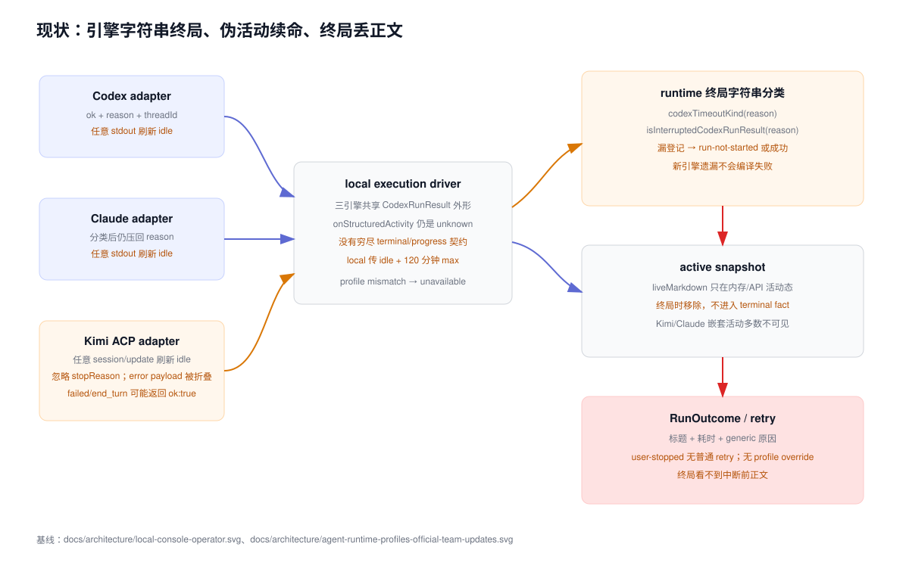

# 设计：local-runtime-supervision-and-override-rerun

## 方案




### 1. 共享执行契约

在不依赖 UI、SQLite 或 shell 的纯模块中定义两组判别联合：

```ts
type ExecutionTerminal =
  | { kind: "completed"; externalSessionId: string; finalText: string }
  | {
      kind: "interrupted";
      actor: "user" | "system";
      cause: "user" | "runtime-closing" | "redirect" | "context-unavailable" | "system";
      partialText: string;
    }
  | { kind: "timeout"; basis: "idle" | "tool" | "max"; partialText: string }
  | { kind: "quota-exhausted"; retryable: false; partialText: string; safeCode: string }
  | { kind: "rate-limited"; retryable: true; partialText: string; safeCode: string; retryAfterMs?: number }
  | { kind: "auth"; retryable: false; partialText: string; safeCode: string }
  | { kind: "crashed"; partialText: string; safeCode: string };

type ExecutionProgressEvent =
  | { kind: "assistant-output"; delta: string; sequence: number }
  | { kind: "reasoning-output"; delta: string; sequence: number }
  | { kind: "tool-started" | "tool-finished"; toolId: string; toolKind: string; sequence: number }
  | { kind: "file-changed"; pathHint: string; sequence: number }
  | { kind: "provider-retry"; retryKind: "rate-limit" | "service"; attempt: number; sequence: number }
  | { kind: "status" | "config" | "usage" | "heartbeat"; sequence: number };
```

真实字段可以按现有命名调整，但语义必须保持：

- `completed` 必须携带通过现有 Agent 回复校验的非空最终正文；“进程正常退出”或 `stopReason=end_turn` 本身不足以证明成功。
- 所有非成功终局都能携带 `partialText`；它是用户可见正文，不是 stdout/stderr 或完整过程记录。
- engine-specific code 先映射为稳定 `safeCode`；原始 code/message/data 单独进入受信任诊断。
- `ExecutionTerminal` 与进展事件的所有 switch 都使用 `assertNever`。不得保留 `interrupted:`、`claude-cancelled`、`idle-timeout:` 等开放式字符串作为业务分流入口。
- `timeout.max` 仍用于兼容历史事实、provider 自身上限或 GitHub runner 等其他调用方，但 local-console 不再根据总墙钟产生该终局。

Codex、Claude、Kimi 适配器直接返回共享终局并发出共享进展事件；共享 driver 的 GitHub 调用方同步迁移为显式映射，保持现有 GitHub 超时、retry/dead-letter 行为。允许短期保留只读诊断字符串，但任何控制流不得再读它。

### 2. 三引擎映射与 Kimi 止血

#### Codex

- `agent_message` 的新增正文映射为 `assistant-output`。
- reasoning、item/tool/command/file 生命周期映射为相应进展事件；只有新增非空 delta 或唯一生命周期转换算新事件。
- 中断、idle、max、认证/额度/限流和进程崩溃在 Codex adapter 内完成一次穷尽映射。
- stdout 字节到达不再直接刷新 local-console idle。

#### Claude

- `text_delta`、`thinking_delta`、tool use/result 与文件动作从嵌套 `stream_event` 解码为共享事件。
- 现有 rate-limit、billing、auth、service 分类直接映射共享终局，不再先压回 generic reason。
- idle 与 max 保留各自 basis；stdout 字节到达不再作为进展。

#### Kimi

- `agent_message_chunk`、`agent_thought_chunk`、`tool_call/tool_call_update` 与 plan/file tool 映射为共享事件；`config_option_update`、`available_commands_update`、usage 和重复状态只映射非进展事件。
- ACP transport 遇到 JSON-RPC error 时保留原始 `code/message/data` 于 `KimiAcpError.diagnostics` 及 run-local 诊断，不再在入口烧成无信息的 `KIMI_ACP_REQUEST_FAILED`。
- `session/prompt` 返回后必须检查 `stopReason`。`cancelled` 映射 interruption，`refusal` 映射安全 crashed/refusal；`end_turn` 只有在最终正文通过现有 Agent 回复契约时才映射 completed。
- `end_turn + 空正文`、`end_turn + 响应契约不完整` 或 transport 正常结束但没有完整终局，基线映射 `crashed/kimi-no-complete-result`，保留 partialText 并使用保守文案，不猜额度。
- 准确 quota 分类的主路径是本次 ACP JSON-RPC error 自带的结构化 `code/message/data`，其中明确 `403 + retryable:false` 才升级为 `quota-exhausted`。当前子进程 stderr 已经由 Moebius 直接捕获到本次 run 目录，可在同一 adapter 内做隔离的 best-effort 等价提示提取；它不是去读取 Kimi 用户目录，也不得成为成功路径或准确文案的唯一前提。不得读取 `~/.kimi-code`；两个本次执行来源都没有可靠信号时继续走 no-complete-result/语义 idle 基线。明确 retryable 429/service retry 才发 `provider-retry`。

### 3. 语义监督状态机

新增纯 `run-supervisor`，输入共享进展事件和单调时钟，输出：

- `progress-observed`：仅 `assistant-output`、`reasoning-output`、唯一工具 started/finished 和 file-changed；非空且 sequence 未消费才刷新 `lastProgressAt`。
- `tool-in-flight`：唯一工具 started 后加入带发生次序的 open-tool 集合，匹配 finished 或 tool-result 后移除；集合非空时适配器暂停通用 idle并启动独立工具闸，清空时停止工具闸并从完成时刻重新启动 idle。provider 缺失 tool id 时按同类在途工具 FIFO 配对；同一 provider id 在前一实例结束后可作为新实例再次使用，不做跨生命周期永久去重。
- `busy-retry-observed`：provider-retry 不刷新 idle，但建立/更新 busy phase 和用户可见 attempt。
- `long-run-report-due`：进程启动后达到报告阈值，只生成一次结构化监督提示，不终结 run。
- `idle-timeout-due`：距离最后真实进展超过现有 local idle 配置，形成 `timeout{idle}`。
- `busy-timeout-due`：同一 busy phase 从首个 retry 起达到 `LOCAL_PROVIDER_BUSY_TIMEOUT_MS`，默认 `5 * 60_000`，形成 `rate-limited` 终局。

`src/config.ts` 集中保存：

- `LOCAL_RUN_IDLE_TIMEOUT_MS = 3 * 60_000`，语义从“任意输出”改成“真实进展”；
- `LOCAL_TOOL_IN_FLIGHT_TIMEOUT_MS = 30 * 60_000`，只监督持续未结束的在途工具；
- `LOCAL_PROVIDER_BUSY_TIMEOUT_MS = 5 * 60_000`；
- `LOCAL_LONG_RUN_REPORT_MS = 15 * 60_000`，只报告；
- GitHub/其他模式仍可保留自己的 max-duration 配置。

local-console 调用执行 driver 时不再传本地 120 分钟 max duration。长运行报告更新同一条活动记录，不新增时间线消息，也不重置 idle。工具在途期间通用 idle 不运行，但独立工具闸始终运行；到期形成 `timeout{tool}`，安全文案说明工具执行过久并已停止。这不是总墙钟 kill：工具正常结束会立即撤销该闸，同一 run 的后续 reasoning、正文与其他工具继续按语义监督。可识别 busy phase 启动后由专用五分钟闸接管，不再被更短的通用 idle 抢先误报；它不是刷新或延长 idle。busy phase 一旦出现真实进展即结束并重新启动通用 idle；之后再次繁忙时重新计时。没有可靠 retry 信号时不显示服务繁忙，最终由语义 idle 以“没有真实进展”收敛。当前没有证据证明真实 Kimi ACP 会发送可识别 retry update，因此繁忙活动属于 provider 能力条件分支，不作为 Kimi 基线承诺。

### 4. 终局持久化与投影

扩展 run terminal/session fact，使非成功终局可以持久保存：

- 结构化 terminal kind、subkind、safeCode、retryable；
- `partialMarkdown` 与 `contentIncomplete=true`；
- elapsed、completedAt、run/step/attempt 关联；
- 可选、已脱敏的 provider retry attempt；原始 payload 不进入 session JSONL renderer 字段。

JSONL 继续是事实源，SQLite 只投影可变流转和可重建索引。升级前事实没有新字段时按旧 event kind 兼容读取，不重写历史。成功 Agent 回复仍只落库一次；partialMarkdown 只能属于结构化终局，不能同时创建成功 Agent message。

active snapshot 进入终态时，runtime 在移除 `liveMarkdown` 前先尝试把最后安全正文提交到 terminal fact。失败提交不得推进 cursor、提交成功回复或把 lifecycle 标为 completed；未收束 source/lifecycle 继续供启动恢复确定性识别。刷新、重启、子任务投影和主会话投影均从持久 fact 恢复。

UI 在同一正文列按顺序呈现：

1. 可选 partial Markdown，使用 static 安全 renderer；
2. 「内容不完整」中性标签；
3. 结构化终局标题、原因、耗时及操作。

用户中止保持中性且不触发红点；quota/rate-limit/auth/crashed/idle 等需要处理的异常触发红点。未知原因使用安全保守文案，不能把 raw stderr/provider payload送进 renderer。

### 5. 一次性执行配置重跑

#### 数据模型

retry/rerun request 增加可选：

```ts
executionOverride?: {
  overrideId: string;
  profile: { cli: "codex" | "claude" | "kimi"; model: string; effort: string };
  scope: "single-run";
}
```

服务端依据受信任 capability registry 校验 CLI/model/effort，不能信任 renderer 自报列表。每次用户确认生成新的提交 nonce 并进入 overrideId；同一 nonce 的并发或迟到重放幂等，不同 nonce 即使 profile 相同也代表用户有意再次重跑。override 与 retry intent、source message、step 和新 run 在同一事务持久化；创建失败不产生半个 run。

现有基础 Agent identity 保持 `session + frozen team snapshot + role`。一次性 run 使用：

`derivedIdentity = hash(baseAgentIdentity + overrideId + overrideProfileFingerprint)`

规则：

- 该 derived identity 没有 provider link 时允许一次 full，并接收当前公开时间线和原消息附件。
- external ID 一旦观察到立即只绑定 derived identity；正常退出恢复同一 run 时 resume 它。
- derived link 不参与基础身份 canonical 解析，不覆盖或冲突原 Kimi/Claude/Codex link。
- override run 终局后不改变 effective team snapshot。下一普通 run 仍按 base identity resume 原 external session，并能通过公开时间线增量看到 override run 的最终公开结果。
- 同一步新增 attempt，原 run、partial content、文件改动和过程记录全部保留；任何路径都不自动回滚。

这不是放宽 profile mismatch fallback。普通运行遇到 engine/profile mismatch 仍 fail closed；只有带受信任 `single-run` override intent 的新 run 才能建立 derived identity/full。

#### UI 与异步能力

`RunOutcome` 为 user-stopped、quota/rate-limit 和 no-complete-result 显示“换执行配置重跑”。激活后打开轻量 popover/inline panel：

- 复用团队页同一 capability registry 和 model/effort 规则，不复制枚举；
- 初始值为本次 run 实际 profile；必须显式确认后才提交；
- 首版不提供“以后都使用”勾选，彻底避免误写团队配置；
- loading、failure、空 registry 都保留 terminal content 和普通重试/继续说话入口，失败可重试加载；
- 提交中幂等禁用；父级重渲染、callback identity 变化或迟到请求不能重复创建 run 或使用过期 profile。

console-ui 只接收 serializable registry DTO、状态和 callbacks；加载、API、幂等 admission 与错误恢复属于 desktop renderer/local-console。

### 6. API、兼容与安全边界

- retry API 保持旧无 body 调用兼容；有 override 时要求 schema、capability 和 source terminal eligibility 全部通过。
- `user-stopped` 普通重试入口补齐；旧 `run-not-started/run-stuck/resume-unavailable` 行为保持。
- 已存在的 `profile-mismatch/engine-mismatch` 不改成 full；普通恢复契约不放宽。
- Kimi raw JSON-RPC data、stderr、路径和 provider 文案只落 run-local 诊断，经过现有大小上限和脱敏；normal DTO 只有 safeCode。
- 不把 provider retry 当用户任务自动重试：这里观察的是单次 provider 调用内部重试。五分钟闸只停止该 run，不自动启动另一个 CLI。
- 不新增 shell 拼接；所有 CLI 仍走绝对路径和 `spawn(cmd,args[])` / `shell:false`。

### 7. 验证策略

自动化分层：

1. 纯契约：三引擎所有 terminal/progress fixture 穷尽映射；未知 payload 安全降级；Kimi raw error 保留但 renderer DTO 不可见。
2. 监督规则：重复/空 delta、心跳、配置、usage、provider retry 不刷新 idle；正文/reasoning/tool/file 刷新；三引擎工具 started/finished/result 成对维护在途集合并暂停/恢复生产 watchdog；busy 五分钟、long-run 只报告；并发事件 sequence 不回退。deadline 证据必须来自 adapter 使用的 watchdog 测试和真实 Electron 长工具运行，不用未被生产调用的纯 evaluator 代替。
3. runtime/store：partial terminal 原子持久化与重建；成功不重复；stop/timeout/quota/rate/auth/crashed 分类；红点；旧事实 migration。
4. override identity：full、session link 隔离、normal-close resume、下一普通 run 回基础 profile、团队 snapshot 不变、重复提交幂等、附件复用。
5. UI/desktop：所有 eligible terminal actions、registry slow/failure、父级 rerender、callback identity 变化、迟到响应、重复点击、键盘和 screen reader 名称。
6. 回归：GitHub runner 用受控 Codex fixture 分别验证 max-duration、失败后 retry 成功、retry budget 耗尽 dead-letter，交叉断言评论/死信数量、failure count、role cursor、调用次数和 terminal 分类；普通 local retry canonical resume；Claude/Codex/Kimi startup/auth/timeout；多 run 精确停止；过程标签 attempt 聚合。

真实运行验收新增 `scripts/acceptance/local-runtime-supervision.ts` 或等价入口，使用系统临时数据根和协议兼容的可控 Codex/Claude/Kimi shim，通过真实 desktop、local-console API、preload 和生产 renderer：

- Kimi 输出 partial 后阻塞，UI 精确停止；
- Kimi `end_turn` 空结果，以及本次 ACP JSON-RPC error / 子进程捕获 stderr 提供明确 `403 + retryable:false` 的 quota 组；
- 心跳/配置 chatter 与真实 progress 两组 deadline；
- provider retry 次数和 busy gate（只证明明确结构化信号下的条件分支；真实 Kimi update 形态仍待取证）；
- Codex/Claude/Kimi 工具执行静默超过加速 idle 窗口后仍在运行，并在 finished/result 后完成；
- 终局刷新/重启恢复 partial；
- 从 Kimi 终局选择 Codex profile full 重跑，再发普通消息证明回到原 Kimi identity。

GitHub mode 另用现有 runner/issue-processing harness 和受控 Codex fixture 跑三组等价回归，不依赖桌面 UI：max-duration 保持既有失败分类和 cursor；一次失败后成功只发布一次最终回复并推进一次 cursor；retry budget 耗尽只发布一条 dead-letter 且保留既有 failure count/调用次数。

CDP 只读 DOM 文本、可访问名称和结构化状态；CLI shim invocation/signal log、session JSONL、SQLite 投影及 provider link 交叉证明。证据全部写系统临时目录，不写仓库 `artifacts/`，默认不用截图回读。

## 权衡

- 选择共享判别联合而不是继续补 reason 字符串：改动面更大，但能让新增终局漏映射在编译期暴露，并把三引擎监督放在同一语义上。
- 选择“可靠信号说准、间接信号保守”而不是解析 Kimi 私有用户日志：准确额度文案覆盖率会受 ACP 能力限制，但核心不会再静默成功，也不会因第三方日志格式变化失效。
- 选择语义 idle + busy 独立闸，而不是更短的总时长：可识别空转和持续繁忙，同时不误杀仍有真实进展的长任务。
- 选择 terminal fact 携带 partial Markdown，而不是提交半截 Agent message：能保留用户已看到的内容，又不会把不完整输出冒充成功事实。
- 选择 run-scoped derived identity，而不是修改冻结快照或放宽 profile mismatch：多一个 provider link 类型，但原 canonical 连续性、恢复 fail-closed 和“仅本次生效”都可同时成立。
- 首版不提供“以后都使用”勾选：减少误改团队全局配置和异步保存分支；长期更换配置仍在团队详情页完成。

## 风险

- 三引擎共享结果类型会触及 GitHub runner。缓解：共享纯类型、调用方显式映射和 GitHub timeout/dead-letter 回归一起落地；local 不传 max 不等于删除其他模式的 max。
- reasoning/tool 事件可能重复或乱序。缓解：adapter 产生单调 sequence，supervisor 对 sequence 和 tool lifecycle 去重，空 delta 不算进展。
- 合法长工具在起止之间没有事件。缓解：三引擎映射成配对 tool lifecycle，open-tool 集合非空时暂停通用 idle，finished/result 后恢复；用超过加速 idle 窗口的真实桌面长工具场景防回归，不引入总时长 kill。
- Kimi 正常短回复和失败后的 partial 可能都以 end_turn 结束。缓解：先用 Agent 回复契约和可靠诊断判定；无法证明完整时 fail closed 并保留 partial，绝不假成功。
- derived identity 若错误进入 base canonical 查询会造成 profile conflict。缓解：identity kind 与 overrideId 入持久事实，查询按 exact identity kind，普通 recovery 测试证明原 link 不变。
- registry 异步请求可能迟到覆盖用户新选择。缓解：request revision、受控 profile、提交 admission key 和 rerender/slow/failure 测试。
- partial Markdown 可能包含不安全内容。缓解：复用现有 static 安全 renderer 和 URL/HTML 策略；raw stderr/provider payload永不进入该字段。
- 回滚时可停止创建 override 和新监督事件，但不得删除已写 terminal partial 或 derived links；旧客户端按未知终局安全显示通用失败，新字段保持可忽略。

## 符合度反思（2026-07-30）

- 原目标三条均已落地：额度/服务异常不再静默冒充成功；local-console 不再以 120 分钟总墙钟杀进程；用户可在异常终局保留已产出内容、选择一次性执行配置并在当前对话重跑。实现没有自动切换引擎，也没有修改团队配置、冻结快照或基础 canonical provider link。
- A11 归档后补了两条跨层测试，把真实 `processIssueSource` 返回的结构化 Codex crash 接入 `createRunner` 的 failureCount/retry/dead-letter 调度。这是补齐自定义 A 级验收闸门的证据完整性，不是修复一个曾经存在的产品 bug：`terminal` 是失败结果的附加结构化字段，dead-letter 判据始终只依赖 `failureCount`，原有定向测试也已证明结构化 crash 仍归普通 failed。新证据分别确认第 5 次结构化失败只发一条含 `Failure count: 5` 的死信、成功发布后 intake count 按既有语义清零且 role cursor 保持 `-1`；以及 count 3 起步的一次结构化失败记录 count 4、下一次真实 resume 成功后不发死信、count 清零并把 cursor 推进到 `0`。
- 第一轮 QA 发现三分钟语义 idle 会误杀静默长工具；第二轮 QA 发现无条件暂停 idle 会让挂死工具无限运行。最终方案把工具在途改为独立、默认三十分钟的连续区间闸，正常工具越过普通 idle 仍可完成，挂死工具形成 `timeout{tool}` 并保留 partial。第三轮独立 QA 已按真实 Electron 和六组 ID 边界复核通过。
- provider 只发送 completed/finished 而没有可匹配 started 时，该事件安全降级为 status，不刷新 idle；这是避免误删其他在途工具的 fail-closed 取舍。真实 Codex `web_search` / `mcp_tool_call` 若出现这种协议形态，后续应以真实事件取证决定是否扩充生命周期映射，不能仅凭 completed 文本猜测。
- 工具闸计量 open-tool 集合从空变为非空到再次清空的连续区间；同一区间新增、结束部分并行工具不重置三十分钟。它不是“每个工具各有三十分钟”，该保守边界已写入行为规格。
- `projectCodexProgress` 中原先按 `isToolType` 生成工具进展的 fallback 已成死路径并在最终实现移除；当前 `isToolType` 只作为 `projectCodexToolLifecycle` 的活跃分类函数，通用 progress fallback 不再生成工具起止。
- 自动化门禁为 `pnpm test` 全绿（根测试 832 通过/4 环境跳过、execution-runtime 62、desktop 390、console-ui 446），三包 typecheck、desktop build、Storybook 门禁和 `git diff --check` 全绿。生产 Electron 验收 14/14：8 秒 idle 下 12 秒长工具完成；15 秒测试工具闸下挂死 `git push` 形成 `timeout{tool}`、安全文案与可操作终局，活动 run 清除。真实 Kimi 的 quota/retry update 形态仍缺实机取证，因此可靠信号路径保持条件能力，基线继续使用 no-complete-result/语义 idle 的保守暴露。
