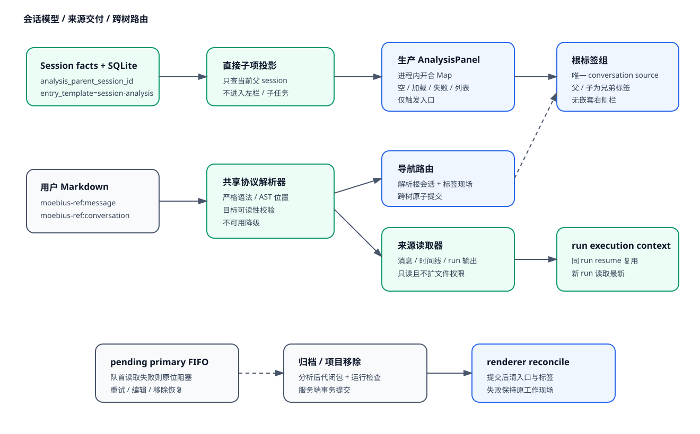
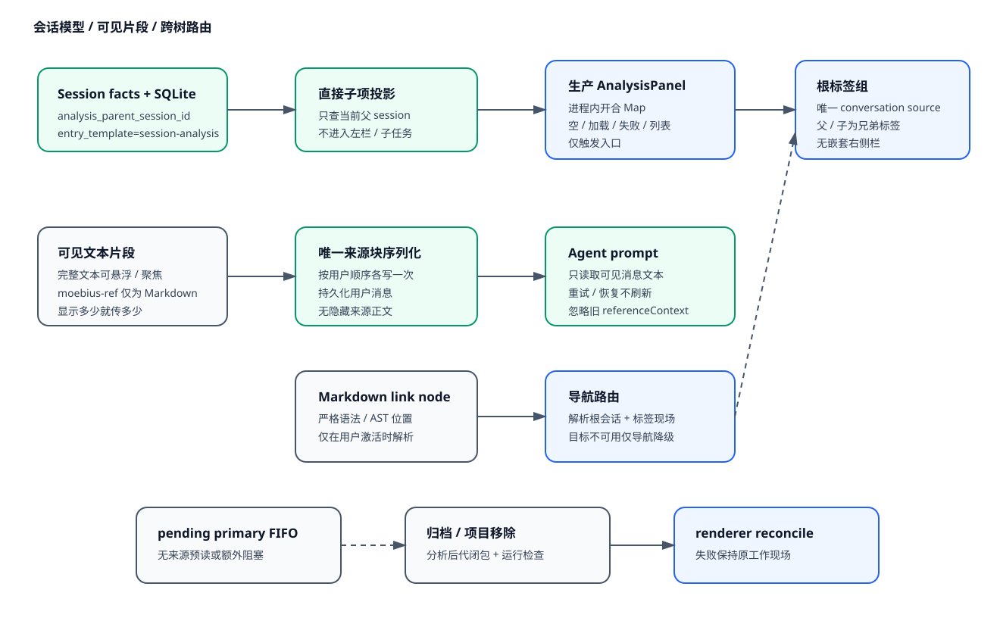

# 设计：session-analysis-visible-fragments

## 方案

保留现有 `serializeTextFragmentReferences` 作为唯一的片段提交边界。每个 `TextFragmentReference.text` 仍由 reference-text API 生成，并在提交时进入用户消息顶部的唯一 Markdown 来源块；已发送消息继续只持久化序列化后的正文，不另外保存胶囊结构。

删除 runtime 在创建分析会话、提交普通消息和 pending 队首发射前调用来源解析器的路径。新建 execution context 不再写入 `referenceContext`；历史 context 在读取归一化时剔除该字段，既不拼入 prompt，也不复制到重试或恢复派生的新 context。

`moebius-ref:` 的解析器与 renderer 导航能力保留；本次只移除 run 输入侧的读取语义。读取完整输出的显式 UI/API 也保留，不受本变更影响。

## 权衡

选择冻结可见文本后，Agent 不会自动获得链接目标后续新增的消息或完整日志。用户若需要更多内容，应重新创建片段、显式粘贴文字或使用已有附件能力。这换来输入范围完全可预期、跨 provider 一致，并从根源上消除隐藏 prompt 膨胀。

不采用按字节截断隐藏来源的方案，因为截断后用户仍无法从胶囊判断实际传输了什么；也不采用点击后再选择展开范围，因为这会引入新的交互与动态引用模型，超出本次已经确认的“显示多少就插入多少”规则。

## 风险

- 旧 execution context 仍可能含 `referenceContext` 字段；通过读取归一化剔除它实现向后兼容，不迁移或重写历史 JSONL，也不让它继续繁殖到新事实。
- 某些既有测试和错误状态依赖来源读取失败；将它们改成导航不可用不阻塞发送的行为测试，SQLite 中旧的 pending source-error 字段暂时保留作兼容读取。
- 回滚时可恢复 runtime 的来源解析调用，但不能只恢复 prompt 拼接而遗漏前置校验，否则会形成不一致的半回滚状态。
