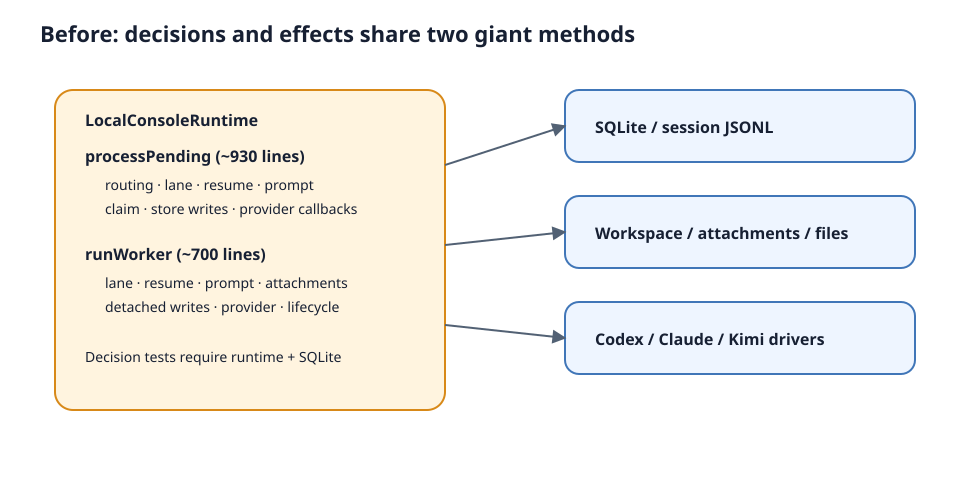

# 设计：extract-local-runtime-decisions-and-enforce-import-boundaries

## 设计目标与不变量

目标不是把 `runtime.ts` 切成更多文件，而是让控制决策在不启动真实 CLI、不创建 SQLite、不读写 JSONL 的条件下可直接验证。实现必须保持以下不变量：

- 消息 claim、事实写入、provider invocation、cursor 推进和失败收敛的相对顺序不变。
- primary 每 session 至多一个，worker 每 `session + role` 至多一个；不同 worker role 可并行。
- 用户直达忙碌 worker 进入同 role FIFO 且不 abort；primary redirect 沿用现有中断与串行规则。
- 同一 Agent identity 的首次 / resume / unavailable 判定继续只由 `execution-context.ts` 负责；不得建立第二套恢复事实。
- full / resume / edit-resend / graceful continuation 的 prompt、timeline delta 与附件范围不变。
- provider ID observation、canonical link、execution link、invocation audit 和 timeline cursor 的提交条件不变。
- 不改公开 API、持久化 schema、错误分类、用户文案或运行参数。

## 现有护栏盘点

### 已有直接纯测试

| 决策 | 当前直接证据 | 结论 |
| --- | --- | --- |
| 用户消息无 mention / 无效 mention / 唯一 mention / 多 mention | `tests/local-console-user-message-routing.test.ts` | 已直接覆盖 composer dispatch，保留 |
| provider identity 首次创建、普通 resume、团队切换、legacy 唯一迁移、冲突 fail-closed、单轮 override | `tests/local-console-execution-context.test.ts` | 已直接覆盖恢复核心，复用，不复制 |
| edit-resend prompt 基础格式 | `tests/local-console-codex-resume.test.ts` | 已有纯断言，保留 |

### 只有重型 runtime / I/O 间接覆盖

| 行为分支 | 当前代表测试 | 缺口 |
| --- | --- | --- |
| primary 无 mention 接单、唯一成员直达、忙碌成员 FIFO、不同 role 并行 | `tests/local-console.test.ts` 的 primary / direct worker / parallel tests | lane 选择和 I/O 接缝绑在一起；多 session 参数组合与已有纯 routing 测试重复 |
| Agent 回复无 mention 的主 Agent 回收、显式 handoff、主 Agent closeout | `tests/local-console.test.ts` 的 handoff / closeout / restart tests | claimed-source 下一动作没有独立纯测试 |
| no-trigger retry 只匹配同 source intent，且不消费错误 intent | `tests/local-console-execution-runtime.test.ts` 的 no-trigger retry tests | `.reverse().find(...)` 规则埋在 runtime；order 组合必须起 server + SQLite |
| primary / worker graceful resume、同 run、同 attempt、同 provider identity | `tests/local-console-codex-resume.test.ts` | 恢复核心已有纯测，但 runtime 的共同输入装配与 prompt 选择重复且只能间接测 |
| full / resume timeline delta、附件范围、write policy | `tests/local-console-execution-runtime.test.ts` | primary 与 worker 各自内联，缺少共享 planner 的对称性证明 |
| provider callback、成功 / 失败终局、cursor、workspace diff、child card | runtime / acceptance tests | 属于 I/O 编排，必须保留最小跨层测试，不迁入纯 planner |
| close / inactive 检查点释放 user-direct claim | `tests/local-console.test.ts` clean-close test、`tests/local-console-codex-resume.test.ts` restart tests | 有端到端覆盖；实现时补一个 planner 输入边界，不为每个 await 点堆重型用例 |

### 当前没有专门测试盯住的分支

生产代码提取前补以下行为基线，均使用内存数据 / fake adapter，不启真实 CLI：

1. claimed Agent source 的动作矩阵：主 Agent无合法 trigger → processed/closeout；专业成员无合法 trigger → 回主 Agent；合法非主 mention → worker redirect；目标 Agent 缺失 → fail。
2. source-scoped retry intent：多 source、多 intent 写入顺序与处理顺序互换时，只选择当前 source 最新未消费 retry intent。
3. worker lane 计划：过滤非 pending / 非 worker / 缺 role 消息；跳过 active role 与已有 lane tail；每个 role 只选择 FIFO 头。
4. 共享 invocation 计划：first、ordinary resume、edit-resend、graceful same-run、unavailable、Codex rollout unavailable 六类输入在 primary / worker 上得到相同 mode / delta / attachment 范围，只有 lane、origin 与 write policy 差异。
5. executing Agent 不在冻结 execution context 时产生确定性 fail 计划，provider 调用次数为零。

“够”的判据：上述矩阵全绿，且至少各保留一个 primary、user-direct worker、agent-handoff worker 的 runtime 接缝测试，证明纯计划确实被 I/O 编排消费。不得用纯测试替掉 provider fact 写入、SQLite/JSONL 原子性或 restart recovery 的唯一集成证据。

## P0：runtime 提纯方案

### 1. claimed-source 与 lane planner

在 `src/local-console/` 新增一个按职责命名的纯模块（实现时以邻近命名为准，预期 `control-dispatch.ts`），输入只包含普通对象、集合和现有 timeline / message types，输出 discriminated union：

- `complete-source`
- `fail-missing-agent`
- `route-primary`
- `schedule-worker`
- `route-without-primary-agent`

同模块提供：

- `selectSourceRetryIntent(...)`：按 source、reason、consumed set 选择 intent，不读取 fact log。
- `planPendingWorkerDispatches(...)`：按 pending messages、active roles、lane tails 产出每 role 的 FIFO candidate，不 claim store。

`processPending` 负责准备输入并执行 union 对应副作用，不再自己重写路由条件。`dispatchPendingWorkerMessages` 只负责读取、claim 和 schedule。

`route-without-primary-agent` 不是普通的“用户没有 mention”分支。正常 HTTP 提交在 Agent
列表为空时会持久化为 `awaiting-team`，不会被 primary claim；该分支只为存量兼容数据保留：
`claimNextPendingMessage` 取得没有 dispatch metadata 的 claimable user source、当前解析到的
Agent 列表为空、因而 `primaryAgent === null` 且 mention trigger 返回 `skip`。只要存在主 Agent，
任意 claimable user source 都直接进入 primary。基线测试必须通过生产 store 构造这条 legacy
source，证明它调用既有 route judgment 且 provider 调用为零；非空 Agent 列表仍不得调用 route
judgment。

### 2. 共享 invocation planner

新增纯模块（预期 `run-invocation-plan.ts`），组合但不替代现有：

- `createRunExecutionContext`
- `planLocalExecutionRecovery`
- `latestAgentTimelineCursor`
- `selectLocalTimelineDelta`
- `buildLocalAgentPrompt` / `buildLocalAgentDeltaPrompt` / `buildLocalResumePrompt`

planner 输入是 runtime 已读取的团队快照、workspace、facts、timeline、policy 与 `codexThreadAvailable` 布尔结果；输出包含：

- 最终 execution context 与 recovery plan
- `continuingSameRun`
- provider mode（full / resume + external id）
- prompt 基础文本与 attachment message indexes
- workspace access
- 是否记录新 execution context / canonical migration / consume intent
- active-run 的 lane / source disposition 结构数据

文件读取、附件复制、Codex rollout 可用性探测、fact 写入和 provider callback 仍留在 runtime。planner 不 import `node:fs`、SQLite store、`execution-driver.ts`、`codex.ts`、`kimi.ts`、`claude.ts` 或 shell adapter；其测试只传值。

### 3. primary / worker I/O 编排

不强行统一两个执行方法为一个新的 God Function。先共享“计划”，再让两条 I/O 编排保留真实差异：

- primary 使用 claimed message 原位流转、analysis gate、primary lifecycle 与 primary response store API。
- worker 区分 `user-direct` / `primary-redirect`、detached persistence、role lane tail 与停止时 release claim。

若提取过程中发现一段代码仍同时需要 store、filesystem、provider callback 和路由判断，则只移动纯判断，不把整段 I/O 包装成所谓 service。完成标准是纯 planner 可以独立测试，不是 `runtime.ts` 达到某个行数。

### 4. 测试剪枝与速度收益

按仓库“即时剪枝”规则只删失去独立价值的重型重复：

- `local-console.test.ts` 中“no mention / invalid / multiple valid mention 都路由 primary”的三 session 组合，已由 `local-console-user-message-routing.test.ts` 完整覆盖决策；保留一个 no-mention primary I/O 接缝和 unique worker 接缝。
- `local-console-execution-runtime.test.ts` 中 no-trigger retry 的 intent/order 参数组合迁到纯 `selectSourceRetryIntent` 测试；保留一个 SQLite + restart / retry 接缝，证明 source link 的持久化与 API 行为。

不得删除 provider fact、restart recovery、store failure 或并发 lane 的唯一集成测试。交付时逐条列出删除/合并内容和“红了代表什么”的替代证据。

性能比较使用相同机器、相同依赖、串行、同一固定文件集合。实现前后各取至少 3 次全绿样本，报告 wall time 中位数、范围、用例数和红样本；不隐藏失败、不使用 `MOEBIUS_TEST_WAIT_SCALE` 美化结果。若固定集合最多执行 8 次仍不足 3 次全绿，则按完整 test name 与失败签名登记 flaky 用例；这些用例不删除、继续留在正常测试与完整闸门中，性能基线改用固定 `--testNamePattern` 排除已登记项的稳定子集，且前后必须使用完全相同的 pattern。稳定子集仍无法取得 3 次全绿时，性能结论记为不确定，净收益按零声明，不临场放宽等待。

性能结果分三层报告：

1. 总降幅：固定集合或已登记稳定子集的前后 wall-time 中位数差，同时报告范围与用例数。
2. 剪枝贡献：剪枝前先采集每个被删除 / 合并重型用例至少 3 次成功执行的 Vitest test-level duration 中位数，再求和；8 次内仍不足 3 个成功样本的候选标为无法可靠计量，并按 0 计，不据此声明收益。
3. 净归因：总降幅减剪枝贡献。wall time 与 test-level duration 的启动开销口径不同，因此这是估算；若估算约等于零或为负，明确报告提纯没有可证明的速度收益，其价值在风险隔离与测试确定性。

动刀前正式基线（2026-08-01）执行 6 次后取得 3 次全绿：run 1 / 2 / 6 均为
107/107，wall time 分别为 30.58s / 30.75s / 30.56s，中位数 30.58s、范围
30.56–30.75s。run 3 / 4 / 5 均只失败同一个既有 flaky 参数用例：
`keeps no-trigger retry source-scoped with intent order ['A','B'] and process order ['A','B']`，
失败签名均为等待 matching system event 8s 超时；因为已经取得 3 次完整全绿，本轮不启用稳定
pattern 降级。剪枝前 test-level duration 中位数为：三 session primary 路由重复用例
408.35ms、A→B source/order 重复参数 312.60ms，预计剪枝贡献合计 720.95ms；B→A
参数保留为 I/O 接缝，其中位数 341.67ms。

实现后三次固定集合均为 105/105 全绿，wall time 为 30.37s / 30.11s / 31.60s，
中位数 30.37s、范围 30.11–31.60s。相对实现前中位数 30.58s，总降幅 0.21s；
剪枝贡献按剪枝前 test-level duration 中位数估算为 0.72095s；两种计时口径不同，
净归因估算为 -0.51095s。因此本 change 不声明提纯带来可证明的净速度收益，其收益是把
路由、lane 与 invocation 决策变成无 CLI / store / filesystem 的确定性测试，并移除一个
已观察到 3 次超时的重复参数组合。

验证中发现一个既有命令入口问题：在当前 pnpm 9.15.4 下，文档写法
`pnpm test --scope <base>` 会被 pnpm 自身解析为未知 option；`pnpm run test --scope <base>`
才会把参数交给 `scripts/test.ts`。初次归档只登记了该问题；A3 复核修正同步更新根
`AGENTS.md`、测试入口注释与内置开发团队指令，避免后续执行者继续使用失效入口。

## P1：import 边界门禁

### A3 复核修正

复核发现 `run-invocation-plan.ts` 直接调用的 `buildLocalResumePrompt` 位于
`codex-resume.ts`，后者同时承担 fact-log 文件读取，导致 planner 的运行时依赖闭包可达
`node:fs/promises`。字符串构造本身是纯函数，本轮把它原样移动到只依赖 timeline type 的
`prompt.ts`，调用方与测试同步改 import，不改变 prompt 文本或 API 参数。

边界检查器增加可选的运行时传递依赖检查：普通静态 import、export-from 与字面量 dynamic
import 形成运行时边；`import type` / type-only export / import type node 不进入运行时闭包。
两个 planner 各有独立 rule id，直接及传递路径均不得到达 `node:fs`、SQLite adapter、
`execution-driver.ts`、Codex/Kimi/Claude provider adapter 或 `node:child_process`。诊断必须给出
完整 dependency path。原交付说明称 25 条 IB，是把 `module-map.md` 第 3 行两处 `[IB:*]`
说明文字误计入；修正前 registry 与真实文档 rule id 均为 23 条，本轮新增两个 planner
closure rule 后为 25 条。

### 检查器形态

- 用 TypeScript parser 读取静态 import、export-from 与字面量 dynamic import；不以正则解析源码。
- 扫描 `src/`、`desktop/src/`、`packages/console-ui/src/` 的 TypeScript 源文件，忽略测试 fixture、生成目录和外部 package。
- 把相对路径与 workspace package import 解析为规范仓库路径；本地 specifier 无法解析时 fail visible。
- 规则是显式 importer scope → denied dependency scope，并支持最窄 allow exception（例如 local-console 可复用 `ceo-orchestration.ts` 的纯 parser，但不得 import runner executor）。
- 违规输出包含 rule id、importer、specifier、resolved target，退出码非零。
- `module-map.md` 的每条原子禁止项标注稳定 `[IB:<id>]` 或 `[NI:<id>]`：`IB` 对应自动 import rule，`NI` 在原条款旁写明不能由 import graph 表达的原因和既有验证责任。
- 结构检查只校验禁止项都有唯一 ID、`IB` 文档 ID 与 rule registry 双向一致、`NI` 原因非空；它不比对条款原文，不冻结措辞，避免文档镜像测试。
- 检查命令作为 `pnpm test` 的 preflight；定向测试仍可直接运行，完整门禁一定执行边界检查。新增命令同步写入根 `AGENTS.md` 与 `module-map.md`。

### MUST NOT 全量映射

下表覆盖 `module-map.md` 当前所有「禁止依赖」小节。`自动`表示 import graph 能判定；`非 import` 表示仍有既有单测、代码审查或运行验收负责，不能谎称被 import checker 覆盖。

| 模块 | 自动 import 规则 | 不能由 import graph 表达的现有条款及原因 |
| --- | --- | --- |
| desktop-shell | 无；该壳层合法装配 runner / observer / local-console，当前条款不能靠目录级 deny 表达 | observer 写接口、资源目录写入、shell 拼接、runner 实例数、双 local server、UI 复制校验规则、移除记录不得改目录均是调用/副作用/语义 |
| console-ui | `[IB:console-ui-no-runtime-internals]` 禁止 runtime/state 内部模块；`[IB:console-ui-no-side-effect-adapters]` 禁止 CLI/shell adapters | “不得复制业务事实”是语义相似性，不是依赖边 |
| local-console | `[IB:local-console-no-github-runtime]` 禁止 GitHub client/intake/runner、artifact publisher 与 GitHub executor；`[IB:local-control-planner-pure-closure]` 与 `[IB:local-invocation-planner-pure-closure]` 禁止两个 planner 直接或经运行时传递路径到达 fs/SQLite/provider/driver adapters；`ceo-orchestration.ts` 纯 parser 保持可复用 | 不得修改其他域规则、启动 heartbeat、镜像 SQLite、恢复 formal acceptance 等是运行语义/数据写入 |
| agents | 无 TypeScript import 图 | Markdown 不得依赖运行状态、token、脚本输出属于素材内容审查 |
| stages | `[IB:stages-no-side-effect-adapters]` 禁止 GitHub/Codex/fs adapters | runner 状态与 stage 白名单复制属于数据/重复事实检测 |
| ceo-format-guardrail | `[IB:ceo-format-no-github-adapter]` 禁止 GitHub client；Codex、文件读取、stages、conversation 与 ceo-scripts 是合法依赖 | state 写入、role thread 复用、规则硬编码、fail-open 是调用时行为 |
| ceo-scripts | `[IB:ceo-scripts-no-provider-adapters]` 禁止 GitHub/Codex adapters | 只读文件与“不得作为可 mention agent”是文件操作/注册语义 |
| ceo-orchestration | `[IB:ceo-orchestration-no-side-effect-adapters]` 禁止 GitHub/Codex、Node fs/child_process | “不得直接持久化”仍可能经注入函数发生，需行为审查 |
| triggers | `[IB:triggers-no-side-effect-adapters]` 禁止 GitHub/Codex 与 Node fs | shell 拼接与复制业务规则是语义 |
| agent-prescripts | 无；该模块合法执行受信任 registry 脚本，无法用目录级 deny 区分输入来源 | 任意脚本路径、shell 拼接、写 `agents/` 是参数与副作用 |
| github-response-intake | `[IB:response-intake-no-side-effect-adapters]` 禁止 GitHub/Codex/fs adapters | agent 文件、prompt 与 issue 内容拼 shell 是内容/数据流 |
| driver-pool | `[IB:driver-pool-no-side-effect-adapters]` 禁止 GitHub/Codex/fs adapters | `.state`、issue domain、prompt 与 trigger 理解是内容/语义边界 |
| local-config | `[IB:local-config-no-provider-adapters]` 禁止 GitHub/Codex adapters | 读取 issue、保存 token/状态是数据内容 |
| observer | `[IB:observer-no-main-chain-dependents]` 禁止主链反向 import；`[IB:observer-no-write-adapters]` 禁止 GitHub/Codex/artifact/child-process adapters | 文件只读与不得提供操作 API 是 HTTP/API 行为 |
| github-issue-runner | `[IB:runner-no-reverse-dependencies]` 禁止 goal-ledger、conversation、response-intake、driver-pool、triggers、observer 反向 import `src/runner*` | agents 不作状态、shell 拼接、失败不评论、不得复制业务事实是运行语义 |
| intake-scanner | `[IB:scanner-no-codex-adapter]` 禁止 Codex adapter | 不得触发处理、只经 applyState 变更是控制流 |
| issue-dispatcher | `[IB:dispatcher-no-side-effect-adapters]` 禁止 GitHub/Codex/fs adapters | “不得理解”trigger、prompt、Codex 参数是语义，注入 runJob 由测试保证 |
| state-persister | `[IB:state-persister-no-domain-adapters]` 禁止 GitHub/Codex/triggers | 是否主动读文件是调用方向，不是单纯 import |
| conversation-protocol | `[IB:conversation-no-side-effect-adapters]` 禁止 GitHub/Codex/fs adapters | issue 内容拼 shell 是数据流 |
| issue-media | `[IB:issue-media-no-side-effect-adapters]` 禁止 GitHub/Codex/fs adapters | global `fetch`、shell 拼接与状态推进无法只看 import 完整判断 |
| media-assets | `[IB:media-assets-no-codex-adapter]` 禁止 Codex adapter | 写入目标、提交产物、URL 拼 shell 是路径/副作用 |
| conversation-interrupt | `[IB:conversation-interrupt-no-side-effect-adapters]` 禁止 GitHub/Codex/fs adapters | driver shape、issue 解析与 prompt 构造属于 API/内容语义 |
| local-script-executor | 无额外 deny；它合法 import child_process/Codex 运行依赖 | 不执行 issue 命令、日志脱敏是 taint / runtime 行为 |
| goal-ledger | `[IB:goal-ledger-no-side-effect-adapters]` 禁止纯模型依赖 GitHub/Codex/fs/child_process；`[IB:goal-ledger-state-no-provider-adapters]` 禁止 state adapter 依赖 GitHub/Codex | 存放路径、run manifest 真相地位、observer 写入口与“隐式依赖”是数据流/装配语义 |
| role-thread-state | 不需要额外跨模块 deny | 存放路径及不得保存 token/prompt/log 是数据内容 |
| agent-context-state | 不需要额外跨模块 deny | 存放路径及不得保存 token/prompt/log 是数据内容 |
| github-intake-state | 不需要额外跨模块 deny | 存放路径及不得保存 token/body/log 是数据内容 |
| github-client | 无额外 deny；它合法依赖 child_process | shell 字符串、stdin body、枚举参数、asset 清洗、无自动重试都是调用参数/策略 |

每个 `[IB:*]` 都必须在规则 registry 中双向匹配；共享 evaluator 覆盖正例、违规边、窄例外、未解析路径、多违规与非字面量 dynamic import，真实仓库提供全 registry 绿例，并以一条真实违规 import 提供反证。标为“非 import”的条款不得为了凑覆盖而写脆弱源码关键字测试。

### 反向证明

实现后临时在受保护模块中加入一条真实违规 import（优先在 `packages/console-ui/src` 引入 `src/local-console/runtime.ts`）：

1. 运行边界检查，必须非零退出并精确报告 importer、target、rule id。
2. 用 `apply_patch` 撤销临时违规。
3. 再运行同一检查，必须退出 0。
4. 只保存命令、退出码和脱敏诊断摘要到系统临时目录；仓库不保留故意违规代码。

## 验证与交付

### 自动验证

1. 动刀前：新增基线纯测试并运行相关固定集合，取得可重复全绿样本。
2. 每个提取步骤后：运行新增 planner 单测和相关 runtime 接缝测试。
3. 收口：`pnpm run test --scope <implementation-base>`、`pnpm typecheck`，以及受影响构建（若 test runner / workspace 配置变化触发）。
4. 交付前只运行一次完整 `pnpm test`；退出码 75 只表示未取得锁，必须重跑，不能报绿。
5. 执行 import 违规反证并撤销。
6. 用同一固定测试命令采集实现后 3 次全绿 wall time，与实现前基线比较。

### 真实运行验收语句

虽然没有新增 UI，local runtime 是用户可见操作的执行链。交付给 `@qa` 的真实应用复核至少包括：

- 从主对话发送无 mention 消息，断言只有主 Agent run 启动并正常收尾。
- 主 Agent 忙碌时发送唯一 `@专业成员` 消息，断言专业 lane 可并行；同角色第二条只排队且不 abort 首条。
- 专业成员无 mention 回复后，断言控制权回到主 Agent；主 Agent 无 mention 回复后 `hasPendingControlWork` 收敛为 false。
- 对已有 provider session 执行 retry / 下一轮，断言同一 external ID resume，失败时不产生 replacement full session。

这些只复核现有行为，没有新的页面或用户动作验收标准。

## 权衡

- 选择按控制用例纵切，而不是把 runtime 按行数机械分成 `runtime-a/b`，因为可独立测试的 decision boundary 才能降低变更风险。
- 选择复用 `execution-context.ts`，不建立“更方便”的第二套 resume planner，避免 provider identity 多事实源。
- 选择静态 import graph 门禁，不尝试用一个检查器解决 shell taint、文件写入、token 内容和业务规则复制；后者逐条显式留在人工/行为验证范围。
- 选择保留最小 I/O 接缝并剪掉重复参数化重测，目标是降低串行全量税，不以测试数量或覆盖率为目标。

## 风险与回滚

- 最大风险是提取时改变副作用顺序。用动刀前基线、discriminated plan、最小提交步和现有 restart/store-failure 测试约束；出现语义差异时回退当前提取步，不顺手修行为。
- import 规则可能误伤合法纯 parser 复用。只接受精确文件级 allow exception，不放宽整个目录。
- 静态解析可能漏掉非字面量动态加载。仓库运行时代码不应使用非字面量本地模块加载；遇到时检查器 fail visible 并由主理人裁决，不静默跳过。
- 当前重型集合已有时序红样本。先把重复决策搬到纯测并保留接缝；如果唯一集成行为仍红，作为既有问题单独报告，不在本 refactor 中改语义。
- 回滚以阶段为单位：纯 planner 与 runtime 调用点同一提交步；边界检查器与 test gate 接入同一提交步，避免留下半接线状态。
