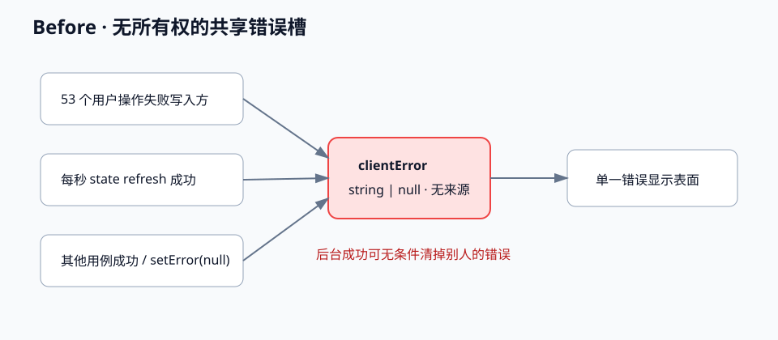
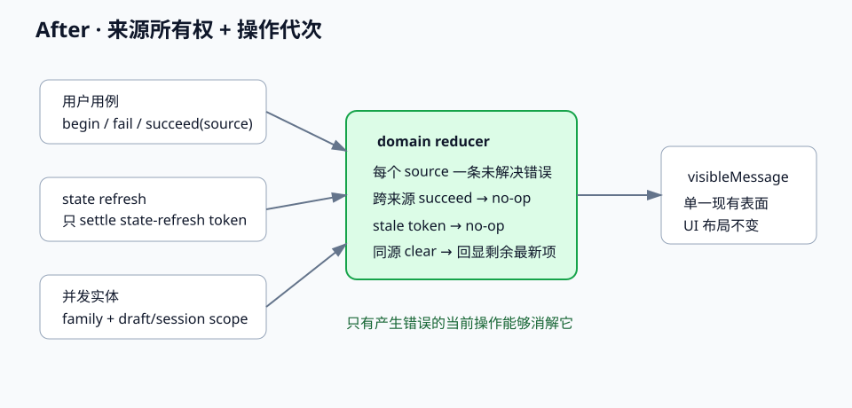

# 设计：console-error-visibility

## 1. 问题与成功判据

这是 **C 型退化**：多个独立用例共享一个无所有权的 `string | null`，后台轮询与其他用例都能清除
自己没有产生的错误。变化理由不是“附件文案”，而是错误的发布、同源恢复、跨来源隔离和迟到结果
四种独立状态规则。

成功判据：

1. 周期性 state refresh 成功只能消解 state-refresh 自己发布的错误；
2. 一处用户操作失败后，其他来源成功不得清除它；
3. 同源下一次成功可以消解旧错误，同源新失败可以替换旧错误；
4. 同源旧操作迟到成功或失败不得覆盖较新的结果；
5. 页面仍只呈现一个当前错误，不新增通知中心、TTL、toast 队列或局部附件特例；
6. `fileDebt=0`、`dependencyDebt=0`、permit 193、composition root 9 不变。



现状基线引用 `docs/architecture/four-layer-runtime.svg`；本图只放大 desktop renderer 内部错误数据流。

## 2. 来源扫描与最小验证

### 2.1 仓库内证据

- `refresh-console-state.ts` 成功路径无条件 `setError(null)`；`use-console-state-sync.ts` 每秒调用一次；
- `desktop/src/console-page/` 有 53 个非 null 写入调用和 23 个除 refresh 外的 null 清除调用，分布在
  refresh/acknowledgement、desktop shell、附件、会话运行、消息、项目、分析、搜索、团队等用例；
- `clientError` 由 `use-desktop-shell-actions.ts` 持有，`app.tsx` 把同一个 setter 传给各用例；
- RA-16 已在真实 Desktop 复现：具体附件错误约一秒后消失，必须用 `MutationObserver` 才能读取；
- 现有 `ConsoleStateCoordinator`、attachment generation、request controller 已证明仓库接受“操作 token +
  stale 结果忽略”模式，可复用而不引入依赖。

### 2.2 护栏先行

实现的第一个生产提交之前，先建立纯状态模型测试与 controller 测试，证明以下当前会失败的行为：

- refresh 成功不会清除 project/attachment 等另一来源错误；
- project 成功不会清除 attachment 错误；
- 同源重试成功清除本源错误；
- 慢旧请求在新请求失败或成功后返回时不改写当前错误；
- 父级重渲染与 callback 身份变化后，慢结果仍提交到最新 controller。

这些测试只断言状态和页面外部行为，不读取生产源码或冻结调用点清单。

## 3. 现有方案调研与候选取舍

### 候选 0：维持现状或延长 TTL

不采用。维持现状让 53 个错误路径继续不可读；TTL 只把错误被错误来源清除的时点推迟，无法定义所有权，
也会引入真实等待测试。

### 候选 A：只把附件失败放进 composer

不采用。它只解决 RA-16 暴露的一个入口，剩余项目、会话、分析、团队等写入方仍受影响，并制造两套
错误生命周期。

### 候选 B：给 state refresh 单独增加一个 error slot

不采用。它能阻止轮询清除用户错误，但其余 23 个成功清除仍可跨用例抹掉错误，无法通过“另一来源成功
不得清除”的验收。

### 候选 C：单一可见表面 + 来源所有权 + 操作代次（采用）

保留页面当前单一 `lastError` 表面，在 desktop application/domain 内把字符串槽升级为带来源和操作代次的
状态。失败只能由当前操作发布；成功只能清除同来源当前操作；其他来源成功与 stale 操作均为 no-op。

采用理由：同时覆盖 53 个写入方，不改 UI 布局，不依赖计时器，也不要求各组件拥有私有 error state。

## 4. 状态模型与职责

### 4.1 Domain：纯错误所有权模型

新增 `desktop/src/console-page/console-error-model.ts`，登记为 domain：

```ts
type ConsoleErrorSourceFamily =
  | "state-refresh" | "result-acknowledgement" | "desktop-shell"
  | "attachment" | "process-data" | "analysis" | "conversation"
  | "sidebar-message" | "sidebar-draft" | "session-run"
  | "project" | "search-navigation" | "new-conversation" | "edit-resend";

interface ConsoleErrorSource { family: ConsoleErrorSourceFamily; scope?: string }
interface ConsoleErrorOperation { sourceKey: string; generation: number }
interface ConsoleErrorState {
  unresolvedBySource: Readonly<Record<string, {
    operation: ConsoleErrorOperation;
    message: string;
    publishedSequence: number;
  }>>;
  latestGenerationBySource: Readonly<Record<string, number>>;
}
```

纯 reducer 接收 `begin / fail / succeed` intent：

- `begin` 只推进该 source 的 generation，旧错误继续可读；
- `fail` 仅在 token 仍是该 source 最新操作时发布，并替换该 source 当前唯一未解决错误；
- `succeed` 仅在 token 最新时清除同 source 的未解决错误；
- stale token 和其他 source 的成功保持状态不变。

每个 source 最多保留一条未解决错误，状态大小受 source 数量约束，不保存无上限时间序列。可见错误从
`unresolvedBySource` 中选择 `publishedSequence` 最大的一条；当前 source 成功后，如果还有其他未解决错误，
重新显示其中最新的一条。view 仍只接收一个字符串。

不同实体可能并发的附件、session、project 使用 `scope`（draft/session/project id）；scope 只参与内部所有权，
不进入文案、DOM、日志或持久化。

### 4.2 Application：稳定 controller

新增 `use-console-error-state.ts`，用 reducer 和递增 ref 暴露稳定 controller：

- `begin(source) -> operation`；
- `fail(operation, message)`；
- `succeed(operation)`；
- `report(source, message)` 仅供无异步等待的同步拒绝，内部等价于 begin + fail；
- `visibleMessage` 由未解决 source 集合中最新一条派生，供现有 presentation 使用。

controller 使用 ref 读取最新状态，不因父级重渲染或 callback identity 变化变旧。它不翻译、不判断业务错误，
只落实所有权。

### 4.3 用例迁移

把当前字符串 setter 按 22 个承载文件迁为 source-aware controller：

| source family | 代表入口 | 清除条件 |
| --- | --- | --- |
| state-refresh / result-acknowledgement | `refresh-console-state.ts`、`use-console-state-sync.ts` | 本次 refresh/ack 成功 |
| attachment / process-data | 附件草稿、过程输出 | 同 draft/tab 的重试或读取成功 |
| conversation / session-run | 创建、发送、运行操作、切换 | 同 session/action 成功 |
| project / search-navigation | 项目 mutation、文件夹选择、搜索打开 | 同 project/query action 成功 |
| analysis / sidebar-* | 分析导航、sidebar draft/message | 同 host/draft/message action 成功 |
| desktop-shell / new-conversation / edit-resend | shell action、新会话、改写重发 | 同用例下一次成功 |

每个异步用例在发起 I/O 前取得 token，并在现有 stale/abort/selection guard 之后才 settle。同步 availability 拒绝
使用 `report`。不得把 raw `setClientError(string|null)` 继续穿透 controller 树。

### 4.4 View 与 composition root

`OperatorConsole` 的 props 和布局不变；`lastError` 继续只接收一个字符串。`app.tsx` 只把现有
`setClientError` 接缝换成 error controller bundle，不在 root 拼来源表；逻辑行必须继续 ≤300。



## 5. 失败、并发与恢复

- source A 失败后，任意次数 state refresh 成功不能清除 A；
- source B 成功只 settle B，不能清除 A；B 失败时 B 成为最新可见错误；
- A 失败 → B 失败 → B 成功后，A 重新成为可见错误；随后 A 成功才清空；
- A 的下一次操作开始时保留旧 A 错误，直到新 A 成功清除或失败替换，避免重试期间空白；
- A1 慢请求后于 A2 返回时，A1 的 succeed/fail 都因 generation stale 被忽略；
- abort、selection mutation 失效与组件卸载沿用现有 guard，不得借错误 controller 恢复 stale 结果；
- 初次 state load 失败仍把项目列表置为 error；state-refresh 后续成功只清自己的错误。

## 6. 层边界与改动预算

- domain 模型无 React、fetch、Electron、timer、locale 或具体 adapter 依赖；
- application controller 不新增 composition root，不新增 condition permit；
- view/console-ui 不拥有错误规则，adapter 不判断错误来源；
- 预计修改 22 个既有承载文件、新增 2 个模块及测试，生产 diff 约 350–650 行；
- `app.tsx` 当前 262 逻辑行，目标保持 ≤285，硬门禁仍为 300；
- `fileDebt=0`、`dependencyDebt=0`、permit 193、roots 9 任一变化即停止并回主理人。

## 7. 测试与验收

### 7.1 自动化

1. 纯 reducer：跨来源隔离、同源成功/失败、错误遮蔽恢复、stale token、scope 隔离；
2. error hook：父级重渲染、controller/callback identity 变化、慢结果；
3. state sync：连续三个成功 poll 不清 operation error；refresh 自身失败后成功会清；
4. project/attachment/session/analysis 四类 controller 各取一条失败→无关成功→同源恢复；
5. presentation：初始加载失败和已有 state 下错误都保持当前外部显示契约；
6. `pnpm run test --scope 47f2031`、boundaries、typecheck、desktop build；完整闸门只在复核后合并点运行。

不新增真实等待；轮询测试使用 fake timer 或直接调用 tick。旧测试若只冻结 `setError(null)` 调用位置而失义，
必须逐 test-name 说明接管行为后再删除，默认测试净删除 0。

### 7.2 真实 Desktop

- 制造一个共享槽错误后等待至少三个 1 秒 poll，错误仍可读；
- 在该错误存在时完成另一来源成功动作，错误仍在；
- 重试同一来源并成功后错误消失；
- 中英文各触发一次附件/项目失败，文案与当前 locale 一致且无需 MutationObserver 才能读到。

## 8. 事实源与回滚

行为增量落在 `spec-delta/desktop-shell/spec.md`；无 PRD、wireframe 或 console-ui API 变化。实现验证后归档时合并
desktop-shell spec，并把 after 图回流 `docs/architecture/console-error-ownership.svg` 与 module map。

回滚以 source 迁移段为单位；纯模型与测试先行。不得回滚到 TTL、附件特例或 refresh-only slot。
