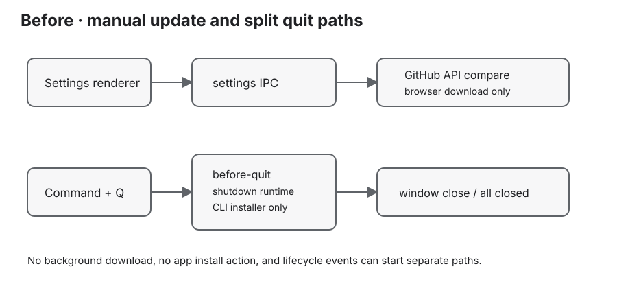
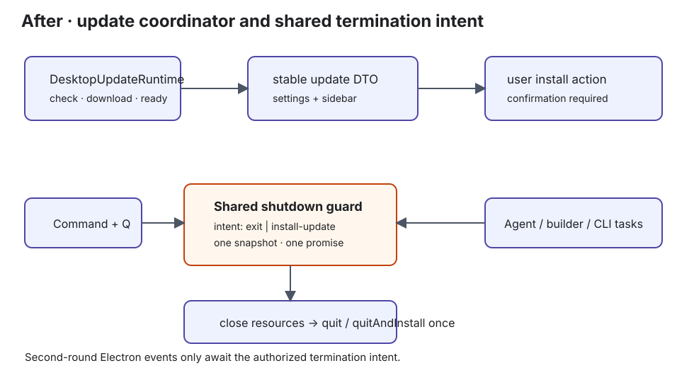

# 设计：desktop-auto-update-and-shutdown-guard

## 方案

现状与目标架构快照：





## 现有方案调研

- 候选 1：`electron-updater` + `electron-builder` GitHub provider（[electron-builder Auto Update](https://www.electron.build/docs/features/auto-update/)、[publish 配置](https://www.electron.build/publish/)）——采用。与仓库现有依赖和 `publish.github` 配置直接契合，能消费 macOS `latest-mac.yml`，允许关闭退出时自动安装并由 Moebius 自己控制确认弹窗、任务收尾和 `quitAndInstall()`。
- 候选 2：Electron 官方 `update-electron-app` + `update.electronjs.org`（[Electron Updating Applications](https://www.electronjs.org/docs/latest/tutorial/updates)）——不采用。启动和定时检查、后台下载的默认体验匹配目标，但默认 native dialog 不足以表达 Moebius 的侧栏就绪按钮、两个独立保护弹窗和共享任务收尾；迁移到另一套服务也没有必要。
- 基线候选（维持现状）：手动 GitHub API 检查后打开 Release 浏览器页——不采用。无需新增运行时复杂度，但无法满足自动下载、应用内就绪入口和一键重启安装，并继续保留一次 `Command + Q` 的生命周期缺陷。
- 最小验证：已静态核对仓库现有 `electron-updater` 依赖、GitHub publish 配置、macOS arm64 DMG/ZIP targets 与当前手动 updater；官方文档确认 macOS 自动更新依赖 ZIP 和 `latest-mac.yml`，并支持自动下载/手动安装边界。方案阶段不启动当前应用、不执行安装；实现阶段以隔离包态实例和 release metadata 校验补足运行验证。
- 结论：采用候选 1；保留当前 Release 浏览器页作为自动更新不可用或下载失败时的显式兜底。

### 1. 更新运行时与发布链路

正式桌面包继续由 `electron-builder` 生成 macOS `arm64` DMG/ZIP。发布配置使用 GitHub provider，发布收尾必须确认 ZIP 内的 `.app` 已签名、公证并 stapled，且最终 ZIP 与 `latest-mac.yml`、对应 blockmap/签名元数据来自同一版本和同一 ZIP；不能用未签名或未公证的中间文件生成更新元数据。`pnpm release:validate-update` 负责本地发布目录和远端 Release 的显式白名单及 YML→最终 ZIP 版本、文件名、大小、SHA-512 校验。

主进程新增一个窄的 `DesktopUpdateRuntime`（名称以实现时真实模块为准），只在 `app.isPackaged && process.platform === "darwin" && process.arch === "arm64"` 时启用自动更新器：

- 启动后执行一次受控检查；用户可手动“立即检查”，两者共享单飞闸门。本 change 不增加运行期间的周期调度。
- 将 `checking`、`update-available`、`download-progress`、`update-downloaded`、`error` 和 `up-to-date` 投影为不含原始异常、绝对路径或 Release 响应正文的稳定 DTO。
- 打开 `autoDownload`，关闭 `autoInstallOnAppQuit`；只在 `update-downloaded` 之后把包标记为 `ready-to-install`，此事件视为上游完整下载和校验已通过。
- 就绪 marker 只在 marker 版本不同于当前应用版本时恢复；更新已安装后再次启动若 marker 已等于当前版本，必须清除 marker 并重新检查，不能把当前版本误显示为待安装更新。
- `available`/`downloading`/`installing` 状态拒绝第二次手动检查。`quitAndInstall()` 调用后由有界退出看门狗确认进程确实离开；若进程未退出，保留就绪 marker，回到可重试失败状态并恢复本地 console/退出协调器，避免留下“窗口仍在但功能已关闭”的僵尸应用。
- `quitAndInstall()` 只能从用户确认且安全收尾完成的 `install-update` 意图调用一次。检查、下载和就绪过程绝不调用浏览器、`app.quit()` 或安装动作。
- 自动更新器不可用、元数据非法、网络失败、下载失败或当前是开发态时，保留手动检查和 Release 浏览器下载兜底；不得把失败表示成已是最新版，也不得在失败状态显示安装按钮。

更新事件流：

```text
app ready
   │
   ▼
DesktopUpdateRuntime ── check ──► latest / available
   │                                  │
   │                                  ▼
   └──────── error ◄──── download ◄── autoDownload
                                      │
                                      ▼
                               ready-to-install
                                      │
                   sidebar user action only
                                      ▼
                             install confirmation
```

### 2. Renderer 状态与 UI

更新状态规则留在纯 `settings-state`/更新状态模块，组件只做状态到显示的映射。建议状态至少区分：`idle`、`checking`、`latest`、`available`、`downloading`、`ready`、`failed`、`installing`；下载进度必须是有界数值，进度回退、非法百分比和迟到事件不得覆盖较新的终态。

`SettingsDialog` 的关于区：

- `checking`：显示正在检查并禁用重复检查。
- `available/downloading`：显示版本与下载进度，不显示安装按钮。
- `ready`：显示已准备好，并提示安装入口位于侧栏；设置不渲染安装按钮。
- `failed`：显示检查/下载失败、重试或重新下载，并保留浏览器 Release 页兜底。
- `installing`：显示“正在准备安装…”；侧栏安装按钮和确认流程禁用。

`OperatorConsole` 侧栏底部保持“重新查看引导”在上、“设置”在下；设置行内部改为同级横向操作组。只有 `ready` 暴露“安装更新”，检查中、下载中、失败、最新版和未知状态都不渲染该按钮。更新完成不进入 `settingsNotifications`，因此不会出现右下角通知。

侧栏“安装更新”调用上层 `requestUpdateInstall()`；设置只消费更新状态，不提供安装入口。组件不调用 Electron API、不读取任务内部状态、不复制 shutdown 规则。

### 2.1 普通重启恢复已就绪更新

`ready-to-install` 不是只存在于当前 renderer 会话的瞬时状态。更新器缓存的完整安装包、版本身份和可安装元数据必须在普通应用重启后可被主进程重新识别；启动恢复时直接广播 `ready`，不得重新下载完整包。设置“关于”恢复“已准备好”状态，侧栏重新显示“安装更新”。若缓存校验失败，才回到失败/可重试状态并隐藏安装按钮。

### 3. 两个独立弹窗，共享一个保护协调器

共享协调器的输入是安装/退出意图和当前任务快照，任务快照至少覆盖：

- local console 中仍在运行的 provider/Agent runs；
- AI 建队或其他桌面主进程托管的 Agent turn；
- Codex、Claude Code、Kimi CLI 安装/更新管道。

普通退出的确认弹窗和更新安装的确认弹窗是两个不同的 presenter/文案契约：

```text
普通退出，无运行任务       普通退出，有运行任务
┌ 退出 Moebius？ ┐          ┌ 仍有任务正在运行 ┐
│ [取消] [退出]  │          │ [继续工作]       │
└────────────────┘          │ [停止任务并退出] │
                            └──────────────────┘

更新安装，无运行任务       更新安装，有运行任务
┌ 安装 Moebius vX？ ┐       ┌ 重启安装 Moebius vX？ ┐
│ 应用将关闭并重新打开 │     │ 当前任务将被停止，记录保留 │
│ [取消] [重启并安装]  │     │ [继续工作] [停止任务并重启安装] │
└────────────────────┘     └──────────────────────────┘
```

这里的“独立”指弹窗标题、说明、按钮和返回语义独立；任务探测、停止、等待 close、失败保护和资源清理仍是同一协调边界。安装路径不得先显示普通退出弹窗再叠加安装弹窗。

### 4. 单次退出生命周期

`DesktopShutdownRuntime` 不再只以 `isQuitting` 延迟表示意图，而是维护显式的一次性终止意图：`none | exit | install-update`，并缓存一个共享的协调/收尾 Promise。第一次收到 `before-quit`、窗口关闭或安装确认时先登记意图并立即阻止重复路径；后续 Electron 事件只等待相同 Promise。

收尾顺序固定为：

1. 若任务快照非空，展示与意图匹配的独立确认弹窗；若任务快照为空，普通退出不展示确认并直接继续安全收尾。
2. 用户确认停止任务后，等待所有已启动子进程/运行 close；任一回收未确认则保持应用打开并报告脱敏失败。
3. 关闭 local console 与 SQLite worker，确认资源关闭。
4. `exit` 意图调用一次 `app.quit()`；`install-update` 意图调用一次 `autoUpdater.quitAndInstall()`。
5. 由最终退出引起的第二轮 Electron 生命周期事件全部识别为已授权终止，不再启动新的对话、清理或退出请求。

主窗口 `close`、`window-all-closed` 与 `before-quit` 只向该协调器报告事件；`window-all-closed` 在已有终止意图时不得另起请求。这样一次 `Command + Q` 的可观察结果是：无任务时一次按键 → 无确认 → 一次安全收尾；有任务时一次按键 → 一次退出保护确认 → 一次安全收尾。最终进程结束、Dock 不再显示运行中指示；未固定应用时图标消失。

### 5. 测试与真实运行证据

纯逻辑单测覆盖：

- 更新状态顺序、重复检查/下载、迟到事件、进度边界、失败重试和 `ready` 门禁；
- 包态/开发态/平台架构更新策略和发布元数据决策；
- 普通退出与安装退出两个 dialog presenter 的内容和分支；
- 已就绪更新跨普通重启恢复且不重新下载完整包；
- 无任务、有任务取消、有任务确认、停止失败、并发请求、一次性终止意图；
- Electron 事件顺序 `before-quit → close → window-all-closed → before-quit` 不产生第二次用户动作或重复最终调用。

真实应用验收必须在隔离的临时数据根和独立构建/测试应用上完成，不能对当前承载会话执行 `Command + Q`、`app.quit`、kill、重启或安装。验收观察以页面 DOM/ARIA 文本、更新器事件计数、退出码、进程树和系统临时 evidence JSON 为准；只有视觉布局无法由文本断言覆盖时才保留截图。

## 权衡

- 选择 `electron-updater` 而非自研下载/覆盖安装：复用 GitHub provider、签名元数据和 macOS 安装流程，代价是发布必须严格生成并同步维护 `latest-mac.yml` 等产物。
- 选择启动自动检查与手动立即检查，不增加运行期间周期调度或用户开关：满足当前“自动检查/自动下载”的最小产品目标，避免引入未定义的更新策略。
- 选择“侧栏就绪按钮 + 设置状态展示”，不使用通知：安装动作可持续发现且不打断工作；代价是用户需要看到侧栏才能触发安装，按钮必须提供清楚的可访问名称。
- 选择两个独立弹窗而不是一个动态通用弹窗：普通退出和重启安装的后果清楚，避免把“退出”误认为“安装”；代价是需要维护两套文案和本地化测试。
- 选择显式终止意图和共享 Promise：解决 Electron 多事件竞态并保证资源只清理一次；代价是生命周期模块需要覆盖更多事件序列，不能再依赖一个布尔值隐式推断。

## 风险

- GitHub Release 缺少最终签名或元数据时，自动下载不可用；实现必须 fail closed，并保留浏览器下载兜底，发布门禁必须先阻止不完整 Release。
- `electron-updater` 的 `quitAndInstall()` 由安装器触发第二轮 app 生命周期；若终止意图未在第一次拦截时登记，可能重新弹出退出保护或留下 Dock 图标，需用事件序列单测和隔离真实实例验收。
- local Agent/provider 的停止能力可能存在迟到 close 或不可确认回收；任何不确定都必须保持应用打开，不得为了安装强行丢弃运行记录或留下孤儿进程。
- 更新状态从主进程广播到设置和侧栏时可能遇到父级重渲染、回调身份变化和迟到事件；必须用可控异步测试覆盖这些环境假设。
