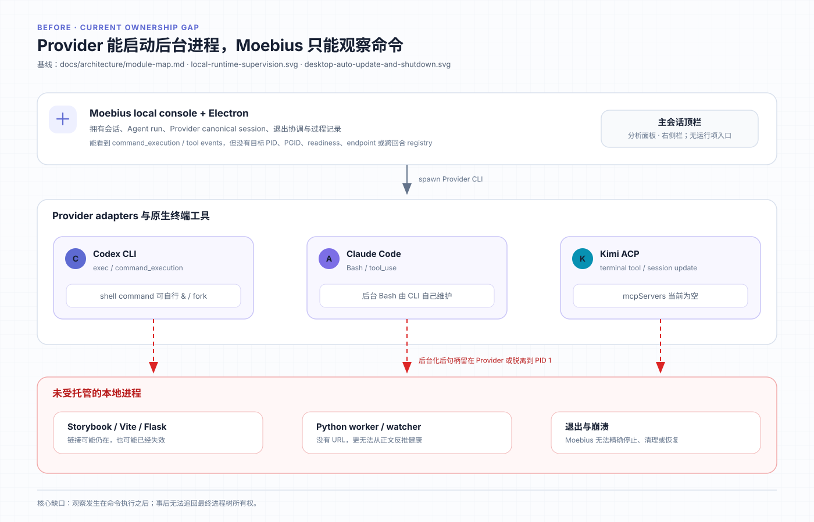
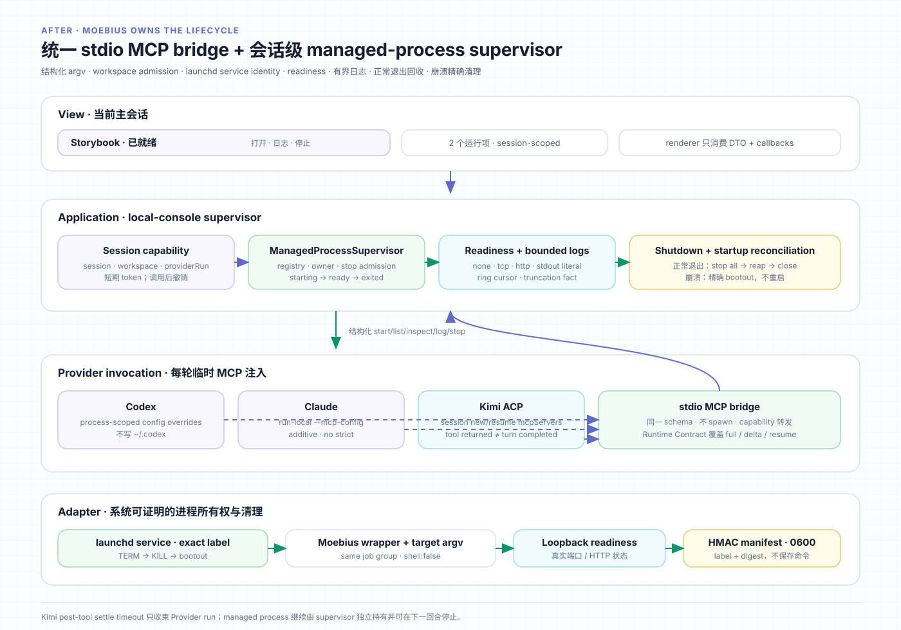

# 设计：add-managed-process-runtime

## 方案





架构基线引用 `docs/architecture/module-map.md` 中 `local-console`、`provider-adapters`、`desktop-shell` 与 `console-ui`，以及 `docs/architecture/local-runtime-supervision.svg`、`docs/architecture/desktop-auto-update-and-shutdown.svg`。本 change 的 after 图在归档时回流为 `docs/architecture/managed-process-runtime.svg`。

### 1. 领域契约与状态机

新增不依赖 UI、fs、SQLite、HTTP、Provider 或 child process 的纯模块，集中定义命令校验后的 DTO、状态转换与 UI intent：

```ts
type ManagedProcessKind = "service" | "task" | "watcher";

type ManagedProcessReadiness =
  | { type: "none" }
  | { type: "tcp"; host: "127.0.0.1" | "localhost"; port: number }
  | { type: "http"; url: string; expectedStatus?: number }
  | { type: "stdout-contains"; text: string };

type ManagedProcessStartRequest = {
  kind: ManagedProcessKind;
  label: string;
  executable: string;
  args: string[];
  cwd?: string; // workspace-relative; default "."
  readiness?: ManagedProcessReadiness;
  endpoint?: { url: string };
};

type ManagedProcessStatus =
  | "starting"
  | "running"
  | "ready"
  | "unhealthy"
  | "stopping"
  | "exited";
```

`kind` 是用户监督语义，不改变启动权限：

- `service` 没有预期自然终点，通常提供 endpoint/readiness，由用户或退出流程停止，例如 Storybook、Vite、Flask。
- `watcher` 没有预期自然终点，等待文件或队列事件且通常没有 endpoint，例如编译 watch、队列 worker。
- `task` 有自然终点，但用户明确要求它跨当前 Provider invocation 继续执行或在面板持续监督，例如长时间训练或批处理。运行时间长短本身不把命令变成 `task`。
- 预期在当前 Provider 原生工具调用内结束、结果立即被 Agent 消费的 Python、测试、构建仍是普通前台命令，即使运行数分钟；不得用 managed `task` 规避 Provider 工具时限。意图不明确时保持前台，不自行后台化。

公开请求没有 `sessionId`、`workspacePath`、`pid`、`pgid`、shell、env 或 capability 字段。bridge 的受信任调用上下文绑定 `sessionId + workspaceIdentity + workspaceRoot + providerRunId`，supervisor 从服务端会话事实解析当前工作空间，再决定 admission。Agent 不能通过参数把运行项挂到别的会话或扩大文件系统边界。

纯 admission 规则：

- `label` 去除首尾空白后 1–80 个 Unicode 字符；控制字符拒绝。
- `executable` 是单个可执行名称，不含 `/`、`\\`、NUL 或 shell 元字符；由 supervisor 使用当前受信任 PATH 解析为绝对路径，再交给 ownership wrapper，绝不交给 shell。
- `args` 是字符串数组，限制项数、单项字节数与总字节数；内容原样作为 argv，不做二次解析。
- `cwd` 只允许 `.` 或相对路径。解析并 realpath 已存在祖先后必须仍位于会话 workspace root；绝对路径、`..`、symlink escape 与不存在且无法证明祖先的路径拒绝。
- TCP/HTTP readiness 与 endpoint 只允许 loopback host，端口 1–65535；不接受凭据、fragment、`file:`、外部主机或任意协议。HTTP readiness 只使用 GET，禁用重定向到非 loopback。
- stdout readiness 只接受有界非空字面字符串，不执行用户正则；日志按 UTF-8 安全解码后匹配。

状态转换由纯 reducer 维护，application 只提交事实：

- spawn accepted → `starting`；spawn failed → 不登记活动项，只返回结构化错误并保留诊断。
- 进程存活且 readiness=`none` → `running`。
- readiness 首次成功 → `ready`；在截止内未成功或 ready 后连续探测失败 → `unhealthy`，进程不自动重启。
- 用户、退出协调或项目强制移除开始停止 → `stopping`；收到 exit/signal → `exited`。
- 进程自行退出直接进入 `exited`，保存 exit code/signal 与安全摘要；不从 stderr 文本猜业务原因。

readiness 初次截止、探测间隔、连续失败阈值、日志字节上限、停止宽限和 Kimi 收敛闸全部放入 `src/config.ts`。首版建议默认：readiness 30 秒、活动 health probe 5 秒、连续 3 次失败标 unhealthy、每项 stdout/stderr 合计 2 MiB 环形尾部、UI/MCP 单次读最多 256 KiB、SIGTERM 宽限 5 秒、SIGKILL 后 reap 5 秒、Kimi managed-tool settle 60 秒。实现可在不改变产品语义的前提下根据真实 Provider spike 调整具体值，但不得散落 magic number。

### 2. supervisor、Darwin ownership job 与崩溃 manifest

`ManagedProcessSupervisor` 属于 local-console application 层，随 `startLocalConsoleServer` 创建并在 `runtime.close()` 与 store 关闭之前停止。它持有：

- 以 `processId` 为键的内存注册表；每项包含会话/workspace 归属、规范化请求、状态、ownership service target、观察到的 wrapper PID/PGID、创建时间、readiness 事实、endpoint 与有界 log ring。
- session 索引，用于 MCP list/inspect/stop 与 renderer 当前会话查询；所有 ID 查询都再次核对 capability 的 session 所有权。
- 每个 ownership wrapper 的控制通道、exit promise、readiness timers 与 stop admission key。

macOS 没有 Node 可直接使用的 parent-death signal；host/control-pipe 一旦与目标同时失去联系，磁盘上的 PID/PGID 不能证明仍指向原进程，PID/PGID 复用会让 A9 存在误杀。首版生产发行本来只支持 macOS arm64，因此 ownership adapter 使用用户 `launchd` service identity，而不是保存裸进程号：

1. 数据根首次创建权限 0600 的 installation ownership key。每个 `processId` 派生不可预测 label `moebius.managed-process.<installation-id>.<process-id>`；生产 domain 固定为当前登录用户的 `gui/<uid>`。该 domain 不存在或不可写时能力返回稳定 unavailable，target spawn 为零。
2. supervisor 将已经校验并解析为绝对路径的 target argv 写入一次性 0600 start payload，再生成指向固定打包 wrapper 的临时 plist。随后原子写入 0600 manifest，记录 schema version、UID/domain、label、processId、session/workspace identity hash、创建时刻和 plist digest，并以 ownership key 做 HMAC；manifest 不保存目标 executable、args、环境、endpoint 或日志。manifest MUST 在 bootstrap 前 durable，bootstrap 失败则撤销 service 并删除三份文件，因此任何已启动 job 都先有可认证清理身份。
3. supervisor 通过 `spawn('/bin/launchctl', ['bootstrap', domain, plistPath], {shell:false})` 启动精确 service target。wrapper 读取后立即删除 start payload；reconciliation 永远不读取或重新创建该 payload，也绝不调用 `bootstrap`/`kickstart`。
4. 固定 wrapper 是 launchd job 的 main process，目标以 `spawn(resolvedExecutable,args[])`、`shell:false`、非 detached 方式进入同一 job process group。wrapper 只转发结构化 started/exited、drain stdout/stderr、维护有界日志和执行有界组停止；不解析业务状态、不读取 Agent prompt、不调度第二个任务。自建 daemon、double-fork 或改变 session/process group 逃逸不在支持范围，Runtime Contract 明确禁止。
5. 正常 stop 优先通过认证 control channel 请求 wrapper 对 job process group 执行 SIGTERM→宽限→SIGKILL；channel 不可用时只使用经 manifest 验证的精确 `launchctl` service target 执行 `kill`/`bootout`。重复 stop 复用同一 promise。只有在 live service identity 已验证且 wrapper 报告的 PGID 与 job identity 一致时，wrapper 内部才使用负 PGID；supervisor 与 startup reconciliation 不对磁盘 PID/PGID 直接发信号。
6. `launchd.plist(5)` 的默认 `AbandonProcessGroup=false` 保证 job main process 退出时，launchd 清理同一 process group 的剩余进程。plist 显式写 `AbandonProcessGroup=false`、`KeepAlive=false`、`RunAtLoad=true`：bootstrap 时启动一次，但退出后不自动重启；wrapper/target 自行退出后 supervisor `bootout` service 并删除 manifest。
7. startup reconciliation 先验证 manifest version、HMAC、UID/domain、label namespace 与 plist digest，再按精确 service target 调用 `launchctl print` 的退出状态确认 registration。存在时执行有界 TERM→KILL→`bootout`；不存在时依赖 launchd 的 process-group 收尾并移除 stale manifest。验证失败或 service identity 冲突时记录 cleanup blocked，不发任何进程信号、不发布 local-console ready，也不执行旧命令。
8. Darwin adapter 是首版唯一生产 ownership backend。非 Darwin 启动时不注入 managed-process MCP，或 `start` 返回稳定 `managed-process-unsupported`；两种路径 target spawn 均为零，绝不退化为 direct child、裸 PID/PGID 租约或后台 shell。测试通过接口注入内存 fake，不伪装生产支持。

wrapper 是 local-console 的窄 ownership adapter，不是第二套 runner、observer 或工作流引擎。它只能承接 supervisor 已校验的单个进程；系统级 job identity 让 Moebius 在主进程和旧 wrapper 都消失后仍可精确寻址自己的 service。ADR-0009 记录这项选择。

注册表只属于当前应用生命周期。目标进程正常或异常退出后，条目保持 `exited` 和有限日志，直到用户明确确认清除或应用退出，方便用户看见失败；应用重启不恢复条目。ownership manifest 只用于认证 service 和清理，不是运行项事实恢复源。会话 JSONL 与 SQLite 不记录命令、PID、确认状态或日志，避免把瞬时运行状态冒充可恢复业务历史。

### 3. stdio MCP bridge 与会话能力

新增固定的 stdio MCP bridge entry。它只实现：

- `managed_process_start`
- `managed_process_list`
- `managed_process_inspect`
- `managed_process_read_logs`
- `managed_process_stop`

MCP schema 与 local domain request 由同一 TypeScript schema/codec 生成，避免三家复制 JSON。bridge 不 spawn 目标进程；它把 JSON-RPC 调用转发到 local-console 内部 bridge endpoint。endpoint 绑定 loopback 随机端口，要求短期、会话级 bearer capability；普通 renderer API 不能使用该 token，MCP token 也不能访问消息、附件或其他会话。

每次 Provider invocation 创建新 capability，绑定 session/workspace/providerRunId，并把 bridge command、固定 args、endpoint 和 token 作为临时 MCP server 配置传给 Provider。invocation 结束立即撤销 token；该轮已经创建的运行项归属 session，不依赖 token 继续存在。下一轮签发新 token，因而 full 和 resume 都能 list/inspect/stop 既有项。

Provider 注入：

- Codex：在现有 `execOptions` 后附加仅本次 CLI 进程生效的 MCP config overrides；不写 `~/.codex/config.toml`。
- Claude：生成权限 0600 的 run-local MCP JSON，并通过 `--mcp-config` 加载；不使用 `--strict-mcp-config`，不指定 replacement settings，不屏蔽用户原生扩展。文件在 Claude 解析后仍保留到 invocation 结束，再删除。
- Kimi：在 ACP `session/new` 与 `session/resume` 的 `mcpServers` 参数传入同一 stdio server；继续使用既有 managed Kimi home，不写用户 home。

注入采用 fail-closed setup gate：adapter 生成临时配置、启动 bridge 或 Provider 报告 MCP 初始化／工具发现失败时，立即撤销 capability，并把本次 invocation 收束为可理解的 capability setup failure。该路径不得提交 completed Agent message，不得接受 `managed_process_start`，target spawn/registry 新增均为零。Runtime Contract 禁止 Agent 在工具不可用时改用 `nohup`、`&`、double-fork 或正文 JSON；真实 Provider 故障验收还必须证明原生终端没有发生这种回退。Moebius 不通过解析成功回复猜测工具存在。

临时文件名、token 或 endpoint 不进入 Agent 可见 prompt、普通时间线和 renderer。run-local 受信任诊断可以记录去敏后的 server 名、工具名和调用时刻，不记录 bearer token。

### 4. Runtime Contract 与提示组成

`prompt.ts` 新增版本化 `buildMoebiusRuntimeContract()`，内容只说明：

- 跨工具调用／回合继续运行或需要用户持续监督的进程必须使用 `managed_process_*`。
- 普通一次性命令继续用 Provider 自有前台工具；耗时长本身不等于托管 task。
- managed `task` 只用于有自然终点、但明确需要跨当前 invocation 存活或持续监督的有限任务。
- 不得用 `&`、`nohup`、double-fork、自建 daemon 或正文 JSON 绕过。
- managed-process 注入、初始化或发现失败时必须报告能力不可用，不得回退后台 shell 或声称已启动。
- 只有工具返回的 processId/status/endpoint 是托管事实；回复可以引用它，但不能用文字创建或停止进程。

该 contract 组合进初始 full prompt、公开时间线 delta prompt、graceful resume 与 retry/edit-resend prompt，保证 provider session 恢复时不依赖首轮残留。它不包含具体 token、端口、工作空间路径或实现命令。进程所有权和权限仍由 schema/admission/capability 强制执行；没有看到或没有遵守提示的 Agent 也不能越过 supervisor。

### 5. Provider 回合与 Kimi 收敛

managed-process bridge 在工具调用完成时向 supervisor 记录 `providerRunId + toolCallId + completionKind + completedAt`。execution driver 订阅自己的 providerRunId，只得到“本轮托管工具已返回”的安全事件，不读取工具参数或日志。

Codex/Claude 继续由现有工具生命周期和 run watchdog 收束。Kimi 增加专门的 post-managed-tool settlement 状态：

1. MCP 返回成功或结构化失败后启动 60 秒（集中可配）settlement timer。
2. 若 Kimi 随后启动普通工具，工具在途期间暂停该 timer；工具结束或新的非空 Agent 正文／reasoning 到达时，从该真实进展重新计时。
3. 正常 `session/prompt` 终局撤销 timer；配置、心跳或重复 tool status 不刷新 timer。
4. timer 到期时按既有 ACP cancel→SIGINT→SIGTERM→SIGKILL 有界序列结束 Provider invocation，形成 `timeout{basis:"provider-turn", safeCode:"kimi-managed-tool-settle-timeout"}`，保留已观察 external session ID 供显式 retry resume。
5. managed process 不随 Provider invocation abort；其 start/stop 已经由 supervisor 独立提交。Agent run 不写 completed message，不推进公开 cursor，不重复调用工具。

该 timer 不替代普通 idle/tool deadline：只有本轮 bridge 已确认工具返回才启用，解决 spike 中“工具完成但 ACP 不结束”的已知状态。工具仍在执行时继续由既有 tool-in-flight deadline 管理。

### 6. HTTP、renderer application 与 console-ui

local-console 新增窄 HTTP API：

- `GET /api/local-console/sessions/:sessionId/managed-processes`
- `GET /api/local-console/sessions/:sessionId/managed-processes/:processId`
- `GET /api/local-console/sessions/:sessionId/managed-processes/:processId/logs?cursor=`
- `POST /api/local-console/sessions/:sessionId/managed-processes/:processId/stop`
- `POST /api/local-console/sessions/:sessionId/managed-processes/acknowledge-exited`

renderer API 不提供 start；只有受能力保护的 MCP bridge 能启动。所有 session/process 对照在服务端核验。stop 使用幂等 admission key，重复点击、超时重试或父级重渲染只等待同一 stop promise。

local state DTO 只增加独立 `managedRunningCount` 供归档／项目移除 reachability guard 使用，绝不叠加到 Agent `runningCount`。侧边栏状态点、结果卡与 ChangeTab 仍只消费 Agent run 事实。renderer application 另行维护 managed-process 明细状态，不把明细塞入会话 JSONL：

- 当前 session 变化后递增 request revision、取消旧 fetch，并清空旧条目后再请求新 session；旧响应不得覆盖。
- 面板关闭时仍低频轮询 summary，保证顶栏状态真实；打开后提高日志/health 刷新频率。状态 settled 后停止无意义高频日志轮询。
- stop 与 read_logs 都绑定 `sessionId + processId + request revision`；callback identity 变化不重置在途操作或重复提交。
- 打开 endpoint 复用现有受信任 `openExternalLink` 边界，服务端 DTO 只返回已校验 loopback URL。

console-ui 新增 presentational `ManagedProcessIndicator` 与 `ManagedProcessPanel`：

- props 只含序列化 DTO、loading/error/log state 和 callbacks。
- 根会话应用顶栏把入口放在分析面板开关之前；单项显示 `label · status`，多项显示 `N 个运行项`。窄窗收敛为图标/数量，保留完整 aria-label。
- 面板用现有 `bg-sunken / border-line / rounded-md`、无阴影无渐变；状态复用设计语言现有 running/neutral/danger 语义，不引入新 token。
- 面板内每项的打开、日志和停止有独立可访问名称；停止中禁用重复动作。日志使用可选择等宽文本，控制字符转义，截断事实可见。
- exited 项保留到用户确认或应用退出；只有活动项计入顶栏“活动数量”。最后一个 active 退出后，入口不瞬间消失，而显示单项 `label · 已退出` 或多项 `N 个已结束`，面板提供明确的“清除已退出”动作。服务端只删除当前 session 已经 settled 的 exited 内存条目；有 active/stopping 的条目不受影响。确认成功且没有其他条目时入口立即消失并把焦点交回下一个顶栏控件；失败时保留入口、面板和日志并显示可重试原因。

主会话归档把当前会话或分析后代的 managed process 视为运行工作，普通归档禁用。项目强制移除把受影响会话的 managed process 纳入“先停止全部相关运行”阶段；停止失败时不进入放弃接回、归档或项目移除。

### 7. Desktop 退出与启动顺序

`DesktopShutdownRuntime.getRunningTaskCount()` 加入 supervisor active count。普通退出和安装更新继续复用同一 snapshot/intent/promise：

1. 有 managed process 时进入既有运行任务确认。
2. 用户取消则进程和应用保持。
3. 用户确认先取消 AI builder/installer 等既有任务，并请求 local-console prepare shutdown。
4. local-console 先写活动 Agent run 的 graceful resume intent，再停止全部 managed process groups；全部 reap 后才关闭 store/server。
5. 任一 group 未能在总清理 deadline 内确认退出时，close reject，Desktop 保持打开并显示 cleanup blocked，不调用 `app.quit` / `quitAndInstall`。

Desktop startup 在 local console 对外 ready 前执行 ownership-manifest reconciliation。每个 manifest 独立验证与清理；验证失败、plist 缺失或精确 service 清理失败的条目保留并记录 blocked，绝不按裸 PID/PGID 处理，同时继续清理其他有效条目并允许应用以空注册表启动。旧命令不会恢复或重跑。macOS `pnpm start` 的 SIGINT/SIGTERM 使用同一 `StartedLocalConsoleServer.close()` 和同一 launchd adapter，因此验证同一 composition root 的关闭不变量；它不是额外 CLI 产品面。非 Darwin local entry 对 managed-process 明确 unsupported。

### 8. 测试与真实验收策略

自动化分层：

1. 纯 domain：schema、cwd/URL/readiness admission、状态 reducer、stop 幂等、readiness transition、日志 ring cursor 与 UI summary。
2. process adapter：真实 launchd job、wrapper/子进程树 SIGTERM/SIGKILL/bootout、manifest HMAC 与 service-label identity、伪造 manifest、PID/PGID 复用和无关同名进程防误杀；测试临时目录、service 与端口全部可回收。
3. MCP/provider：同一 schema 在 Codex args、Claude run-local config、Kimi ACP mcpServers 中出现；full/resume 都注入；配置文件清理；capability session isolation。
4. Kimi：tool returned + prompt terminal、tool returned + progress、tool returned + hang、工具仍 in-flight 四组；只在 hang 组触发 provider-turn timeout，managed process 保持。
5. runtime/API：跨 Agent 回合 list/inspect/log/stop/acknowledge-exited，session 隔离，archive/project removal，normal close/startup reconciliation，端口与进程树事实。
6. UI/renderer：单项/多项/无 URL/exited/unhealthy、最后一项退出后保留与确认清除；session switch 迟到响应；父级重渲染、callback identity 变化、慢/失败日志、stop 和 acknowledge；键盘、aria、窄窗。

真实验收新增 `scripts/acceptance/managed-process-runtime.ts` 或等价入口，使用系统临时数据根、真实 Electron 页面和三家真实 Provider；仅 Provider 已知 Kimi hang 分支可用协议兼容 shim 稳定复现，但同一脚本必须同时证明真实 Kimi 的工具发现与调用。服务目标使用安全的 `python -m http.server` 和产生子进程/有限日志的 fixture。证据写系统临时目录，包含：页面文本/aria、MCP payload、processId/PID/PGID、launchd service target、HTTP 探针、信号/bootout/reap、端口关闭、manifest 清理、配置 hash/mtime。不得把截图、配置正文、token 或长日志写入仓库。

## 权衡

- 选择 stdio MCP bridge 而不是解析 Agent 回复 JSON：多一个短命 bridge 和私有 capability，但 Moebius 在启动前取得所有权，三家看到同一 schema，权限可以强制。
- 选择 Darwin `launchd` service identity + 固定 wrapper + HMAC manifest，而不是 host 消失后保存 PID/PGID：多一个平台 adapter，却能在 Moebius 主进程和旧 wrapper 都消失时仍按 service label 精确清理，避免 PID/PGID 复用误杀。代价是首版托管能力只在正式发行平台 macOS 提供，其他平台 fail closed。
- 选择会话归属而不是全局工作区列表：与主会话入口和用户确认一致，工具权限天然最小；代价是切换会话后要回所属会话管理。活动项因此阻止归档或先随强制移除停止。
- 选择 in-memory 注册表 + cleanup-only ownership manifest 而不是持久恢复注册表：满足跨 Agent 回合，同时贯彻“不跨应用自动重启”；代价是应用重启后不再查看旧日志。
- 选择 loopback-only endpoint/readiness：覆盖 Storybook、Vite、Flask/FastAPI 和 Python HTTP 的核心场景，避免首版变成任意网络探针。没有 URL 的任务仍可托管。
- 选择 Kimi 专用 post-tool settle gate 而不是缩短所有 Provider tool timeout：只处理已经证实的 ACP 缺口，不误杀 Codex/Claude 的合法长工具，也不停止已托管进程。
- 首版不做 restart：停止是可证明的单向生命周期；restart 需要重新授权命令、处理工作空间变化与幂等，留待后续单独设计。

## 风险

- Provider CLI 的 MCP 参数格式会随版本变化。缓解：schema 单源、每家 adapter contract test、真实 CLI discovery 验收；注入失败只让当前 Agent run 明确失败，不回退自行后台化。
- Claude 的附加 MCP 与用户原生配置可能命名冲突。缓解：使用保留且版本化 server 名，`--mcp-config` 只追加、不 strict；冲突时 fail closed 并提示，不覆盖用户配置。
- launchd wrapper 或 manifest 实现错误可能留下 job 或误清理。缓解：HMAC manifest、UID/domain/label/plist digest 全匹配、startup 只按 service target kill/bootout、supervisor 禁止裸 PID/PGID kill、无关同名进程与伪造 manifest 对抗测试、所有清理有 deadline 和 blocked 状态。
- readiness 探针可能产生 SSRF 或被重定向。缓解：解析后和每次 redirect 后都要求 loopback，限制协议、响应字节、连接/总时长；不读取响应正文作为日志。
- 日志洪泛可能阻塞 supervisor。缓解：持续 drain、按字节 ring、单帧/单行上限、背压与截断计数；UI 增量 cursor 有独立最大响应。
- exited 项在长应用生命周期中累积。缓解：面板提供显式“清除已退出”，每会话与全局注册数量仍有上限；达到上限且仍有未确认 exited 时拒绝新 start 并提示先清除，未确认退出事实不因新条目静默消失，active 项永不淘汰。
- Kimi 在 60 秒内没有正文但仍合法思考。缓解：闸只在 managed tool 已明确返回后启用，任何真实 Agent progress 即撤销；具体默认值由真实 spike 校准并集中配置。
- renderer 轮询切换会话可能闪现旧服务或向错误 session stop。缓解：request revision、AbortController、服务端 session/process 双重所有权和 callback identity 测试。
- 回滚时不能留下新版 launchd job。缓解：旧版不认识 ownership manifest 时不得执行命令；卸载/回滚前先通过当前版本正常退出。manifest 带版本和 HMAC，未来清理器只处理可验证版本；旧命令 payload 在首启后已删除，reconciliation 没有重启材料。

## 符合度反思占位

实现完成后逐条对照 proposal A1–A14，记录哪些设计保持、哪些因真实 Provider 协议调整及其证据。未完成三家真实工具发现、真实 Electron 副作用动作、退出/崩溃进程树证据或 Kimi 收敛证据时不得声明 `code-verified`。
