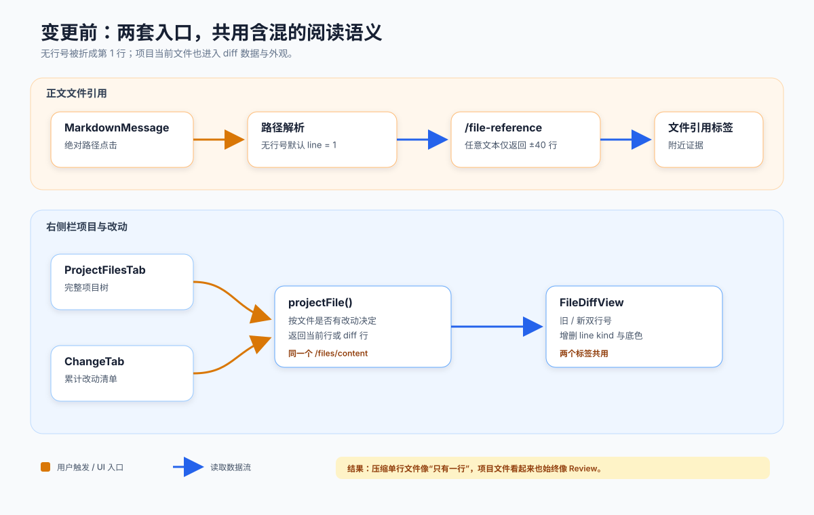

# 设计：separate-file-reading-modes

## 架构基线

- 模块职责与依赖边界：[`docs/architecture/module-map.md`](../../../docs/architecture/module-map.md)
- Markdown 安全渲染现状：[`docs/architecture/local-console-streamdown-markdown.svg`](../../../docs/architecture/local-console-streamdown-markdown.svg)
- 变更前链路：

- 变更后链路：

## 方案

### 1. 保留文件引用的打开意图

正文解析层输出文件引用时，除现有绝对路径、行和列外增加 `hasExplicitLine`。无行号路径可以继续把读取目标规范化为第 1 行，但不得因此丢失“用户没有要求定位”的事实；`/workspace/README.md` 与 `/workspace/README.md:1` 必须生成不同的初始模式。

解析层仍只识别受支持的 POSIX 绝对路径形式，不预判文件是否存在、是否为 Markdown 或是否位于工作区。显式 Markdown 链接、裸文本与 inline code 中已经允许的路径继续走同一解析器；根路径、分隔符和危险协议边界保持现状。

建议新增不依赖 React 的纯模型：

- `FileOpenIntent`：`rawPath`、`line`、`column`、`hasExplicitLine`。
- `decideInitialFileMode(intent, resolvedTarget)`：只有完整工作区 `.md` / `.markdown` 且没有显式行号时返回 `preview`；其他情况返回 `source`。
- `reduceFileViewState(state, event)`：集中处理目标变化、用户切换、刷新、成功、失败和过期响应。

扩展名匹配大小写不敏感，只接受 `.md` 与 `.markdown`；不内容嗅探，也不把 `.mdx` 纳入本次。

### 2. 在服务端按 canonical 目标划分工作区内外

`workspace-query-runtime` 根据文件引用所属 `sessionId` 读取该会话已经锁定的实际工作空间，分别解析工作空间与目标的 canonical realpath，再做路径段安全的包含关系判断。判定随每次读取请求执行，不把 renderer 或旧标签缓存的作用域当成事实。

结果为一个判别联合：

- `workspace-file`：canonical 目标位于 canonical 工作空间内，包含 workspace-relative path、完整 UTF-8 文本、行模型与 Markdown eligibility。
- `external-preview`：canonical 目标不在工作空间内，包含 canonical path、请求目标和有界行窗口，并明确 `isComplete: false`。
- `unavailable`：包含稳定错误代码和用户可读恢复建议，不携带上一目标内容。

这个判断以真实目标为准：工作区内符号链接指向外部时进入 `external-preview`；工作区外别名指向工作区内部时进入 `workspace-file`。路径不存在时无法取得目标 realpath，服务端使用解析后的父级与原始目标形成稳定的 `not-found`，不得通过字符串前缀猜成工作区文件。

### 3. 拆开当前源码与累计 diff 的查询契约

保留 `/files/content` 作为“项目当前文件”契约，但移除 `decideProjectFileRead` 根据改动状态返回 diff 的行为；成功响应总是完整当前 UTF-8 文本和单一当前行模型。为「改动」新增明确的 `/workspace-diff/content` 查询（实际命名可遵循路由邻近约定），只返回相对会话基线的 diff 行和旧 / 新行号。

`/file-reference` 继续作为正文路径入口以兼容已有桌面接线和持久化标签类型，但响应改为上述 `workspace-file | external-preview | unavailable` 判别联合。renderer 不读取文件系统、不自行做 realpath，也不靠响应行数猜“完整还是预览”。

三个读取端口职责如下：

| 入口 | 数据 | UI |
| --- | --- | --- |
| 项目文件 | 当前完整文件 | 普通源码；Markdown 可 Preview |
| 正文中的工作区路径 | 当前完整文件 + 打开意图 | 普通源码或 Markdown Preview |
| 改动 | 会话基线 diff | Review / Diff |
| 正文中的工作区外路径 | 目标附近有界窗口 | 明确外部预览 |

完整文件沿用当前项目文件读取已经执行的整文件预算和失败语义；本 change 不改变预算数值，也不把数值提升为新的产品规则。超过预算时沿用 `file-too-large`，不能静默退化为附近窗口。“打开完整文件”在这里表示成功响应不是窗口或截断内容；超过既有产品边界时仍明确不可用。外部预览沿用已有扫描字节、最大单行和响应大小预算。不可显示文本、目录、缺失与不可读沿用已有错误归类，不新增更细错误码，也不回退读取同名或相似文件。

这个契约拆分是实现“项目文件不是 Review、改动才是 Review”的最小数据语义拆分：至少必须让调用方明确请求 current source 或 baseline diff，不能继续由服务端按“文件是否 changed”替调用方猜模式。采用独立端口而非布尔参数，是为了让两种响应类型保持可判别；不借此改写 ChangeTab 的列表、刷新或入口。

### 4. UI 将源码、Markdown Preview 与 Diff 分成独立组件

新增 `FileSourceView`（或等价命名）负责完整当前文件：只显示一列当前行号，不接受 diff line kind，不渲染增删背景。`FileDiffView` 只由 `ChangeTab` 使用。`ProjectFilesTab` 和工作区内的 `FileReferenceTab` 复用完整文件容器，但各自保留树选择与标签标题等外层职责。

完整 Markdown 内容通过现有 `MarkdownMessage` 的静态模式渲染，外层提供「Preview / 源码」切换。文件 Preview 禁用团队 mention 和对话引用激活，避免项目文档正文被误当成会话控制面；绝对本地文件链接仍回调到统一文件打开入口，`http` / `https` / `mailto` 继续经过现有确认，原始 HTML 清洗、危险协议阻止和 Mermaid 严格模式保持不变。

相对链接、本地相对图片和 hash 到源码行的映射不在本次解决。可见缺口是：常见 README 的相对文档链接只能显示文字、不能在应用内打开，仓库内徽标或截图只显示替代文本，因而 Preview 不等同于 GitHub 的完整仓库渲染。本次仍排除它们，因为用户确认的方案是复用现有 Markdown renderer；相对路径需要以当前文件为基准增加新的导航解析，而本地图片还需要新的二进制读取、MIME、大小与生命周期安全契约，均不是“源码 / Preview 模式分离”的必要条件。远程图片仍服从现有 Markdown 安全策略。

外部有界窗口永远进入 `ExternalFilePreview`（可由现有 `FileReferenceTab` 的分支承载），标题和内容区同时显示“预览 / 仅显示目标位置附近内容”。即使扩展名为 Markdown，也不渲染不完整片段。

### 5. 模式、标签与定位状态

已有持久化 `file-reference` 标签类型不迁移为新类型，避免旧标签丢失。标签状态新增可选 `fileMode`；旧状态缺失时根据最新目标和 `hasExplicitLine` 重新决定初始值。新建的显式 `:line` 标签先无条件初始化为源码，不能读取同文件其他标签或全局偏好覆盖；只有用户随后在这个标签手动切换，才随现有标签现场记住选择。

项目文件标签按当前所选文件保存该标签内的模式；选择一个新的 Markdown 文件时按“裸选择”默认 Preview，选择普通文件则固定源码。正文显式行号创建的标签默认源码。切到 Preview 不承诺把源码行映射到渲染节点；切回源码时恢复目标行和最后成功阅读位置。

源码目标行必须滚入视野，并通过 `aria-current` / 可读标签与边框或标记等非纯颜色信号突出；列号作为辅助目标信息显示，不要求水平精确定位到字符。

### 6. 异步一致性与文件变化

每次目标或刷新加载开始时生成 monotonically increasing request token。成功或失败只有在 token、sessionId、目标和当前标签身份仍匹配时才能提交；AbortController 可减少无用工作，但正确性不能依赖网络真的被取消。

组件测试必须主动覆盖父级重渲染、回调身份变化、先慢后快、先成功后失败和旧失败晚到，确保旧响应不覆盖当前文件、模式或错误。模式决策和 reducer 使用纯单元测试覆盖边界，组件测试只验证状态到可见结果的映射。

源码与 Preview 始终从同一次成功响应的文本派生。当前版本不监听磁盘，也不在文件变化时自动替换已经呈现的内容；用户重新选择、重新打开，或既有入口提供刷新时才重新读取。本 change 不增加文件版本标识、读中变更检测或新的 `file-changed-during-read` 错误。

ChangeTab 只替换“所选改动文件内容”的读取端口，以下既有行为必须保持：结果卡片仍一步打开同一来源标签；未开始、加载中、无改动、非 Git 和读取失败空态不变；工作期间的截至说明与手动刷新不变；自动轮次结束刷新、pending 新改动提示、当前选择与滚动位置保护不变。ProjectFilesTab 的数据分流不得改动这些外围状态机。

### 7. 只读、安全与失败恢复

所有入口只读，不增加编辑、保存、格式化、shell 或 git 操作。Markdown Preview 不执行文档中的代码、脚本或任意协议；文件链接只产生应用内导航意图，不扩大 provider 或 Agent 权限。

错误 UI 保留当前标签及目标路径，移除上一文件内容，显示稳定原因和重试。工作空间失效继续由会话区承担修复入口；右侧栏只说明当前无法读取。重试重新做 canonical 判定和预算检查，不能复用失败前的作用域结论。

### 8. 验证分层

- domain / application：显式行号保留、Markdown 初始模式、模式 reducer、canonical 内外判定、symlink 边界、完整读取 / 外部窗口既有预算。
- renderer component：源码单行号、Diff 专属语义、Markdown 切换与链接策略、目标定位、错误 UI、异步竞态和可访问信号。
- desktop wiring：四种入口调用正确端口，旧持久化标签兼容，刷新与标签恢复。
- Storybook：为普通源码、Markdown Preview、显式行号、外部预览和既有失败状态建立 production export stories。
- 真实应用：从主 / 子 / 右侧栏会话正文、项目文件和结果卡片逐条执行 `tasks.md` 的验收语句，以页面入口和可观察信号记录证据。

## 双向范围核对

| 核对项 | 依据与结论 | 对应任务 |
| --- | --- | --- |
| 工作区路径打开完整文件并定位 | 成功时返回完整当前文本；显式行号进入源码并定位 | 5.1、5.2 |
| 项目文件不是 Review | ProjectFilesTab 改用 current source；ChangeTab 独占 baseline diff | 5.3、5.4 |
| Markdown 默认 Preview | 裸路径与项目树默认 Preview；显式 `:line` 新标签先初始化源码，之后才允许记忆用户在该标签的切换 | 5.5–5.7 |
| 工作区外有界预览 | canonical 真实目标决定作用域，外部继续复用既有窗口读取 | 5.8、5.9 |
| 失败与恢复 | 只沿用项目完整读取和外部窗口已有预算 / 错误，不新增产品错误类型 | 5.10、5.11 |
| 文件变化 | 不加 watcher 或版本协议；已呈现文本保持到用户重新读取，源码与 Preview 使用同一次响应 | 5.12 |
| Markdown 链接 | 复用现有绝对本地路径、外链与危险协议规则；相对链接 / 本地图片的可见缺口如方案 4 所述 | 5.14 |
| 异步竞态 | 只在组件 / desktop 测试用 deferred Promise 控制；不加生产开关，不伪装为真机证据 | 4.3、4.4；原 5.13 已移除 |

现行项目文件 reader 在 `src/local-console/file-read.ts` 中导出 2 MiB 实现常量；现行 local-console spec 已记录“项目文件 2 MiB 上限”，右侧栏 PRD 在本 change 之前也已规定文件过大时明确不可显示。精确数值没有独立产品依据，也不在 `src/config.ts`；因此本 change 只复用该既有预算，不把 2 MiB 写成新产品规则、不移动或调整上限。这里的“完整文件”是二态契约：预算内成功就返回完整内容，不能返回附近窗口；超过既有上限则明确不可用。

新增 diff 查询端口只拆数据语义，不改 ChangeTab 外围行为。结果卡片入口、来源标签去重、累计基线、工作空间说明、未开始 / 加载 / 无改动 / 非 Git / 失败空态、工作期间刷新、轮次结束刷新、pending 新改动提示、当前选择与滚动保护都保持既有实现与 spec；4.2、5.4 负责回归。

canonical realpath 和 symlink 内外分流是落实“工作区内完整、工作区外有界”的必要条件，也是现有文件引用 canonical 路径与标签去重语义的延续。项目完整读取的 `file-too-large` / `binary-file` / `not-found` / `not-file` / `workspace-unavailable`，以及外部窗口的 `invalid-path` / `line-too-large` / `response-too-large` / `line-not-found` / `scan-limit` / `unavailable` 都是既有边界，保留但不扩张。先前草案中的独立 `invalid-utf8`、`file-changed-during-read`、版本标识、读中重试和 symlink 监控只是防御性增强，无法直接对应原始目标，现已从 PRD、design、spec-delta 与 tasks 移除。

原始需求没有漏项；上表覆盖五条用户裁决和工作区外边界。当前方案没有顺手重构：不调整预算、不引入虚拟化、不增加本地图片端点、不解析相对仓库资源、不加文件监听、不重写 ChangeTab 状态机，也不新增用户可见调试能力。

## 权衡

- 选择服务端 canonical 判定，而不是 renderer 用原始路径字符串判断。代价是响应契约更丰富，但可以正确处理符号链接、会话 worktree 和路径前缀碰撞，并把文件系统权限留在既有边界内。
- 选择拆查询端口，而不是给同一 `FileDiffView` 加“隐藏颜色”开关。后者仍会让项目源码依赖 diff 行模型，容易在新增 / 删除文件和刷新时再次混淆当前内容与基线内容。
- 选择工作区大文件明确失败，而不是自动降级附近预览。降级会违反“工作区路径打开完整文件”的用户语义；外部文件才使用有界预览。
- 选择 Markdown 裸路径默认 Preview、显式行号默认源码，代价是同一文件可从不同入口得到不同初始模式；这与用户已经确认的“读文档 / 查源码行”意图一致，且切换始终可用。
- 选择当前标签记忆而非全局偏好。全局偏好会让显式行号路径可能被用户先前选择覆盖，破坏稳定定位。
- 选择手动刷新而非文件监听。当前目标是准确阅读，不引入 watcher 生命周期、频繁重渲染和快照撕裂。

## 风险

- 路由拆分可能让 ChangeTab 或 ProjectFilesTab 接错端口。通过判别响应类型、桌面接线测试和真实应用中同一已改动文件的双入口对照防止。
- Markdown renderer 原本服务会话消息，直接复用可能误开 mention / 对话引用。通过文件 Preview 的受限 callback profile 和安全回归测试隔离。
- 既有整文件预算内的较大文本仍可能产生较多行节点。本 change 保持现有读取预算与渲染规模，不顺手引入虚拟化；若验证暴露独立性能问题，另行裁决。
- canonical 分类接入 session workspace 后可能把历史上同一路径的标签分到不同作用域；以每次读取返回的 canonical 结果为准，并用现有标签去重测试覆盖，不增加 symlink 监控或读中换向检测。
- 旧标签没有 `hasExplicitLine`。迁移只能按旧标签已保存的 line 是否来自明确引用进行 best effort；无法证明时按无显式行号处理并允许用户切换，不改写会话事实源。

回滚时可恢复原有 renderer 接线和路由，但必须同时回滚响应判别联合与标签状态字段；PRD 和 spec-delta 不能在行为回滚后宣称新语义已经实现。
