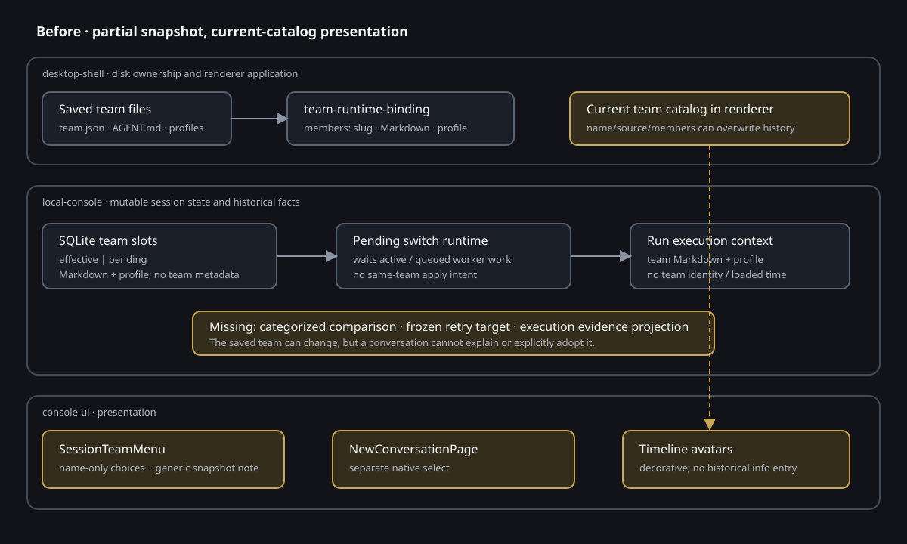

# 设计：agent-team-snapshot-traceability-and-apply

现状与改造后的数据链见  与 。架构基线引用 `docs/architecture/agent-teams-runtime-binding.svg`、`docs/architecture/desktop-agent-session-continuity.svg` 和 `docs/architecture/module-map.md` 的 desktop-shell / console-ui / local-console 边界。

## 方案原则

1. **会话状态与 run 历史分层**：effective/candidate/pending 和应用 intent 是可变流转状态，落 SQLite；每个 run 当时使用的完整内容是历史事实，随 execution context 追加到 session JSONL，SQLite 仅保留可重建索引。
2. **完整版本只在后端冻结**：renderer 只发送“应用当前候选” intent，不提交 Markdown、profile、指纹或文件路径。local-console 通过桌面壳 resolver 读取、验证、比较并冻结。
3. **代次而不是时钟切队**：每个可执行 dispatch/run 绑定内部 snapshot key；旧 run 产生的后续 handoff 继承旧 key。应用只在旧 key 没有活动或排队工作后提升，避免用消息时间猜测边界。
4. **组件库只承载呈现和 intent**：变化分类、候选有效性、应用状态与证据分级都在 local-console domain；`packages/console-ui` 只消费稳定 DTO。
5. **内部键不等于用户版本号**：完整内容 canonical hash 可作为 snapshot key 和幂等键，但所有 renderer DTO 都省略它，用户只看到载入时间和事实字段。

## 1. 完整团队版本模型

### 1.1 运行时契约

把 `LocalConsoleAgentTeamSnapshot` 扩展为版本化结构，字段职责如下：

| 字段 | 来源 | 用途 |
| --- | --- | --- |
| `team.ownership/id` | 团队稳定绑定 | 健康解析和同团队更新身份 |
| `team.name/description/primaryAgentSlug` | 有效 `team.json` | 历史菜单与信息卡 |
| `team.officialSourceName/createdAt` | 官方 manifest 或用户记录 | 同名团队辨认；二者按来源择一 |
| `members[].slug/displayName/description` | 目录名与 `AGENT.md` 身份解析 | 菜单、头像、mention 和信息卡 |
| `members[].agentMarkdown` | 有效保存文件全文 | prompt 与只读历史查看 |
| `members[].executionProfile` | 静态 profile store | CLI/model/effort 硬绑定 |
| `capturedAt` | 完整版本读入时 | 内部诊断，不直接展示 |
| `loadedAt` | 成为 effective 时 | 用户看到的“团队版本载入于” |
| `snapshotKey` | canonical 完整版本 hash | 内部比较、代次、幂等与队列绑定 |

`snapshotKey` 的 canonical 输入只含影响会话行为或历史身份的字段；对象键排序稳定，成员按 snapshot 顺序序列化。onboarding orchestration、路径、mtime、健康状态和未保存草稿不进入 key。

变化分类使用三个独立内部 digest：

- `agentDefinitionDigest`：有序成员 slug + 每名成员完整已保存 `AGENT.md` 内容，包含全部 frontmatter 与正文；任何文件内容变化都会改变该摘要。
- `executionProfileDigest`：有序 slug + CLI/model/effort；缺失 legacy profile 使用显式 legacy sentinel，不读取当前默认值。
- `teamInformationDigest`：团队身份、名称、用途、主 Agent、有序 slug，以及从完整 `AGENT.md` 解析出的成员可读身份结果。

任一物理 `AGENT.md` 内容变化都产生 `agent-definition`；若该变化同时改变 `display_name` / `description` 等解析身份结果，还额外产生 `team-information`。因此即使正文不变、只改身份 frontmatter，也必须同时出现两类提示。

### 1.2 SQLite 可变状态

保留现有 `sessions.agent_team_*` 绑定列和 `session_agent_team_members` 兼容入口，迁移为三槽：`effective | candidate | pending`。

- `session_agent_team_snapshot_meta`：每个 session/slot 一行，保存完整团队身份、时间、内部 keys/digests 和 `pendingReason: switch | refresh | null`。
- `session_agent_team_members`：增加可读身份和 `snapshot_key`；继续保存 Markdown、profile 和顺序。
- `session_team_update_intents`：每 session 最多一行，保存 `fromSnapshotKey`、`targetSnapshotKey`、`status: waiting | failed`、`requestedAt`、稳定 failure code 和是否可取消/重试。
- `session_messages.dispatch_snapshot_key`：已解析的 primary/worker dispatch 绑定其团队代次；`awaiting-team` 为 NULL，提升后再解析并写入新 key。

candidate 是最近一次成功读取、验证并与 effective 不同的完整磁盘版本缓存。检测读只在 candidate key 变化时写 SQLite；无变化刷新不写。应用请求先重新读取一次：成功则用点击时最新版本替换 candidate，再冻结到 pending；读取失败则使用页面所指向、已持久化的 candidate 建立 failed intent。由此重试有稳定目标，且不会把之后保存的版本偷换进来。

### 1.3 兼容迁移

迁移必须在代表性旧库上覆盖：

- 只有 effective rows；
- effective + pending switch rows；
- Codex/Kimi/Claude/NULL profile 混合；
- 无 snapshot 的旧未绑定会话；
- 正在 pending/running 的旧消息。

旧 rows 生成内部 key 时只使用已持久字段；未知团队名称、来源、成员 display identity 和 `loadedAt` 保持 NULL。旧 pending rows 保持 `switch` 语义；真正提升时才写 `loadedAt`。迁移不从当前磁盘补历史，不修改 session JSONL，不改变成员顺序、profile、绑定或消息状态，并通过 `foreign_key_check`。应用请求开始时，尚未带 `dispatch_snapshot_key` 的旧 pending/running 工作只在该事务内绑定当前 effective key；已完成历史不回填。

## 2. 变化检测和应用状态机

### 2.1 检测

`LocalSessionTeamUpdateRuntime.inspect(sessionId)` 执行：

1. 读取 session effective snapshot 与绑定；无绑定、团队 deleted/needs-repair、已有 pending switch 时按现行状态返回不可应用，不伪造更新。
2. 调用注入的 `loadAgentTeamSnapshot(binding)` 读取当前完整有效保存版本。
3. 在纯 `session-team-update-plan.ts` 比较三个 digest，得到 0–3 个分类及成员计数。
4. 候选与当前已持久 candidate 不同才更新 candidate；返回 renderer-safe DTO，不返回 key、Markdown、profile 当前值或前后差异。

团队页内部草稿不会被 resolver 读取；有效 Finder 修改在下一次 inspect 被发现。无效文件、冲突或 unreadable 由既有团队健康/外部冲突通道表达。

### 2.2 状态与转移

| 当前 | 事件 | 下一状态 | 队列行为 |
| --- | --- | --- | --- |
| `idle + changes` | 点击任一应用 | `waiting` 或直接完成 | 原子冻结 candidate → pending；记录 from/target key |
| `waiting` | 旧 key 仍有 work | `waiting` | 旧工作继续；新用户消息为 `awaiting-team` |
| `waiting` | 旧 key work 清空 | `idle` | pending 提升 effective，写 `loadedAt`，等待消息按新名单 FIFO 解析 |
| `waiting` | 提升/读取失败 | `failed` | effective 与 pending 均保留，等待消息不发射 |
| `failed` | 重试 | `waiting` 或完成 | 只用已冻结 pending，不重读 candidate |
| `failed/waiting` | 取消 | `idle + changes?` | 删除 intent/pending；等待消息按旧 effective FIFO 解析；重新 inspect |
| 任意应用态 | 团队又保存 | 状态不漂移 | 已冻结 target 不变；取消/成功后才显示更晚变化 |

旧代次 work 包含 active run、已调度 run、primary/worker pending dispatch，以及这些 run 产生并继承旧 key 的可见 handoff。状态机不只检查点击时消息 ID，也不因当前 active run 结束就过早提升。

应用是“两提交”流程：第一提交必须先持久化 pending 完整版本和 intent，第二提交才尝试立即提升。即使第二提交失败，目标仍可重试。若第一提交本身无法落盘，请求不进入应用态，composer 不接受“等待更新”消息，保留原变化提示并显示稳定错误；这是无法持久化任何状态时的 fail-closed 边界，不能假装已经冻结。

### 2.3 历史步骤例外

普通新消息、应用后新 handoff 和新发起工作读取当前 effective key。重试、重新运行、恢复和一次性配置重跑按既有 `sourceMessageId/runId` execution context 取原 team/profile/workspace，不读取 current effective。应用不能修改 canonical provider link 或 Agent timeline cursor。

## 3. run 级审计事实与只读 API

### 3.1 JSONL 事实

`LocalRunExecutionContextFact` 增加可选 `teamSnapshot` 审计块：团队历史身份、`loadedAt`、有序成员身份、Markdown 和 profile，以及内部 snapshot key。它在 provider executable 解析、版本校验、认证或 spawn 前写入，所以启动前失败也有“计划尝试”依据。

新增 `local-provider-process-started` 事实，由现有 driver `onProcessStarted` 回调追加，记录 session/run/role/engine/startedAt，不包含路径、argv 或 provider 原文。旧 provider invocation/link/terminal 事实继续保留。

纯 projector 根据持久证据给出：

- `executed`：存在 process-started、provider session/trace、可见 provider 输出或成功终局等可信外部执行证据；
- `planned-not-started`：存在 execution context，终局明确发生在外部执行开始前，且无任何开始证据；
- `bound-start-unknown`：其余 legacy/不完整记录。

run override profile 已在 execution context 中，信息卡直接显示它，不回落团队基础 profile。

### 3.2 查询边界

新增两条 GET 路由：

- `/sessions/:sessionId/runs/:runId/agent-info`：返回成员、团队历史身份、三项 profile（可空）、证据分级和 loadedAt（可空）。
- `/sessions/:sessionId/runs/:runId/agent-markdown`：仅在用户显式打开 Dialog 时返回该 run context 中对应成员的完整 Markdown。

路由从 session JSONL/索引按 session + run 唯一定位并校验 role，不接受文件路径、team id 或 member slug 作为任意读取能力。普通 state/view、团队菜单和信息卡首开都不携带 Markdown。旧记录缺字段返回 NULL/`not-recorded`，不查当前目录补齐。

## 4. desktop-shell 装配

### 4.1 完整 resolver

扩展 `desktop/src/team-runtime-binding.ts`：同一次有效读取产出 team core、稳定来源辨认、成员身份/Markdown 与 profile。它继续只接收稳定 binding，路径解析沿用 team record；local-console 不知道 `teams/` 布局。

桌面 loopback client 增加 inspect/apply/retry/cancel 和两条 run audit GET。`refresh-console-state` 把更新 DTO 与 effective/pending 历史摘要合并进选中会话状态；不在 renderer 比较 Markdown 或 profile。

### 4.2 保存反馈

新增 desktop application 层 `agent-team-save-feedback-plan.ts`，统一把实际 mutation 结果映射为：

- `saved`：团队、项目种类与数量；
- `partial`：成功项目 + 失败项目和重试 intent；
- `external-loaded`：无草稿且成功载入有效外部版本；
- 无反馈：失败、冲突、无效、读取失败或 needs-repair。

所有现有 mutation hooks 只上报真实成功结果。`save-all-and-leave` 全成功时先提交 feedback，再切到列表；失败保持详情。反馈是 renderer session 状态，不进入团队文件、session JSONL 或 last-used team。

异步 hooks 必须以 request key/revision 隔离迟到结果；父组件重渲染和 callback identity 变化不能重复 mutation、清空较新反馈或把失败改成成功。

## 5. console-ui 组件投影

### 5.1 团队菜单

在 `session-team-menu.tsx` 内导出共用 `AgentTeamMenuOption`，由 `SessionTeamMenu` 与 `NewConversationPage` 组合：

- 名称、来源、用途、主 Agent、成员数和有序成员；
- `AgentInitialAvatar` 显示成员首字；主 Agent有文字标识；
- 空间不足时保留主 Agent和前几名，`+N` 是独立 button，Enter/Space 只展开该项的有界成员滚动区；
- 已有会话顶部当前项使用 state DTO 的 effective 历史摘要并不可选择；分隔线下只列其他当前目录团队；
- pending switch 使用冻结 pending 摘要；新对话使用当前目录团队。

删除新对话原生 `<select>`，但保留现有发送、mention、禁用和草稿契约。分析新会话因复用 `NewConversationPage` 自动获得同一选项，不建副本。

### 5.2 更新提示

新增 `SessionTeamUpdateNotice` 呈现组件，输入仅含分类、成员计数、`idle|waiting|failed`、等待消息和 callbacks。三条紧凑中性行位于主 composer 上方；任一按钮调用同一 apply callback。waiting 合并说明；failed 提供 retry/cancel；不使用 danger、Badge 错误语义或侧栏 attention。

等待消息继续复用现有 pending-dispatch 列表与编辑/移除动作，不建立第二份消息数组。

### 5.3 头像信息

- Agent 时间线和 `RunBlock` 的头像按钮用 `PopoverTrigger asChild` 包住 `AgentInitialAvatar`；用户头像继续用既有 `RoleTag`。
- 新增 `AgentRunInfoPopover`，由 Radix collision/side/align 能力锚定触发头像，默认下方、空间不足上翻、窄窗限制 `max-width`；关闭行为和焦点回返交给受控 Radix 语义并做回归测试。
- 新增包内通用 `ui/dialog.tsx`（复用现有 Radix Dialog 依赖与 DESIGN token）和 `AgentMarkdownDialog`；完整源码用可选择等宽文本显示，不执行 Markdown/HTML，不提供编辑/复制回团队/比较动作。

Popover 数据按 `{sessionId,runId,role}` 缓存。请求慢或失败时卡片原位 loading/error/retry；key 改变时忽略旧响应。父级仅替换 callback identity 不触发重复请求，也不让旧闭包处理点击。Dialog Markdown 请求同样按 key/revision 防迟到覆盖。

### 5.4 团队页反馈

新增 `AgentTeamSaveFeedback` 组件，详情页单项成功放在当前操作附近；partial 逐项显示；列表页在顶部显示 save-all 全成功结果。它消费 desktop 计划好的反馈 DTO，不从草稿状态猜测“已保存”。

上述新模式回流 `packages/console-ui/DESIGN.md` 的组件模式目录；不新增裸色、阴影、渐变或 desktop 私有 UI。

## 6. 文件职责与影响范围

| 范围 | 主要文件/新增职责 |
| --- | --- |
| local domain | `session-team-snapshot.ts`（canonical key/digest）、`session-team-update-plan.ts`（分类与状态决策）、`run-agent-audit-plan.ts`（证据分级/DTO） |
| local application | `session-team-update-runtime.ts`（inspect/apply/retry/cancel）、`pending-session-context-runtime.ts`（按 snapshot key 排空/提升）、run preparation/provider started fact、audit query runtime |
| local adapter | `types.ts`、`store.ts`、`sqlite-state*.ts`、`server.ts`、JSONL fact codec/index、state query projection |
| desktop application/adapter | `team-runtime-binding.ts`、console API/state contracts/client/coordinator、团队 mutation hooks、`agent-team-save-feedback-plan.ts` |
| console-ui | `session-team-menu.tsx`、`new-conversation-page.tsx`、`composer-context.tsx`、`operator-console.tsx`、`run-block.tsx`、`agent-initial-avatar.tsx`，新增 update notice/info popover/markdown dialog/save feedback 与 Story/tests |
| boundaries/docs | `src/testing/four-layer-registry.ts`、`packages/console-ui/DESIGN.md`；归档时按项目规则回流 specs、wireframe 与 architecture |
| acceptance | 扩展 `scripts/acceptance/console-dashboard-ui.ts` 或新增同目录真实 Electron 场景脚本；证据只写系统临时目录 |

实际实施若可在邻近文件内保持职责清晰，可少建文件；不得把 domain 决策内联进 view 或 SQLite adapter。新增生产文件必须登记四层归属并通过边界扫描。

## 权衡

### 复用 effective/candidate/pending 槽，而不是引入通用版本仓库

历史 run 已由 JSONL execution context 保存完整团队，因此 SQLite 只需保留当前三个可变槽和一个 intent。通用不可变版本仓库会重复历史事实、增加垃圾回收和一致性问题。本方案的代价是 session 当前历史与 run 历史来自两种存储，但符合项目“SQLite 流转、JSONL 历史”的边界。

### 用 snapshot key 绑定工作，而不是仅用点击时 message id

旧 run 在点击后可能再产生 handoff；静态 message cutoff 会过早切换。代次 key 可以让衍生工作继承旧版本，直到整条旧链清空。代价是 pending dispatch 增加一列和迁移逻辑，但它直接封住并发边界。

### 检测缓存 candidate，但不把它当 effective

保存后无需重启和稳定重试需要一个后端持有的有效候选。candidate 只在成功验证且内容变化时更新，不能运行、不影响会话；无效外部修改不会覆盖它。代价是状态刷新偶尔写可重建缓存，换来失败后同版本重试和跨重启稳定性。

### Markdown 按显式请求读取

把完整 prompt 塞进常规 state 会放大轮询和 renderer 暴露面。单用途 run-scoped GET 只在点击查看时读取持久事实；代价是 Dialog 有独立 loading/error 状态。

### UI 用共享组件，不让 desktop 复制原型

团队选项、Popover、Dialog 和反馈都在 `@moebius/console-ui`。desktop 只装配 DTO/callback。这样满足设计系统与边界测试；代价是 package 公共类型会扩展，但避免真实页面和 Story 各自维护一套交互。

## 风险与回滚

- **迁移风险**：三槽约束和 profile 列已有历史迁移。先在旧 schema fixtures 上建立表级前后快照、外键检查和双次 init，再接 runtime；失败回滚事务，不做部分迁移。
- **切换/应用竞态**：同一 session 的 switch/apply/retry/cancel 必须走 store 串行队列和 expected from/target key；陈旧请求返回 409，不覆盖较新 intent。
- **旧工作永不清空**：卡住/中断仍按现有终态控制；用户取消应用可释放新消息，但不会取消旧 run。应用提示不能成为第二套停止控制。
- **团队失效**：等待期间团队目录损坏不影响已冻结 pending；健康门禁决定生效后的继续能力。若冻结前无有效 candidate，应用 fail closed。
- **审计误报**：不得以 run lifecycle `startedAt` 单独证明外部执行；只用 dedicated process/provider facts。未知归 `bound-start-unknown`。
- **敏感内容**：Markdown 端点只能按 run context 读取，不能接受路径；普通 state、日志错误和 analytics 不含正文。
- **React 迟到响应**：信息 Popover/Dialog 与团队 catalog/更新检测都以 key/revision 防旧响应覆盖，并专门测试 callback identity 变化。
- **视觉回归**：团队菜单密度和 Popover 遮挡通过真实 Electron 窄窗、上下翻转、键盘焦点与 reduced-motion 验收；不以原型截图代替生产观察。
- **回滚**：代码回滚后新增表/列由旧代码忽略；旧 JSONL 可选字段由旧 reader 忽略。回滚前若存在 waiting update，先由新版本取消或完成 intent；不得让旧版本把 `awaiting-team` 消息永久留队。
