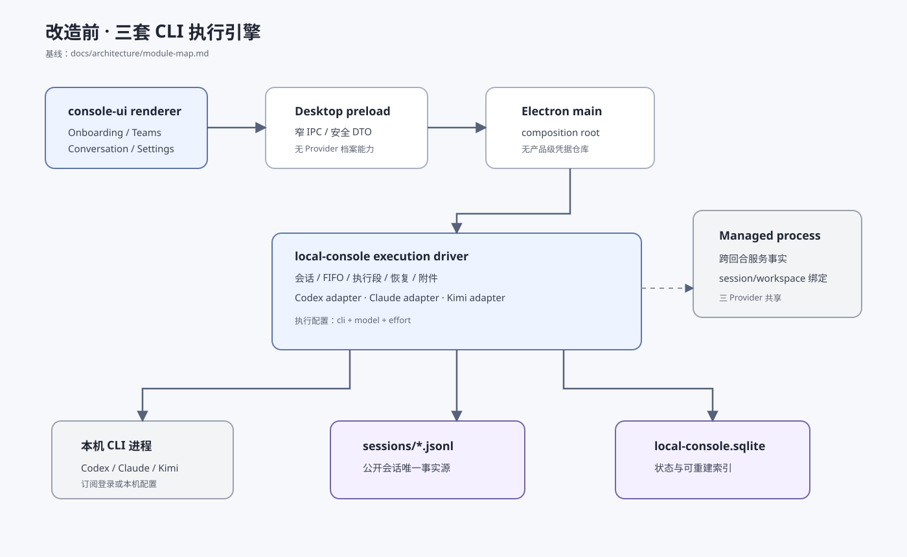

# 设计：add-byok-pi-agent-runtime

## 1. 设计目标与不变量

- Moebius session JSONL 继续是公开会话唯一事实源；Pi session 只是 Provider 原生过程记录。
- SQLite 只保存可变状态、索引、档案元数据和事务账本，不保存 API Key。
- renderer 永远只能看见档案状态、服务商、模型和 Key 脱敏尾号，不可请求明文。
- API Key 不得进入 argv、env、HTTP/local-console DTO、会话事实、Pi auth 文件、插件配置、错误或普通诊断。
- Pi Host 是每轮有自然终点的前台子进程，不使用 managed process；跨回合服务只能调用既有 managed process bridge。
- 现有 CLI 配置和历史会话原位兼容，不能因 schema 扩展被重解释或静默改成 Pi。
- 生产 UI 只根据 PRD 与设计系统实现，不导入、复制或读取 prototype。

## 2. 架构快照

基线：`docs/architecture/module-map.md` 的 desktop-shell、local-console、console-ui 四层边界，以及现有 Provider driver / managed process 链路。




## 3. Provider 目录与档案模型

Provider 目录是随应用版本发布的只读数据：

```ts
type ProviderCatalogEntry = {
  id: "deepseek";
  displayName: "DeepSeek";
  baseUrl: "https://api.deepseek.com";
  protocol: "openai-chat-completions";
  models: readonly [
    { id: "deepseek-v4-flash"; efforts: readonly PiEffort[] },
    { id: "deepseek-v4-pro"; efforts: readonly PiEffort[] }
  ];
};
```

档案由稳定 UUID 标识，服务商身份不可变：

```ts
type ProviderProfile = {
  id: string;
  providerId: "deepseek";
  displayName: string;
  credentialRef: string;
  keySuffix: string;
  defaultModel: string | null;
  verifiedModels: string[];
  readiness: "ready" | "needs-attention" | "disabled";
  reason: SafeProviderReason | null;
  catalogRevision: number;
  revision: number;
  createdAt: string;
  updatedAt: string;
};
```

`validating`、`saving`、`migrating` 和 `deleting` 是 operation journal 的叠加活动状态，不覆盖旧 revision 的 readiness。正在验证新 Key 时，已就绪旧 revision 继续服务既有运行；只有全部目标模型验证并完成本地提交后才原子切换 revision。

启动恢复必须把 readiness 当作可校准状态，而不是无条件信任 SQLite 中的 `ready` 标记。对每个 `ready` 档案逐一读取并解密其当前 `credentialRef`；缺失、损坏或不可解密时原子提升 revision 并转为 `needs-attention`，保留引用和历史标识，让设置页进入重新输入、验证和保存路径。健康档案独立保持 `ready`，一个档案的凭据故障不得污染其他档案，也不得在第一次真实运行失败后才更新状态。

引用不是可漂移计数器，而是从团队成员 binding、AI 建队草稿、排队任务、一次性执行及可恢复会话执行代的 canonical 记录汇总。删除或移除模型前必须重新计算并返回逐项可见引用清单。

## 4. 凭据存储与事务

### 4.1 SafeStorage 取舍

当前锁定 `electron@38.8.6`，本地 `electron.d.ts` 的 `SafeStorage` 仅有同步 `encryptString` / `decryptString`。本 change 不升级 Electron，以免把 Chromium、打包签名和全桌面回归并入功能范围。

`CredentialVault` 只由 Electron main、`app.whenReady()` 后的异步适配层调用：

- Electron 38 的同步 `safeStorage` 调用封装在一次性凭据 helper 内，由 main 进程通过 stdin/stdout 等待结果；调用不跨 IPC 暴露，不位于 renderer 或 local-console server，且不阻塞 Electron main event loop。
- 加密 blob 以 mode `0600` 原子写入数据根专用凭据文件；记录只含 credentialRef、ciphertext 和版本。
- `isEncryptionAvailable() === false`、decrypt 失败或文件损坏都 fail closed 为安全状态，不回退明文。
- 解密结果只在一次 invocation 的局部内存存在，写入 Pi Host stdin 后立即释放引用；不得缓存到长生命周期服务对象。
- 打包 Electron 验收覆盖首次保存、重启解密、轮换、删除和不可解密故障。

### 4.2 原子写入

档案创建/轮换使用 prepare → validate → commit：

1. prepare 在 SQLite 建 operation，保存非敏感草稿；Key 只在主进程内存。
2. validate 向隔离工作目录启动 Pi Host，要求模型回复且正确调用受控 echo/read fixture；不接触用户项目。多模型轮换逐个验证，并在开始前返回模型数和用量提示。
3. commit 先写新 encrypted credential revision，再在一个 SQLite transaction 中切换档案 revision、验证集与 operation 状态；最后清理旧 credential revision。
4. SQLite 提交失败时删除未引用的新 blob，旧 revision 继续有效；旧 blob 清理失败进入内部 cleanup pending，不回滚已公开成功但不向 renderer 暴露路径。

迁移、批量成员替换、团队生命周期引用和删除同样使用 operation journal。重启 recovery 只接受完整 commit marker；否则恢复操作前状态，显示“上次操作未完成”和可重试入口。逐项迁移每个对象独立提交并显示完成项，未提交项保持原引用。

## 5. 执行配置 v2 与兼容迁移

```ts
type ExecutionProfileV2 =
  | { version: 2; engine: "codex" | "claude" | "kimi"; model: string; effort: string }
  | {
      version: 2;
      engine: "pi";
      providerProfileId: string;
      providerId: "deepseek";
      model: "deepseek-v4-flash" | "deepseek-v4-pro";
      effort: PiEffort;
    };
```

- v1 `{cli, model, effort}` 在读取边界纯迁移成对应 CLI variant；持久化下次安全写时升级，不重写历史事实。
- SQLite `session_agent_team_members` 的 engine constraint 扩展为四引擎，并增加 nullable provider profile/model identity；migration 用新表复制、校验计数、原子 rename。
- 团队 binding 文件升级为 v2；未知 engine/model/provider 一律返回可修复错误，不选默认值。
- 会话快照冻结完整 profile 和 profile fingerprint。Pi fingerprint 包含 provider profile id、provider id、model、effort，不含 Key、suffix、readiness 或档案 revision，因此 Key 轮换不创建新身份。

## 6. Pi Host 与协议

Pi Host 是 desktop/local-console 打包的独立 Node ESM entry。父进程以 `spawn(process.execPath, [hostPath], { shell:false, stdio:["pipe","pipe","pipe"] })` 启动；argv 与 env 不含 Key。stdin 使用长度前缀 JSON frame：第一帧含 invocation、工作空间 capability 与 Key；随后只接受 cancel/steer/tool-result。stdout 只输出白名单事件，stderr 进入有界本机诊断并统一脱敏。

Host 输出：

- `session-observed`：Pi session id 与记录相对标识；父进程立即按 canonical link 规则持久化。
- `assistant-delta` / `reasoning-delta` / `tool-started` / `tool-finished` / `compacted` / `usage`：映射到既有活动事实。
- `completed`：非空完整正文和终态工具结果；父进程仍负责 JSONL 提交与 cursor。
- `failed`：只允许安全分类 `auth`、`model-unavailable`、`rate-limited`、`quota`、`network`、`provider-unavailable`、`no-complete-result`、`crashed`、`cancelled`。

Resume 必须同时匹配 session、Agent identity、workspace identity、冻结 profile fingerprint、execution generation 和 Pi session id。已观察过 session creation 但 link 缺失/冲突时零 Provider 调用并 fail closed。Pi session 文件位于 Moebius 数据根的 provider-native 目录、mode `0600`；公开 UI 只读安全投影。

Host 完成、失败或取消后有界退出并清理全部普通子进程。它不得 double-fork、detached 或 unref。跨回合服务必须通过注入的 managed-process tools；这些工具沿用 session/workspace/run capability，不接受 env、shell、PID 或 PGID。

## 7. Pi SDK 与插件适配

精确依赖及尖峰结果：

| 包 | 版本 | 许可证 | 风险与处理 |
| --- | --- | --- | --- |
| `@earendil-works/pi-coding-agent` | `0.83.0` | MIT | Node >=22.19，含 photon 原生依赖；desktop build/dist 与 arm64 packaged smoke 必测 |
| `@earendil-works/pi-ai` | `0.83.0` | MIT | OpenAI Chat Completions provider；禁止 Responses fallback |
| `@earendil-works/pi-agent-core` | `0.83.0` | MIT | 会话、事件与压缩核心 |
| `@modelcontextprotocol/sdk` | `1.30.0` | MIT | 只连接当前 invocation 注入的 Moebius managed-process bridge；无配置扫描、OAuth keyring、script MCP 或任意 server 输入 |
| `typebox` | `1.3.7` | MIT | 只定义固定工具与 Host 边界 schema |

候选社区包已做源码与构建尖峰，但不进入生产依赖：`pi-mcp-adapter@2.19.0` 直接导出 `.ts` 并触发 TS5097/严格类型失败；`pi-web-lite@0.1.3` 的环境配置发现与 `pi-subagents@0.40.0` 的 background/schedule/share/worktree 能力超出本 change 边界。生产 Host 使用 Pi SDK 的 `defineTool` / `InlineExtension`、官方 MCP SDK 和 Moebius 自己的 capability 输入完成受控投影；没有已配置搜索服务时只公开 Web Fetch，并明确显示 Web Search 不可用。

`ResourceLoader` 只加载 Moebius 明确传入的 AGENTS.md、skills 与第一方适配扩展，禁止 global/project extension 自动发现。基础工具不直接启用上游任意 bash：文件访问绑定 workspace capability；命令工具接受结构化 command/args/cwd，`shell:false`。Plan/Todo 复用官方行为模型，但由 Moebius 控制可用工具集。

MCP 配置来自 Moebius 可信配置，stdio server 也必须是结构化 command/args 并受当前 invocation 生命周期约束。Web 未配置、MCP 未配置或 Skills 不存在时，UI 如实显示该能力不可用，基础编码仍可继续。前台子任务深度 1、并发上限集中配置，结束前全部 join/cancel。

## 8. 执行代、临时重跑与迁移

每个 session member identity 的执行变化写入 append-only Moebius fact；SQLite 只投影当前有效配置与 ended 状态。逻辑 execution generation 由这些有序事实与冻结 profile fingerprint 推导，不另建第二套可变历史表：

```ts
type ExecutionGeneration = {
  id: string;
  kind: "base" | "single-run" | "migration" | "rebuild";
  profile: ExecutionProfileV2;
  status: "active" | "sealed" | "ended";
  previousGenerationId: string | null;
  nativeSessionId: string | null;
  reason: SafeGenerationReason | null;
};
```

- Key 轮换沿用 generation 与 native session。
- 一次性换配置重跑建立 derived identity，只服务当前 source message/step/attempt，不修改 base generation。
- 同档案换模型或跨档案/服务商永久迁移：封存旧 generation，创建 migration generation，以安全可见的 Moebius 历史摘要建立新 Pi session；UI 明示上下文已重建，绝不伪称原生 resume。
- Provider 档案缺失时只允许迁移到已就绪档案或结束继续能力，不显示“重新建立原执行”。
- 结束继续能力把 generation 标为 ended；原待发射队列转成持久“未发送 · 原目标不可继续”项，不阻塞团队切换，不自动转派。

## 9. UI 投影

### Onboarding

统一“执行环境”列表同时显示 CLI 与 Provider。DeepSeek 表单固定服务商，仅输入 Key、模型和档案名；验证分为 validating / saving，取消与迟到响应不能落档案。有效 Provider 单独满足引导门槛并可承接 AI 建队。批量“改用这个 API”必须原子保存全部成员配置与引用。

### Settings

新增“AI 服务商”分类和档案列表、创建/轮换/模型管理/重新启用/停用/迁移/删除。默认模型下架时字段为空并要求显式重选。危险操作显示团队、草稿、任务和可恢复会话引用；所有异步操作可关闭并在重进时恢复真实状态。

### Agent Teams

成员执行配置按 engine 判别展示。Pi 选择 Provider、模型、思考程度；Provider 就绪但默认模型不可用时不静默代选。团队创建、复制、官方更新、成员/团队删除与 Provider 引用同成同败。

### Main / Agent Conversation

时间线、运行活动、完整输出与恢复操作沿用现有组件语义。Pi 显示服务商/模型、工具活动、附件、Plan、子任务和唯一“已整理较早上下文”系统事实。完整输出仍是安全清洗投影，不显示原始 Provider 错误、请求响应载荷或内部协议对象。异常根据档案状态只提供可执行的修复、一次性重跑、永久迁移、重建或结束继续能力。

所有异步组件必须以 operation id/revision 忽略迟到结果，不能依赖父 callback 引用稳定；测试覆盖父级重渲染、callback identity 改变、慢成功、慢失败、关闭重开与重复点击。窄窗口使用单列/全宽 sheet，不造成横向滚动或遮挡主操作。

## 10. 模块边界与登记

- domain：Provider catalog/profile 状态机、execution profile/generation、引用计划与安全失败，纯 TypeScript，无 Electron/SQLite/fs/provider。
- application：Provider profile service、credential transaction coordinator、Pi invocation planner、migration/recovery service。
- adapter：SQLite repository、safeStorage vault、Pi host process/protocol、DeepSeek model adapter、插件 wrappers。
- view：console-ui 纯 DTO/callback；desktop renderer adapter 负责 DTO 转换；desktop main 是唯一 composition root。

新增文件同时更新 `docs/architecture/module-map.md` 的 registry 和允许依赖；不得让 console-ui 导入 desktop/local-console 或让 domain 引入 IO。

## 11. 验证策略

### 测试 fixture 可证明

- Provider 状态机、引用汇总、默认模型、Key 轮换原子性、迁移/删除 recovery。
- v1→v2 JSON/SQLite migration、fingerprint、generation、single-run 和 queue handoff。
- vault adapter 使用 injected fake safeStorage 的加解密失败、原子文件和秘密不进 DTO/log。
- Pi Host framing、事件映射、cancel、resume 身份校验、异常退出、进程树清理。
- 插件 allowlist、结构化命令、路径边界、前台子任务 join、MCP/Web 缺失降级。
- 五页面状态和异步环境假设：父重渲染、callback identity、慢/失败返回、迟到结果、窄宽度 DOM。

### 必须真实 DeepSeek/API

- 保存前真实最小能力验证：模型回复并调用受控工具。
- 在隔离项目完成读取、修改文件和确定性测试；核对页面、磁盘 diff 与结果。
- 真实 full/resume、停止、Key 轮换后同 session 继续、上下文压缩、文件输入，以及 DeepSeek V4 图片输入在请求前的可见 fail-closed。
- 已配置环境下 Plan、Web、MCP、Skills、前台并行子任务；未配置时如实降级。

### 必须真实 Electron

- safeStorage 保存、重启解密、轮换、删除、不可解密恢复。
- API-only onboarding → AI 建队 → 首任务完整用户动作。
- settings 生命周期、批量迁移与崩溃/关闭恢复。
- 宽窗口与窄窗口五页面，键盘/焦点、暗色、reduced motion。
- packaged arm64 app 中 Pi/TS plugin bundle、photon/keyring 解析、Host 启停及零遗留 helper。
- evidence 记录按 `docs/protocols/real-app-acceptance.md` 写系统临时目录；仓库不提交 artifacts。

验证顺序：开发中只跑受影响定向测试与 `pnpm run test --scope`、typecheck、desktop/console-ui build、真实改动点验收；功能与视觉复核通过后才运行本 change 唯一一次完整 `pnpm test`。

## 12. 权衡

- 不升级 Electron：减少桌面平台回归，但同步 safeStorage 只能通过严格 main-only adapter 控制；升级留给独立 change。
- 短生命周期 Host：比常驻 runtime 多一次启动成本，但崩溃隔离、密钥寿命、打包边界和进程监督更清晰。
- 锁定并适配社区插件：复用成熟能力，但不继承其自动发现、明文配置、后台任务和任意脚本能力。
- 迁移建立新 Pi session：放弃跨模型/服务商伪 resume，换取可证明的身份和上下文诚实性。
- 首版只公开 DeepSeek：保证免填 Base URL 与目录可维护，不提前决定其他服务商。

## 13. 风险与回滚

- 原生依赖在 Electron/arm64 打包缺失：构建和 packaged smoke 是硬门；失败时保持 Pi feature unavailable，不影响三套 CLI。
- DeepSeek 模型目录变化：目录 revision 使档案进入可修复状态，不静默换模型；旧历史可读。
- 崩溃造成 credential/profile 半提交：operation journal 与 revision commit 恢复旧完整状态；任何不确定状态 fail closed。
- Pi/插件事件语义变化：精确版本、协议 contract tests 与 event exhaustiveness 防止静默漂移。
- 进程泄漏：Host/普通工具有界 reap；跨回合任务只有 managed process；真实进程树验收验证退出后零 helper。
- 功能范围过宽：按 tasks 分垂直切片，每阶段维持 CLI 回归绿；返工只修改证据命中的最小范围。

回滚时可关闭 Pi catalog feature gate，使新档案不可新运行但历史保持可读；不得删除档案、凭据或会话 generation。schema 迁移只向前，旧 CLI variant 持续可读。
