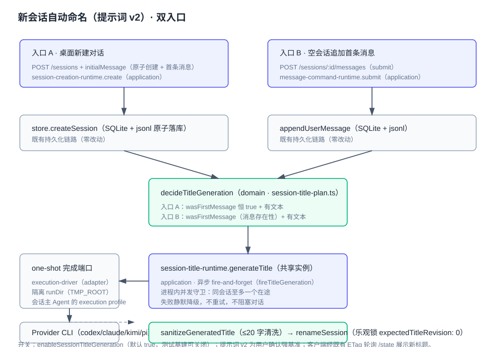

# 设计：session-title-generation-entry-points

## 方案




### 触发点

`LocalSessionCreationRuntime.create()` 在 `store.createSession` 成功（会话 + 首条消息原子落库）后、`processPending` 前：

```ts
const firstMessageBody = content.normalizedInitialMessage ?? "";
const titleGeneration = decideTitleGeneration({
  wasFirstMessage: true,
  firstMessageHasText: firstMessageBody !== "",
});
if (titleGeneration.kind === "generate") {
  this.input.generateSessionTitle({ sessionId, firstMessageBody });
}
```

- `wasFirstMessage` 恒 true：creation 路径必然是全新会话；
- `?? ""` 把 `normalizedInitialMessage: string | undefined` 收敛为 string，与 submit 路径的 `content.trimmed` 形态一致；
- 纯附件（无正文）→ `firstMessageHasText: false` → skip，标题继续走既有默认派生（附件显示名）。

### 共享触发

`runtime-session-wiring.ts` 已构造 `LocalConsoleSessionTitleRuntime`（含 inFlight 守卫、one-shot 端口、`sessionPrimaryProfile`、`renameSession` 乐观锁、错误上报）。提取共享函数：

```ts
const fireTitleGeneration: (input: { sessionId: string; firstMessageBody: string }) => void = (titleInput) => {
  void titleRuntime.generateTitle(titleInput.sessionId, titleInput.firstMessageBody);
};
```

同一函数注入两处：
- `createLocalMessageRetryWiring` 的 `generateSessionTitle`（submit 路径，现状）；
- `createLocalSessionCommandWiring` 的 creation 端口组（新增字段，类型 `CreationPorts["generateSessionTitle"]`）。

两条入口由此共享同一 runtime 实例——「同会话同一时刻至多一个在途生成」的进程内守卫、开关 enablement、失败静默与乐观锁冲突语义天然一致，不产生第二套行为。

### 端口形状

`generateSessionTitle(input: { sessionId: string; firstMessageBody: string }): void` 复用既有 `MessagePorts["generateSessionTitle"]` 形状，creation 端口不另造形状，杜绝两套形状漂移。

## 权衡

| 选项 | 放弃什么 | 为何不选 |
| --- | --- | --- |
| 在 server.ts（adapter）层触发 | 触发判定进 adapter 薄层 | 违反四层架构：判定属 domain/application，server 只做参数读取 |
| 在 renderer/desktop 侧触发 | 双端同步成本 | renderer 只调 API，行为事实在服务端；改 renderer 徒增漂移面 |
| 为 creation 路径新建第二个 title runtime 实例 | 双实例的独立性 | 破坏 inFlight 单例语义（同会话可双生成），开关语义分裂 |
| 在 creation 路径重复写判定条件 | 判定收敛 | 复用 `decideTitleGeneration`，判定留在 domain 单点 |
| 走 spec 内联而非完整 change | change 流程成本 | 用户明确指示完整 change；且 PRD 缺口（自动生成语义从未落盘）属产品意图补写 |

## 风险

- **空正文边界**：`initialMessage: ""`（空串）与 `undefined`（缺省）行为不同——空串走 `deriveSessionTitle("")` → 「新会话」，缺省走附件分支。本改动不触碰该派生逻辑，仅保证两种形态都不触发模型生成（`?? ""` 后均为空 → skip）。已用测试固化（纯附件用例）。
- **并行时序**：标题生成与主流程 run 并行；标题 one-shot 失败静默，不阻塞 `processPending`。与 submit 路径既有行为一致。
- **回滚**：改动集中在三个 wiring/runtime 文件的接线与一个测试文件，无数据迁移、无 schema 变化；回滚即还原三处接线与测试增量。
