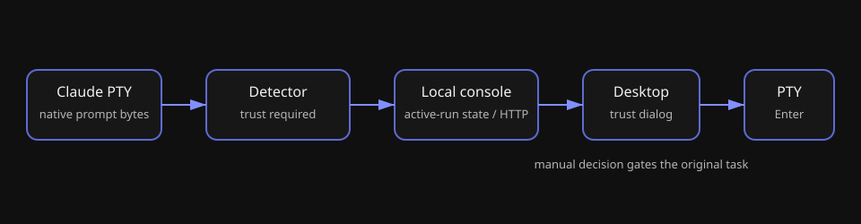
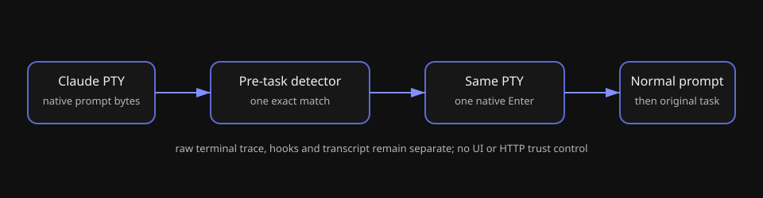

# 设计：claude-tui-auto-workspace-trust

## 方案

### 模块 1：Claude PTY 预任务自动确认

本项目约束：用户要求只在 Claude 已显示的原生信任提示上自动按 Enter；现有 ClaudeTuiWorkspaceTrustDetector 已在任务写入前识别该提示，现有 ClaudeTuiRuntime 已验证同一 PTY 的 Enter 后可等待正常输入提示并写回原任务 → 采纳在 provider adapter 内直接驱动一次 native Enter 的状态转换。

检测器仍只观察任务写入前的原始 PTY 字节，保留 ANSI 正规化与已知原生提示指纹。首次命中后，runtime 立即锁定“已自动确认”状态、向同一 PTY 写入一次 Enter，并把检测器切换到只等待正常输入提示的后续阶段。只有该提示返回后，原始人类任务才可写入；任务写入后检测器仍被销毁。重复 redraw、普通终端文本、Agent 输出或 lifecycle/transcript 事件均不能追加 Enter。

### 模块 2：删除人工信任控制面

本项目约束：产品 PRD 现已规定不显示人工信任对话框，且现有 workspaceTrust projection、HTTP route、Desktop callback 与 console-ui dialog 的唯一职责都是人工 trust/decline 决策 → 采纳删除该专用链路，而不是保留不可达的 UI/API。

删除范围包括 local-console 的 active-run trust 状态、runtime controller、POST route 与相应纯 plan；Desktop API client／view callback；console-ui dialog、导出、stories、翻译键与组件测试。Claude raw terminal trace 保持只读，其他 provider 的 state/API 不变。

### 模块 3：可观察验证

本项目约束：这是会写入原生 PTY 的用户可见行为，AGENTS.md 要求真机验收；现有测试已覆盖检测器、PTY、local-console、真实 Claude CLI 与真实 Electron → 采纳逐层验证而非用 build 成功代替。

单元测试验证首次匹配只写一个 Enter、必须等待正常 prompt 才写原任务、重复 redraw 不会双写、任务开始后的提示文本不能触发确认。local-console／Desktop 测试验证不再暴露人工 trust 状态或 route。真实 Claude CLI 与真实 Electron 以新工作区启动，验证无对话框即可完成首轮、同 PTY 第二轮、idle 精确 resume、只读 terminal 与 transcript usage 不回退。

## 权衡

| 候选 | 结论 | 理由 |
| --- | --- | --- |
| 自动识别后在同一 PTY 写一次 Enter | 采纳 | 用户明确要求自动跳过该步骤；既有真实 Claude 路径已验证 native Enter 与保留任务的顺序。 |
| 保留人工对话框并在后台替用户点击 | 不采纳 | 仍保留无意义的阻塞 UI，也会留下可从 renderer 触发的旧控制面。 |
| 通过读取或直接修改 Claude 信任记录绕过提示 | 不采纳 | PRD 的 Claude 配置所有权边界禁止 Moebius 读取或改写用户／项目 Claude 配置。 |
| 对任意包含“信任文件夹”的终端文本发送 Enter | 不采纳 | 违反“仅识别原生提示”的需求，且会把普通 terminal output 误作输入授权。 |

## 风险与回滚

- Claude 变更原生提示形态时，检测器不应误确认；它会保持不写任务／不自动 Enter，最终终局由既有 PTY 生命周期决定，具体结果留待真实 CLI 验证。回滚只需恢复人工 gate。
- 终端 redraw 重复提示可能诱发重复按键；状态锁与单元测试保证每个 bootstrap 最多一次 Enter。
- 本次行为会由 Claude 自己决定是否记录信任；Moebius 不读写该记录。真实 CLI 与 Electron 在临时工作区运行，避免污染用户工作区。

## 测试策略

| 变更单元 | 验证层级 | 证据 |
| --- | --- | --- |
| 预任务自动确认状态机 | Vitest 单元／adapter | Enter 次数、任务写入顺序、重复 redraw、异常退出 |
| 控制面删除 | local-console／Desktop／console-ui 测试 | 无 workspaceTrust 投影、无信任 route、无 dialog |
| CLI 原生行为 | 真实 Claude CLI | 临时工作区首次提示自动确认并完成保留任务 |
| 用户入口 | 真实 Electron | 首轮不显示 dialog、终端只读、同 PTY 第二轮与 idle --resume |

## 方向性风险判定

无方向性风险。自动确认的产品选择由用户明确指定；同一 PTY 的 native Enter 与等待正常输入提示均来自既有实现和真实 Claude CLI 验证；没有新增依赖、持久化格式、公开 API 或并发模型选择。
