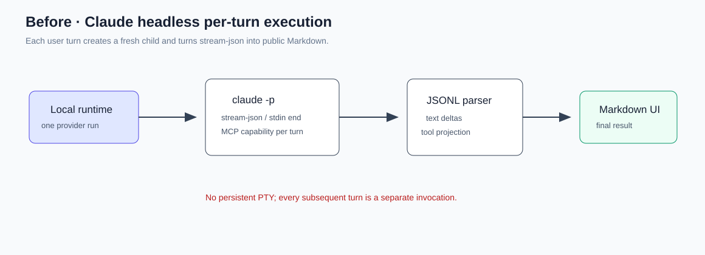
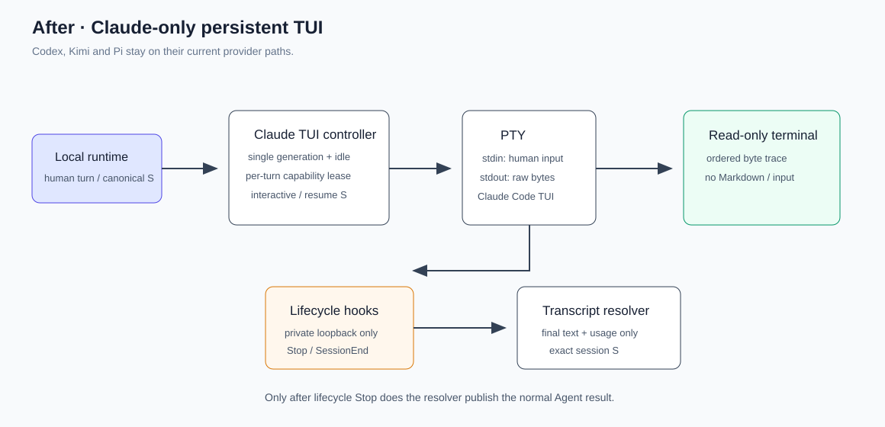

# 设计：claude-tui-resume

## 方案

### 持久 PTY 与轮次状态

`claude-tui-transport` 是一个可注入 PTY factory 的窄 provider adapter。它只拥有一个物理 PTY、精确的原始字节顺序、写入人类输入、resize、退出和 idle timer；不解析 Claude 文本、不决定 Agent 路由，也不创建 shell 包装。一个 canonical Claude session 在当前 TUI 存活期间只有一个 transport generation；同一 generation 内的后续 turn 清除 idle timer 并向同一 stdin 写入输入。

`claude.ts` 后续接入时，首次 generation 使用交互 `--session-id S`，idle 后的下一 generation 使用 `--resume S`。绝不使用 `-p`、`--output-format stream-json`、`--continue` 或最近会话推断。PTY 非正常退出不伪造本轮完成；下一次明确请求才走 canonical resume。

### lifecycle 与结果来源分离

每个 PTY 生成一个仅 Moebius 可读的 temporary settings file，内容仅有带不可猜 capability 的 loopback HTTP hooks。Claude Code 当前只允许 `SessionStart` 使用 command/MCP hook，因此 PTY owner 在真实启动后直接登记 session-start；私有 HTTP receiver 只接受 `UserPromptSubmit`、`Stop` 和 `SessionEnd` 的身份/顺序信息，丢弃所有正文载荷。每轮写入人类输入前会捕获已验证 transcript 的记录边界；`Stop` 后 resolver 只接受该边界之后追加的最终 Agent 正文和 usage，不能把同一持久会话的旧 final 误投影为新轮。Claude 的落盘略晚于 `Stop` 时，仅对未找到／未完成记录做有界重读；身份、路径、重复候选与 cursor 异常立即 fail-closed。resolver 不能以 transcript 或终端字节驱动 lifecycle。

### 首次工作区信任交互

Claude Code 可能在新目录的交互启动阶段显示“是否信任此文件夹”的原生选择。该提示是一次显式的人类安全决策，不是 lifecycle：PTY owner 只在首个任务尚未写入、且终端显示已知的 Claude 信任提示时将 active run 标为等待信任；它不从终端文本推导 Start／Stop／结果／usage，也不把提示文本投影为 Markdown。

Moebius 不自动输入“信任”。桌面端的明确选择只会写入同一个 PTY：信任写入 Claude 当前原生提示已显示的默认项确认键（Enter），等待它回到正常输入提示后再发送原始任务一次；不信任写入当前原生取消键（Esc）并安全终止当前 run。真实 Claude Code 2.1.239 在这里会输出非空 `❯ Try "write a test for <filepath>"`（`❯` 后是 non-breaking space），因此 detector 同时识别这一已知 native pre-task input affordance 和旧的空 `❯` 形式。已进入正常 Claude turn 后的终端输出不再参与该检测，以免 Agent 输出伪造交互提示。这个门槛不读取、修改或持久化 Claude 的用户／项目配置或信任记录。

### 多行人类输入

真实 Claude TUI 会把同一次 PTY write 中的多行正文与尾随 `\r` 视作粘贴内容，而非提交。为保持“每轮仍只向同一 PTY 写入人类输入”的契约，多行任务先原样写入；收到 Claude 对粘贴内容的终端重绘后，等待 `CLAUDE_TUI_MULTILINE_SUBMIT_SETTLE_MS=75` ms 的输出静默，再单独写入 Enter。单行输入仍以原有的一次 write 提交。该输入节奏已由 fake PTY、真实 Claude CLI 和真实 Electron 主页面验证；它不改变 human input、session 或 resume 的对外语义。

### 托管运行项 capability

TUI 启动时的 MCP transport 保持连接，但它不持有永久 provider-run capability。新的 Claude relay 对每个活跃 turn 向现有 `ManagedProcessSupervisor` 申请一份 lease，在 Stop、idle、取消、异常退出和下一 turn 前撤销。公开 MCP schema、工作目录约束和禁止 shell/env/PID 输入保持不变。

relay 仅以运行目录内 `0600` 的私有 JSON 文件传给 Claude 的 `--mcp-config`；绝不传 `--strict-mcp-config`，因此不会要求 Claude 忽略其余 MCP 配置。Moebius 不读取、合并、改写或持久化用户／项目 Claude MCP 配置；私有文件在 generation 清理时删除。

### 终端输出与打包

PTY bytes 按序作为运行期 trace/delta 送到只读 xterm surface，不进入 Markdown renderer 或 session JSONL 正文。renderer 不向 PTY 写入命令；仅由 composer 提交人类消息，尺寸变化使用独立 resize API。`node-pty` 为原生运行时依赖，桌面构建必须外置并 `asarUnpack`，产物验收须检查 macOS arm64 `spawn-helper` 为可执行文件。

## 权衡

- **`node-pty` vs `/usr/bin/script`**：后者在本机 pipe 环境因 `tcgetattr/ioctl` 失败；前者已在 Node 和 Electron 中完成读写 spike。代价是原生依赖与打包验证。
- **独立 lifecycle hook receiver vs 解析终端提示符**：选择 hooks，避免依赖主题、ANSI 或 TUI 文案；代价是增加一次私有 loopback 通信与 settings 临时文件。
- **raw terminal vs stream-json Markdown**：选择 raw terminal 作为实时显示，保留 transcript 仅作最终事实；代价是不再把中间 TUI 文本误当 Agent 回复。
- **稳定 MCP transport + run lease vs 每轮重启 TUI**：选择前者以符合持久 PTY，同时保留最小权限边界；代价是新增 Claude 专属 relay，其他 provider 不受影响。
- **私有 `--mcp-config` vs 不提供 relay／改写 Claude 配置**：用户要求的 managed-process 能力需要 Claude 看见 Moebius relay；已安装的 Claude Code 将 `--strict-mcp-config` 定义为“只使用 `--mcp-config`、忽略其余 MCP 配置”，而本实现明确不传该 flag。因此选择仅加载每个 generation 的私有 relay 配置；不提供配置会让 relay 不可用，读写或合并用户／项目配置则违反产品约束。

## 现有方案调研

- **终端渲染候选**：`@xterm/xterm@5.5.0` 与本项目 Vite 5 的组件包构建、Storybook 构建均已实际通过；其 `Terminal.write`、`disableStdin` 和 `linkHandler` API 能承载冻结方案中的“按序原始字节、只读、禁链接”约束，因此采纳为 renderer 的唯一 terminal emulator。`@xterm/xterm@6.0.0` 未采纳：当前需求不要求升级，5.5.0 已完成本项目构建验证。自定义 `<pre>` 未采纳：无法解释 ANSI／光标控制序列，违反本方案的 raw terminal 约束。
- **Node bundle 候选**：初次 Electron Node bundle 实测因 `node-pty` 的 native loader 生成 esbuild dynamic-require shim 而失败；将 `node-pty` 作为桌面 direct dependency 外置，并显式列入 `asarUnpack` 后，`pnpm --filter @moebius/desktop build` 通过。该做法保留原生包自己的 loader，且符合本方案既定的外置／解包要求。
- **最小验证证据**：`pnpm view @xterm/xterm@5.5.0 dist.unpackedSize` 输出 `2400898`，`@xterm/xterm@6.0.0` 输出 `5921599`；组件包构建输出 `✓ built in 4.52s`，Storybook 输出 `✓ built in 9.08s`。本地 unsigned macOS arm64 `electron-builder --dir` 产物还实际确认了 `app.asar.unpacked/node_modules/node-pty/prebuilds/darwin-arm64/spawn-helper` 为 `0755` 的 arm64 Mach-O；这不替代正式签名／notarization 验收。
- **`--mcp-config` 方向验证**：2026-08-22 在本机执行 `claude --version && claude --help`，输出版本为 `2.1.239 (Claude Code)`；同一版本帮助将 `--mcp-config` 描述为加载 JSON 文件／字符串中的 MCP server，并将 `--strict-mcp-config` 描述为“仅使用 `--mcp-config`、忽略所有其他 MCP 配置”。`tests/claude.test.ts` 同时断言本项目 argv 含私有 `--mcp-config` 且不含 `--strict-mcp-config`。据该已安装 CLI 契约可判定私有 relay 配置为附加加载，不会隔离 Claude 既有 MCP 配置；此方向性风险关闭。

## 风险

- 原生 helper 的本地 unsigned macOS arm64 `--dir` 产物可执行位已验证为 `0755`；正式签名、notarization 与发布产物仍未验证，失败时不发布。
- 真实 Claude CLI 已验证显式信任、同一 live PTY 的第二轮、idle 后精确 `--resume`、raw terminal 与 transcript usage；此次三轮 `cache_read_input_tokens` 为 `30046`、`52891`、`30046`。2026-08-22 的真实 Electron 主页面验收也以真实 UI 完成 onboarding、Claude 选择、项目选择、Escape 不可绕过信任、显式信任、三轮发送、只读终端和 idle resume 共 12 项断言；该轮的 `cache_read_input_tokens` 为 `30046`、`53570`、`30046`。
- [待核实] 上述成功的 Electron 验收打印了 4 条 Chromium `404` resource console diagnostic 和一条 macOS IMK mach-port warning；断言未失败，但尚未定位诊断来源，因此不将其表述为无诊断通过。
- PTY 输出可能包含控制序列；只交由 terminal emulator 消费，不映射到 HTML/Markdown，终端链接与任意 renderer-side input 保持禁用。
- 回滚可按 Claude adapter 分支独立恢复 headless 实现；不会迁移 canonical ID、会话 JSONL 或其他 provider 数据。
