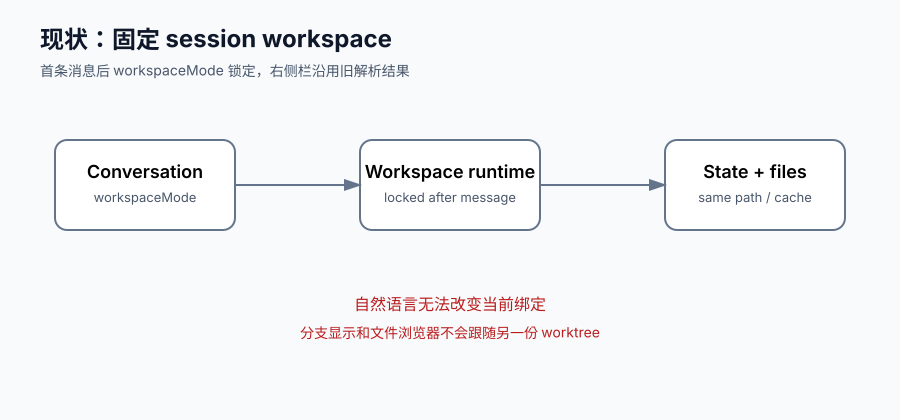
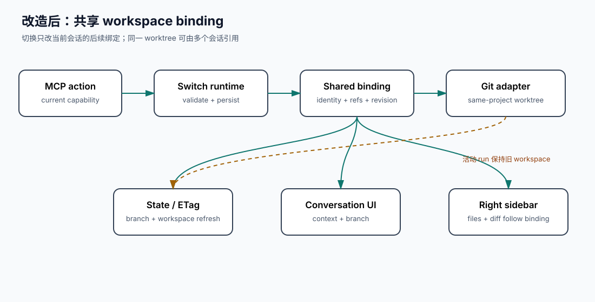

# 设计：conversation-workspace-shared-lease

## 方案





### 共享 lease 语义

- 一个会话同一时刻只有一个当前 workspace binding；一个 worktree 可以被多个会话同时引用。
- 切换不进行所有权转移，不因目标已被其他会话绑定而拒绝，也不修改当前 provider 进程的 cwd。
- 活动 run 继续使用其创建时冻结的 workspace context；切换后的 binding 从下一次 run 生效。
- 共享 binding 不新增全局写锁、自动合并器或并发写入归因。Git/命令自身的冲突结果按现有错误链路呈现。
- 离开临时 worktree 时，仅当共享引用数为零且没有活动 provider/托管进程才调用 Trash；共享、忙碌、非临时或项目根目录均保留并返回可显示原因。

### 输入与解析

MCP 工具只接受以下结构之一：

```ts
{ target: "project-root" }
{ target: "branch", branchName: string }
```

`branchName` 通过当前项目仓库的 `git worktree list --porcelain` 解析到已有 worktree。缺失、歧义、越出当前项目仓库或不可读目标拒绝；不隐式创建、删除、切分支、fetch、merge 或 rebase。工具不接受绝对路径、脚本、shell 字符串或外部 session id，调用身份由当前 MCP capability 提供。

### 数据流

`moebius_switch_workspace` → session-scoped switch runtime → Git target resolution → binding persistence + workspace revision → state API/ETag → composer context、branch label、project files 与 workspace diff。

旧 worktree 的清理请求经过 application 层的窄 `moveToTrash` port；Desktop adapter 复用 `shell.trashItem`。CLI 或能力不可用时保留目录并返回结构化 unavailable 原因。

### 关键选型理由

每条方案条目均按“本项目约束 → 采纳结论”记录：

| 方向 | 选型理由与结论 |
| --- | --- |
| 共享 lease | 用户确认“对话和 worktree 非独占” → 同一 worktree 允许多个会话绑定，不做独占冲突或所有权转移。 |
| 会话绑定事实 | 会话 JSONL 是持久时间线事实源，SQLite 保存可变状态与索引，现有设置已有 workspaceMode 持久化路径 → 扩展现有 session workspace binding，并保留旧字段兼容。 |
| 目标解析 | 用户要求继续已有分支对应 worktree，现有 `workspace-source.ts` 已使用稳定 worktree 路径和真实 branch → 复用 bounded `git worktree list --porcelain`，不隐式创建目标。 |
| MCP 入口 | ADR-0009 已确定统一 stdio bridge、capability token 与 session/workspace/provider-run 绑定 → 在 `moebius_managed` bridge 增加当前会话专属 workspace control tool。 |
| 活动 run 语义 | 托管进程 capability 已绑定 provider run 的 workspaceRoot，cwd 隔离 spike 证明子进程不能改变父进程 cwd → 当前 run 保持原绑定，下一次 run 使用新绑定。 |
| 状态刷新 | 现有 state API 使用 revision/ETag，缓存 spike 复现同 revision 会遮蔽 branch 变化 → 切换递增 workspace revision，并失效 branch/workspace 查询缓存。 |
| 文件浏览器刷新 | 现有 ProjectFilesTab 只按 sessionId/workspaceMode 重载，且产品要求右侧栏打开新文件夹 → 把 workspace identity/revision 纳入查询与 UI effect 依赖。 |
| Trash | 用户要求离开的临时 worktree 进入 Trash，Desktop 已有 `shell.trashItem`，仓库禁止任意 shell → 复用窄 Trash adapter，并在共享/忙碌时安全保留。 |
| 并发写入 | 用户只确认绑定非独占，且本 change 只覆盖切换、显示和浏览；仓库无现成跨会话写锁 → 不新增全局写锁或自动合并器，保留现有 provider/run 行为。 |
| 产品差异显示 | 共享 worktree 可能包含其他会话的变化，现有右侧栏不做改动归因 → 改为显示当前绑定工作区相对该会话基线的变化，明确不声称来源。 |

无“无本项目依据，仅为惯例”的方案条目。

### 变更单元与依赖

1. **M1 binding domain**：定义 workspace identity、共享引用、revision、临时生命周期和清理资格。
2. **M2 Git adapter**：解析项目根、已有 worktree、真实 branch 与确定性失败。
3. **M3 persistence**：扩展 session workspace 设置，兼容旧 `workspaceMode`，保存每个 binding 的 baseline/revision。
4. **M4 switch runtime**：校验目标、写入 binding、发布 revision、处理旧临时 worktree 清理请求。
5. **M5 MCP**：把 workspace tool 路由到当前 session，保持 managed process settlement 只识别既有 process tools。
6. **M6 state/UI**：投影当前 binding、真实 branch、revision；刷新 composer、branch、项目文件和改动标签。
7. **M7 Trash adapter**：Desktop IPC 接线与不可用时的安全降级。
8. **M8 集成验收**：定向测试、scope 回归、真实 Electron 用户动作与全量回归。

### 测试策略

| 单元 | 测试层级 | 覆盖行为 |
| --- | --- | --- |
| M1 | domain/runtime 单测 | 多会话共享、切换引用、零引用判断、运行中不可清理 |
| M2 | Git adapter 单测/临时仓库测试 | 同仓库目标、缺失、歧义、prunable、越界与真实 branch |
| M3 | 持久化/重启测试 | 新字段、旧会话兼容、binding baseline/revision 恢复 |
| M4 | application runtime 测试 | 成功切换、失败不落盘、活动 run 保持旧 cwd、清理分支 |
| M5 | MCP bridge/provider wiring 测试 | schema、capability、路由、工具 settlement 不串入 workspace tool |
| M6 | HTTP/UI 测试 | revision/ETag、真实 branch、文件树重载、迟到响应隔离 |
| M7 | adapter/IPC 测试 | Trash 调用、共享或忙碌时不调用、CLI unavailable 降级 |
| M8 | 真实 Electron + 全量回归 | 自然语言触发、分支显示、文件浏览器跟随、Trash 与回归对比 |

## 权衡

- 共享 binding 牺牲了 worktree 的独占写入保护，换取多个对话之间的灵活切换；本 change 不伪造并发写入安全性。
- 只解析已有 worktree，牺牲了“切换时自动创建”便利性，避免自然语言误创建目录或分支。
- 当前 run 不迁移 cwd，牺牲了单轮即时切换，换取托管进程 capability 与执行审计的一致性。
- 改动标签不做对话归因，牺牲了“这段对话改了什么”的精确表述，换取共享 worktree 下不误导用户。

## 风险与回退

- 共享 worktree 的并发写入可能产生 Git 或文件冲突；回退路径是保留现有错误记录，不自动覆盖或合并。
- 目标 worktree 解析失败时保留旧 binding、文件树和会话历史，不进行部分切换。
- Trash 能力缺失或失败时保留目录并记录原因，不把清理失败伪装成切换失败。
- 需要回退时可关闭 workspace MCP tool 并继续使用旧 `workspaceMode` 解析；新增 binding 字段保持可忽略，旧会话不丢失。

## 方向性风险判定

R1“独占／转移／共享 lease”已由用户明确确认 C，风险关闭。其余方向均可由用户需求、仓库既有惯例或已执行 spike 推出；无未关闭方向性风险。

## 遗留事项

- 基线 `pnpm test` 已实际执行但存在既有清理失败：退出码 1，143 个测试文件通过、1 个失败、1 个跳过；1027 个测试通过、1 个失败、5 个跳过。
- **未验证**：Git 缺失、歧义、prunable、越界目标的完整实现。
- **未验证**：共享引用与活动 provider/托管进程组合时序。
- **未验证**：binding persistence 的迁移和重启恢复。
- **未验证**：所有 Provider 对 workspace MCP tool 的发现与路由。
- **未验证**：真实 Electron 中状态、真实分支、项目文件和改动标签刷新。
- **未验证**：Desktop Trash 的真实端到端动作。
- **待核实**：CLI 模式下系统 Trash 不可用时的最终提示；默认保留目录并报告原因。

## 方案状态

本方案经评审交接后自主定稿，按纪律第 3 条分级作为基准；spec-delta 在实现验证完成后回流，不提前修改现有行为事实规格。
