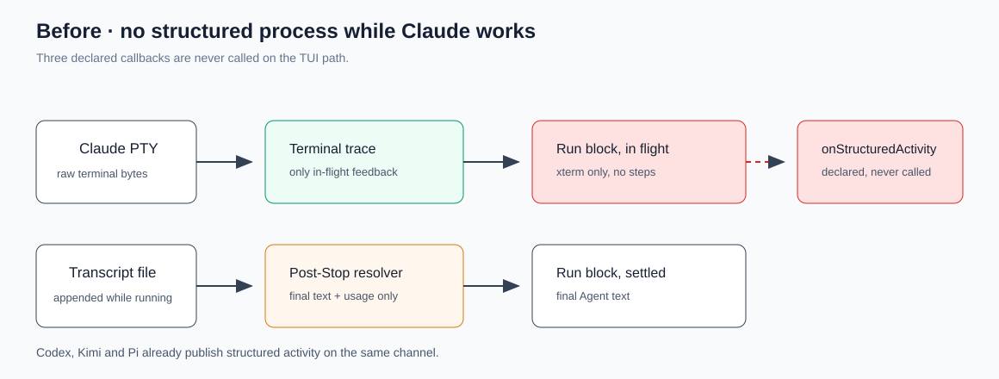
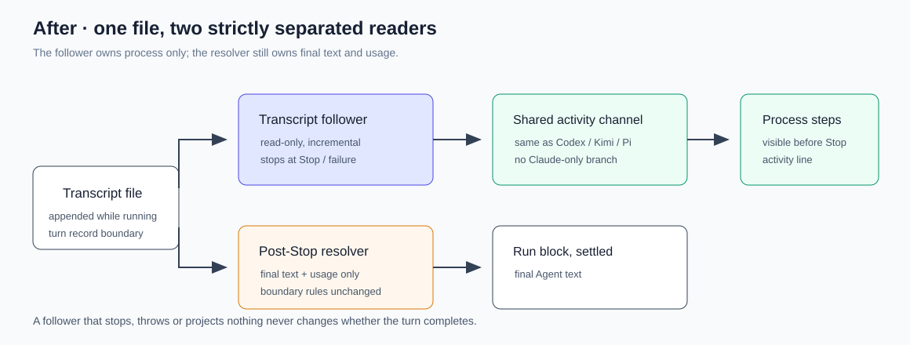

# 设计：claude-live-process-steps

## 方案

### 只读跟随器

新增 `src/claude-tui-transcript-follower.ts`，职责单一：在一个轮次的生命周期内，把 Claude 已落盘的 transcript 记录按顺序增量投影出去。

- **起点**：复用现有的记录边界。`src/claude.ts` 在写入人类输入前已经捕获 `transcriptAfterRecordCount`，跟随器以同一个边界为游标起点，因此运行中投影与 Stop 后定案共用同一条「本轮从哪里开始」的事实。
- **身份**：复用 `src/claude-tui-transcript.ts` 既有的解析路径——`CLAUDE_CONFIG_DIR` 或用户 `~/.claude/projects`，精确 session UUID，immutable cwd 交叉校验。身份、路径或候选重复异常时停止跟随并静默降级，不猜测、不换源。
- **增量**：按游标读取新追加的记录；只处理已完整成行的记录，半行留到下次。文件被截断、替换或游标倒退时停止跟随，不重放。
- **投影**：复用 `provider-native-process-traces` 已定的 Claude transcript 事件形状（thinking / tool_use / tool_result），使 `src/local-console/run-activity.ts` 不必为 Claude 新开分支——它已经能处理 Kimi 的同类事件。
- **终止**：Stop、idle、取消、PTY 异常退出、下一轮开始前都必须停止并释放句柄。

### 接线

`src/claude.ts` 的 `advanceInitialInput` 写入任务后启动跟随器，`finishStoppedTurn` 与 `settleFailure` 停止。三个已声明但从未调用的回调获得实现：

- `onStructuredActivity`：跟随器投影的每条事件；
- `onExecutionProgress`：工具开始/结束等既有进展语义，接入现有本地监督（工具执行闸与空转判定）；
- `onVisibleAgentMarkdown`：**本 change 不接**。Claude 的可见正文仍只在 Stop 后由 resolver 定案，运行中不做流式正文，避免与「最终正文只来自记录边界之后的 assistant 记录」的既有 fail-closed 判据产生第二个来源。

### 与结果来源的隔离

跟随器与 resolver 读同一个文件，但职责严格分开：跟随器只产出过程事件，resolver 仍是最终正文与 usage 的唯一来源，判据与重试边界不变。跟随器停止或从未产出任何事件都不影响本轮能否正常完成——这一点必须由测试固定，否则会把「过程展示」偷偷变成结果链路的前置依赖。

## 权衡

- **transcript 跟随 vs 解析终端字节**：选前者。终端字节是给人看的 TUI 重绘，解析它等于把 ANSI 与主题变成事实源，且 `claude-tui-resume` 已明确禁止用终端字节驱动任何语义。代价是过程显示略滞后于终端。
- **transcript 跟随 vs 回到 headless stream-json**：不采纳后者。那是换执行引擎级别的回退，会丢掉持久 TUI 带来的 session 连续性与 relay 稳定性；本 change 的目标是补齐展示，不是推翻传输方式。
- **运行中不接流式正文**：见上。少一个来源换来结果链路判据不变，是划算的；如果将来要做流式正文，应作为独立 change 并重新论证与记录边界的关系。
- **轮询 vs 文件监听**：实现细节留给实施，但必须有上限——监听失败时回退到有界轮询，不做无限重试。

## 风险

- **落盘滞后**：Claude 写 transcript 略晚于终端显示（`claude-tui-resume` 已记录该现象）。表现为步骤比终端慢一拍；这不构成回归，因为当前根本没有步骤。
- **长轮次文件增长**：跟随器只读增量、不缓存全文；需要确认大 transcript 下的读取开销可接受。
- **与 Stop 后重读的竞态**：跟随器可能正读到 resolver 也在读的记录。两者都只读，且 resolver 有自己的边界判据，不共享可变状态。
- **回滚**：跟随器可整体关闭，回到「运行中无过程步骤」的当前行为；不迁移 canonical ID、会话 JSONL 或其他 provider 数据。
