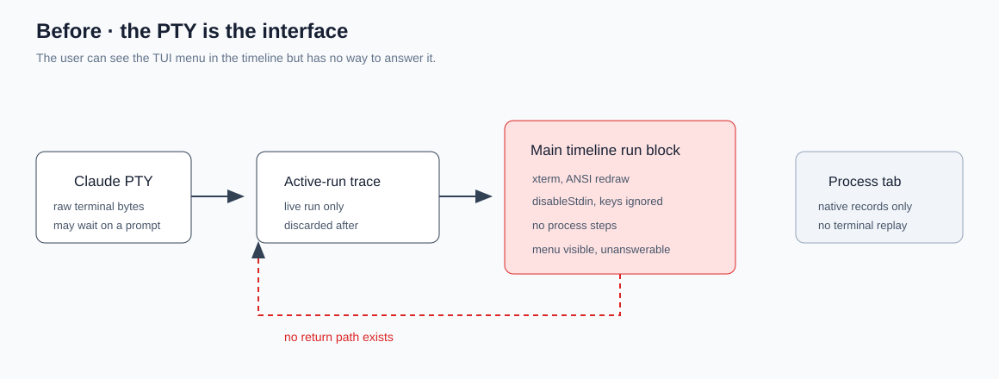
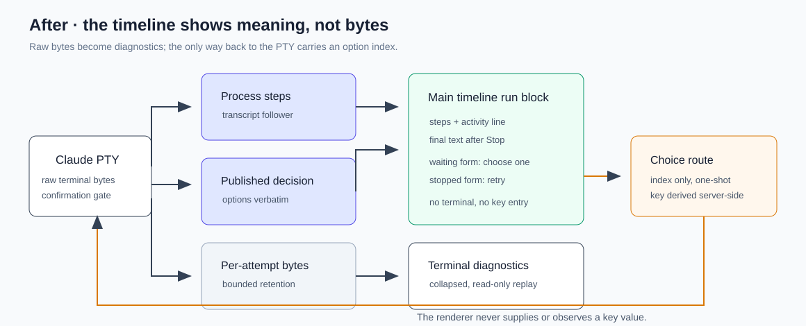

# 设计：claude-terminal-demotion

## 方案

### 终端从主时间线迁到诊断区

`ClaudeTerminalSurface` 组件本身保留——它的只读约束（`disableStdin`、按键处理器恒 false、`linkHandler: null`、textarea 只读且不可聚焦）正是诊断区需要的。改变的只有它挂在哪里：

- `packages/console-ui/src/console/run-block.tsx` 去掉 `claudeTerminal` 分支；
- 右侧栏过程标签的每次尝试下新增终端诊断区，默认收起，展开后按原有游标增量回放该次执行的字节；
- 终端数据的生命周期随之从「活动运行块存活期间」扩展到「该次尝试可查看期间」。这是本 change 里唯一有存储含义的改动：需要确认按尝试保留的字节量上限与清理时机，超限时明确显示「该次执行的终端诊断已不完整」，不静默截断。

### 等待确认与已停下两种运行块形态

`claude-tui-native-prompt-gate` 产出两类事实，UI 各对应一种形态：

- **等待确认**：带候选项。候选项原样渲染成单选列表（不翻译、不重排、不补充 Moebius 自己的选项），附「查看终端原文」折叠区。这一形态不显示成正在工作，不计入完成、正文或 usage。
- **已停下**：无候选项。说明卡住 + 终端原文折叠区 + 显式重试，沿用既有安全失败块样式。

两种形态都不出现任何可输入控件，终端原文折叠区仍是只读回放。

### 反向控制通道

新增一条控制路由，走既有 `src/local-console/control-dispatch.ts`，请求体只有三个字段：会话、待决策标识、候选项序号。

- **窄**：只接受序号，不接受按键、文本或命令。任何越出候选项集合的序号直接拒绝。
- **一次性**：待决策标识随本轮生成且只能消费一次；重复提交幂等，不重复写 PTY。
- **过期即拒**：本轮已经离开等待态（用户停下、PTY 退出、TUI 被清理）时拒绝并说明状态已变化，不写入已经失效的 PTY。
- **仍是 Moebius 写入**：真正写进 PTY 的按键由后端按候选项序号生成，renderer 永远不接触按键值——这保证「终端不是输入入口」这条产品约束在实现层也成立。

## 权衡

- **保留终端作为诊断 vs 彻底删掉**：保留。原始字节在排查 TUI 集成问题时不可替代，且已有完整的只读实现；代价是多一处需要管生命周期的数据。
- **候选项列表 vs 只给「重试」**：选前者。只给重试意味着 Claude 每新增一种确认，产品就完全瘫痪到下次发版；候选项列表让用户能自救，且不要求 Moebius 理解提示语义。
- **窄序号通道 vs 让终端可写**：选前者。让终端可写等于把 PTY 实现细节升格成用户界面，且无法约束用户输入什么；窄通道保留了「Moebius 是唯一写入方」的既有边界。
- **诊断区放右侧栏过程标签 vs 运行块内折叠**：选前者。过程标签已经是「本地调试材料」的既定去处，运行块内再挂一个折叠终端会把噪音留在主视线上，与本 change 的目的相反。

## 风险

- **拆终端早于补步骤**：若在 `claude-live-process-steps` 之前落地，Claude 运行中会变成完全空白。缓解：依赖关系写进 proposal，实施顺序不得颠倒。
- **终端字节保留策略**：按尝试保留会增加内存/存储占用。缓解：先定上限与清理时机，超限显式说明而非静默截断。
- **候选项渲染的注入面**：候选项文本来自终端。缓解：作为纯文本渲染，不解释 HTML、Markdown、脚本或终端控制序列——与过程标签既有的只读文本规则一致。
- **回滚**：可按「恢复 run-block 的终端分支 + 关闭控制路由」独立回滚，不影响过程步骤、PTY 生命周期与结果来源。
