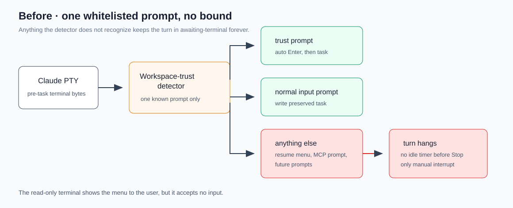
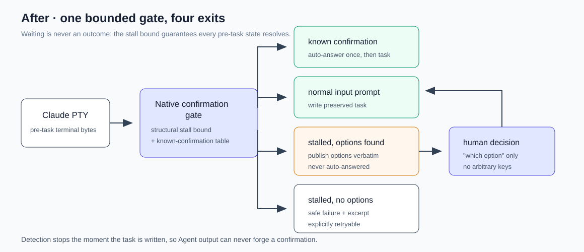

# 设计：claude-tui-native-prompt-gate

## 方案

### 判定翻转：从「这是不是信任提示」到「是不是在等人」

`src/claude-tui-workspace-trust.ts` 换成 `src/claude-tui-native-prompt.ts`。原检测器的三态（`waiting` / `workspace-trust-required` / `terminal-ready`）扩展为四态：`waiting` / `native-prompt` / `terminal-ready` / `stalled`。

判定分两层，顺序固定：

- **结构层（兜底，必须有）**：`waiting` 状态下终端输出静默超过 `CLAUDE_TUI_NATIVE_PROMPT_STALL_MS` 且仍未出现正常输入提示，进入 `stalled`。这一层不理解任何提示语义，只判断「PTY 不动了且没就绪」，因此覆盖所有未来新增的确认。
- **语义层（优化）**：已知确认表按顺序匹配，命中即产出 `native-prompt` 及其处置。已知表只有三条：工作区信任、恢复模式、MCP 授权。

`stalled` 时再做一次通用候选项抽取：在归一化后的终端可见文本里找形如 `<数字>. <文本>` 的连续行组（Claude TUI 的选择菜单形态）。抽到候选项则产出 `native-prompt` + `kind: "unknown-choice"` + 候选项原文；抽不到则产出安全失败。抽取只识别结构，不理解语义，也不猜测哪一项是安全的——因此 `unknown-choice` 永远不自动应答。

检测器仍在任务写入后立即丢弃，这一点不变：已知确认与候选项抽取都只在首个任务写入前有效，Agent 输出无法伪造确认。

### 处置分层

| 确认 | 来源 | 处置 |
| --- | --- | --- |
| MCP 授权 | Moebius 注入的 `moebius_managed` relay | 上游消除；失败则自动选「仅本次使用」 |
| 恢复模式 | Moebius 发起的 `--resume S` | 上游消除；失败则自动选「按原样恢复完整会话」 |
| 工作区信任 | 用户的目录 | 保持现有自动 Enter |
| 可辨认候选项 | 未知 | 上抛为待决策事实，等待用户选择 |
| 其余 | 未知 | 有界安全失败 + 终端原文 |

恢复模式固定选「按原样恢复完整会话」：Moebius 的 canonical 语义是精确恢复同一 session，摘要恢复会替换掉这条链路唯一的事实源。不选「不再询问」，因为那会写入 Claude 自己的持久配置，越过产品红线。

MCP 授权固定选「仅本次使用」而不是「本项目所有未来 MCP server」，理由同上：后者是替用户对 Moebius 之外的 server 做决定。

### 上游消除与 settings 边界

Moebius 已经为每个 generation 写自己的临时 `--settings` 文件（`src/claude-tui-lifecycle.ts`）。`claude --help` 把 `--settings` 描述为 "additional settings"，是附加加载而非替换，因此可以在同一个文件里加 Moebius 自己的运行偏好：

- MCP 授权：`enabledMcpjsonServers: ["moebius_managed"]`（server 名固定，见 `src/claude.ts` 的 `writeManagedMcpConfig`）。
- 恢复模式：对应「不再询问」的 settings 键。

**两者都必须先在真实 CLI 上验证键名与生效性**，验证脚本记录实际观察到的行为；验证不通过就只留自动应答，不写未经验证的键。这是产品红线放宽的前提——放宽的是「Moebius 临时文件里能写什么」，不变的是「不读取、不修改用户／项目 Claude 配置」。

### 失败分类与重试

新增稳定失败原因 `claude-native-prompt-unresolved`，归入既有安全失败体系：不暴露原始终端字节到正文，终端原文只进入受信任诊断通道（当前即只读终端 trace）。这一轮不产出正文、usage 或完成态，允许按原 run 快照显式重试。

`stalled` 判定必须先确认 PTY 仍存活：PTY 已退出时走既有的非正常退出分类，不能把「进程死了」误报成「在等确认」。

## 权衡

- **通用等待态兜底 vs 继续补白名单**：选前者。白名单对开放集必然漏，而漏的代价是无限挂起——这是所有失败形态里最差的一种。语义层保留下来只是为了让已知确认能自动应答，不再承担「防挂死」职责。
- **候选项结构抽取 vs 只做安全失败**：选前者。只做安全失败时，Claude 每新增一种确认，产品就完全瘫痪到下次发版；结构抽取让用户能自救，且不要求 Moebius 理解提示语义。代价是多一条窄的反向通道（本 change 只产出事实，通道在 `claude-terminal-demotion`）。
- **上游消除 vs 只靠自动应答**：两者都做，上游优先。自动应答仍是在跟一个会改版的 TUI 打字，能不打就不打；但它必须存在，因为 settings 键可能失效或在旧版本上不存在。
- **放宽临时 settings 内容 vs 保持只含 hooks**：选放宽。原红线的意图是「不侵入用户配置」，在 Moebius 自己的临时文件里写 Moebius 自己的运行偏好不违反该意图；继续死守会逼出更差的替代方案（改用户配置，或永远靠打字应答）。
- **`--dangerously-skip-permissions` / `--permission-mode bypassPermissions`**：不采纳。它们越过的是用户对 Claude 全部工具的授权边界，与本问题（Moebius 自造提示）不成比例，且违反「按原生 Claude CLI 边界启动」的既有产品规则。

## 风险

- **settings 键未经验证**：恢复模式的键名来自菜单第 3 项「不再询问」的存在性推断，尚未在真实 CLI 上确认。缓解：把验证写成 tasks 的前置项，未验证通过则该键不写入，功能落到自动应答，行为不退化。
- **静默阈值误判**：Claude 启动慢或终端长时间无输出时可能误判 `stalled`。缓解：阈值只在「任务尚未写入」的窗口内生效，且 `stalled` 的默认处置是可重试的安全失败而不是终止会话；阈值可配置。
- **候选项抽取误判**：Agent 输出里可能出现形似菜单的文本。缓解：抽取只在任务写入前有效，此时 PTY 中不可能有 Agent 输出。
- **回滚**：三条已知确认的自动应答与结构兜底彼此独立，可分别关闭；关闭全部即回到当前行为（信任自动 Enter + 其余挂起），不迁移 canonical ID、会话 JSONL 或其他 provider 数据。
