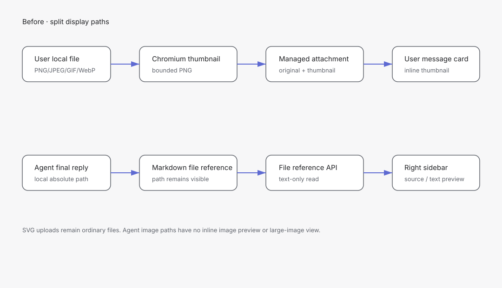
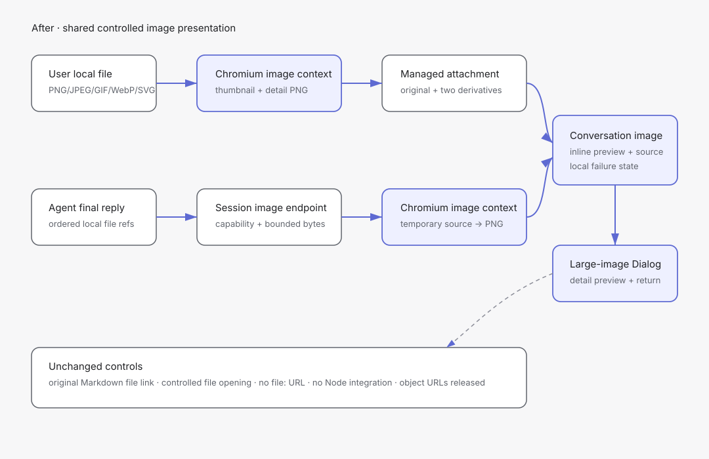

# 设计：conversation-image-previews

## 问题与成功判据

成功必须同时满足：用户附件与 Agent 本地图片引用都能在所属消息内显示；SVG 不执行脚本、不请求外部资源；无法预览的 SVG 仍可作为普通文件发送；大图查看不读取任意本地文件、不暴露托管路径、不改变原消息与 Agent 运行；非图片与远程 Markdown 图片保持现状。

## 现状证据

- `desktop/src/console-page/attachment-preview.ts` 已用 Chromium 解码和 Canvas 生成最长边 512px、最大 2MiB 的 PNG 派生预览。
- `src/local-console/attachments.ts` 已流式托管附件、按 magic bytes 识别 PNG/JPEG/GIF/WebP，并只向 renderer 返回派生 PNG。
- `packages/console-ui/src/console/structured-attachments.tsx` 已有图片/文件两种结构化卡片和 pending/failed/ready 状态。
- `packages/console-ui/src/console/markdown-internal-reference.ts` 与 local-console `file-reference` 路由已承载 Agent 本地文件引用的解析与受控读取。
- `packages/console-ui/src/ui/dialog.tsx` 已提供符合当前设计语言的 Radix Dialog，可承载大图查看层。

## 现有方案调研

- Chromium 图片上下文 + Canvas（[MDN：SVG as an image](https://developer.mozilla.org/en-US/docs/Web/SVG/Guides/SVG_as_an_image)、[Electron Security](https://www.electronjs.org/docs/latest/tutorial/security)）——SVG 作为 ``/Canvas 图片时 JavaScript 被禁用、外部资源不能加载；与现有 renderer 派生预览和 Electron 隔离设置一致，无新增运行时依赖。
- `sharp`（[官方构造与输入限制](https://sharp.pixelplumbing.com/api-constructor/)、[官方输出说明](https://sharp.pixelplumbing.com/api-output/)）——可在 Node 侧统一处理 SVG 与常见栅格格式，并提供像素上限；但会给 macOS arm64 Electron 打包增加原生 Node-API/libvips 依赖和签名验证面。
- `resvg-js`（[官方仓库](https://github.com/thx/resvg-js)）——SVG 渲染边界集中，支持 macOS arm64；但只解决 SVG，栅格图片仍需另一条管线，并新增原生或 WASM 依赖。
- 基线候选（维持现状）——没有实现成本，但 SVG 与 Agent 图片继续只能凭文件名判断，不满足已确认需求。
- 结论：首版复用 Chromium 图片上下文与 Canvas，不引入新图片依赖。用户附件继续只向 renderer 返回派生图；Agent 文件引用通过新的会话级窄图片端点读取受支持、受字节限制的图片源，renderer 不获得通用文件 API。若实现前 SVG 探针不满足脚本、外部请求和 PNG 派生三项判据，必须暂停实现并修订本设计，不自动切换依赖。

## 最小验证记录

已尝试在当前 worktree 运行一次性 Chromium 探针，环境因未安装 `tsx`/Playwright 可调用依赖而在浏览器启动前退出；没有产生验证结论。实现任务第一项必须在 `pnpm install` 后运行探针，至少覆盖内联脚本、外部 `<image>`、Canvas PNG 输出和超大尺寸拒绝。权威资料给出图片上下文的安全限制，但不替代仓库目标 Electron 版本的真实探针。

## 架构基线

现状基线来自 `docs/architecture/local-console-managed-attachments.svg` 与 `docs/architecture/file-reading-modes.svg`；本 change 的主数据流快照以托管附件图为起点，并补入既有 Agent 文件引用支路。

## 方案

### 1. 图片判定与派生预览

- 把 `attachment-preview.ts` 的栅格 signature 判定扩展为受限图片源判定：PNG/JPEG/GIF/WebP 继续看 magic bytes；SVG 必须在有界 UTF-8 前缀内识别 XML/SVG 根，不能只信扩展名或客户端 MIME。
- 栅格格式继续走 `createImageBitmap`；SVG 只以 Blob URL 的 `` 图片上下文解码，再绘制到 Canvas。不得把 SVG 插入 DOM、`iframe`、`object`、`embed` 或 `innerHTML`。
- 同一次解码生成时间线缩略图和按配置上限生成的大图派生 PNG。服务端分别校验格式、尺寸和字节上限后落在固定派生键，不把 renderer 提交的文件名作为路径。
- GIF 只解码静态首帧。SVG 解码或派生失败时，客户端显式请求把服务端已识别的 SVG staging 项按普通文件提交；该降级只允许 SVG，不能把损坏 PNG/JPEG/GIF/WebP 冒充普通文件绕过失败状态。
- SVG 保持 `image/svg+xml` 媒体类型并可在 UI 呈现为图片，但 provider `imagePaths` 仍只包含当前原生支持的 PNG/JPEG/GIF/WebP；SVG 作为 manifest 普通文件供 Agent 受控读取。

### 2. Agent 本地图片引用

- 复用 `markdown-internal-reference.ts` 的节点语义产出有序、去重的本地文件引用候选；不得另写扩展名正则扫描正文，也不得把代码块、转义文本、HTML 或远程 URL 识别为本地图片。
- desktop 对 Agent 最终消息的候选调用会话级图片预览端点。端点要求本次桌面启动的附件 capability，并复用现有 session 工作空间解析、realpath、普通文件和符号链接边界。
- 端点只对服务端内容识别为 PNG/JPEG/GIF/WebP/SVG 且未超过配置上限的文件返回受限源 Blob；HTML、伪装扩展名、目录、缺失文件、超限文件和未知二进制返回结构化不可用，不返回任意文本或其他二进制。
- renderer 把返回 Blob 送入同一派生预览函数，随后立即释放源 object URL；时间线和大图只持有派生 PNG object URL。切换 session、消息移除、重载、失败重试或组件卸载时都释放 URL。
- 原 Markdown 文件引用按钮保持原位；预览的「打开文件」仍走既有 `onOpenFileReference`，不新增 shell、`file:` URL 或系统浏览器通道。

### 3. 视图与交互

- `console-ui` 新增纯受控图片预览组件和大图 Dialog；组件只接收预览 URL、文件信息、来源、状态与 intent callbacks，不调用 HTTP、Electron 或本地文件系统。
- 用户消息的托管附件与 Agent 图片引用都在正文后使用同一视觉结构。多图在消息自身宽度内换列，窄容器下降到单列，不产生页面级横向滚动。
- 预览按钮支持点击、Enter、Space；Dialog 支持关闭按钮与 Escape，并由 Radix 恢复焦点。关闭不触发运行、附件或文件 mutation。
- 加载和失败占用原预览槽。失败只替换当前图片；正文、同消息其他图片和普通附件保持。
- 中英文文案进入现有 i18n 资源；中文必须与 PRD 完整文案一致，英文保持同一含义。

### 4. 分层与边界

- 图片类型、降级、顺序和状态转换放在可单测 domain plan；HTTP 与文件 IO 留在 local-console adapter；异步请求、URL 生命周期和 stale response 抑制留在 desktop application；JSX 只映射受控状态。
- `packages/console-ui` 不 import local-console 或 desktop；desktop 不复制服务端 magic-byte/realpath 判定；local-console 不 import React/DOM。
- 新增运行参数集中进 `src/config.ts`。如果实现新增生产文件，必须登记四层归属并通过 `pnpm check:boundaries`。

## 权衡

- 选择 Chromium 派生预览，保留现有无原生图片依赖的打包形态；代价是用户附件要在上传阶段生成两档 PNG，Agent 图片需要一次受控源读取。
- 不把 SVG 直接交给 React 或 Markdown 渲染，失去 SVG 内部交互和无损无限缩放，但换来统一静态图片语义与现有安全边界。
- 不让 local-console 直接生成所有预览，避免首版引入 `sharp`/`resvg-js`；若真实探针或性能证据否定 Chromium 方案，再以新的设计修订评估依赖。
- 大图首期不用缩放工具条或图库导航，减少新的状态与可访问交互；细节查看能力由更大的派生图和查看层内部滚动提供。

## 风险

- SVG 解码差异：目标 Electron Chromium 可能与通用浏览器资料不同。缓解：实现前真实探针；失败时暂停并修订方案。
- 大图派生增加内存与上传字节。缓解：集中尺寸/字节预算、串行附件队列、Canvas 及时释放和超限失败测试。
- Agent 正文引用较多图片时形成请求洪峰。缓解：按可见消息有界并发、缓存同一规范路径结果、切换会话时取消请求并隔离迟到响应。
- 文件在读取间变化。缓解：服务端读取前后核对 realpath、普通文件与稳定 stat；变化返回结构化 unavailable，不把两版内容拼接。
- 回滚：UI 可退回文件卡片；新派生文件是可重建数据，不进入 JSONL 事实；未修改消息正文和原附件 blob，关闭新端点即可恢复既有行为。
