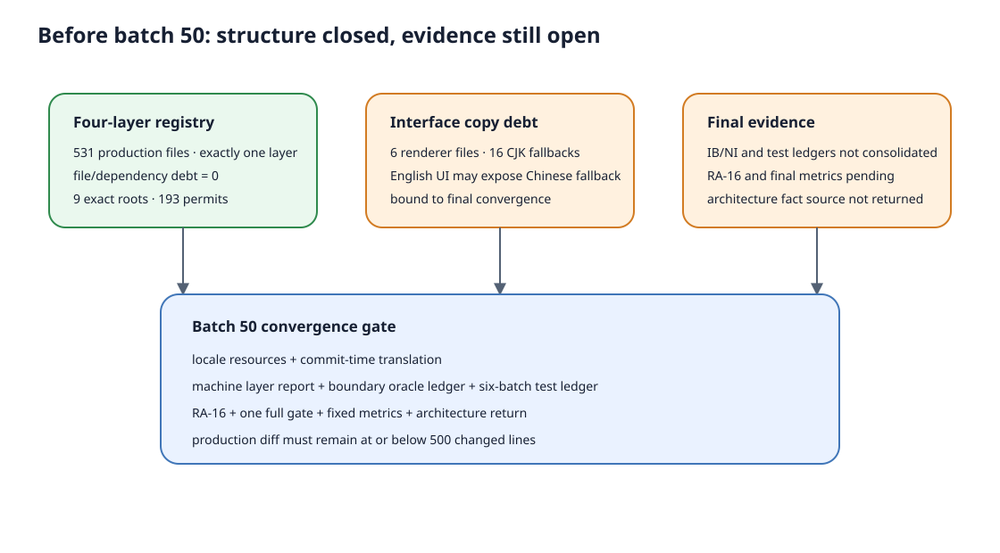
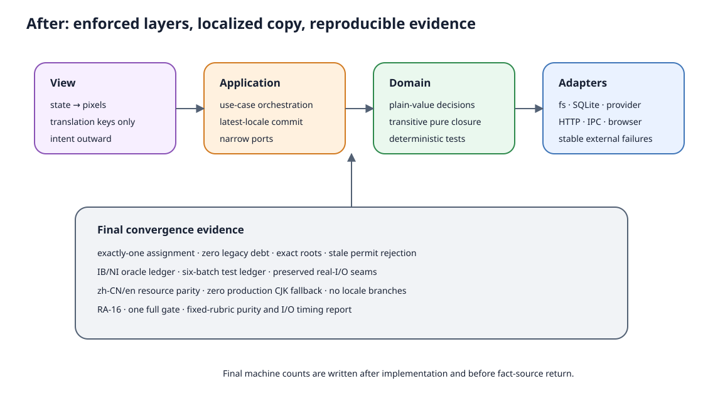

# 设计：four-layer-50-final-convergence

## 1. 方案来源判型与成功判据

本批是 **C · 退化型最终收敛**。来源以仓库内 guard、registry、前五批 ledger、真机证据和现行 PRD/spec
为主，不引入依赖或新架构框架。

成功必须同时满足：

- 16 条 copy debt 清零；zh-CN/en key 与插值一致，生产代码无 CJK 静态 fallback、无 locale 分支；
- 语言切换、父级重渲染、翻译回调身份变化与慢/失败异步返回后，可见错误使用**提交时的当前语言**；
- 531+（以实现后实际扫描为准）生产文件 exactly-one layer，四层 legacy debt 仍为 0，root/permit 无 stale；
- 六批测试增删有 test-name 与接管/保留依据，真实 I/O 唯一接缝不丢；
- RA-16、scope、typecheck、build、boundary、brand 与合并点唯一一次完整闸门全绿；
- 生产 diff additions+deletions 不超过 500。

## 2. 现有方案调研

- **候选 A：维持现状**——guard 继续用 6 文件/16 行 exact debt 放行。成本最低，但直接违反 debt 的
  `removalChange=four-layer-50-final-convergence`，English 界面仍可能出现中文 fallback；不采用。
- **候选 B：把 `t(...)` 结果直接传入六个文件或创建按 locale 闭包的 client**——改动最少，但正在进行的
  upload/restore 在语言切换后仍可能用启动时的旧文案；父级重渲染和回调身份变化会留下环境假设；不采用。
- **候选 C：局部稳定 failure code + application 提交点翻译（采用）**——attachment adapter/preview
  不依赖 view 或 locale，异步 commit 从最新 ref 读取 translator；edit-resend/team save 只注入窄 copy。
  比 B 多一层局部 code→key 映射，但不扩展成全局错误框架，能覆盖慢返回与语言切换。
- **候选 D：重开 20/40 批继续重构**——四层 debt 已为 0，问题只剩 copy debt；重开已归档 change 会破坏
  可追溯性且没有额外收益；不采用。

最小验证已完成：`production-copy-guard` 当前 3/3 通过并精确确认 6/16 debt；`check:boundaries` 当前
617/531/3 通过；registry 机械复算为 view 77 / application 171 / domain 182 / adapter 101、debt 0、
root 9、permit 193。

## 3. 架构图

`before.svg` 以当前 `docs/architecture/module-map.md` 与
`docs/architecture/local-runtime-decisions-and-import-boundaries.svg` 为现状基线，表达“架构债已清零但
copy debt 与最终证据尚未闭合”；`after.svg` 只表达目标不变量。
实现完成后按真实计数更新 `after.svg`，归档时回流 `docs/architecture/four-layer-runtime.svg`。

## 4. 唯一生产代码纵切：copy debt 归零

### 4.1 15 个 translation key

| 语义 | key | 当前来源 |
| --- | --- | --- |
| 附件上传 fallback | `desktop.error.attachmentUpload` | `attachment-client.ts` |
| 图片预览未准备 | `desktop.error.attachmentPreviewNotReady` | `attachment-client.ts` |
| 图片预览保存 fallback | `desktop.error.attachmentPreviewSave` | `attachment-client.ts` |
| 附件草稿恢复 fallback | `desktop.error.attachmentDraftRestore` | `attachment-client.ts` |
| 附件回填 fallback | `desktop.error.attachmentBackfill` | `attachment-client.ts` |
| 附件移除 fallback | `desktop.error.attachmentRemove` | `attachment-client.ts` |
| 附件预览读取 | `desktop.error.attachmentPreviewRead` | `attachment-client.ts` |
| 图片超出预览预算 | `desktop.error.imagePreviewBudget` | `attachment-preview.ts` |
| 图片尺寸无效 | `desktop.error.imageDimensionsInvalid` | `attachment-preview.ts` |
| 浏览器无法创建预览 | `desktop.error.imagePreviewCanvas` | `attachment-preview.ts` |
| 图片预览编码失败 | `desktop.error.imagePreviewEncode` | `attachment-preview.ts` |
| 停止轮找不到源消息 | `desktop.error.editResendSourceMissing` | `edit-resend.ts` |
| 成员仍在保存 | `desktop.error.teamMemberAlreadySaving` | `team-state.ts` |
| 本地附件服务未就绪 | `desktop.error.attachmentServiceUnavailable` | replacement + upload queue 共用 |
| 附件草稿 owner 不匹配 | `desktop.error.attachmentDraftOwnerMismatch` | `use-attachment-replacement.ts` |

key 同时加入 `packages/console-ui/src/i18n/locales/en.ts` 与 `zh-CN.ts`。不新增 locale 比较；用户输入、
Agent 输出、服务端返回的动态 error、文件名与诊断原文继续原样保留，只替换 16 条 Moebius 静态 fallback。

### 4.2 attachment 错误边界

- 在现有 managed-attachment contract/model 内增加局部 `ManagedAttachmentFailureCode` 与 error type；
  不建全局错误总线，不让 adapter import `Translate` 或 locale resources。
- `attachment-client.ts` 与 `attachment-preview.ts` 在缺少服务端动态 error 时抛稳定 code；外部 body.error
  仍按原文透传。replacement/upload queue 的两个静态失败也改抛同一局部 code。
- `ManagedAttachmentDraftInput` 接收窄 `translateFailure(code)`；`useManagedAttachmentDrafts` 用 ref 保存
  最新 translator，所有 restore/remove/upload/replacement 的异步失败在 commit 前读取该 ref。
- stale/aborted 返回仍先由现有 generation/AbortSignal 判定；stale 结果不得因翻译改造重新显示错误。
- `app.tsx` 只多传现有 `t`/translation bundle，目标仍小于 300 逻辑行；不触碰 `runtime.ts`。

### 4.3 edit-resend 与 team save

- `refillStoppedRunDraft` 接收 `missingSourceMessage` 窄输入；`useEditResend` 已持有 `t`，通过现有 input ref
  读取当前 translator。测试传 sentinel，不冻结中英文原句。
- `decideAgentTeamSaveAdmission` 只返回状态，不再从 domain 返回界面文案；`saveAllAgentTeamDrafts` 接收
  `alreadySavingReason`，由已有 `useAgentTeamMemberSaving.t` 提供。I/O 与保存次序不变。

### 4.4 guard 清债与测试剪枝

- 删除 `productionCopyDebt` 六条登记、`ProductionCopyDebt` 类型和按 debt 跳过扫描的逻辑；guard 改为
  对自动发现的全部生产文件直接扫描 CJK 静态文案。
- 删除 `keeps legacy production copy debt exact and bound to its removal change`：被测 legacy debt 契约已删除，
  保留会退化为空数组自证。该删除在 final test ledger 单列；其安全职责由更强的全量扫描 guard 接管。
- 不新增“locale 文件包含某句原文”的镜像测试。资源测试只断言 key 对齐、插值对齐和 sentinel 行为。

## 5. 最终核账制品

### 5.1 `convergence-report.md`

以 `pnpm check:boundaries` 与 registry 同源数据生成并记录：

- view/application/domain/adapter 文件数及总数；零未归属、零多归属；
- file/dependency debt=0；composition roots 全存在且 exact；condition permits 无 stale；
- domain closure logical lines 与固定口径比例区间；
- 生产 diff additions+deletions 预算；
- 完整闸门各 scope 数量、墙钟与真实 I/O 下限。

### 5.2 `boundary-oracle-ledger.md`

- 19 个具体 `[IB:*]`（排除文档中的 `[IB:*]` 通配说明）逐项映射 checker stable ID；
- 17 个 `[NI:*]` 逐项映射到精确 test-name、RA 编号或可重复数据流检查；
- `checkModuleMapBoundaryRegistry` 继续机械保证 registry IB 不漏文档、文档 IB 不缺实现、NI 原因非空；
- 若两个 IB 完全同 oracle，仅在保留稳定诊断 ID 和迁移说明后去重；预期删除 0，不为“更整齐”换 ID。

### 5.3 `final-test-ledger.md`

按 00/10/20/30/40/50 六批分别记录：

- 00：门禁测试增量，删除 0；
- 10：6 条源码镜像断言由具体 `[IB:*]` 接管；
- 20：五条 integration ledger 全保留，删除 0；
- 30：契约退役删除 322 条，再加孤儿 goal-ledger 20 条，单列为产品/死代码删除，不伪装等价替代；
- 40：纯测试只增不抵扣真实 I/O，删除 0；
- 50：legacy copy-debt 棘轮测试删除 1，职责由无豁免全量 CJK guard 接管。

每个删除项必须有 test-name（或同一测试内的点名 assertion）、删除判据、接管门禁/契约、保留接缝；
任何空列阻断收口。

### 5.4 指标口径

- 纯比例：沿用 00 批 logical-line 与职责抽样区间；报告 domain closure files/lines 与区间，不把 DTO/常量
  当业务规则，不用去重 violation 反推原始 AST 条件。
- 完整闸门：只在 QA/主理人复核通过后的合并点跑一次 Node 24 `pnpm test`；目标 ≤110s，未达则解释，
  不重跑挑快样本。
- 真实 I/O 下限：以 `final-test-ledger` 标记的真实 SQLite/JSONL/fs/process/HTTP/Electron 文件为固定集合，
  从同一次完整闸门日志提取其 file duration 并求和；未打印 duration 的文件按 0 计，因此结果是下限。
  占比=下限/完整闸门墙钟，目标 ≤40%；未达不删唯一接缝修指标。

## 6. RA-16 与前序证据重叠判定

| 前序验收 | 本批是否重叠 | 处理 |
| --- | --- | --- |
| RA-05 语言 | 是：locale resources / translator | RA-16 重做语言切换、错误文案与重启保持 |
| RA-13 附件 | 是：attachment fallback/preview | RA-16 重做失败→恢复→发送→重启的附件子路径 |
| RA-14 团队 | 部分：成员保存 admission | RA-16 重做成员编辑/保存；文件管理器、外链、退出协调引用 40 批记录 |
| RA-01/02、05a、08/09/10 | 系列要求联合 smoke，生产代码无直接重叠 | RA-16 做短 smoke，不扩成完整前序矩阵 |
| RA-11R/12R/30D | 否：不触及启动、process topology、历史 GitHub state | 直接引用 30 批记录，不重跑 |
| RA-15 | 否：不触及 provider/session link | 直接引用 40 批三家原生记录，不重跑 provider |

RA-16 必须使用真实 dev Electron：

1. Settings 切 English；通过可恢复的 attachment endpoint 失败注入触发 fallback，屏幕显示英文错误；
   切回简体中文后重试同一失败，屏幕显示中文错误且旧请求不得覆盖当前语言。
2. 解除失败注入，添加真实附件、看到预览并发送；新会话运行中停下并重试，终局归属正确。
3. A/B 会话快速往返保持各自草稿，完成搜索导航、分析会话、右栏标签切换与团队成员编辑/保存。
4. 重启后语言、selection、草稿、分析/标签现场、团队修改和已发送附件事实保持，无重复终局。

## 7. 验证顺序

1. 先补 sentinel 行为测试与慢异步 rerender 测试，证明旧分支和最新 translator 提交语义；再迁文案。
2. 运行 production-copy guard、locale resource parity、attachment/edit-resend/team-save 定向测试。
3. 运行 `pnpm run test --scope ec57cd5`、`pnpm check:boundaries`、`pnpm typecheck`、desktop build、
   `pnpm brand:check`；生产 diff 超 500 立即停止。
4. QA 执行 RA-16；主理人复核代码、ledgers、报告与图。
5. 复核通过后的合并点运行本 change 唯一一次完整 `pnpm test`，再写最终计数、I/O 下限与 after.svg。

## 8. 风险与回滚

- **异步错误显示旧语言**：translation ref 在 commit 时解析；测试覆盖父级重渲染、translator 身份变化、
  慢失败和 stale 返回。
- **adapter 反向依赖 view**：failure code 是本地 plain union；adapter 不 import locale/Translate。
- **为了清 guard 忽略文案**：禁止 `i18n-exempt`；debt 必须删除，不能改 count。
- **镜像测试修绿**：只断言 sentinel 行为与 key 结构，不读取生产源码断言某句 copy。
- **收敛批继续重构**：生产 diff >500 或出现新 layer debt 时停止，退回对应前序范围。
- **性能目标驱动删测**：唯一真实 I/O 接缝优先；指标未达记事实，不通过删测或改等待制造收益。
