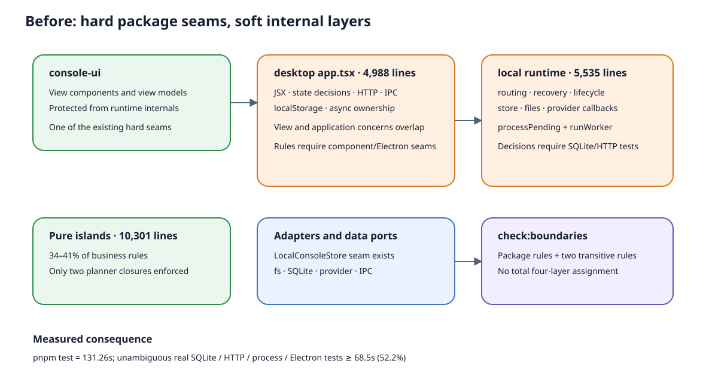
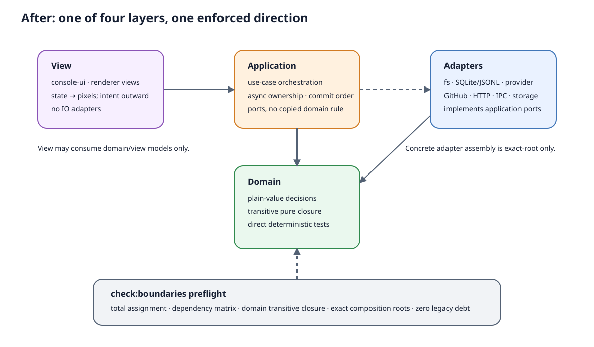

# 设计：four-layer-architecture-series

## 1. 设计目标与不变量

本系列完成后，全仓每个生产源文件都有唯一层归属，层间依赖由现有 TypeScript AST 边界检查
机制强制；业务决策可以在不启动 SQLite、HTTP、Electron 或 provider 进程时直接单测。

硬不变量：

- 用户可见行为、API/IPC、SQLite/JSONL、provider/GitHub 协议和失败恢复顺序不变。
- `LocalConsoleStore` 端口保留；store 实现继续属于 adapter，不新增第二套 repository 抽象。
- `console-ui` 继续是受控视图包，不把 renderer 编排搬进组件库。
- 每个子 change 合并后无“下一批才能编译/工作”的占位接口、双写或未消费 planner。
- 发现真缺陷只登记，不在本系列顺手修；测试必须保护当前承诺行为而非冻结实现措辞。
- 每个子 change 在 QA/主理人复核后、合并前恰好运行一次 `pnpm test`；开发收口使用
  `pnpm run test --scope <base>`、定向测试、typecheck 和必要构建。

## 2. 现有方案调研与判型

本任务属于 solution-sourcing 的 **C 退化型**：同一结构聚集多条独立变化理由，规则测试被迫
穿过真实 IO。来源扫描以仓库内部证据为主，最小验证是现有行为护栏、全量耗时和依赖图。

| 候选 | 收益 | 代价 / 结论 |
| --- | --- | --- |
| 维持现状，只约束新代码 | 最低风险 | `runtime.ts` / `app.tsx` 继续增长，存量规则仍需集成测试；用户已明确拒绝 |
| 只抽一个热点样板 | 快速证明 planner 模式 | 不能满足全仓四层目标；用户已明确选择全面重构 |
| 一次性目录搬迁和大爆炸改写 | 最快得到整齐目录 | diff 噪声、回归与回滚半径过大，中途没有安全停止点；不采用 |
| **按运行边界分六个 change，先门禁、后纵切迁移** | 每批自洽、可停、可测；复用现有 checker 和 planner | 总周期更长，会经历显式 legacy exception 逐批归零；采用 |
| 引入 Clean Architecture/CQRS/事件总线/DI 框架 | 外观统一 | 引入第五种概念和运行模型，违反用户约束；不采用 |

最小验证已经成立：现有 `local-control-planner-pure-closure` 与
`local-invocation-planner-pure-closure` 能沿运行时 import 图发现间接 IO，证明无需新框架即可把
同一机制推广到全仓。此前 planner 提取没有产生可证明的净速度收益，因此本系列不把“多拆
文件”当收益；只有等价剪枝后的实测耗时才计入速度收益。

## 3. 四层归属与依赖矩阵

### 3.1 唯一归属

`src/testing/import-boundaries.ts` 继续作为检查入口，扩展一份声明式 layer registry。扫描器对
`src/**`、`desktop/src/**`、`packages/console-ui/src/**` 的生产 TypeScript 文件执行：

- 每个文件必须恰好命中一个 `view | application | domain | adapter` scope；零命中或多命中失败。
- scope 可是 prefix 或 exact；exact 只用于当前路径无法安全整批归类的文件。
- composition root 不是第五层，只是 application 层中的窄 allow-entry；必须 exact allowlist。
- legacy exception 必须是 exact importer → exact target，带移除 change id；禁止 wildcard。
- 新增文件没有归属、扩大 exception、已消失 exception 未删除都使检查失败。

静态官网没有 TypeScript import 图，也不参与桌面、local console 或 GitHub runner 的运行时装配，
因此明确排除在 layer registry 之外；本系列不新增或修改 marketing-site 门禁。

### 3.2 允许依赖

| 调用方 | 可依赖 | 禁止依赖 |
| --- | --- | --- |
| view | view、domain 的只读/view model | application、adapter、Node/Electron/HTTP/IPC/browser persistence |
| application | application、domain、应用端口 | view；具体 adapter 仅 composition-root exact 例外 |
| domain | domain、批准的纯计算依赖 | view、application、adapter、所有副作用 runtime |
| adapter | adapter、domain、它实现的 application port type | view；不得反向调用 use case |

应用层“可有 IO”的含义是可以 `await` 注入端口并处理时序，不是可以随处 import 具体 fs、SQLite、
provider 或 IPC 实现。具体实现只在 composition root 装配。

### 3.3 门禁登记

| ID | 判定 | 约束 |
| --- | --- | --- |
| `[IB:architecture-layer-assignment-total]` | AST 路径扫描 | 每个生产 TS/TSX 文件唯一归属四层 |
| `[IB:architecture-layer-dependency-matrix]` | import / export / dynamic import 图 | 拒绝层间非法方向，输出完整 dependency path |
| `[IB:domain-pure-runtime-closure]` | 传递 runtime import 图 | domain 闭包不得到达 fs、SQLite、child process、provider、Electron、HTTP/IPC adapter |
| `[IB:view-no-side-effect-adapters]` | import 图 | view 不得 import adapter/application 或 Node/Electron 副作用依赖 |
| `[IB:application-no-view-dependency]` | import 图 | use case 不得依赖 React 组件；composition root exact 例外 |
| `[IB:adapter-no-use-case-reentry]` | import 图 | adapter 只能 import port types，不得调用 application use case |
| `[IB:composition-root-narrow-allowlist]` | exact allow registry | 只有列名入口可同时装配 view/application/adapter |
| `[IB:application-use-case-shape]` | AST use-case registry + branch/LOC budget | 非 composition-root application 文件只允许一个登记的运行时 use case export；每个 use case ≤300 条逻辑行、cyclomatic complexity ≤12。条件必须分派 domain `decide*`/`plan*` 结果，或命中 exact transport-control permit；零遗漏、零 stale permit。存量超限项只允许 exact debt 并绑定移除 change。 |
| `[IB:adapter-boundary-branch-total]` | AST branch inventory + symbol provenance + exact contract permit | adapter 内每个 `if`/`switch`/三元/短路条件必须机械归类为 schema/codec guard，或由 port 输入、IO result、error/signal 派生的 transport control；业务字段值比较只有命中 exact 外部协议 permit 才允许，零未归类、零 stale permit；adapter 不得 runtime import domain decision/application use case。 |
| `[NI:view-intent-only]` | 真实页面验收 + 组件隔离 | JSX 回调只发意图，不能靠 import 图判断内联条件是否是领域规则 |

两个新增可判定 oracle 的 checker 契约：

- `application-use-case-shape` 从 AST 计算逻辑行、导出的运行时 use case 数与复杂度，并追踪条件根符号。
  允许的 domain 分派必须能追溯到 domain scope 的具名 `decide*`/`plan*` 返回值；纯超时、取消、端口
  success/failure 等时序控制必须登记 `module + export + normalized-condition fingerprint + kind` 的 exact
  permit。反例 fixture 在 application use case 内直接写 `if (message.role === "qa")`，以及构造第 13 个
  条件分支；两者都必须令 `pnpm check:boundaries` 红，并报告 use case 与条件位置。
- `adapter-boundary-branch-total` 对 adapter 条件引用做局部 symbol provenance：schema/type/null/长度检查归
  codec，源于 port 输入、IO result、error code、AbortSignal 的控制归 transport；业务枚举值只允许引用
  exact external-contract permit。反例 fixture 在 adapter 内写
  `if (record.role === "qa" && record.stage === "in-progress")` 后丢弃记录，且不登记协议 permit；必须令
  `pnpm check:boundaries` 红并打印未归类 normalized condition。另一个 lossless codec fixture 改变非传输
  字段时，adapter contract test 必须红，防止通过无分支映射偷偷复制过滤规则。

上述阈值和 permit 是机器 oracle，不是完成度指标：实现者不得通过拆出多个未登记 helper、添加无依据
permit 或修改 fixture 来修绿。新增 permit 必须点名外部协议字段与对应 adapter contract test；checker
拒绝不存在条件的 stale permit。composition root 仍由 exact allowlist 管理，不计为 use case。

每个子 change 新增 composition root 时，必须在该 change 内附同规格的条件分类审计，并把审计结论
同步回系列交付证据：逐文件、逐行列出全部控制分支，归为 wiring 装配、timing 时序控制或 business
业务判据，三类计数之和必须等于 AST 控制分支总数。business 条目不得留在 allowlist 豁免区：要么
下沉到 domain 的具名 `decide*` / `plan*`，要么把文件登记为 application use case 并接受
`[IB:application-use-case-shape]`。没有这份可复算审计，composition root 不得进入 exact allowlist；后续
20/30/40 批均适用，不以“文件少于 300 行”代替语义检查。

现有 25 条 `[IB:*]` 不删除；新矩阵比旧规则更强时，旧稳定 ID 保留到最终 convergence change，
再只删除完全重复且有 git 留痕的规则，不在迁移中途同时换 oracle。

## 4. 系列拆分与量化目标

指标口径：

- “纯逻辑/业务规则”沿用基线人工职责归类；每批用同一脚本与抽样规则复算，报告区间，不制造
  虚假精度。
- “完整闸门耗时”每个子 change 只在合并点跑一次，因此下表是累计目标带，不是承诺值；实际值
  必须报告。速度收益只归因于明确删除/合并的重型用例 duration，不能归因于机器偶然变快。
- 可比耗时基线：重构前 HEAD `54b93d4`，Node 24.18.0，`pnpm test` 单次成功样本 119.24s
  （1,900 项通过、4 项跳过，2026-08-02）。后续各批耗时一律与这份 Node 24 基线比较。
- 首轮盘点的 131.26s 保留为历史记录：运行于 Node 22 环境（patch 版本未单独记录），不得与
  Node 24 批次样本直接计算收益。纯逻辑/业务规则 34–41%；首轮明确真实 IO 测试墙钟下限
  68.5s / 52.2% 仍只作为测试构成基线，不换算为 Node 24 墙钟占比。

| 顺序 / change | 范围 | 预估改动行数 | 合并后的自洽状态 | 累计纯逻辑目标 | 累计完整闸门目标 |
| --- | --- | ---: | --- | --- | --- |
| 00 `four-layer-00-boundary-foundation` | 四层 registry、覆盖检查、依赖矩阵、现有纯模块闭包、exact debt ledger | 1.2k–1.8k | 全生产文件有唯一归属；现有违规显式冻结，新违规进不来 | 34–41%（不提取规则）；已知 10,301 行 100% 受闭包保护 | 132–136s；允许 checker 增量，收益为风险可见性 |
| 10 `four-layer-10-local-console` | runtime public use cases、primary/worker 编排、生命周期辅助；保留 store 端口 | 5.5k–7.5k | runtime 成为薄 facade/composition root；领域 planner 与应用 use case 可独立测 | 48–57% | 112–126s |
| 20 `four-layer-20-desktop-renderer` | `app.tsx` shell/team/settings/onboarding 与 conversation/search/sidebar 分组纵切 | 5.0k–7.0k | `app.tsx` 只装配 controller 与 `OperatorConsole`；renderer 规则进入纯 state model | 60–69% | 102–118s |
| 30 `four-layer-30-github-runner` | runner 主链、scanner/dispatcher/acceptance/route/orchestration 的 use case 与纯决策 | 3.0k–4.5k | GitHub mode composition root 只装配；L1/S1/V1 顺序由 application 流程显式表达 | 66–74% | 98–114s |
| 40 `four-layer-40-adapter-convergence` | desktop main/team/onboarding、provider/GitHub/state/observer adapters 与剩余 cohabitation | 3.5k–5.5k | fs/SQLite/provider/IPC/browser storage 只在 adapter；数据端口未重画 | 72–80% | 94–112s；若无重复集成测试可剪，速度收益可为零 |
| 50 `four-layer-50-final-convergence` | debt ledger 归零、规则去重、文档/架构图、全仓测试对账与指标复测 | 1.0k–1.8k | 无 legacy exception；四层和现有业务模块图同时成立，可在此长期停留 | ≥72%，目标 75% | ≤110s 目标；真实 IO 下限占比 ≤40% |

目标不是把所有代码变纯：application 时序、adapter 原子性、provider 进程、SQLite/JSONL、真实
Electron/HTTP 接缝必须继续由集成或真机测试覆盖。最终纯比值低于 72% 时，只有逐项证明剩余
分支属于时序/IO 而非可提纯业务规则才可验收。

## 5. 测试替代总账

每个子 change 在 `tasks.md` 维护逐项 ledger，字段固定为：

| 原集成测试（文件 + test name） | 原来红了代表什么 | 新纯测试（文件 + test name） | 等价输入/输出分支 | 保留的最小接缝 | 删除/保留 |
| --- | --- | --- | --- | --- | --- |

规则：

1. 先新增纯测试并在生产迁移前证明它能击中同一决策分支。
2. 只有原集成用例的唯一价值已被纯测试覆盖，且同一跨层接缝另有保留用例时才能删除/合并。
3. SQLite/JSONL 原子性、restart recovery、provider callback/link/cursor、HTTP receiver、IPC channel、
   Electron preload、安全路径和 L1/S1/V1 发布顺序不得被纯测试替掉。
4. test name 级 duration 在删除前采三次成功样本中位数；取不到三次按 0 计收益。
5. 参数组合迁入纯测试时列出边界值映射；不得把旧断言改写成新实现镜像后宣称等价。

初始候选对账（最终以子 change 实际 test names 为准）：

| change | 可降级候选 | 新纯测试责任 | 必须保留的接缝 |
| --- | --- | --- | --- |
| 10 | `local-console.test.ts` 的路由/队列组合；`local-console-execution-runtime.test.ts` 的 retry/prompt 组合；`local-console-pending-switch.test.ts` 的状态选择组合 | session/project policy、primary plan、worker plan、terminal/recovery transition | 每类 HTTP+SQLite 一条、restart、provider facts、并发 lane、store failure |
| 20 | `console-app-*.test.tsx` 中仅证明 owner/generation/reducer 的参数组合；`state-sync.test.ts` 的纯状态分支 | route/selection/search/process/team/settings controllers 与 reducers | fetch receiver、preload IPC、慢/失败返回、父重渲染、真实 Electron 用户动作 |
| 30 | `runner.test.ts` 中可由纯 route/intake/acceptance decision 覆盖的组合 | issue processing plan、发布边界 transition、ledger/orchestration decision | gh/Codex adapter、L1 timeout、S1 cursor、V1 visible failure、真实 sandbox issue |
| 40 | adapter 文件中仅验证 parser/classifier 的参数组合 | wire/storage result parser、path/identity decision | SQLite/JSONL、filesystem、process、IPC/preload、observer HTTP 原子/安全接缝 |

00 不剪测试；50 只根据已完成 ledger 删除 stale 重复，不首次发明替代关系。

下表把方案阶段已经确认的重型候选精确到当前 test name。右侧是实施时必须先存在的新纯测试；它们
不是预先批准删除。只有逐分支证明等价并补上“保留接缝”列后，子 change 才能把对应旧用例标为
删除/合并；否则旧用例继续保留。未列入本表的用例不得仅凭文件级判断删除。

| change | 当前集成测试（文件 + test name） | 先建立的纯测试（拟定文件 + test name） | 等价决策分支 | 保留接缝 |
| --- | --- | --- | --- | --- |
| 10 | `tests/local-console.test.ts` · `routes a user message without mention directly to the session primary Agent` | `tests/local-console-routing-policy.test.ts` · `plans an unmentioned user message for the session primary role` | 无 mention、primary 空闲时的目标角色与触发源 | 同文件保留一条真实 HTTP + SQLite 发送、claim、运行、落盘链路 |
| 10 | `tests/local-console.test.ts` · `claims worker dispatches atomically per role while preserving per-role FIFO` | `tests/local-console-worker-plan.test.ts` · `preserves per-role FIFO while allowing independent role lanes` | 同 role 串行、不同 role 独立、claim 次序 | 保留一条真实 store 原子 claim + 并发 worker lane 用例 |
| 10 | `tests/local-console-pending-switch.test.ts` · `rejects a workspace switch after the first message while preserving the running team switch` | `tests/local-console-session-policy.test.ts` · `rejects workspace mutation after the first message without changing the selected team` | 已有消息后的 workspace 锁定与 team snapshot 保持 | 保留真实 restart 后 workspace/team snapshot 恢复用例 |
| 10 | `tests/local-console-codex-resume.test.ts` · `continues an interrupted thread with the edited resend as an overriding delta` | `tests/local-console-retry-plan.test.ts` · `uses edited resend as the overriding delta for an interrupted attempt` | interrupted + canonical link + edited resend 的 prompt/continuation plan | 保留真实 provider continuation/link/cursor 与重启用例 |
| 20 | `desktop/tests/console-app-sidebar-conversation-regressions.test.tsx` · `keeps a target-owned draft editable across a slow switch and parent rerender while blocking send` | `desktop/tests/console-conversation-controller.test.ts` · `keeps target draft ownership through rerender and blocks send during slow selection` | draft owner、pending phase、父级重渲染与 callback identity 变化 | 保留一条真实 React receiver 绑定与慢 fetch 返回用例 |
| 20 | `desktop/tests/console-app-sidebar-conversation-regressions.test.tsx` · `serializes rapid round trips and clears both unread badges without stale selection writes` | `desktop/tests/console-navigation-controller.test.ts` · `serializes rapid round trips and commits unread state only for the latest selection generation` | generation、队列次序、stale selection write 丢弃 | 保留一条 mounted app + HTTP receiver 的快速往返接缝用例 |
| 20 | `desktop/tests/console-app-sidebar-conversation-regressions.test.tsx` · `keeps the previous route and draft when ordinary conversation creation fails` | `desktop/tests/console-navigation-controller.test.ts` · `rolls back pending creation to the previous route and draft on failure` | create pending → failure 的 route/draft 恢复 | 保留一条 mounted app 的 fetch failure 到可见错误反馈用例 |
| 20 | `desktop/tests/onboarding-app-routing.test.tsx` · `keeps the later shell PATH recheck when the initial check resolves last` | `desktop/tests/onboarding-readiness-controller.test.ts` · `rejects an older initial readiness result after a newer PATH recheck` | request generation 与迟到 initial result 丢弃 | 保留 preload IPC subscription/receiver 解绑与 mounted onboarding 接缝 |
| 20 | `desktop/tests/onboarding-app-routing.test.tsx` · `does not let an older full readiness response overwrite newer per-CLI results` | `desktop/tests/onboarding-readiness-controller.test.ts` · `merges newer per-CLI results without accepting an older full snapshot` | full/per-CLI response 版本合并 | 保留一条真实 preload readiness channel 到页面状态用例 |
| 30 | `tests/runner.test.ts` · `integration acceptance prepass posts one parent request only after every ledger child has passed` | 现有 `tests/acceptance-prepass.test.ts` · `records a child acceptance fact and requests parent integration acceptance only when join is ready` | join ready 后只请求一次 parent integration acceptance | 保留一条 runner 阶段顺序 + 可见发布 + ledger save 接缝 |
| 30 | `tests/runner.test.ts` · `records no_action fallback routing without posting a comment` | `tests/external-route.test.ts` · `records deterministic no_action for an agent-authored comment on an already passed ledger child`，并由 `tests/github-response-intake.test.ts` · `records external comment fallback route outcomes by comment id across no_action, append, and fail_open` 覆盖 fold | no_action 不发布、route fact 按 comment id 持久化 | 保留一条 runner 外部评论 → fallback adapter → state save 链路 |
| 30 | `tests/runner.test.ts` · `does not re-run fallback routing for the same comment id` | `tests/external-route-deduplication.test.ts` · `does not plan fallback routing for an already recorded comment id` | 已记录 comment id 的幂等判据 | 保留 runner 重启后读取真实 state 并跳过重复发布的接缝 |

实施者必须把这张初始表复制到对应子 change 的实际 ledger，补齐 duration、最终文件名和“删除/保留”
结论；若迁移后的模块边界表明某候选仍承担不可替代接缝，其结论应为“保留”，而不是为了指标硬删。

## 6. 按 change 的验收清单

### 00 · Boundary foundation

- 全生产 TS/TSX 清单中零个未归属、零个多重归属文件；新增未登记 fixture 必须令
  `pnpm check:boundaries` 红并显示文件路径。
- domain 经两跳到 `node:fs/promises`、adapter 或 provider 的反证 fixture 必须红并打印完整路径；
  type-only import 不形成假违规。
- application 直接按 `message.role` 分支或超过 12 个条件节点的反例 fixture 必须由
  `[IB:application-use-case-shape]` 判红；exact transport-control permit 删除条件后必须因 stale 而红。
- adapter 以内联 `role + stage` 判据丢弃记录的反例 fixture 必须由
  `[IB:adapter-boundary-branch-total]` 判红；codec 改写非传输字段必须使 lossless contract test 红。
- legacy exception 只能 exact 命中并绑定移除 change；扩大 prefix 或留下 stale exception 必须红。
- 现有 25 条边界测试继续全绿；生产行为和测试选择不变。

### 10 · Local console

- 项目/会话 policy、claimed source、primary/worker invocation、retry/recovery/terminal decision 均可只传
  普通值直接单测；对应 application use case 只通过 `LocalConsoleStore`/execution 等窄端口执行。
- `runtime.ts` 不再内联可独立变化的路由、恢复、提示范围或 terminal 判据；不以行数为唯一验收。
- **真实页面 RA-01**：主页面新建会话并发送消息，页面依次出现用户消息、运行中事实和同一会话
  Agent 终局；重启后消息与终局仍在，且没有重复 Agent 回复。
- **真实页面 RA-02**：主页面运行中点击“停下”，页面保留中断前正文并显示非成功终局；点击重试后
  同一会话重新运行，终局与过程 attempt 归属正确。
- **真实页面 RA-03**：主页面直接提及非主成员和执行一次成员 handoff，时间线显示目标成员身份，
  右侧过程标签按对应成员/attempt 出现；不同成员并行时互不覆盖。
- **真实页面 RA-04**：左侧栏完成会话重命名、置顶/取消、已读/未读、归档/恢复及项目修复/移除中
  本批实际改到的动作；刷新/重启后持久状态与操作结果一致。

### 20 · Desktop renderer

- `app.tsx` 只保留语言/路由/bootstrap composition 与受控视图 prop 映射；team/settings/onboarding 和
  conversation/search/sidebar 的异步 owner、generation、phase 位于可直接测试的 controller/state model。
- 异步加载测试覆盖父级重渲染、回调身份变化、慢返回、失败和 stale result，不只测稳定引用 happy path。
- **真实页面 RA-05**：左侧栏打开设置，切换语言、检查更新、复制版本并关闭；屏幕状态只属于最新
  请求，关闭后通知正确，重启后语言保持。
- **真实页面 RA-05a**：从主页面左侧栏在会话 A/B 间快速连续往返；A、B 各自输入不同未发送草稿，
  慢切换尚未完成时发送按钮保持禁用且不得把草稿写入旧会话；最终主区与高亮 selection 指向最后一次
  点击的会话，两份草稿仍各归原会话，A/B 未读标记与实际已查看状态一致。重启应用后最后 selection、
  已持久化的未读状态与页面一致，任何未承诺持久化的草稿只按既有契约恢复或清空，不得串到另一会话。
- **真实页面 RA-06**：打开 Agent 团队页，切换团队/成员、修改并保存一个允许编辑的字段；保存反馈
  只出现在目标团队，重新进入后内容一致。
- **真实页面 RA-07**：从主页面回看 onboarding，完成/跳过后回到原会话现场；原 selection、草稿和
  右栏没有被重置。
- **真实页面 RA-08**：搜索两次不同条件并打开第二次结果；主内容、左侧 selection、右栏 host 与
  第二个条件一致，第一请求迟到不得拉回页面。
- **真实页面 RA-09**：从消息和整段会话各创建一次分析会话；离开旧入口后迟到结果不抢当前页面，
  成功结果在正确右栏标签中，发送后成为可继续的真实会话。
- **真实页面 RA-10**：右侧栏打开改动、文件、过程、子任务/普通会话标签并切换宿主；刷新期间当前
  标签不被抢占，关闭/重开恢复各宿主自己的标签现场。

### 30 · GitHub runner

- issue processing application flow 显式保持 build timeline → acceptance pre-pass → recovery → trigger →
  fallback route → execution → publish → state save 的既有顺序。
- L1 never-resolve、S1 首条可见结果前失败、V1 放弃可见三类故障注入继续成立。
- **真实页面 RA-11**：在白名单 sandbox GitHub issue 页面发布合法 `@agent` 指令，页面先出现受控
  reaction，随后只出现一条目标 Agent 评论；本地 runner 状态最终不再 in-flight。
- **真实页面 RA-12**：在 active sandbox issue 页面发布无 mention 外部评论，页面只出现一次既有
  fallback route 结果；重启 runner 后同一 comment 不重复发布。
- sandbox 不可用时必须写“未验证”，不能用 fake gh 抵扣真实页面；先合并后补验还是阻断归档属于
  30 批开始前必须由用户/主理人决定的环境策略，本方案不预判。

### 40 · Adapter convergence

- fs、SQLite/JSONL、provider CLI、GitHub、HTTP、Electron IPC/browser storage 只在 adapter scopes；
  domain/application 不再通过间接 import 到达具体实现。
- `LocalConsoleStore` 及现有 schema/API/IPC 不变；adapter parser 析出时 byte/wire/storage 输入输出逐例等价。
- **真实页面 RA-13**：主页面添加真实本地附件并发送，预览、发送、重启恢复和删除生命周期与既有
  页面承诺一致；路径和附件不进入错误会话。
- **真实页面 RA-14**：从设置或 Agent 团队页执行本批触及的 IPC/文件管理器/外链动作，屏幕反馈与
  系统动作一致；取消选择或 adapter 失败时页面可恢复且不写入错误目标。
- **真实页面 RA-15**：使用本批触及的真实 Codex/Claude/Kimi provider 各完成一次可用链路；过程、
  terminal、resume/session link 与重启后的展示一致。不可用 provider 明确登记“未验证”，不伪造通过；
  先合并后补验还是阻断归档在 40 批开始前按用户/主理人的环境策略执行。

### 50 · Final convergence

- layer registry 覆盖全部生产文件，legacy exception 为零，composition root exact allowlist 无 stale 项。
- 所有 `[IB:*]` 与 `module-map.md` 双向一致；所有 `[NI:*]` 有具体行为验证责任，不用“代码审查”四字
  代替 oracle。
- 六个 change 的测试 ledger 每个删除项都有等价纯测试和保留接缝；不存在净删除。
- 复测纯逻辑/业务规则比例、完整闸门、真实 IO 下限；达不到目标时逐项解释，禁止改口径美化。
- **真实页面 RA-16**：依次完成新会话发送/终止与重试、左侧栏快速会话往返、搜索导航、分析会话、
  团队编辑、设置、右栏标签和附件的联合 smoke；每一步屏幕信号与前述 RA 条目一致，重启后持久事实保持。

## 7. 子 change 实现边界

### 00：门禁先行

只扩展 checker、规则测试和 `module-map.md`。允许以 exact debt ledger 表达存量违规，但不得移动业务
代码。该批收益是未来违规可见，不声明纯比例或速度改善。

### 10：local-console 纵切

按用例而非“controllers/services/utils”横切：项目与会话命令/查询、primary run、worker run、终局与
恢复。`runtime.ts` 可保留 façade 和 active-run 内存协调；store/JSONL/files/provider 是注入端口或
adapter。数据端口不改。若一个提取模块仍同时读取 store 并决定路由，说明切点失败。

### 20：renderer 纵切

分成两个内部提交但同一 change 验收：shell/team/settings/onboarding；conversation/search/sidebar。
controller 以 hook 或普通 coordinator 形式存在均可，不引入状态框架。纯状态规则进入 reducer/model，
HTTP/IPC/localStorage 进入 adapter，`OperatorConsole` 仍是受控 view。

### 30：GitHub runner 纵切

继续沿用既有 `scanner`、`dispatcher`、`acceptance-prepass`、`external-route`，不重写为事件管线。
主 entry 只装配，application use case 保留 L1/S1/V1 调用顺序，纯 decision 留在现有 conversation、
intake、ledger、trigger、orchestration modules 或新窄 planner。

### 40：adapter 收敛

覆盖未在前三批触及的 desktop main/team/onboarding、provider/GitHub/state/observer 和 cohabiting parser。
适配器可以很大，只要变化理由都是同一外部边界；不得为了行数拆 `sqlite-state-worker.ts`，也不得改
`LocalConsoleStore`。只有其中确有领域判据时才原样析出纯函数。

### 50：清债与事实源

不再做大规模逻辑迁移；只处理遗漏归属、stale exception、重复门禁、测试 ledger、指标复测和架构
事实源回流。若此批仍需迁移超过 500 行生产业务逻辑，前一批不得声明完成。

## 8. 风险与回滚

- **行为被“清理”**：移动时顺手修 bug 或统一错误。回滚：每批先冻结外部行为矩阵；发现差异撤回该
  纵切，不修改 oracle 迎合实现。
- **纯层名义化**：文件搬到 domain 但传递依赖仍到 IO。回滚：00 的 closure gate 在迁移前先红，
  只有闭包清零才允许合并。
- **application 变成新 God Object**：以 `Service` 收纳所有方法。防线：按用户用例命名，依赖接口窄，
  application 不复制 domain 条件；NI 审查列出每个分支归属。
- **adapter 重画数据层**：为“整齐”新增 repository。防线：`LocalConsoleStore` identity/API 作为显式
  不变量；任何 schema/port 变化都超出授权。
- **测试数量下降掩盖覆盖下降**：逐 test-name ledger + 保留接缝；缺任何一列不得删除。
- **性能目标受机器波动**：只比较同机串行成功样本；无法稳定取得样本时收益记不确定/零，不调等待
  掩盖。
- **系列中途停止**：每个子 change 的 debt ledger 只减少且 checker 仍绿；停止时系统仍可构建、运行，
  未迁移文件继续由 exact exception 显式隔离，不依赖未来接口。
