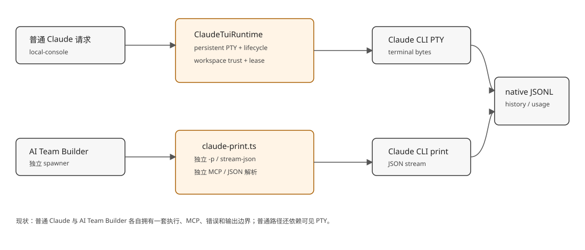
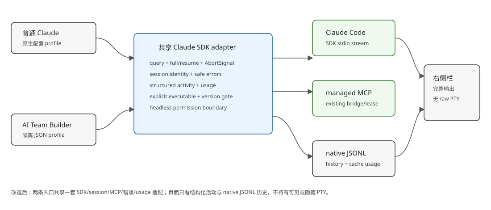

# 设计：unify-claude-agent-sdk-runtime

## 方案

### 模块划分与依赖顺序

1. **共享 SDK 执行 adapter**（建议落在 `src/claude-agent-sdk.ts` 及相邻纯 codec/错误映射模块）
   - 唯一负责 `query()` 的创建、`AbortSignal`、full/resume、session ID 观察、SDK message/result 归一化和安全失败。
   - 通过现有 `resolveClaudeExecutable` 和 `runClaudeVersion` 取得并校验实际 executable，再把路径传给 SDK 的 `pathToClaudeCodeExecutable`；不绕过现有版本门禁。
   - 只把 SDK 的结构化 activity 和最终结果交给上层，不把 PTY/raw bytes 暴露为运行时接口。

2. **共享运行 profile / MCP option builder**
   - 普通 Claude profile：不设置 `settingSources`、`strictMcpConfig` 或工具 allowlist，保留用户和项目 Claude 配置归属；传递冻结的 model、effort、permission mode、既有内部 Agent/team `disallowedTools` 与 session 选项。
   - AI Team Builder profile：`settingSources: []`、`strictMcpConfig: true`、`tools: ["Read", "Glob", "Grep"]`、`permissionMode: "dontAsk"`、JSON Schema `outputFormat`，沿用隔离 cwd 与现有开发者指令。
   - 有托管运行项时，把 `ManagedProcessMcpInvocation` 映射为 `mcpServers.moebius_managed` 的 stdio 配置，先执行既有 preflight，结束时撤销 capability 并注销 completion listener。

3. **普通 local-console 接入**
   - `execution-driver` 继续负责统一 run/session 关联，改为调用共享 SDK adapter；首次 `system:init` 观察到 session ID 就立即绑定 canonical execution 代，resume ID 不一致时 fail closed。
   - 删除生产路径对 `ClaudeTuiRuntime`、PTY lifecycle、workspace trust detector 和 terminal trace 的依赖；保留现有运行块、停止/取消、失败归类、右侧栏入口和 provider-native trace link。
   - query result 的最终文本进入现有 `CodexRunResult` 成功路径；SDK 的 error subtype、permission denial、认证/启动错误映射到既有 Claude failure code，不把原始 stderr 或请求载荷送入 renderer。

4. **AI Team Builder 接入**
   - `desktop/src/ai-team-builder/claude-spawner.ts` 改用共享 adapter，不再依赖 `src/claude-print.ts` 的独立子进程解析。
   - 保留 draft 隔离 runtime root、`full` / `resume`、`onSessionStarted`、结构化输出校验、超时和取消语义；从 SDK `result.structured_output` 读取 schema 结果，保留最终文本作为诊断/回退字段。

5. **原生历史、过程投影与 usage**
   - `persistSession: true`，Claude 原生 JSONL 继续是唯一完整输出事实源；复用 `provider-process-trace` 的可信路径、session ID 和 workspace fingerprint 校验。
   - 复用 `projectClaudeTranscriptRecord` 的 assistant text/thinking/tool/tool-result/error/usage 投影；补齐 SDK 产生的 usage 形状需要的字段，确保 `cache_read_input_tokens`、`cache_creation_input_tokens`、input/output tokens 和 `modelUsage` 不被吞掉。
   - SDK final result 的 `usage` / `modelUsage` 作为本轮归一化 usage 证据；展示仍从 provider-native transcript 读取，避免把一次 SDK 结果再复制成第二份历史。

6. **界面和组合根收口**
   - 移除 `claudeTerminalTrace` route、runtime port、worker/primary wiring 和 console-ui raw terminal surface 的生产依赖。
   - 运行中继续展示结构化最新活动、停止/取消与状态；「完整输出」继续进入右侧栏的 native transcript。过程不可用时沿用现有局部不可用语义。
   - 更新 provider adapter、module map、OpenSpec spec-delta 和真实 Electron 验收脚本；不改变 Codex/Kimi/Pi 的流程。

### 数据流

```text
用户消息 / AI 建队请求
        │
        ▼
共享 profile + session/resume + managed MCP option
        │
        ▼
Claude Agent SDK query(pathToClaudeCodeExecutable, cwd, options)
        │                         │
        │ SDK message stream       │ final result
        ▼                         ▼
结构化 activity / progress   text + session_id + usage/modelUsage
        │                         │
        ├── local-console run / builder result
        └── Claude 原生 JSONL ── provider-process-trace ── 右侧栏完整输出
```

每个 provider turn 都是一个有自然终点的前台 SDK query；停止使用 `AbortController`，普通测试/构建仍由 Provider 前台命令运行。托管服务、watcher 或跨 invocation 的 task 仍只能经现有 managed-process bridge 启动。

### 关键接口边界

- 共享 adapter 不知道团队派工、消息游标、SQLite 或 UI；它只实现 Claude provider contract。
- `desktop` 只保留 AI Team Builder 的 application wiring，不复制 SDK option/错误/usage 规则。
- transcript resolver/projector 只读取受信任的原生 JSONL；无法读取时返回该 attempt 的不可用事实，不用 final text 冒充完整过程。
- user/project Claude config、认证和原生 session 所有权仍在 Claude Code；Moebius 只传本轮冻结的运行约束和会话级 managed MCP。

## 权衡

### 采用显式 executable + SDK，而不是 SDK 内置 binary

现有产品要求按实际解析路径做 Claude 版本门禁，并保留本机 Claude 安装、认证和更新入口。Agent SDK 支持 `pathToClaudeCodeExecutable`，真实 spike 已证明显式路径可以完成 query 并返回同一套 usage/result。代价是仍要求本机 Claude executable 可用；这符合现有 profile 的启动边界，也避免悄悄绕过用户当前安装版本。

### 每轮新建 query + resume，而不是跨轮持有 SDK Query

用户要的是 canonical session 的历史连续性而不是可见 TUI。每轮有明确 result、可取消、可清理，能直接映射当前 run 生命周期；session persistence 和 `resume` 保留模型上下文与 JSONL 历史。代价是每轮需要重新启动 SDK/Claude 子进程，接受这项启动开销以减少隐藏进程和跨轮状态。

### native JSONL，而不是 Moebius 自建 transcript mirror

右侧栏现有事实源和产品要求均指向 provider-native history；SDK 已将 token/cache usage 写入 Claude JSONL。复用该事实源避免历史双写和 session 猜测，代价是用户清理或损坏 Claude 数据后对应过程可能不可用，沿用现有已接受的后果。

### 无交互等待，而不是保留隐藏权限/登录对话

页面不再提供 PTY，任何等待用户回答的 query 都会造成不可见卡住。因此普通 profile 保留自动权限策略，AI Team Builder 使用 `dontAsk`；未能自动决定的权限、认证或 MCP 状态映射为结构化安全失败，不弹人工确认页面，不偷偷重跑。

## 方向性验证证据

以下命令均在步骤 2 方案阶段实际执行，spike 代码不进入交付物：

1. SDK 安装：

   `npm install --no-audit --no-fund @anthropic-ai/claude-agent-sdk` → exit 0；安装 `@anthropic-ai/claude-agent-sdk@0.3.243`，包声明 `claudeCodeVersion: 2.1.243`。

2. 普通 query / 三轮长对话：

   真实 SDK query 在当前工作区完成 `hi`；session `f17f2ff0-d863-4e97-977b-da3d74412230`，JSONL 位于 `/Users/wing/.claude/projects/-Users-wing--moebius-workdir-worktrees-yfLa9BpX4hVo/f17f2ff0-d863-4e97-977b-da3d74412230.jsonl`，usage 观察到 input 2、cache creation 36236、cache read 0、output 18。

   三轮长对话去重后：3 个唯一 request，output 16851，cache creation 49959，cache read 82412，thinking 854；session `d1a8370c-0fdc-4d11-af7a-85632ac9ddca`，JSONL 位于 `/Users/wing/.claude/projects/-Users-wing--moebius-workdir-worktrees/yfLa9BpX4hVo/d1a8370c-0fdc-4d11-af7a-85632ac9ddca.jsonl`。重复 assistant row 按 SDK d.ts 中“streaming blocks 可共享 message.id、final result 才是最终 usage”规则去重。

3. 显式 executable：

   `node --input-type=module ... query({ options: { pathToClaudeCodeExecutable: "/Users/wing/.local/bin/claude", maxTurns: 1, persistSession: false, permissionMode: "dontAsk", tools: [] }})` → exit 0，`resultSubtype: success`，session `01d9ffa4-ee26-46b8-8aad-840649a557ce`，`result: sdk-explicit-executable-ok`；`usage` 含 input 2、output 15、cache creation 22609、cache read 0，`modelUsage` 同时含 `cacheCreationInputTokens: 22609` 和 `cacheReadInputTokens: 0`。

4. AI Team Builder profile：

   `settingSources: []`、`strictMcpConfig: true`、`tools: ["Read","Glob","Grep"]`、`permissionMode: "dontAsk"`、JSON Schema query → exit 0，返回 `structuredOutput: {"ok":true}`；同 session resume 第二轮返回 `structuredOutput: {"turn":2}`。

5. SDK stdio MCP：

   真实 SDK query 使用临时 stdio MCP server、`settingSources: []`、`strictMcpConfig: true`、`allowedTools: ["mcp__probe__probe"]` → `resultSubtype: success`，`finalText: MCP_PROBE_OK`，观察到 `tool:mcp__probe__probe`。第一次同类探针 `maxTurns: 2` 返回 `error_max_turns`，已按失败证据修正为 4 后通过；该失败不作为成功能力计数。

这些证据关闭了 SDK 执行路径、session/resume、结构化 builder 输出、显式 executable 和 stdio MCP 的方向性风险；完整 Moebius bridge round-trip、真实 Electron 页面和打包产物仍属于实现阶段验证。

## 风险与回滚

- Claude 原生 JSONL 格式未来变化：保留未知事件的 debug/unavailable 事实，不猜测；新增固定 transcript fixture 与真实 provider acceptance。
- SDK/CLI 版本不匹配：每次 full/resume 先复用版本门禁；失败不创建新 external session。依赖升级必须重跑上述 spike 与完整 Claude acceptance。
- 旧 PTY session 恢复：先用原有 canonical session ID 做 SDK resume；若 provider 明确不可继续，保留旧 attempt 并进入既有「原执行已经无法继续」，不得自动 full。
- 桌面打包漏带平台 SDK binary：把 root dependency、lockfile、desktop build/dist 和 macOS arm64 acceptance 作为同一收口闸门。
- 回滚路径：在本 change 未归档前只回退本地分支改动；若实现阶段验证不满足，恢复原 provider wiring 与 PTY surface，不修改用户已有 Claude JSONL。

## 选型依据审计

每一条方向选择都能追溯到需求、用户确认、仓库既有惯例或本步 spike；本方案没有“无本项目依据，仅为惯例”的方向选择条目，因此该类遗留事项为“无”。

| 方案条目 | 本项目约束 | 采纳结论 |
| --- | --- | --- |
| 普通 Claude 与 AI Team Builder 共用 adapter | 用户确认“两者都替换用统一的”；两条现有入口都属于 Claude provider adapter 边界 | 共享一个 SDK query adapter，差异只进入 profile |
| 使用显式 Claude executable | 现有产品要求按实际解析路径做版本门禁、保留本机认证和更新入口 | 复用 `resolveClaudeExecutable`，传给 SDK 的 `pathToClaudeCodeExecutable` |
| 每轮 query 后 resume | 用户要求可从历史连续查看；SDK 提供 `persistSession`/`resume`；现有 canonical external session 规则要求同 ID 恢复 | 每轮建立有终局的 query，同一 canonical session 使用 resume |
| 普通 profile 不隔离原生配置 | 现有产品要求不读取、复制或改写用户/项目 Claude 配置 | 不设 `settingSources`、`strictMcpConfig` 或 tools allowlist，只保留内部 Agent/team disallowed tools |
| Builder profile 隔离 | 现有 `claude-spawner.ts` 的隔离 cwd、`dontAsk`、三项工具和 JSON Schema 契约；SDK spike 已验证 | 使用 `settingSources: []`、`strictMcpConfig`、受限 tools、`dontAsk` 与 schema |
| managed MCP 用 stdio 注入 | 仓库已有 `ManagedProcessMcpInvocation`、bridge、preflight 和 capability lease；SDK d.ts 与 MCP spike 支持 stdio | 映射到 `mcpServers.moebius_managed`，沿用 preflight/completion/revoke |
| native JSONL 为历史事实源 | 现有右侧栏/trace resolver 明确读取 provider-native transcript；用户关心 JSONL token/cache 记录 | 不建第二份 transcript，补强 projector 对 SDK usage 的读取 |
| 去掉 PTY 和隐藏交互 | 用户确认“不需要可见”，产品 PRD 已冻结无 PTY、无登录/信任/MCP 确认页面 | SDK headless query；不可自动决定时结构化安全失败 |
| 固定 SDK 版本 | 本次安装 spike 实际验证 `0.3.243`，包声明 Claude Code `2.1.243`；仓库使用 pnpm lock | 根 workspace 精确锁定 `0.3.243`，实现后重跑安装/构建 |

## 测试策略（变更单元 × 验证层级）

| 变更单元 | 单元/集成测试 | 真实运行验证 | 测试基础设施 |
| --- | --- | --- | --- |
| SDK adapter 与 session identity | 注入 query factory，覆盖 full、resume、首个 session ID、ID 冲突、取消、SDK error subtype | 临时工作区真实 executable query、同 session 第二轮和旧 session resume | 复用 Vitest、`AbortController`、`src/testing/wait.ts`；不新增轮询框架 |
| profile 与 managed MCP | option builder 快照、普通/Builder 隔离、MCP preflight、completion/revoke、权限拒绝 | SDK stdio MCP；真实 Moebius bridge 的 `managed_process_list`/completion 回路 | 复用现有 bridge fixture 与 managed-process supervisor fixture |
| local-console adapter | execution-driver、run 终局、external link、失败映射和不自动 full 的 Vitest | 真实 Electron 普通 Claude 首轮、第二轮、取消、认证/权限/MCP 失败 | 复用现有 local-console acceptance 与隔离数据根 |
| AI Team Builder adapter | `claude-spawner` full/resume、schema 校验、超时、取消和失败回退 | 真实 Electron Builder 首轮、resume、隔离 cwd 与 JSON 输出 | 复用 desktop Vitest 与 AI Team Builder acceptance |
| transcript/history/usage | Claude JSONL projector fixture：正文、thinking、tool、error、input/output/cache usage、重复 assistant 行 | 长连续对话后从右侧栏读取 native JSONL，核对 cache read/creation | 复用 trusted-jsonl/provider trace 分页测试 |
| UI/composition cleanup | raw terminal route/port 移除、结构化运行块和完整输出入口回归 | 真实页面确认无 PTY surface、历史仍可打开、记录不可用时局部降级 | 复用 console-ui 测试和真实 Electron acceptance |
| dependency/package gate | lockfile、typecheck、import boundary、desktop build | macOS arm64 desktop build/dist，确认 SDK runtime 随包可用 | 复用仓库既有 pnpm/build gate |

## 遗留事项（集中登记）

- **未验证**：把 SDK 依赖加入根 workspace 后的 `pnpm install --frozen-lockfile`、TypeScript、边界检查和 macOS arm64 desktop build/dist。
- **未验证**：SDK 调用真实 Moebius managed-process bridge 的完整工具调用与 completion 回路；当前只验证了临时 stdio MCP，bridge 自身已有独立 preflight/bridge 测试。
- **未验证**：真实 Electron 中普通 Claude 首轮、同 session 第二轮、取消、认证失败、权限失败、MCP 失败和右侧栏恢复。
- **未验证**：真实 Electron 中 AI Team Builder 首轮、resume、JSON Schema 输出和隔离工作区边界。
- **未验证**：由旧 PTY 创建的 Claude session 是否能由 SDK resume；失败时必须沿既有 fail-closed 规则处理。
- **未验证**：无登录/工作区信任/权限交互时的真实本机认证边界；方案规定不可见等待必须结构化失败，但真实页面仍需验收。
- **未验证**：本 change 的完整 `pnpm test`；按仓库约定应在实现、复核通过后只执行一次。
- **待核实**：临时 npm 安装报告本机未知 `//python` 与 `python` 配置警告；不影响已完成的临时 SDK spike，需在实现安装阶段确认与仓库 pnpm 环境无关。

## 架构快照




